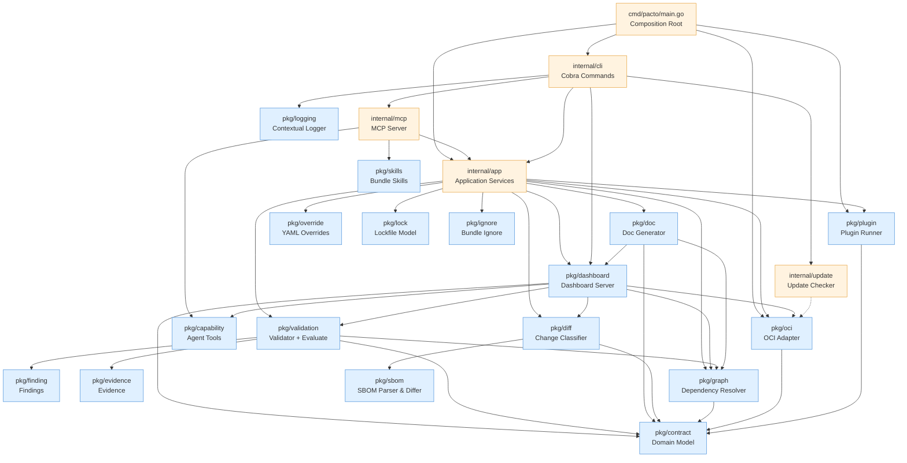

# Architecture

How the Pacto codebase is arranged, for contributors and plugin authors.
Dependencies flow in one direction.

**Four things stay apart, and this layout exists to keep them apart.** A
*contract* is declared operational intent. *Evidence* is what a collector
observed about a running system. `Evaluate` is a pure function that compares the
two and returns typed findings plus coverage. Everything else — the CLI, the
dashboard, the operator — is delivery. A contract adds a relational and temporal
layer over the interface specs it composes rather than replaces: ownership,
dependencies, compatibility, readiness. That layer is why the core splits into
`pkg/graph` (dependencies), `pkg/diff` (compatibility and change over time) and
`pkg/validation` (structural enforcement and evidence evaluation).

## Separation of concerns

The model keeps ten roles distinct.

| Concept | Where it lives | First-class type? |
|---|---|---|
| **Contract** — declared operational intent | `pkg/contract` `Contract` | Yes |
| **Bundle** — the contract plus the interface/config/policy/skill files it composes | `pkg/contract` `Bundle` (a `Contract` + `fs.FS`) | Yes |
| **Interface** — a composed spec (OpenAPI, AsyncAPI, gRPC) the service exposes | `pkg/contract` `Interface` (references a file in the bundle) | Yes |
| **Capability (contract)** — a declared observability capability: `health`, `metrics` or a namespaced `extension` | `pkg/contract` `Capability` | Yes |
| **Generated tool / skill** — an agent-facing *projection* of a bundle, not part of the domain model | `pkg/capability` `BuildTools` (tools from an OpenAPI interface); `pkg/skills` (`skills/*.md`) | Projection, not a contract type |
| **Policy** — a JSON Schema that validates the contract itself | `pkg/contract` `Policy`; resolved and enforced in `pkg/validation` | Yes |
| **Evidence** — a runtime observation, external to the contract | `pkg/evidence` `Observation` / `EvidenceSet` | Yes |
| **Evaluation result** — typed findings plus coverage | `pkg/finding` `Finding`; `pkg/validation` `Coverage` | Yes |
| **Collector** — turns a real system into evidence | any component producing a valid `EvidenceSet` (`pkg/evidence`); the first-party one is the Kubernetes collector (`integrations/kubernetes`) | No core interface — Evidence is the boundary |
| **Plugin / controller / external actor** — interprets a contract and acts through existing tools | `pkg/plugin` (out-of-process); controllers live in `integrations/*` | Boundary, not core logic |

## Dependency graph

The diagram shows the load-bearing edges, not every import: the leaf packages
each of these builds on are left out to keep it readable. Dependencies flow
**downward only**. The OCI adapter (`pkg/oci`) is a public package, importable
by external consumers such as the Kubernetes operator in
`integrations/kubernetes`. So are the engine packages that operator consumes —
`pkg/contract`, `pkg/evidence`, `pkg/finding` and `pkg/validation` — none of
which import Kubernetes. The import-boundary gate
`tests/architecture/boundary_test.go` enforces both rules.

## Layers

| Layer | Location | Responsibility |
|-------|----------|----------------|
| **Core** | `pkg/` | Pure, reusable domain logic. No CLI dependencies, no side effects beyond minimal I/O. |
| **Application** | `internal/app` | Use-case orchestration. Each CLI command maps to one service method. Returns structured results (never prints). |
| **Interfaces** | `internal/cli`, `internal/tui`, `cmd/` | Thin adapters. Flag parsing, output formatting, process bootstrap. Zero business logic. |

Infrastructure adapters live in `internal/` because they depend on external
systems or framework-specific details.

| Package | Role |
|---------|------|
| `internal/mcp` | Model Context Protocol server for AI tool integration |
| `internal/k8sclient` | Shared, dashboard-independent Kubernetes access seam |
| `internal/fleetsrc` | Concrete, cluster-free `fleet.Source` implementations |
| `internal/evidenceoci` | Persists accepted evidence as OCI 1.1 referrers |
| `internal/update` | Async GitHub version checking and self-update |
| `internal/testutil` | Shared mocks and fixtures (`MockBundleStore`, `MockPluginRunner`, `TestBundle()`) |

Per-package detail is not repeated here. `go doc ./pkg/...` is the reference,
and it cannot go stale.

## Collectors: evidence is the boundary

There is intentionally **no `pkg/collector.Collector` interface**. Different
environments need different collector inputs — the Kubernetes collector needs CR
bindings and temporal windows, another environment may need build results or
cloud resource identifiers — so forcing them through one speculative input
signature would either leak platform concepts into the core or be an abstraction
only for symmetry.

A collector feeds the engine by producing a `pkg/evidence` `EvidenceSet`, and
there is nothing else to implement. Concrete collector APIs live in their own
integrations (the Kubernetes observer is
`integrations/kubernetes/internal/observer`); the pure engine never imports
them. `tests/architecture/collector_docs_test.go` fails if a `pkg/collector`
package reappears without a real implementation behind it.

## The OCI bundle cache key

`pkg/oci`'s `CachedStore` wraps any `BundleStore` with in-memory and disk
caching. One entry is
`~/.cache/pacto/oci/_v2/<escaped repository segments>/<escaped tag>/`, holding
`bundle.tar.gz` and a `ref.json` sidecar naming the reference that bundle came
from.

The reserved `_v2/` segment keeps the layout disjoint from the pre-injective one
it replaced. That older key spelled every `:` as `/`, so
`localhost:5000/demo/svc:1.0.0` and `localhost/5000/demo/svc:1.0.0` named one
directory and overwrote each other. Entries in the old layout are still read,
and are served only when their sidecar names the reference asked for; nothing is
written there any more.

## The dashboard

`pkg/dashboard` is the largest core package: an HTTP server, multi-source
aggregation, graph, compliance and an embedded single-page app, which the
operator also embeds. Two rules about it are load-bearing.

Its HTTP server is built on [Huma v2](https://huma.rocks/) with typed I/O
structs and generated OpenAPI. Static files and CORS are served on the raw
`http.ServeMux`; only API operations go through Huma.

OpenAPI is the only wire truth. Huma generates the OpenAPI contract from the Go
handlers, the TypeScript request and response types are generated from that
contract into `pkg/dashboard/frontend/src/lib/generated/` and committed with a
do-not-edit notice, and `make check-dashboard-sdk-drift` regenerates both and
fails on any diff. Handwritten frontend code may add ergonomics but must never
redeclare a wire field or build an `/api/...` URL by hand, because a third,
hand-maintained copy of the schema drifts silently.

## Design principles

1. **Pure core** — `pkg/*` packages have zero CLI or Kubernetes dependencies and are reusable from any Go program
2. **Strict layering** — CLI → App → Core (`pkg/`) → Domain (`pkg/contract`)
3. **Declaration separated from observation** — the contract is stable intent (`pkg/contract`); runtime facts are separate evidence (`pkg/evidence`) collected outside the core. The pure `Evaluate` function in `pkg/validation` reasons over both and never observes or acts itself
4. **No global state** — every instance is created in the composition root (`main.go`); even the logger is built per invocation and carried on the command context (`pkg/logging`), never installed as a process global
5. **Interface-based** — engines depend on interfaces (`BundleStore`, `ContractFetcher`), not concrete implementations
6. **Out-of-process plugins** — language-agnostic, version-independent
7. **Embedded schemas** — JSON Schema compiled into the binary
8. **Deterministic validation** — no configurable rules; same input, same result
9. **Compose, do not replace** — Pacto never defines a schema language of its own; the contract adds only the relational and temporal layer no single interface owns
10. **Single service-information model** — `ServiceDetails` (built by `ServiceDetailsFromBundle`) is the one service-information model consumed by the dashboard server, the `pacto doc` Markdown renderer and the static HTML exporter, so they cannot drift

## Architectural invariants

These rules must be preserved by future changes. Each exists for a specific
reason.

| Invariant | Rationale |
|-----------|-----------|
| `pkg/contract` imports nothing from the project | Foundation layer. If it depends on anything above, the entire dependency graph becomes circular. |
| `pkg/*` must not import `internal/cli` or `internal/app` | Core logic must remain reusable outside the CLI (operator, MCP, tests). |
| `pkg/oci` is a public package | OCI primitives (client, credentials, tag resolution) are importable by external consumers such as the Kubernetes operator. |
| `internal/app` methods are stateless | Options in, result out. No side effects beyond the operation itself. This makes testing and composition straightforward. |
| Validation is deterministic | No configurable rule sets. Same contract + same schema = same result, always. |
| `pkg/catalog` is framework-independent | It imports `pkg/contract`, go-digest and the standard library, and nothing else, so catalog semantics can never become a property of one delivery mechanism. |
| `pkg/fleet` is route-neutral | The operational graph owns canonical identities, query facts, completeness and limitations, and returns route-neutral entity references. Turning a reference into a navigable URL is a *transport* concern: the dashboard transport adds an href built from the canonical key through a single route builder. MCP and other non-dashboard consumers read the same facts and must never receive dashboard URLs. Enforced by `TestFleetStaysRouteNeutral` in `tests/architecture`. |
