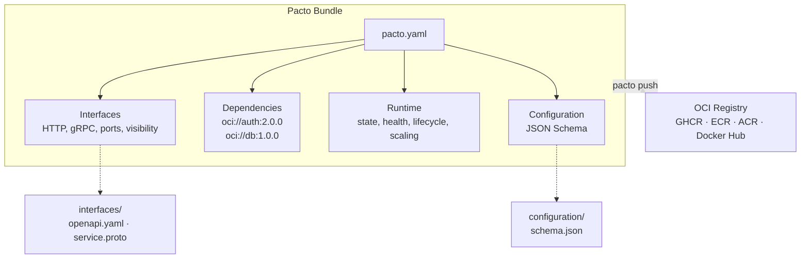

[](https://github.com/TrianaLab/pacto/actions/workflows/ci.yml)
[](https://pkg.go.dev/github.com/trianalab/pacto)
[](https://goreportcard.com/report/github.com/trianalab/pacto)
[](https://codecov.io/gh/TrianaLab/pacto)
[](https://github.com/TrianaLab/pacto/releases/latest)
[](LICENSE)

# Pacto

**One contract to describe how a service behaves.**

Pacto (/ˈpak.to/ — from Spanish: *pact*, *agreement*) is an open, OCI-distributed contract standard for cloud-native services. It captures everything a platform needs to know about a service — interfaces, runtime behavior, dependencies, configuration, and scaling — in a single, machine-validated YAML file.

**[Documentation](https://trianalab.github.io/pacto)** · **[Quickstart](https://trianalab.github.io/pacto/quickstart)** · **[Specification](https://trianalab.github.io/pacto/contract-reference)** · **[Examples](https://trianalab.github.io/pacto/examples)**

---

## The problem

Today, a cloud service is described across **six different places** — none of which talk to each other:

```
OpenAPI spec    → describes the API, but not the runtime
Helm values     → describes deployment, but not the service
env vars        → documented in a wiki (maybe), validated never
K8s manifests   → hardcoded ports, guessed health checks
Dependencies    → tribal knowledge in Slack threads
README.md       → outdated the day it was written
```

The consequences:

- **Platforms guess service behavior.** Is it stateful? What port? Does it need persistent storage?
- **Dev ↔ Platform friction.** Developers ship code; platform engineers reverse-engineer how to run it.
- **Breaking changes detected too late.** A port change or removed dependency breaks production, not CI.
- **Documentation drifts from reality.** No one updates six files when one thing changes.

## The Pacto solution

One file. Machine-validated. Versioned and distributed as an OCI artifact.

```yaml
pactoVersion: "1.0"

service:
  name: payments-api
  version: 2.1.0
  owner: team/payments

interfaces:
  - name: rest-api
    type: http
    port: 8080
    visibility: public
    contract: interfaces/openapi.yaml
  - name: grpc-internal
    type: grpc
    port: 9090
    visibility: internal

dependencies:
  - ref: oci://ghcr.io/acme/auth-pacto@sha256:abc123
    required: true
    compatibility: "^2.0.0"

runtime:
  workload: service
  state:
    type: stateful
    persistence:
      scope: local
      durability: persistent
    dataCriticality: high
  health:
    interface: rest-api
    path: /health

scaling:
  min: 2
  max: 10
```

Only `pactoVersion` and `service` are required — everything else is opt-in, so a contract can be as minimal or as detailed as your service needs.

Platforms, CI, and tooling can now reason about the service automatically — no guessing, no wiki diving, no Slack archaeology.

---

## Before and after

<table>
<tr><th>Without Pacto</th><th>With Pacto</th></tr>
<tr><td>

```
my-service/
  src/
  Dockerfile
  helm/
    values.yaml        ← ports, replicas
  k8s/
    deployment.yaml    ← health checks
  docs/
    README.md          ← maybe outdated
  .env.example         ← config keys
```

*"Is it stateful?"* — Check the Helm chart.<br>
*"What does it depend on?"* — Ask the team lead.<br>
*"Did anything break?"* — Deploy and find out.

</td><td>

```
my-service/
  src/
  Dockerfile
  pacto.yaml             ← single source of truth
  interfaces/
    openapi.yaml
  configuration/
    schema.json
```

```bash
pacto validate .          # validates everything
pacto diff old new        # detects breaking changes
pacto graph .             # shows dependency tree
```

</td></tr>
</table>

---

## What's inside a Pacto bundle



A bundle is a self-contained directory (or OCI artifact) containing:

- **`pacto.yaml`** — the contract: interfaces, dependencies, runtime semantics, scaling
- **`interfaces/`** — OpenAPI specs, protobuf definitions, event schemas
- **`configuration/`** — JSON Schema for environment variables and settings

---

## CLI demo

```bash
# Scaffold a new contract
$ pacto init payments-api
Created payments-api/
  payments-api/pacto.yaml
  payments-api/interfaces/
  payments-api/configuration/

# Validate (3-layer: structural → cross-field → semantic)
$ pacto validate payments-api
payments-api is valid

# Push to any OCI registry
$ pacto push oci://ghcr.io/acme/payments-api-pacto -p payments-api
Pushed payments-api@1.0.0 -> ghcr.io/acme/payments-api-pacto:1.0.0
Digest: sha256:a1b2c3d4...

# Visualize the dependency tree
$ pacto graph payments-api
payments-api@2.1.0
├─ auth-service@2.3.0
│  └─ user-store@1.0.0
└─ postgres@16.0.0

# Detect breaking changes — including dependency graph shifts
$ pacto diff oci://ghcr.io/acme/payments-api-pacto:1.0.0 \
             oci://ghcr.io/acme/payments-api-pacto:2.0.0
Classification: BREAKING
Changes (4):
  [BREAKING] runtime.state.type (modified): runtime.state.type modified
  [BREAKING] runtime.state.persistence.durability (modified): runtime.state.persistence.durability modified
  [BREAKING] interfaces (removed): interfaces removed
  [BREAKING] dependencies (removed): dependencies removed

Dependency graph changes:
payments-api
├─ auth-service  1.5.0 → 2.3.0
└─ postgres      -16.0.0
```

`pacto diff` doesn't just compare fields — it resolves both dependency trees and shows exactly what shifted: version upgrades, added services, and removed dependencies. One command, full blast-radius visibility.

---

## Why OCI?

Pacto bundles are distributed as **OCI artifacts** — the same standard behind Docker images. This means:

- **Versioned and immutable** — every contract is content-addressed with a digest
- **Works with existing registries** — GHCR, ECR, ACR, Docker Hub, Harbor — no new infrastructure
- **Signable and scannable** — use cosign, Notary, or any OCI-compatible signing tool
- **Pull from CI, platforms, or scripts** — standard tooling, no proprietary clients

---

## Installation

### Via installer script

```bash
curl -fsSL https://raw.githubusercontent.com/TrianaLab/pacto/main/scripts/get-pacto.sh | bash
```

### Via Go

```bash
go install github.com/trianalab/pacto/cmd/pacto@latest
```

### Build from source

```bash
git clone https://github.com/TrianaLab/pacto.git && cd pacto && make build
```

---

## Documentation

Full documentation at **[trianalab.github.io/pacto](https://trianalab.github.io/pacto)**.

| Guide | Description |
|-------|-------------|
| [Quickstart](https://trianalab.github.io/pacto/quickstart) | From zero to a published contract in 2 minutes |
| [Contract Reference](https://trianalab.github.io/pacto/contract-reference) | Every field, validation rule, and change classification |
| [For Developers](https://trianalab.github.io/pacto/developers) | Write and maintain contracts alongside your code |
| [For Platform Engineers](https://trianalab.github.io/pacto/platform-engineers) | Consume contracts for deployment, policies, and graphs |
| [CLI Reference](https://trianalab.github.io/pacto/cli-reference) | All commands, flags, and output formats |
| [Plugin Development](https://trianalab.github.io/pacto/plugins) | Build plugins to generate artifacts from contracts |
| [Examples](https://trianalab.github.io/pacto/examples) | PostgreSQL, Redis, RabbitMQ, NGINX, Cron Worker |
| [Architecture](https://trianalab.github.io/pacto/architecture) | Internal design for contributors |

---

## License

[MIT](LICENSE)
