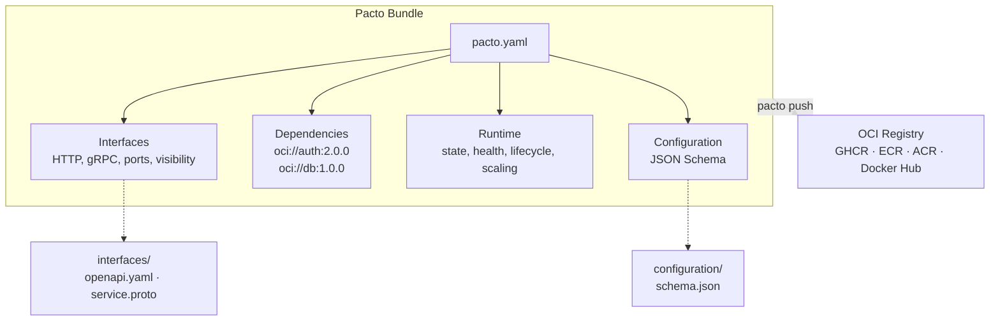

[](https://github.com/TrianaLab/pacto/actions/workflows/ci.yml)
[](https://pkg.go.dev/github.com/trianalab/pacto)
[](https://goreportcard.com/report/github.com/trianalab/pacto)
[](https://codecov.io/gh/TrianaLab/pacto)
[](https://github.com/TrianaLab/pacto/releases/latest)
[](LICENSE)

# Pacto

**Pacto is to service operations what OpenAPI is to HTTP APIs.**

Pacto (/ˈpak.to/ — Spanish for *pact*) is a YAML contract that describes the operational behavior of a cloud-native service — its interfaces, runtime semantics, dependencies, configuration, and scaling intent. Contracts are validated through three layers (structural, cross-field, semantic), versioned, and distributed as OCI artifacts through the registries you already run.

Where OpenAPI describes the API and Helm describes the deployment, Pacto describes the service itself. Platforms, CI pipelines, and AI agents consume the same contract to generate manifests, enforce policies, resolve dependency graphs, and detect breaking changes — without reverse-engineering how a service works.

No runtime agents. No sidecars. No new infrastructure. Pacto runs at build time and CI time only.

**[Documentation](https://trianalab.github.io/pacto)** · **[Quickstart](https://trianalab.github.io/pacto/quickstart)** · **[Specification](https://trianalab.github.io/pacto/contract-reference)** · **[Examples](https://trianalab.github.io/pacto/examples)**

---

## How it works

```
1. Developer writes a pacto.yaml alongside their code
2. pacto validate checks it (structure, cross-references, semantics)
3. pacto push ships the contract to an OCI registry as a versioned artifact
4. Platform tooling pulls the contract and uses it to generate manifests,
   enforce policies, resolve dependency graphs, or detect breaking changes
```

---

## Who is this for?

- **Application developers** — Describe your service once. Validation catches misconfigurations before CI. Breaking changes are detected automatically across versions.
- **Platform engineers** — Consume contracts to generate manifests, enforce policies, and visualize dependency graphs. No more reverse-engineering how to run a service.
- **DevOps / infrastructure teams** — Distribute contracts through existing OCI registries. Integrate with CI pipelines using standard tooling — no new infrastructure required.

---

## The problem

A cloud service is described across **six different places** — none of which talk to each other:

```
OpenAPI spec    → the API, but not the runtime
Helm values     → deployment config, but not the service itself
env vars        → documented in a wiki (maybe), validated never
K8s manifests   → hardcoded ports, guessed health checks
Dependencies    → tribal knowledge in Slack threads
README.md       → outdated the day it was written
```

The result:

- Platforms guess service behavior — *Is it stateful? What port? Does it need persistent storage?*
- Developers ship code; platform engineers reverse-engineer how to run it
- Breaking changes are detected in production, not CI
- No one knows what depends on what until something breaks

---

## Quick preview

```bash
pacto validate .                              # 3-layer contract validation
pacto push oci://ghcr.io/acme/svc-pacto       # push to any OCI registry (skips if exists)
pacto push oci://ghcr.io/acme/svc-pacto -f    # force overwrite existing artifact
pacto diff oci://registry/svc:1.0 svc:2.0     # detect breaking changes
pacto graph .                                  # resolve dependency tree
pacto mcp                                     # start MCP server for AI assistants
pacto validate . -v                            # any command with verbose logging
```

---

## What Pacto captures

One file. Machine-validated. Versioned and distributed as an OCI artifact.

```yaml
pactoVersion: "1.0"

service:
  name: payments-api
  version: 2.1.0
  owner: team/payments

interfaces:
  - name: rest-api
    type: http
    port: 8080
    visibility: public
    contract: interfaces/openapi.yaml
  - name: grpc-internal
    type: grpc
    port: 9090
    visibility: internal

dependencies:
  - ref: oci://ghcr.io/acme/auth-pacto@sha256:abc123
    required: true
    compatibility: "^2.0.0"

runtime:
  workload: service
  state:
    type: stateful
    persistence:
      scope: local
      durability: persistent
    dataCriticality: high
  health:
    interface: rest-api
    path: /health

scaling:
  min: 2
  max: 10
```

Only `pactoVersion` and `service` are required — everything else is opt-in, so a contract can be as minimal or as detailed as your service needs.

---

## Before and after

<table>
<tr><th>Without Pacto</th><th>With Pacto</th></tr>
<tr><td>

```
my-service/
  src/
  Dockerfile
  helm/
    values.yaml        ← ports, replicas
  k8s/
    deployment.yaml    ← health checks
  docs/
    README.md          ← maybe outdated
  .env.example         ← config keys
```

*"Is it stateful?"* — Check the Helm chart.<br>
*"What does it depend on?"* — Ask the team lead.<br>
*"Did anything break?"* — Deploy and find out.

</td><td>

```
my-service/
  src/
  Dockerfile
  pacto.yaml             ← single source of truth
  interfaces/
    openapi.yaml
  configuration/
    schema.json
```

```bash
pacto validate .          # validates everything
pacto diff old new        # detects breaking changes
pacto graph .             # shows dependency tree
```

</td></tr>
</table>

---

## What's inside a Pacto bundle



A bundle is a self-contained directory (or OCI artifact) containing:

- **`pacto.yaml`** — the contract: interfaces, dependencies, runtime semantics, scaling
- **`interfaces/`** — OpenAPI specs, protobuf definitions, event schemas
- **`configuration/`** — JSON Schema for environment variables and settings

## Example repository layout

```
payments-api/
  src/                           ← your application code
  Dockerfile
  pacto.yaml                     ← the contract (committed to the repo)
  interfaces/
    openapi.yaml                 ← referenced by pacto.yaml
  configuration/
    schema.json                  ← JSON Schema for env vars / config
  .github/workflows/
    ci.yml                       ← pacto validate + pacto diff + pacto push
```

The contract lives next to the code it describes. CI validates it on every push and publishes it to an OCI registry on release.

---

## Why Pacto is different

Most tools describe **how to deploy** a service. Pacto describes **what a service is** operationally.

A Helm chart tells Kubernetes how many replicas to run and what image to pull. A Pacto contract tells *any* platform that the service is stateful, persists data locally, exposes an HTTP API on port 8080, depends on auth-service ^2.0.0, and should scale between 2 and 10 instances.

This distinction matters because:

- **Runtime state semantics** — the contract declares whether a service is stateless, stateful, or hybrid, and what that means for persistence and data criticality. Platforms use this to choose the right infrastructure without guessing.
- **Typed dependencies** — dependencies are declared with version constraints and resolved from OCI registries. `pacto graph` shows the full tree; `pacto diff` shows what shifted between versions.
- **Configuration schema** — environment variables and settings are defined with JSON Schema, so platforms can validate config before deployment.
- **Scaling intent** — the contract declares whether scaling is fixed or elastic, giving platforms the information they need to configure autoscaling correctly.
- **Machine-validated contracts** — every contract passes three validation layers before it can be pushed. Invalid contracts never reach the registry.

---

## Key capabilities

- **3-layer validation** — structural (YAML schema), cross-field (port references, interface names), semantic (state vs. persistence consistency)
- **Dependency graph resolution** — recursively resolve transitive dependencies from OCI registries, with parallel sibling fetching
- **Breaking change detection** — `pacto diff` compares two contracts field-by-field *and* resolves both dependency trees to show the full blast radius
- **OCI distribution** — push/pull contracts to any OCI registry (GHCR, ECR, ACR, Docker Hub, Harbor), with local caching
- **Plugin-based generation** — `pacto generate` invokes out-of-process plugins to produce deployment artifacts from a contract
- **Rich documentation** — `pacto doc` generates Markdown with architecture diagrams, interface tables, and configuration details
- **AI assistant integration** — `pacto mcp` exposes all operations as [MCP](https://modelcontextprotocol.io) tools for Claude, Cursor, and Copilot

---

## AI-native contracts

Pacto contracts are machine-readable by design — which makes them a natural fit for AI assistants. Running `pacto mcp` starts a [Model Context Protocol](https://modelcontextprotocol.io) server that lets tools like **Claude**, **Cursor**, and **GitHub Copilot** interact with your contracts directly:

```bash
pacto mcp                       # stdio (Claude Code, Cursor)
pacto mcp -t http --port 9090   # HTTP (remote or web-based tools)
```

Through MCP, an AI assistant can validate contracts, inspect dependency graphs, generate new contracts from a description, and explain breaking changes — all without leaving your editor. See the [MCP Integration](https://trianalab.github.io/pacto/mcp-integration) guide for setup instructions.

---

## CLI demo

```bash
# Scaffold a new contract
$ pacto init payments-api
Created payments-api/
  payments-api/pacto.yaml
  payments-api/interfaces/
  payments-api/configuration/

# Validate (3-layer: structural → cross-field → semantic)
$ pacto validate payments-api
payments-api is valid

# Push to any OCI registry (skips if the artifact already exists)
$ pacto push oci://ghcr.io/acme/payments-api-pacto -p payments-api
Pushed payments-api@1.0.0 -> ghcr.io/acme/payments-api-pacto:1.0.0
Digest: sha256:a1b2c3d4...

# Re-push fails gracefully; use --force to overwrite
$ pacto push oci://ghcr.io/acme/payments-api-pacto -p payments-api
Warning: artifact already exists: ghcr.io/acme/payments-api-pacto:1.0.0 (use --force to overwrite)

# Visualize the dependency tree
$ pacto graph payments-api
payments-api@2.1.0
├─ auth-service@2.3.0
│  └─ user-store@1.0.0
└─ postgres@16.0.0

# Generate documentation with architecture diagrams
$ pacto doc payments-api --serve
Serving documentation at http://127.0.0.1:8484
Press Ctrl+C to stop

# Detect breaking changes — including dependency graph shifts
$ pacto diff oci://ghcr.io/acme/payments-api-pacto:1.0.0 \
             oci://ghcr.io/acme/payments-api-pacto:2.0.0
Classification: BREAKING
Changes (4):
  [BREAKING] runtime.state.type (modified): runtime.state.type modified
  [BREAKING] runtime.state.persistence.durability (modified): runtime.state.persistence.durability modified
  [BREAKING] interfaces (removed): interfaces removed
  [BREAKING] dependencies (removed): dependencies removed

Dependency graph changes:
payments-api
├─ auth-service  1.5.0 → 2.3.0
└─ postgres      -16.0.0
```

---

## Why OCI?

OCI registries are already the standard distribution layer for cloud-native artifacts. Your organization runs one for container images. Pacto uses the same infrastructure to distribute service contracts — no new systems to deploy or maintain.

Pacto bundles are distributed as **OCI artifacts**, which means:

- **Versioned and immutable** — every contract is content-addressed with a digest
- **Works with existing registries** — GHCR, ECR, ACR, Docker Hub, Harbor — no new infrastructure
- **Signable and scannable** — use cosign, Notary, or any OCI-compatible signing tool
- **Pull from CI, platforms, or scripts** — standard tooling, no proprietary clients

---

## How Pacto compares

Pacto doesn't replace these tools — it fills the gap between them.

| Concern | OpenAPI | Helm | Terraform | Backstage | Pacto |
|---------|---------|------|-----------|-----------|-------|
| API contract | ✅ | — | — | — | ✅ |
| Runtime semantics (state, health, lifecycle) | — | Partial | — | — | ✅ |
| Typed dependencies with version constraints | — | — | — | — | ✅ |
| Configuration schema | — | Partial | — | — | ✅ |
| Breaking change detection | — | — | — | — | ✅ |
| Dependency graph resolution + diff | — | — | — | — | ✅ |
| OCI-native distribution | — | ✅ | — | — | ✅ |
| Machine validation | ✅ | — | ✅ | — | ✅ |

**Why not just OpenAPI + Helm?** OpenAPI describes your API surface. Helm describes how to deploy one particular way. Neither captures runtime behavior, dependency relationships, configuration schemas, or scaling intent — and there's no way to diff two versions across all of these dimensions. Pacto is the layer that ties them together.

## What Pacto is NOT

- **Not a deployment tool.** Pacto doesn't deploy anything. It describes *what* a service is — platforms decide *how* to run it.
- **Not a service mesh or runtime agent.** There's nothing to install in your cluster. Pacto runs at build time and CI time only.
- **Not a service catalog.** Pacto produces the structured data that a catalog (Backstage, Port, Cortex) could consume, but it's not a UI or portal.
- **Not a replacement for OpenAPI or Helm.** It references your OpenAPI specs and complements deployment tools — it doesn't replace them.

---

## Vision

Pacto aims to become the standard operational contract format for cloud-native services — a shared language between developers, platforms, CI pipelines, and automation systems.

Contracts are designed to be consumed by any tool in your stack: CI pipelines that validate on every PR and catch breaking changes, platform controllers that generate Kubernetes manifests or Terraform modules, service catalogs that import contract metadata, policy engines that enforce organizational rules, and AI assistants that validate, inspect, and generate contracts via MCP.

The contract is the API between developers and the platform. Pacto provides the format, the validation, and the distribution — what you build on top is up to you.

One file per service. Machine-validated. Version-tracked. Platform-agnostic.

---

## Installation

### Via installer script

```bash
curl -fsSL https://raw.githubusercontent.com/TrianaLab/pacto/main/scripts/get-pacto.sh | bash
```

### Via Go

```bash
go install github.com/trianalab/pacto/cmd/pacto@latest
```

### Build from source

```bash
git clone https://github.com/TrianaLab/pacto.git && cd pacto && make build
```

---

## Documentation

Full documentation at **[trianalab.github.io/pacto](https://trianalab.github.io/pacto)**.

| Guide | Description |
|-------|-------------|
| [Quickstart](https://trianalab.github.io/pacto/quickstart) | From zero to a published contract in 2 minutes |
| [Contract Reference](https://trianalab.github.io/pacto/contract-reference) | Every field, validation rule, and change classification |
| [For Developers](https://trianalab.github.io/pacto/developers) | Write and maintain contracts alongside your code |
| [For Platform Engineers](https://trianalab.github.io/pacto/platform-engineers) | Consume contracts for deployment, policies, and graphs |
| [CLI Reference](https://trianalab.github.io/pacto/cli-reference) | All commands, flags, and output formats |
| [MCP Integration](https://trianalab.github.io/pacto/mcp-integration) | Connect AI tools (Claude, Cursor, Copilot) to Pacto via MCP |
| [Plugin Development](https://trianalab.github.io/pacto/plugins) | Build plugins to generate artifacts from contracts |
| [Examples](https://trianalab.github.io/pacto/examples) | PostgreSQL, Redis, RabbitMQ, NGINX, Cron Worker |
| [Architecture](https://trianalab.github.io/pacto/architecture) | Internal design for contributors |

---

## License

[MIT](LICENSE)
