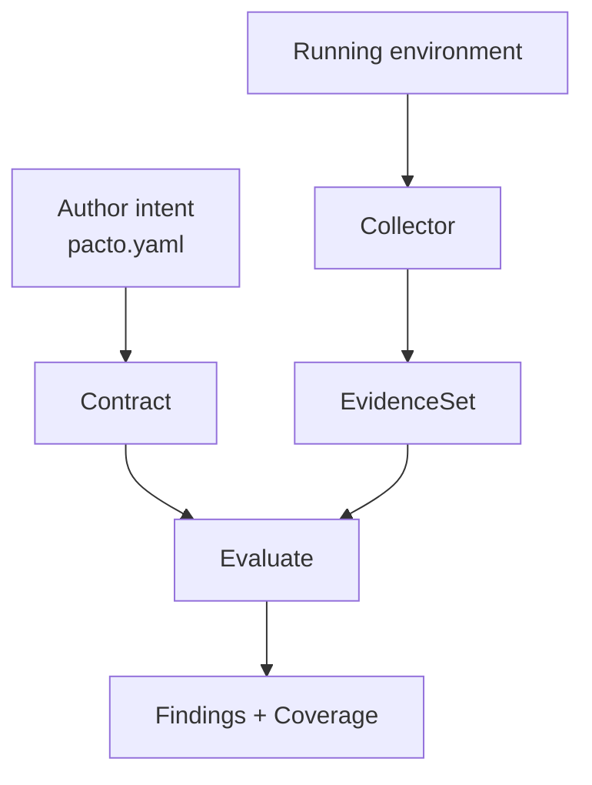
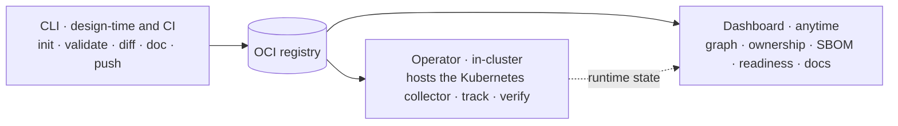

[](https://github.com/TrianaLab/pacto/actions/workflows/ci.yml) [](https://pacto.run) [](https://pkg.go.dev/github.com/trianalab/pacto/v3) [](https://codecov.io/github/TrianaLab/pacto) [](https://github.com/TrianaLab/pacto/releases/latest) [](https://artifacthub.io/packages/search?repo=pacto-operator) [](LICENSE)

# Pacto

**Pacto is an operational contract system for services.** It gives software a machine-readable operational interface: a versioned description of what a service is, what it exposes, what it depends on and what it promises. A service declares those facts — identity and ownership, the interfaces it exposes, the dependencies it requires and the version ranges it accepts, its configuration, its policies, its state and its readiness — in one file. That file is published to any OCI registry as an immutable, content-addressed revision, and Pacto compares it against the previous revision, against the constraints it has to satisfy and against evidence collected where the service actually runs.

It doesn't replace OpenAPI, Helm, Terraform, Backstage or Kubernetes — it adds the operational contract layer between them, composing the interfaces you already own and adding what no single one of them does: ownership, version-ranged dependencies, transitive policy, compatibility and readiness over time. Composed across a platform, those contracts become an **operational graph** — a versioned, verifiable record that humans, automation and agents read the same way. Four capabilities over that artifact: **Diff · Graph · Validate · Verify**.

**[Documentation](https://pacto.run)** · **[Quickstart](https://pacto.run/latest/quickstart)** · **[Specification](https://pacto.run/latest/contract-reference)** · **[Examples](https://pacto.run/latest/examples)** · **[Live demo](https://pacto.run/latest/demo/#/fleet)**

> **Why Pacto exists** — [MANIFEST.md](MANIFEST.md)

---

## The problem

Every service already has operational facts. They just have nowhere to live.

Who owns it is in a wiki. What it exposes is an OpenAPI document in another repository. What it requires is implied by Helm values, Terraform outputs and a Kubernetes Service name. What breaks if you change it is in someone's memory. Each of those is mutable, versioned against nothing and open-ended in shape — so nothing can be compared, and nothing can be checked.

The gap that matters most is the dependency edge. No artifact anywhere records that `checkout` accepts `auth ^2.0.0`, which is why a catalog entry saying `dependsOn: auth` gives a CI job nothing to evaluate: it knows the edge exists, not whether the change you are about to merge crosses it.


```mermaid
flowchart LR
    DEV([Developer]) --> C
    OA[OpenAPI spec] -. composed .-> C
    JS[Config JSON Schema] -. composed .-> C
    C["📋 pacto.yaml<br/>operational contract"] --> R[(OCI registry)]
    R --> P["Platforms and tools<br/>CI · Kubernetes · Backstage · Crossplane"]
```

Pacto composes the interfaces you already own into one versioned contract, distributes it like a container image and lets whatever consumes your services — platforms, CI, runtime controllers and increasingly autonomous agents — read it instead of reverse-engineering it.

## Architecture: declaration, evidence, evaluation

Underneath the products is one model. The contract **declares** intent; a **collector** observes a running environment and emits **Evidence**; the pure engine **evaluates** `Contract × Evidence` into Findings; consumers surface or act on them.


```mermaid
flowchart TB
    A["Author intent<br/>pacto.yaml"] --> C["Contract"]
    R["Running environment"] --> COL["Collector"]
    COL --> E["EvidenceSet"]
    C --> EV["Evaluate"]
    E --> EV
    EV --> OUT["Findings + Coverage"]
```

The rule the engine holds to: **a confirmed contradiction is an error; an inability to observe is `Unknown`, not a contradiction.** A required assertion Pacto could not observe is never silently reported as a pass, which is what makes the answer safe to hand to something that will act on it.

The stable extension boundary is the **`EvidenceSet`**, not a collector interface: a collector is any component that produces a valid `EvidenceSet` the engine can evaluate. The **Kubernetes collector** is the first shipped integration; other collectors may live inside or outside this monorepo. Pacto is *modular through a stable Evidence schema* — not a dynamically pluggable collector runtime. See [Collectors and the evidence boundary](https://pacto.run/latest/collectors/).

## The tools

The CLI, dashboard and Kubernetes operator are the products built on that model. The operator is the *host* around the Kubernetes collector; the engine never queries Kubernetes.


```mermaid
flowchart LR
    CLI["CLI · design-time and CI<br/>init · validate · diff · doc · push"] --> R[(OCI registry)]
    R --> DASH["Dashboard · anytime<br/>graph · ownership · SBOM · readiness · docs"]
    R --> OP["Operator · in-cluster<br/>hosts the Kubernetes collector · track · verify"]
    OP -. runtime state .-> DASH
```

No sidecars and no central control plane: the CLI uses your existing OCI registry, the [operator](https://pacto.run/latest/integrations/kubernetes/overview/) watches CRDs and the dashboard merges every source — local, OCI, Kubernetes and cache — into one view.

---

## Try it

```bash
# Author and publish a contract (install is below)
pacto init my-service && cd my-service       # scaffold a contract bundle
pacto validate .                             # 3-layer validation
pacto push oci://ghcr.io/acme/svc-pacto      # tag inferred from service.version

# Catch breaking changes in CI
pacto diff oci://ghcr.io/acme/svc:1.0 oci://ghcr.io/acme/svc:2.0

# Explore everything in a browser
pacto dashboard                              # auto-detects local, OCI and K8s sources
```

The [Quickstart](https://pacto.run/latest/quickstart) goes from zero to a published contract in about five minutes, using a throwaway local registry so you need no account.

## What a contract declares

```yaml
pactoVersion: "2.0"

service:
  name: payments-api
  version: 2.1.0
  owner:
    team: payments
    dri: alice

interfaces:
  - name: rest-api
    type: openapi
    ref: interfaces/openapi.yaml   # points at your existing OpenAPI spec
    visibility: public

dependencies:
  - name: auth
    ref: oci://ghcr.io/acme/auth-pacto:2.0.0
    required: true
    compatibility: "^2.0.0"
```

Twelve sections, of which only `pactoVersion` and `service` are required — configuration, state, workload, capabilities, policies and readiness are all opt-in, and unknown fields are rejected rather than ignored. There is no port, image, replicas or namespace field: those are delivery decisions, and leaving them out is what keeps one contract true across every cluster the service runs in. Each interface's `ref` points at a schema you already own, so a contract composes your interfaces rather than redefining them. See the [Contract Reference](https://pacto.run/latest/contract-reference) for the full schema.

---

## What you get

Bump a version, remove an endpoint, drop a config property — `pacto diff` classifies each change and exits non-zero on `BREAKING`:

```console
$ pacto diff oci://ghcr.io/acme/svc:1.0 oci://ghcr.io/acme/svc:2.0
Classification: BREAKING
Changes (3):
  [NON_BREAKING] service.version (modified): service.version modified [1.0.0 -> 2.0.0]
  [BREAKING] openapi.paths[/predict] (removed): API path /predict removed [- /predict]
  [POTENTIAL_BREAKING] schema.properties.model_path (removed): schema.properties.model_path removed [- map[type:string]]
breaking changes detected                    # printed to stderr; non-zero exit gates the merge
```

Everything a contract enables, from one artifact:

- **Dependency graph** — transitive service relationships, recursively resolved, plus the dependents a change reaches
- **Change impact** — `pacto impact` evaluates a new version against each consumer's declared `compatibility` range and returns a per-consumer verdict; it recommends review, it does not act
- **Ownership registry** — every service by team and DRI (directly responsible individual), with per-owner compliance and readiness
- **SBOM inventory** — SPDX / CycloneDX package inventory and package-level diffs across versions
- **Operational docs** — `pacto doc` renders Markdown, an offline dashboard-grade HTML site or an interactive API explorer (`--ui swagger`, rendered with Scalar)
- **Readiness scoring** — a team's own scored self-assessment of a revision, with a threshold and an expiry, surfaced in the operational graph. Pacto checks the math and the clock, never the underlying work
- **Runtime verification** — with the [operator](https://pacto.run/latest/integrations/kubernetes/overview/), whether deployed workloads still match their contract
- **OCI distribution** — push/pull to GHCR, ECR, ACR, Docker Hub and Harbor with local caching; a digest reference is immutable. Pacto does not sign bundles or check signatures on them, so add cosign or Notary if your supply chain needs it — what Pacto *does* sign is [evidence envelopes](https://pacto.run/latest/evidence-security/) (Ed25519, verification always on) and its [own published chart and image](https://pacto.run/latest/integrations/kubernetes/artifact-hub/)
- **Reproducibility** — `pacto.lock` pins the transitive dependency and reference closure by digest, gitignore-style `.pactoignore` controls what gets packaged
- **Extensibility** — `pacto generate` invokes out-of-process `pacto-plugin-<name>` binaries you supply; `pacto mcp` exposes contract operations to Claude, Cursor and Copilot

The dashboard merges local, OCI and Kubernetes sources into one operational graph; deploy the [container image](https://pacto.run/latest/dashboard-docker) alongside the operator to combine runtime state with contract data.

## Who reads a contract

Platforms, CI systems, controllers, automation and agents consume the same interface instead of reconstructing operational knowledge from deployment files, documentation and runtime state.

- **CI pipelines** — `pacto validate`, `pacto diff`, `pacto lock --check` and `pacto push`, keyed on exit codes and stable uppercase codes rather than on parsed prose
- **The Kubernetes operator** — reads a published revision plus collected evidence, writes back a compliance state, a condition, an event and Prometheus metrics
- **On-call and platform engineers** — the dashboard, `pacto explain` and `pacto doc --serve`
- **Anything speaking HTTP** — the dashboard and graph API, described by a generated OpenAPI 3.1 document
- **Programs that operate services on someone's behalf** — `pacto mcp`, which derives per-operation tools from a bundle's OpenAPI interface, each already marked mutating or not
- **Any OCI-native tool, with no Pacto binary installed** — `oras manifest fetch`, `oras blob fetch`, `tar -xzf`. The exit path is the format, not the tooling

## Why this matters more every year

A contract pays for itself at the second consumer, and it did so long before anything called an agent existed. What changed is the number of consumers and the cost of a wrong answer: software that operates software multiplies the readers of these facts and removes the fallback of asking a colleague. Agents do not justify the contract; they raise the cost of not having one.

This is also why `Unknown` is a first-class state rather than a rounding error. A person reading "no findings" under a broken collector will usually smell something wrong. A program will not.

---

## How Pacto compares

Pacto composes the interface tools it sits between (OpenAPI, config schemas) and complements deploy tools (Helm, Terraform). It gets compared just as often to the platform-engineering tier — the orchestrators, provisioners and portals that *act on* a service. Pacto is not one of them: its job is four verbs over a single versioned OCI artifact — **diff** (semantic breaking changes), **graph** (transitive dependencies and dependents), **validate** (structure, cross-field rules and recursive policy, fail-closed on an unresolvable reference) and **verify** (the same artifact at design-time via the CLI and at runtime via the operator) — while making zero deployment decisions.

| | Versioned artifact | Semantic diff | Dependency graph | Transitive policy | Runtime verify | Orchestrator-agnostic | Deploys? |
|---|---|---|---|---|---|---|---|
| **Score** ([score.dev](https://score.dev)) | — | — | — | — | — | ✅ | No |
| **Crossplane Configuration** | ✅ | — | Partial | — | Partial | — | Yes |
| **KubeVela** / OAM | — | Partial | Partial | — | Partial | Partial | Yes |
| **Radius** | — | — | ✅ | — | — | Partial | Yes |
| **Kratix** | Partial | — | Partial | — | — | Partial | Yes |
| **Backstage** / Port | — | — | Partial | — | — | ✅ | No |
| **Kargo** | ✅ | — | — | — | Partial | — | No |
| **Pacto** | ✅ | ✅ | ✅ | ✅ | ✅ | ✅ | **No** |

✅ first-class · Partial adjacent or limited · — not in scope. Verified against each project's own documentation, August 2026; these projects move fast, so re-check the cells before relying on them. How to read the columns:

- **Versioned artifact** — the unit is immutably versioned and pinnable by digest
- **Semantic diff** — changes are classified by compatibility impact rather than rendered as text; a line-based diff is Partial
- **Dependency graph** — a service-to-service graph traversed transitively, in both directions; package-level resolution or ordering inside one application is Partial
- **Transitive policy** — governance rules evaluated across the dependency closure, fail-closed
- **Runtime verify** — running workloads checked against an independently declared contract; reconciling toward the tool's own desired state is Partial
- **Orchestrator-agnostic** — ✅ means the tool needs no Kubernetes control plane of its own. This is the softest column: between ✅ and —, Partial is a judgement of degree
- **Deploys?** — whether getting workloads running is part of the product's own job, even when a GitOps agent performs the apply. Kargo scores No on its own documentation: "Promotions are different from _deployments_ … The job of _deploying_ … is left to a GitOps agent like Argo CD"

Several of these are complementary rather than competing: a contract can gate a Kargo promotion, feed a Backstage card or front a Crossplane provisioner. The point is the combination. Other rows do one or two of these well — Radius computes a transitive application graph, Crossplane resolves package dependencies through a `Lock` CRD, KubeVela re-checks applied resources for configuration drift, Kargo verifies Freight before promoting it — but Pacto is the only row that does all of it over one versioned artifact: diffed for breaking changes, resolved into a service graph, validated against recursively resolved policy that fails closed on an unresolvable reference and verified against what is actually running, with no control plane of its own and no deployment decisions.

**What Pacto is NOT:**

- Not a deployment tool — Kubernetes, Helm, Crossplane, Argo CD and Terraform still schedule, template, provision and deploy. Pacto adds the operational meaning they act on and makes zero deployment decisions, which keeps it complementary to engines like KubeVela, Radius and Kratix rather than competing with them. It is not an IDP, a portal or an authorization system either: a human portal and an agent can consume the same Pacto graph
- Not a registry — it publishes to the OCI registries you already run (GHCR, ECR, ACR, Docker Hub, Harbor)
- Not a service catalog or portal — the dashboard renders ownership, SBOM and readiness *from* contracts and runtime, and the same structured data is what a catalog (Backstage, Port, Cortex) could consume instead of a hand-maintained entry

See [MANIFEST.md](MANIFEST.md) for the full rationale.

---

## Installation

```bash
# Installer script
curl -fsSL https://raw.githubusercontent.com/TrianaLab/pacto/main/scripts/get-pacto.sh | bash

# Go
go install github.com/trianalab/pacto/v3/cmd/pacto@latest

# From source
git clone https://github.com/TrianaLab/pacto.git && cd pacto && make build
```

The installer script also installs the two official plugins and leaves a
version-stamped binary that `pacto update` can upgrade in place. `go install`
and `make build` install `pacto` alone into `$GOBIN`, and a `go install` build
reports its version as `dev` because the stamp is applied at release time. The
[Installation guide](https://pacto.run/latest/installation) covers pinning a
version, installing without `sudo` and uninstalling.

## Documentation

Full documentation at **[pacto.run](https://pacto.run)**.

| Guide | Description |
|-------|-------------|
| [Quickstart](https://pacto.run/latest/quickstart) | From zero to a published contract in about 5 minutes |
| [Contract Reference](https://pacto.run/latest/contract-reference) | Every field, validation rule and change classification |
| [For Developers](https://pacto.run/latest/developers) | Write and maintain contracts alongside your code |
| [For Platform Engineers](https://pacto.run/latest/platform-engineers) | Consume contracts for deployment, policies and graphs |
| [CLI Reference](https://pacto.run/latest/cli-reference) | All commands, flags and output formats |
| [Dashboard](https://pacto.run/latest/dashboard-docker) | Deploy the dashboard container alongside the operator |
| [Kubernetes Operator](https://pacto.run/latest/integrations/kubernetes/overview/) | Runtime contract tracking and verification |
| [MCP Integration](https://pacto.run/latest/mcp-integration) | Connect AI tools (Claude, Cursor, Copilot) to Pacto via MCP |
| [Plugin Development](https://pacto.run/latest/plugins) | Build plugins to generate artifacts from contracts |
| [Examples](https://pacto.run/latest/examples) | PostgreSQL, Redis, RabbitMQ, NGINX, gRPC and more |

---

## License

[MIT](LICENSE)
