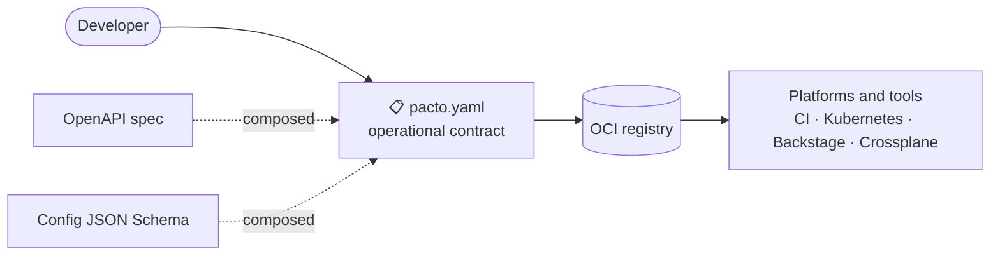
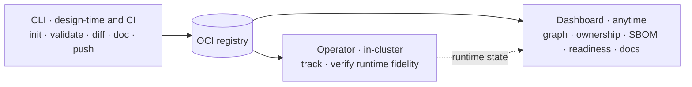

[](https://github.com/TrianaLab/pacto/actions/workflows/ci.yml)
[](https://pkg.go.dev/github.com/trianalab/pacto/v2)
[](https://codecov.io/github/TrianaLab/pacto)
[](https://github.com/TrianaLab/pacto/releases/latest)
[](LICENSE)

# Pacto

**Pacto is to service operations what OpenAPI is to HTTP APIs.**

A service's operational behavior — interfaces, dependencies, runtime semantics, configuration and readiness — is scattered across Helm values, wikis and dashboards, and drifts from what's actually running. Pacto captures it once in a validated, versioned contract (`pacto.yaml`), distributes it through your existing OCI registry and lets `pacto diff` catch breaking changes while the operator catches runtime drift. It doesn't replace OpenAPI, Helm, Terraform, Backstage or Kubernetes — it adds the operational contract layer between them, composing the interfaces you already own and adding what no single one does: ownership, dependencies, compatibility and readiness over time.

**[Documentation](https://trianalab.github.io/pacto)** · **[Quickstart](https://trianalab.github.io/pacto/quickstart)** · **[Specification](https://trianalab.github.io/pacto/contract-reference)** · **[Examples](https://trianalab.github.io/pacto/examples)** · **[Live demo](https://trianalab.github.io/pacto/demo/)**

> **Why Pacto exists** — [MANIFEST.md](MANIFEST.md)

---

## Where Pacto fits


```mermaid
flowchart LR
    DEV([Developer]) --> C
    OA[OpenAPI spec] -. composed .-> C
    JS[Config JSON Schema] -. composed .-> C
    C["📋 pacto.yaml<br/>operational contract"] --> R[(OCI registry)]
    R --> P["Platforms and tools<br/>CI · Kubernetes · Backstage · Crossplane"]
```

Pacto composes the interfaces you already own into one versioned contract, distributes it like a container image and lets whatever runs your services read it instead of reverse-engineering it.

## The three tools


```mermaid
flowchart LR
    CLI["CLI · design-time and CI<br/>init · validate · diff · doc · push"] --> R[(OCI registry)]
    R --> DASH["Dashboard · anytime<br/>graph · ownership · SBOM · readiness · docs"]
    R --> OP["Operator · in-cluster<br/>track · verify runtime fidelity"]
    OP -. runtime state .-> DASH
```

No sidecars and no central control plane: the CLI uses your existing OCI registry, the [operator](https://github.com/TrianaLab/pacto-operator) watches CRDs and the dashboard merges every source — local, OCI, Kubernetes and cache — into one view.

---

## Try it

```bash
# Author and publish a contract (install is below)
pacto init my-service && cd my-service       # scaffold a contract bundle
pacto validate .                             # 3-layer validation
pacto push oci://ghcr.io/acme/svc-pacto      # tag inferred from service.version

# Catch breaking changes in CI
pacto diff oci://ghcr.io/acme/svc:1.0 oci://ghcr.io/acme/svc:2.0

# Explore everything in a browser
pacto dashboard                              # auto-detects local, OCI and K8s sources
```

The [Quickstart](https://trianalab.github.io/pacto/quickstart) goes from zero to a published contract in two minutes.

## What a contract captures

```yaml
pactoVersion: "2.0"

service:
  name: payments-api
  version: 2.1.0
  owner:
    team: payments
    dri: alice

interfaces:
  - name: rest-api
    type: openapi
    ref: interfaces/openapi.yaml   # points at your existing OpenAPI spec
    visibility: public

dependencies:
  - name: auth
    ref: oci://ghcr.io/acme/auth-pacto:2.0.0
    required: true
    compatibility: "^2.0.0"
```

Only `pactoVersion` and `service` are required — everything else (runtime semantics, configuration, policies and readiness) is opt-in. Each interface's `ref` points at a schema you already own, so a contract composes your interfaces rather than redefining them. See the [Contract Reference](https://trianalab.github.io/pacto/contract-reference) for the full schema.

---

## What you get

Bump a version, remove an endpoint, drop a config property — `pacto diff` classifies each and fails CI before the merge:

```console
$ pacto diff oci://ghcr.io/acme/svc:1.0 oci://ghcr.io/acme/svc:2.0
Classification: BREAKING
Changes (3):
  [NON_BREAKING] service.version (modified): service.version modified [1.0.0 -> 2.0.0]
  [BREAKING] openapi.paths[/predict] (removed): API path /predict removed [- /predict]
  [POTENTIAL_BREAKING] schema.properties.model_path (removed): schema.properties.model_path removed [- map[type:string]]
breaking changes detected                    # printed to stderr; non-zero exit gates the merge
```

Everything a contract enables, from one artifact:

- **Dependency graph** — transitive service relationships and blast radius (the downstream services a change can affect), recursively resolved
- **Ownership registry** — every service by team and DRI (directly responsible individual), with per-owner compliance and readiness
- **SBOM inventory** — SPDX / CycloneDX package inventory and package-level diffs across versions
- **Operational docs** — `pacto doc` renders Markdown, an offline dashboard-grade HTML site or an interactive Swagger/Scalar API explorer
- **Readiness scoring** — operational-readiness assessment per service, surfaced in the fleet view
- **Runtime verification** — with the [operator](https://github.com/TrianaLab/pacto-operator), whether deployed workloads still match their contract
- **OCI distribution** — push/pull to GHCR, ECR, ACR, Docker Hub and Harbor with local caching; signable with cosign or Notary
- **Reproducibility and supply chain** — `pacto.lock` for pinned resolution, gitignore-style `.pactoignore` for packaging
- **Extensibility** — out-of-process plugins generate deployment artifacts; `pacto mcp` exposes contract operations to Claude, Cursor and Copilot

The dashboard merges local, OCI and Kubernetes sources into one fleet view; deploy the [container image](https://trianalab.github.io/pacto/dashboard-docker) alongside the operator to combine runtime state with contract data.

---

## How Pacto compares

Pacto composes the interface tools it sits between (OpenAPI, config schemas) and complements deploy tools (Helm, Terraform). It gets compared just as often to the platform-engineering tier — the orchestrators, provisioners and portals that *act on* a service. Pacto is not one of them: its job is four verbs over a single versioned OCI artifact — **diff** (semantic breaking changes), **graph** (transitive blast radius), **enforce** (recursive policy, fail-closed) and **verify** (the same artifact at design-time via the CLI and at runtime via the operator) — while making zero deployment decisions.

| | Versioned artifact | Semantic diff | Dependency graph | Transitive policy | Runtime verify | Orchestrator-agnostic | Deploys? |
|---|---|---|---|---|---|---|---|
| **Score** | — | — | — | — | — | ✅ | No |
| **Crossplane Configuration** | ✅ | — | — | — | — | — | Yes |
| **KubeVela** / OAM | — | — | Partial | — | — | Partial | Yes |
| **Radius** | — | — | ✅ | — | — | Partial | Yes |
| **Kratix** | — | — | — | — | — | Partial | Yes |
| **Backstage** / Port | — | — | Partial | — | — | ✅ | No |
| **Kargo** | ✅ | — | — | — | — | ✅ | Yes |
| **Pacto** | ✅ | ✅ | ✅ | ✅ | ✅ | ✅ | **No** |

✅ first-class · Partial adjacent or limited · — not in scope. A 2026 snapshot, and several of these are complementary rather than competing: a contract can gate a Kargo promotion, feed a Backstage card or front a Crossplane provisioner. The point is the combination — Pacto is the only row that is a versioned, diffable, graph-resolved, policy-enforced and runtime-verified contract that stays orchestrator-agnostic and never deploys.

**What Pacto is NOT:**

- Not a deployment tool — it describes services, not how to run them, and makes zero deployment decisions, which keeps it complementary to deploy engines like KubeVela, Radius and Kratix rather than competing with them
- Not a service mesh — no sidecars, no traffic interception
- Not a service catalog or portal — the dashboard renders ownership, SBOM and readiness *from* contracts and runtime; it feeds Backstage/Port, it doesn't replace them
- Not another configuration language — it composes the schemas you already own

See [MANIFEST.md](MANIFEST.md) for the full rationale.

---

## Installation

```bash
# Installer script
curl -fsSL https://raw.githubusercontent.com/TrianaLab/pacto/main/scripts/get-pacto.sh | bash

# Go
go install github.com/trianalab/pacto/v2/cmd/pacto@latest

# From source
git clone https://github.com/TrianaLab/pacto.git && cd pacto && make build
```

## Documentation

Full documentation at **[trianalab.github.io/pacto](https://trianalab.github.io/pacto)**.

| Guide | Description |
|-------|-------------|
| [Quickstart](https://trianalab.github.io/pacto/quickstart) | From zero to a published contract in 2 minutes |
| [Contract Reference](https://trianalab.github.io/pacto/contract-reference) | Every field, validation rule and change classification |
| [For Developers](https://trianalab.github.io/pacto/developers) | Write and maintain contracts alongside your code |
| [For Platform Engineers](https://trianalab.github.io/pacto/platform-engineers) | Consume contracts for deployment, policies and graphs |
| [CLI Reference](https://trianalab.github.io/pacto/cli-reference) | All commands, flags and output formats |
| [Dashboard](https://trianalab.github.io/pacto/dashboard-docker) | Deploy the dashboard container alongside the operator |
| [Kubernetes Operator](https://trianalab.github.io/pacto/operator) | Runtime contract tracking and verification |
| [MCP Integration](https://trianalab.github.io/pacto/mcp-integration) | Connect AI tools (Claude, Cursor, Copilot) to Pacto via MCP |
| [Plugin Development](https://trianalab.github.io/pacto/plugins) | Build plugins to generate artifacts from contracts |
| [Examples](https://trianalab.github.io/pacto/examples) | PostgreSQL, Redis, RabbitMQ, NGINX, gRPC and more |

---

## License

[MIT](LICENSE)
