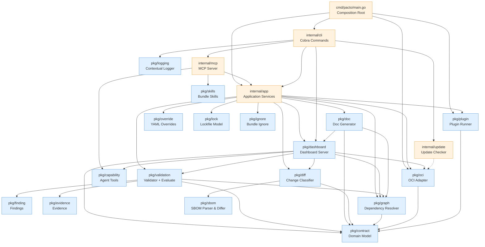
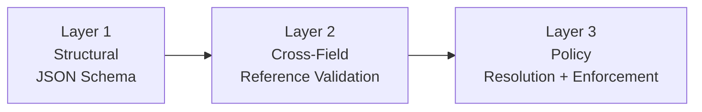

# Architecture

How the Pacto codebase is arranged, for contributors and plugin authors. Dependencies flow predominantly in one direction; the small, deliberate exceptions are documented below.

Read [The Pacto model](model.md) first — it defines the roles this layout exists to keep apart (declaration versus observation, the `Evaluate` engine, the compliance model, the control loop). A contract adds a relational and temporal layer — ownership, dependencies, compatibility, readiness — over interface specs it composes rather than replaces. That layer is why the core splits into `pkg/graph` (dependencies), `pkg/diff` (compatibility and change over time) and `pkg/validation` (structural enforcement and evidence evaluation).

---

## Dependency graph

The diagram shows the load-bearing edges, not every import — `pkg/catalog`, `pkg/fleet`, `pkg/impact` and `pkg/openapi` are left out to keep it readable. Dependencies flow **downward only**. The OCI adapter (`pkg/oci`) is a public package, importable by external consumers such as the [Kubernetes Operator](integrations/kubernetes/overview.md). So are the engine packages the operator consumes — `pkg/contract`, `pkg/evidence`, `pkg/finding` and `pkg/validation` — none of which import Kubernetes (enforced by the import-boundary gate `tests/architecture/boundary_test.go`). A collector feeds the engine by producing a `pkg/evidence` `EvidenceSet`; there is no core collector interface to implement.

---

## Layer overview

The codebase is organized into three layers:

| Layer | Location | Responsibility |
|-------|----------|----------------|
| **Core** | `pkg/` | Pure, reusable domain logic. No CLI deps, no side effects beyond minimal I/O. |
| **Application** | `internal/app` | Use-case orchestration. Each CLI command maps to one service method. Returns structured results (never prints). |
| **Interfaces** | `internal/cli`, `cmd/` | Thin adapters. Flag parsing, output formatting, process bootstrap. Zero business logic. |

Infrastructure adapters live in `internal/` because they depend on external systems or framework-specific details:

| Package | Role |
|---------|------|
| `internal/mcp` | Model Context Protocol server for AI tool integration |
| `internal/k8sclient` | Shared, dashboard-independent Kubernetes access seam |
| `internal/fleetsrc` | Concrete, cluster-free `fleet.Source` implementations |
| `internal/evidenceoci` | Persists accepted evidence as OCI 1.1 referrers |
| `internal/update` | Async GitHub version checking and self-update |

Test infrastructure lives in `internal/testutil`, which provides shared mocks and fixtures (`MockBundleStore`, `MockPluginRunner`, `TestBundle()`) used across test packages.

---

## Package responsibilities

### `pkg/contract` -- Domain model

The root public package. Contains pure Go types and logic with **zero I/O and zero framework dependencies**. Imports nothing from the project.

- `Contract` -- the root aggregate. Top-level `Service`, `Interfaces`, `Configurations`, `Dependencies`, `State`, `Workload` (a string), `Capabilities`, `Policies`, `Readiness`, `Metadata`, `Extensions`. There is no `Runtime` wrapper and no port/scaling/image field — those are delivery and observation concerns, external to the declared contract.
- `Service`, `Interface`, `Configuration`, `Policy`, `Dependency`, `Capability`, `State` -- the section types
- `Parse()` -- YAML deserialization
- `Bundle` -- `Contract` + `fs.FS` (the contract plus the files it composes)
- `OCIReference` -- OCI reference parsing
- `Range` -- Semver constraint evaluation

### `pkg/validation` -- Validation engine

Three-layer, short-circuit validation:

Each layer short-circuits -- if it produces errors, subsequent layers are skipped. See [Validation layers](contract-reference/validation.md#validation-layers) for the per-layer rules and error codes. `Validate()` resolves policies locally (used by pack/push); `ValidateWithResolver()` resolves referenced policy contracts recursively (used by the validate command).

This package also holds the runtime evaluator, `Evaluate(contract, evidence) -> ([]finding.Finding, Coverage)` (`evaluate.go`) — the pure function described under [The engine](model.md#the-engine). It compares declared intent against a collector-produced `evidence.EvidenceSet` and returns typed findings plus coverage. It is stateless and free of platform dependencies, so the [Kubernetes operator](integrations/kubernetes/overview.md) consumes it without pulling Kubernetes types into the core library. Structural validation and runtime evaluation are distinct: the three layers above decide whether a contract is *valid*; `Evaluate` decides whether a valid contract *matches observed reality*.

### `pkg/evidence` -- Runtime observation model

The external-facts half of the engine. Defines a discriminated `Observation` carrying an `Outcome` (`Observed`, `Unsupported`, `Failed`, `Stale`, `Insufficient`) and a typed payload that is present iff `Outcome == Observed`. Assertion identity lives on `SubjectRef`, so a non-`Observed` observation is still attributable. An `EvidenceSet` is a timestamped, provenance-stamped collection of observations about one service. Constructors (`NewCapabilityObserved`, `NewInterfaceObserved`, …) and JSON marshaling enforce the "Observed implies exactly one payload" invariant at every boundary. Evidence is produced by collectors and consumed by `Evaluate`; it is never part of the declared contract.

### `pkg/finding` -- Evaluation result model

A pure data package with zero external dependencies: no knowledge of collectors, reporters, Kubernetes, OCI or persistence. Defines `Finding` (a typed conclusion with `Code`, `Severity`, `Category`, `Subject`, `ContractPath`, `Message` and optional `EvidenceRefs`), the severity ladder (`error`/`warning`/`info`/`unknown`) and the code registry that maps each stable `Code` to a category and default severity. Family 1 codes are confirmed violations (`{RuntimeDrift, error}`); family 2 codes are evidence uncertainty (`{Inconclusive, unknown}`). Reporters at the edge project `Finding` into external shapes (SARIF, PolicyReport); this package never imports them.

### Collectors -- Evidence is the boundary

There is intentionally **no `pkg/collector.Collector` interface**. Different environments need different collector inputs (the Kubernetes collector needs CR bindings and temporal windows; another environment may need build results or cloud resource identifiers), so forcing them through one speculative input signature would either leak platform concepts into the core or be an abstraction only for symmetry. Concrete collector APIs live in their integrations (the Kubernetes observer in `integrations/kubernetes/internal/observer`); the pure engine never imports them.

### `pkg/capability` -- Agent tool projection

Turns a bundle's OpenAPI interface into agent-callable tools: `BuildTools` derives one `Tool` per operation (input schema from parameters and request body; mutating operations gated behind an opt-in) and `Invoke` calls the live service. This is a *projection* of a declared interface, not a contract type — it is distinct from the contract `capabilities` section (which declares `health`/`metrics`/`extension` observability). Consumed by `internal/mcp` and the dashboard; HTTP/OpenAPI-specific today.

### `pkg/skills` -- Bundle domain knowledge

Reads a bundle's optional `skills/*.md` documents — workflows, business rules and operational guidance an interface alone cannot express. Skills are bundle-level knowledge, independent of interface type, and are surfaced to agents alongside generated tools (via `pacto_skill` in the MCP server). Like generated tools, skills are a projection of the bundle, not part of the contract domain model.

### `pkg/diff` -- Change classifier

Compares two contracts and classifies every change using a deterministic rule table. Sub-analyzers handle specific sections:

- `contract.go` -- service identity, workload, state, capabilities
- `interfaces.go` -- interface additions/removals/changes, configuration and policy diffing
- `dependency.go` -- dependency list changes
- `openapi.go` -- deep OpenAPI diff (paths, methods, parameters, request bodies, responses)
- `schema.go` -- recursive JSON Schema diff (properties, required fields, types, constraints)
- `readiness.go` -- readiness assessment (all changes NonBreaking, still surfaced)

### `pkg/sbom` -- SBOM parser and differ

Parses SPDX 2.3 and CycloneDX 1.5 SBOM files from the bundle's `sbom/` directory and normalizes them into a unified package model. Provides a diff engine that compares two SBOM documents and reports package-level changes (added, removed, version/license modified).

- `ParseFromFS()` -- scans `sbom/` for recognized extensions, auto-detects format
- `Diff()` -- compares two SBOM documents and returns changes
- `HasSBOM()` -- deprecated; nothing in Pacto calls it, and `ParseFromFS()`
  returning a non-nil document answers the same question. Removed at v4.

The diff engine (`pkg/diff`) calls into this package when both bundles contain SBOMs. Results are reported separately from contract changes and don't affect classification.

### `pkg/graph` -- Dependency resolver

Builds a dependency graph by recursively fetching contracts from OCI registries and local paths. Sibling dependencies at each level are resolved concurrently. Detects cycles and version conflicts.

- `ParseDependencyRef()` -- centralized dependency reference parser (`oci://`, `file://`, bare paths)
- `RenderTree()` / `RenderDiffTree()` -- tree-style rendering with connectors
- `DiffGraphs()` -- structural diff between two dependency graphs

### `pkg/catalog` -- Bounded contract catalog

Turns a finite, explicitly supplied set of contract roots plus their dependency closure into a bounded, immutable catalog. Nothing is crawled or inferred: a root exists in the catalog because a caller named it.

- `Build(ctx, Request)` -- resolves every reference exactly once and returns a frozen `*Catalog`. Afterwards queries are pure, network-free, deterministically ordered and safe for concurrent readers; a registry tag that moves later does not move the catalog
- `Resolver` port -- reference parsing, credentials, caching and registry access live in a caller-supplied adapter (`internal/app`'s `CatalogResolver()`), never in the catalog itself
- `Bounds` -- explicit ceilings on roots, revisions, edges, depth and resolver calls, charged before the work they admit
- Three separations the model never collapses: requested ref is not resolved ref is not content identity; a revision is not a declaration is not a path; partial is not empty and is not complete

`pkg/graph` answers "what does this one bundle depend on" for a human reading a tree. `pkg/catalog` answers "what is in this explicit set of roots and their closure" for a machine, with the identity and completeness discipline that answer needs. It is not the operational fleet -- `pkg/fleet` describes runtime targets and observation, and the two share vocabulary but no model. Discovery is not authorization and discovery is not execution.

The catalog core is framework-independent by construction: it imports `pkg/contract`, go-digest and the standard library, and nothing else. `tests/architecture/boundary_test.go` enforces that, so catalog semantics can never become a property of one delivery mechanism. Exposed over MCP by `pacto mcp --root` -- see [MCP integration → Contract catalog discovery](mcp-catalog-discovery.md).

The remaining packages -- overrides and packaging, the generators and servers,
the application services and the adapters -- are in
[Tooling and adapters](architecture-tooling.md).

---

## Design principles

1. **Pure core** -- `pkg/*` packages have zero CLI/Kubernetes dependencies and are reusable from any Go program
2. **Strict layering** -- CLI → App → Core (`pkg/`) → Domain (`pkg/contract`)
3. **Declaration separated from observation** -- the contract is stable intent (`pkg/contract`); runtime facts are separate evidence (`pkg/evidence`) collected outside the core by a collector (any component that produces a valid `EvidenceSet`; the Kubernetes collector is the first shipped one). The pure `Evaluate` function in `pkg/validation` reasons over both and never observes or acts itself
4. **No global state** -- all instances are created in the composition root (`main.go`); even the logger is built per invocation and carried on the command context (`pkg/logging`), never installed as a process global
5. **Interface-based** -- engines depend on interfaces (`BundleStore`, `ContractFetcher`), not concrete implementations
6. **Out-of-process plugins** -- language-agnostic, version-independent
7. **Embedded schemas** -- JSON Schema compiled into the binary
8. **Deterministic validation** -- no configurable rules; same input, same result
9. **Compose, don't replace** -- Pacto never defines a schema language of its own; the contract adds only the relational and temporal layer no single interface owns
10. **Single service-information model** -- `ServiceDetails` (built by `ServiceDetailsFromBundle`) is the single service-information model consumed by the dashboard server, the `pacto doc` Markdown renderer and the static HTML exporter, so they cannot drift

---

## Architectural invariants

These rules must be preserved by future changes. Each exists for a specific reason.

| Invariant | Rationale |
|-----------|-----------|
| `pkg/contract` imports nothing from the project | Foundation layer. If it depends on anything above, the entire dependency graph becomes circular. |
| `pkg/*` must not import `internal/cli` or `internal/app` | Core logic must remain reusable outside the CLI (operator, MCP, tests). |
| `pkg/oci` is a public package | OCI primitives (client, credentials, tag resolution) are importable by external consumers such as the Kubernetes operator. |
| `internal/app` methods are stateless | Options in, result out. No side effects beyond the operation itself. This makes testing and composition straightforward. |
| Validation is deterministic | No configurable rule sets. Same contract + same schema = same result, always. |
| `pkg/fleet` is route-neutral | The operational graph owns canonical identities, query facts, completeness and limitations, and returns route-neutral entity references. Turning a reference into a navigable URL is a *transport* concern: the dashboard product transport adds an href built from the canonical key through a single route builder. MCP and other non-dashboard consumers read the same facts and must never receive dashboard URLs. Enforced by `TestFleetStaysRouteNeutral` in `tests/architecture`. |

Eleven further invariants govern `pkg/dashboard` alone — source priority, cache
promotion, `SectionMeta` coverage, generated wire types — and are listed in
[Dashboard architecture](dashboard-architecture.md#dashboard-invariants).

---

## See also

- [The Pacto model](model.md) — the roles this layout keeps apart
- [Dashboard architecture](dashboard-architecture.md) — `pkg/dashboard` in detail
- [Collectors and the evidence boundary](collectors.md) — how evidence reaches
  `Evaluate`
- [Testing architecture](maintainers/testing.md) — the test suite that holds the
  invariants above
- [Release architecture](maintainers/releases.md) — how the modules are versioned
  and shipped
- [CONTRIBUTING.md](https://github.com/TrianaLab/pacto/blob/main/CONTRIBUTING.md)
  — build, lint and test the tree these packages live in
