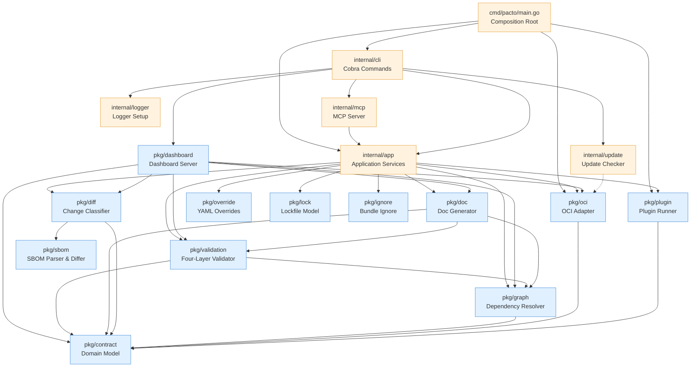
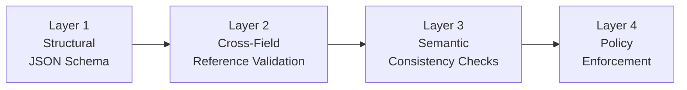

# Architecture
Pacto follows a layered architecture where dependencies flow predominantly in one direction. There are small, deliberate exceptions documented below. This page describes the internal design for contributors and plugin authors.

---
## Dependency graph

Dependencies flow **downward only**. The OCI adapter (`pkg/oci`) is a public package, importable by external consumers such as the [Kubernetes Operator](operator.md).

All core domain logic lives in `pkg/` and is reusable outside the CLI — for example, by the [Kubernetes Operator](operator.md).

---

## Layer overview

The codebase is organized into three layers:

| Layer | Location | Responsibility |
|-------|----------|----------------|
| **Core** | `pkg/` | Pure, reusable domain logic. No CLI deps, no side effects beyond minimal I/O. |
| **Application** | `internal/app` | Use-case orchestration. Each CLI command maps to one service method. Returns structured results (never prints). |
| **Interfaces** | `internal/cli`, `cmd/` | Thin adapters. Flag parsing, output formatting, process bootstrap. Zero business logic. |

Infrastructure adapters live in `internal/` because they depend on external systems or framework-specific details:

| Package | Role |
|---------|------|
| `internal/mcp` | Model Context Protocol server for AI tool integration |
| `internal/logger` | Global `slog` configuration |
| `internal/update` | Async GitHub version checking and self-update |

The OCI adapter (`pkg/oci`) is a public package so it can be imported by external consumers (e.g., the Kubernetes operator).

Test infrastructure lives in `internal/testutil`, which provides shared mocks and fixtures (`MockBundleStore`, `MockPluginRunner`, `TestBundle()`) used across test packages.

`pkg/dashboard` is the largest package in the core layer. Unlike the other `pkg/*` packages (which are focused processing libraries), the dashboard is a self-contained application component: HTTP server, multi-source data aggregation, graph visualization, compliance engine, Kubernetes client, and embedded SPA. Its complexity is justified because it must remain reusable outside the CLI binary (the Kubernetes operator embeds the same dashboard server).

---

## Package responsibilities

### `pkg/contract` -- Domain model

The root public package. Contains pure Go types and logic with **zero I/O and zero framework dependencies**. Imports nothing from the project.

- `Contract`, `ServiceIdentity`, `Interface`, `Runtime`, `State`, `Configuration`, `Policy`, etc.
- `Parse()` -- YAML deserialization
- `OCIReference` -- OCI reference parsing
- `Range` -- Semver constraint evaluation
- `Bundle` -- Contract + file system

### `pkg/validation` -- Validation engine

Four-layer, short-circuit validation:

Each layer short-circuits -- if it produces errors, subsequent layers are skipped.

Also includes **runtime validation** (`ValidateRuntime`) -- a foundational abstraction for comparing a contract's declared state against observed runtime conditions. This is consumed by the [Kubernetes Operator](operator.md) without introducing platform-specific dependencies into the core library.

### `pkg/diff` -- Change classifier

Compares two contracts and classifies every change using a deterministic rule table. Sub-analyzers handle specific sections:

- `contract.go` -- service identity, scaling
- `runtime.go` -- workload, state, lifecycle, health
- `interfaces.go` -- interface additions/removals/changes, configuration and policy diffing
- `dependency.go` -- dependency list changes
- `openapi.go` -- deep OpenAPI diff (paths, methods, parameters, request bodies, responses)
- `schema.go` -- recursive JSON Schema diff (properties, required fields, types, constraints)

### `pkg/sbom` -- SBOM parser and differ

Parses SPDX 2.3 and CycloneDX 1.5 SBOM files from the bundle's `sbom/` directory and normalizes them into a unified package model. Provides a diff engine that compares two SBOM documents and reports package-level changes (added, removed, version/license modified).

- `ParseFromFS()` -- scans `sbom/` for recognized extensions, auto-detects format
- `HasSBOM()` -- checks whether a bundle contains recognized SBOM files
- `Diff()` -- compares two SBOM documents and returns changes

The diff engine (`pkg/diff`) calls into this package when both bundles contain SBOMs. Results are reported separately from contract changes and don't affect classification.

### `pkg/graph` -- Dependency resolver

Builds a dependency graph by recursively fetching contracts from OCI registries and local paths. Sibling dependencies at each level are resolved concurrently. Detects cycles and version conflicts.

- `ParseDependencyRef()` -- centralized dependency reference parser (`oci://`, `file://`, bare paths)
- `RenderTree()` / `RenderDiffTree()` -- tree-style rendering with connectors
- `DiffGraphs()` -- structural diff between two dependency graphs

### `pkg/override` -- YAML overrides

Applies value-file and `--set` overrides to raw YAML before parsing. Supports deep merge, dot-separated paths, and array index notation.

### `pkg/doc` -- Documentation generator

Generates rich Markdown documentation from a contract. Reads OpenAPI specs, event contracts, and JSON Schema configuration to produce a comprehensive service document with architecture diagrams, interface tables, and configuration details. Includes an HTTP server for browser-based viewing.

### `pkg/plugin` -- Plugin system

Out-of-process plugin execution via JSON stdin/stdout. Discovers plugin binaries and manages the communication protocol. See the [Plugin Development](plugins.md) guide.

### `pkg/dashboard` -- Dashboard server

The exploration and observability layer of the Pacto system. See [Dashboard architecture](#dashboard-architecture) below for a detailed design description.

### `pkg/lock` -- Lockfile builder and verifier

Deterministic lockfile model for dependency and reference closure tracking. Pure, dependency-light package (stdlib + `gopkg.in/yaml.v3` only).

- `Lock` -- root model with `Root`, `Dependencies[]`, `References[]`
- `Marshal()` -- stable-sorted, byte-identical deterministic serialization so re-marshaling an unchanged closure produces identical output
- `HashFS()` -- content hashing for local bundles (sha256 over sorted file list with length-prefixed paths and data)
- Typed errors: `DriftError` (OCI digest mismatch), `LocalDriftError` (local content changed), `StaleError` (pacto.yaml and pacto.lock disagree), `ConflictError` (conflicting version requirements), `UnresolvedError` (resolution failure), `MissingError` (lock required but absent)

Closure building (transitive dependencies and transitive config/policy references) lives in `internal/app`. Verification is wired into validate, graph, diff and push commands with go.sum-style hard-fail semantics.

### `pkg/ignore` -- Bundle ignore matcher

Gitignore-style pattern matching for `.pactoignore` filtering. Determines which files are excluded from bundle packaging.

- `DefaultPatterns` -- `.git/`, `.pactoignore`, `pacto.lock`, `.DS_Store`
- `alwaysKeep` guard -- ensures `pacto.yaml` is never ignorable regardless of user patterns
- `Matcher.Ignored()` -- ancestor-aware filtering (files inside ignored directories are themselves ignored)
- `FS()` -- filtering `fs.FS` wrapper applied at bundle load so pack, push and validation see one consistent file set

Supports gitignore syntax: comments (`#`), negation (`!`), directory-only (`/`), anchoring (`^/`), globs (`*`, `?`, `[]`) and double-star (`**`) for cross-segment matching. Last matching rule wins.

### `internal/app` -- Application services

Each CLI command maps to exactly one service method. This layer orchestrates `pkg/*` packages and infrastructure adapters. Methods are stateless: they take an options struct and return a result struct, never printing directly.

- `Init()`, `Validate()`, `Pack()`, `Push()`, `Pull()`
- `Diff()`, `Graph()`, `Explain()`, `Generate()`, `Doc()`
- Shared helpers: `resolveBundle()`, `resolveBundleWithOverrides()`, `loadAndValidateLocal()`, `loadAndValidateFull()`

### `internal/cli` -- CLI layer

Cobra command handlers and Viper configuration. **Zero business logic** -- only input parsing, orchestration, and output formatting.

### `pkg/oci` -- OCI adapter

Wraps `go-containerregistry` to handle OCI registry operations. This is a public package, importable by external consumers such as the Kubernetes operator. Pacto distributes contracts as OCI artifacts -- the same standard behind container images -- so they work with any OCI-compliant registry (GHCR, ECR, ACR, Docker Hub, Harbor) without new infrastructure. Every pushed contract is content-addressed with a digest, making it immutable and verifiable.

Key components:

- **`BundleStore`** interface -- the core abstraction: `Push()`, `Pull()`, `Resolve()`, `ListTags()`
- **`Client`** -- implements `BundleStore` using `go-containerregistry`. Translates between `contract.Bundle` and OCI images (tar.gz layer with metadata labels)
- **`CachedStore`** -- wraps any `BundleStore` with in-memory and disk caching (`~/.cache/pacto/oci/<registry>/<repo>/<tag>/bundle.tar.gz`). Can be disabled at runtime via `--no-cache`
- **`Resolver`** -- lazy version resolution with semver filtering. `Resolve()` pulls bundles in `LocalOnly` or `RemoteAllowed` mode. `FetchAllVersions()` pulls every semver tag to populate the cache. `FilterSemverTags()` selects valid semver tags sorted descending
- **Credential chain** -- `NewKeychain()` tries sources in priority order: explicit flags/env vars, pacto config (`~/.config/pacto/config.json`), `gh` CLI token (GitHub registries), Docker config + credential helpers, cloud auto-detection (ECR/GCR/ACR), anonymous fallback
- **Typed errors** -- `AuthenticationError`, `ArtifactNotFoundError`, `RegistryUnreachableError`, `InvalidRefError`, `InvalidBundleError`, `NoMatchingVersionError`

### `internal/mcp` -- MCP server

Thin adapter layer that exposes Pacto operations as [Model Context Protocol](https://modelcontextprotocol.io) tools. Each MCP tool handler delegates to an `internal/app` service method -- no business logic lives here. The server communicates over stdio and is started via `pacto mcp`. Used by AI tools such as Claude, Cursor, and Copilot.

### `internal/logger` -- Logger setup

Configures Go's standard `log/slog` default logger based on the `--verbose` flag. When verbose mode is enabled, debug-level messages are emitted to stderr; otherwise only warnings and above are shown. Called once during CLI initialization via `PersistentPreRunE` -- all packages use `slog.Debug()` directly with no wrappers.

### `internal/update` -- Update checker

Performs async version checking against the GitHub releases API. Started in a background goroutine during CLI initialization, with a 200ms timeout to avoid blocking. Results are cached on disk for 24 hours (`~/.config/pacto/update-check.json`) to minimize API calls. Suppressed for dev builds and JSON output mode.

---

## Dashboard architecture

The dashboard is complex enough to warrant its own design section. It provides a web-based UI for navigating contracts, dependency graphs, version history, interface details, configuration schemas, and diffs -- aggregated from multiple data sources.

### Source model

The dashboard exposes up to **four source types**:

| Source type | Role | Key type |
|-------------|------|----------|
| `local` | Contract from filesystem | `LocalSource` |
| `oci` | Contract from OCI registry | `OCISource` |
| `cache` | Contract baseline from the on-disk materialized cache | `CacheSource` |
| `k8s` | Runtime enrichment from Kubernetes | `K8sSource` |

`cache` is an **offline fallback**: it surfaces as a distinct source only when no
live OCI registry is configured. When a live OCI registry *is* configured, the
on-disk cache stays internal to the `oci` source (used for version enrichment) and
is **not** listed separately — `ActiveSources()` in `detect.go` exposes the disk
cache under the `"oci"` key in that case and under the `"cache"` key otherwise. So
a session shows either `oci` **or** `cache` for the registry-backed baseline, never
both (see [Internal materialization](#internal-materialization) below).

### Discovery lifecycle

`OCISource` runs a **continuous background loop** (not one-shot):

1. **Shallow scan** (synchronous, at first `ListServices` call) -- one `ListTags` + `Pull` per configured repo. Fast.
2. **Deep discovery** (background goroutine) -- BFS across dependency refs, prefetches all semver versions. Closes `s.done` after the first cycle, ending the "discovering" UI state.
3. **Periodic rediscovery** -- after the first cycle, re-runs every 60 seconds (`ociRediscoverInterval`). Picks up new services, dependencies, and versions pushed since the last scan. Each cycle rescans the internal cache and invalidates in-memory caches so enrichment data (hash, classification) surfaces immediately.

`K8sSource` is query-on-demand with a 3-second list cache TTL. Each API call fetches fresh data -- no background polling or watching.

### Source categories

Sources are divided into two categories with different roles:

**Contract sources** (`local`, `oci`, `cache`) provide the authoritative service definition -- interfaces, configuration, dependencies, version, owner. Exactly one contract snapshot wins per service. Priority: `local` > `oci` > `cache` (explicit dev intent wins over the registry baseline, which wins over the offline disk cache). `cache` only participates when no live `oci` source is configured.

**Runtime source** (`k8s`) enriches the contract with live cluster state -- contract status, conditions, endpoints, resources, ports, scaling, insights, checks. Runtime data **never overrides contract content** (config and policy *content* always comes from the declared contract). The `enrichWithRuntime()` function in `source_resolver.go` enforces this boundary: it copies k8s-specific fields but preserves contract fields. The one computed exception is the `Validation` summary, which is derived (not declarable) and is recomputed from runtime state when k8s data is present — `computeSectionMeta` attributes that section to `k8s` in the section provenance.

### Resolution model

`ResolvedSource` (`source_resolver.go`) is the central aggregation layer. It combines contract and runtime sources into a unified view:

1. **Contract resolution** -- iterates contract sources in priority order (`local`, then `oci`, then `cache`). The first source that has the service wins. This produces one authoritative contract snapshot.
2. **Runtime enrichment** -- if k8s is available and has data for the service, runtime fields are layered on top of the contract snapshot without replacing any contract content.
3. **Service list** -- all sources are queried concurrently. Services are grouped by name across sources, merged using `mergeServiceEntry()`. The `Sources` array on each service lists all source types where that service was found.

`BuildResolvedSource()` constructs the `ResolvedSource` from the map of detected sources, automatically separating contract sources from the runtime source.

### Version history

Version history is merged across sources in a defined order (`resolverVersionSources` in `source_resolver.go` — `["k8s", "oci", "local", "cache"]`):

1. **k8s** -- PactoRevision CRDs are most authoritative (deployed versions with timestamps)
2. **oci** -- registry tags provide the full version catalog
3. **local** -- current on-disk version
4. **cache** -- the offline disk-cache baseline, consulted last

When a live OCI registry is configured, `OCISource.GetVersions()` already enriches its bare tag listings with hash, createdAt, and classification from materialized bundles, so the separate `cache` entry contributes nothing extra. When no live registry is configured, the `cache` source supplies the version catalog from disk.

Versions are deduplicated by version string. When the same version appears in multiple sources, `enrichVersion()` fills empty fields (hash, createdAt, classification, ref) from later sources without overwriting existing values.

### Classification

`ClassifyVersions()` (`version_classify.go`) is a pure derivational function that computes diff classification between consecutive versions. It operates on `BundlePair` structs (tag + parsed bundle) and is independent of any data source.

Classification requires **materialized bundles** -- both the current and previous version must have their contract bundles available locally. If either bundle is missing (not yet fetched from the registry), that version pair is skipped and receives no classification. This is intentional: classification is computed on demand as bundles become available, not assumed.

### Internal materialization

`CacheSource` (`source_cache.go`) reads materialized OCI bundles from the disk cache (`~/.cache/pacto/oci/`). It plays **two distinct roles** depending on whether a live OCI registry is configured:

- **Internal enrichment (live OCI present).** It backs `OCISource`, providing contract hash, classification, and createdAt enrichment for registry tag listings. In this mode it is invisible — `ActiveSources()` exposes the disk cache under the `"oci"` key.
- **Offline contract source (no live OCI).** It is promoted to a first-class `cache` source: `ActiveSources()` exposes it under the `"cache"` key and `BuildResolvedSource()` includes it as the lowest-priority contract source (`local` > `oci` > `cache`).

The flow when live OCI is present:

1. `OCISource.SetCache(cs)` wires a `CacheSource` internally
2. `OCISource.GetVersions()` lists tags from the registry (bare version + ref), then enriches each version with hash, createdAt, and classification from the internal cache
3. Cache rescans happen in three places: after each background discovery cycle (`discoverAndPrefetch`), after resolve operations, and after fetch-all-versions -- all call `RescanCache()` + memory cache invalidation so new data surfaces immediately

The `createdAt` timestamp from cached bundles reflects **local materialization time** (when the bundle was pulled to disk), not the registry push time. OCI registries do not expose push timestamps via tag listing.

### Section provenance (`SectionMeta`)

Every service-detail response carries a `SectionMeta` map so the UI can explain
*why* a section is absent and *where* present data came from — not just show a
blank. Each section reports a `state` and a `source`:

| State | Meaning |
|-------|---------|
| `present` | Has data from an available source. |
| `empty` | The section is applicable but was genuinely not declared. |
| `not_applicable` | Cannot apply to this contract (e.g. runtime sections on a reference-only contract). |
| `unavailable` | A source that would have supplied it was unreachable or absent. |

`SectionInfo` also carries `OverriddenBy` (the source that overrode a contract
value, e.g. `"k8s"` for the deployed `version`/`owner`) and a `Reason` note for
non-present states. `computeSectionMeta` (`sectionmeta.go`) derives the map from
what the resolver assembled; `markRuntimeOverrides` flags fields the k8s overlay
replaced. The top-level `RuntimeEvaluated` flag is true only when a Kubernetes
runtime overlay was actually applied, which lets the UI distinguish "no runtime
data yet" from "runtime evaluated, nothing to report". `SectionMeta` is populated
on **both** the resolved path and the single-source `getService` path, so every
response is fully explained regardless of which sources are active.

**Which source wins, per field.** This is the authoritative multi-source
provenance table — the dashboard and operator attribute fields identically:

| Field / section | Authority | Notes |
|-----------------|-----------|-------|
| interfaces, configurations, policies, dependencies, runtime declaration, readiness, scaling, metadata | Declared contract (`local` > `oci` > `cache`) | Config & policy **content** always comes from the declared contract — even for reference-only contracts (the operator extracts schema content into status). |
| `version` | k8s overrides contract when deployed | `OverriddenBy: "k8s"`. |
| `owner` | k8s overrides contract when deployed | `OverriddenBy: "k8s"`. |
| namespace, `resolvedRef` | k8s only | Deployed-state fields; absent off-cluster. |
| contract status, conditions, endpoints, observed runtime, resources, ports | k8s only (runtime overlay) | `not_applicable` for reference-only contracts off-cluster. |
| `Validation` summary | Recomputed from runtime when k8s present | The one computed (non-declarable) field; `SectionMeta` attributes it to `k8s`. |

### `--no-cache` semantics

The `--no-cache` flag is a **cold-start mode**, not a fully stateless mode:

- At startup, `DetectSources()` skips `detectCache()` entirely -- no pre-existing cached bundles are scanned or indexed
- `CachedStore.DisableCache()` skips disk **reads** (no stale data), but disk **writes** remain enabled so same-session pulls are persisted
- The dashboard resolves `cacheDir` from `CachedStore.CacheDir()` when not explicitly set, ensuring `RefreshCacheSources()` knows where to find materialized bundles
- The `memCache` is always wired at startup (even with `--no-cache`) via `SetCacheSource(nil, memCache)`, ensuring `RefreshCacheSources()` can invalidate stale entries after on-the-fly creation
- If the user triggers "Fetch all versions" or lazy dependency resolution, `RefreshCacheSources()` creates a `CacheSource` on the fly from disk and wires it into the OCI source for enrichment
- The `onDiscover` callback is wired to `server.RefreshCacheSources` (not just `memCache.InvalidateAll`), so continuous background discovery also triggers on-the-fly `CacheSource` creation
- This means `--no-cache` ensures a clean start but allows same-session materialization to enrich the current view

### Graph model

The dashboard builds two graph representations:

**Global graph** (`buildGlobalGraph()`) -- a flat structure with `GraphNodeData` and `GraphEdgeData`, designed for D3.js force-directed visualization. Includes unresolved external dependencies as nodes with `status: "external"`. Edges are typed as `"dependency"` (contract deps) or `"reference"` (config/policy refs).

**Per-service graph** (`buildGraph()`) -- a recursive `DependencyGraph` with `GraphNode` and `GraphEdge`, used for tree visualization of a single service's dependency chain. Includes cycle detection.

Both graphs use **ref-alias mapping** (`buildRefAliases()`) to resolve OCI repository names (e.g., `my-service-pacto`) to contract service names (e.g., `my-service`), based on `imageRef` and `chartRef` fields from the service index.

`computeBlastRadius()` performs BFS on the reverse dependency graph (required deps only) to count how many services would be transitively affected if a given service breaks.

Multi-version **conflict detection** (`detectConflicts()` in `pkg/graph`) is a CLI-only concern used during `pacto graph` resolution; the dashboard does not call it, so version conflicts across the aggregated index are not surfaced through the dashboard API. A node can also appear with incomplete edges if its service details failed to load during a concurrent index rebuild; such nodes are rendered from the index alone.

### Server and API

The HTTP server is built on [Huma v2](https://huma.rocks/) with typed I/O structs and automatic OpenAPI 3.1 spec generation. Static files (embedded SPA) and CORS are served on the raw `http.ServeMux`; only API operations go through Huma.

Key API operations:

| Endpoint | Method | Purpose |
|----------|--------|---------|
| `/health` | GET | Health status + version |
| `/metrics` | GET | Service and source counts |
| `/api/services` | GET | Service list with blast radius, compliance, checks |
| `/api/services/{name}` | GET | Full service details |
| `/api/services/{name}/versions` | GET | Version history |
| `/api/services/{name}/sources` | GET | Per-source breakdown |
| `/api/services/{name}/dependents` | GET | Reverse dependency lookup |
| `/api/services/{name}/refs` | GET | Config/policy cross-references |
| `/api/services/{name}/graph` | GET | Per-service dependency tree |
| `/api/graph` | GET | Global D3-ready dependency graph |
| `/api/diff` | GET | Classified diff between two versions |
| `/api/sources` | GET | Detected source status and discovery state |
| `/api/refresh` | POST | Force-refresh all sources |
| `/api/resolve` | POST | Lazy-resolve a remote dependency |
| `/api/versions` | POST | List registry tags, optionally fetch all |
| `/api/debug/*` | GET | Diagnostics (requires `--diagnostics` flag) |

When running alongside the Kubernetes operator, `EnrichFromK8s()` automatically discovers OCI repositories from CRD `resolvedRef` fields, enabling full contract bundles, version history, and diffs without explicit OCI arguments.

### Version tracking

The dashboard computes version tracking semantics from two sources:

- **Version policy** (`versionPolicy`): the preferred source is the operator's `status.contract.resolutionPolicy` field (`Latest` → `"tracking"`, `PinnedTag` → `"pinned-tag"`, `PinnedDigest` → `"pinned-digest"`), normalized by `NormalizeResolutionPolicy()`. When unavailable (non-K8s sources, older operators), `ClassifyVersionPolicy()` provides a conservative fallback that only classifies unambiguous cases (digest, explicit semver tag) and returns empty for ambiguous refs.
- **Latest available** (`latestAvailable`): the highest semver version from the existing version list. Computed by `ComputeLatestAvailable()`.
- **Update available** (`updateAvailable`): true when `latestAvailable` is a higher semver than the current `version`. Computed by `IsUpdateAvailable()`. This is informational -- it does **not** affect contract compliance status.
- **Current version marker** (`isCurrent`): set on the `Version` entry matching `ServiceDetails.Version` via `MarkCurrentVersion()`.

Operator-provided `resolutionPolicy` is propagated through the K8s source (`serviceDetailsFromK8sStatus`), carried forward by `enrichWithRuntime()`, and preserved by `enrichVersionTracking()` which only applies the fallback when no policy is already set.

These fields are populated during the service index cache rebuild (`enrichVersionTracking()`) and surfaced through the existing `/api/services` and `/api/services/{name}` endpoints.

---

## Design principles

1. **Pure core** -- `pkg/*` packages have zero CLI/Kubernetes dependencies and are reusable from any Go program
2. **Strict layering** -- CLI → App → Core (`pkg/`) → Domain (`pkg/contract`)
3. **Observation separated from validation** -- runtime observation (collecting actual state from Kubernetes, CI, etc.) happens outside `pkg/`; validation against observed state happens inside `pkg/validation`
4. **No global state** -- all instances created in the composition root (`main.go`); the only global is `slog.SetDefault()` configured once at startup
5. **Interface-based** -- engines depend on interfaces (`DataSource`, `BundleStore`, `ContractFetcher`, `Runner`), not concrete implementations
6. **Out-of-process plugins** -- language-agnostic, version-independent
7. **Embedded schemas** -- JSON Schema compiled into the binary
8. **Deterministic validation** -- no configurable rules; same input, same result

---

## Architectural invariants

These rules must be preserved by future changes. Each exists for a specific reason.

| Invariant | Rationale |
|-----------|-----------|
| `pkg/contract` imports nothing from the project | Foundation layer. If it depends on anything above, the entire dependency graph becomes circular. |
| `pkg/*` must not import `internal/cli` or `internal/app` | Core logic must remain reusable outside the CLI (operator, MCP, tests). |
| `pkg/oci` is a public package | OCI primitives (client, credentials, tag resolution) are importable by external consumers such as the Kubernetes operator. |
| K8s enriches runtime only, never overrides contract content | Contract is the source of truth for interfaces, config, dependencies, version. K8s provides live state (contract status, conditions, endpoints), and config/policy *content* always comes from the declared contract. The computed `Validation` summary is the one runtime-recomputed field, and `SectionMeta` attributes it to `k8s` so provenance stays honest. |
| Cache is a public source only as an offline fallback | When a live `oci` source is configured the disk cache stays internal to it (exposed under the `"oci"` key). Only when no live registry is configured is the cache promoted to a distinct `cache` source. A session shows `oci` **or** `cache` for the registry baseline, never both — so users are never confused about which is authoritative. |
| Contract source priority is `local` > `oci` > `cache` | Explicit dev intent beats the registry baseline, which beats the offline disk cache. `cache` only participates when `oci` is absent. |
| `resolverVersionSources` is `["k8s", "oci", "local", "cache"]` | Version history is merged in this order. With a live registry, `OCISource.GetVersions()` already includes cache enrichment so the trailing `cache` entry is a no-op; without one, `cache` supplies the catalog from disk. |
| Classification requires materialized bundles | `ClassifyVersions()` diffs consecutive bundles. Without both bundles available, no classification is computed. This is correct behavior, not a bug. |
| `--no-cache` skips startup scanning, not same-session materialization | Cold-start mode ensures deterministic initial state. `DisableCache()` only skips disk reads — disk writes remain enabled so bundles fetched during the session are persisted and available for enrichment. |
| `DisableCache()` must never disable disk writes | Same-session materialization (fetch-all-versions, resolve) relies on `CachedStore` writing bundles to disk. `CacheSource` then reads these during `RefreshCacheSources()` to provide hash, createdAt, and classification enrichment. |
| `internal/app` methods are stateless | Options in, result out. No side effects beyond the operation itself. This makes testing and composition straightforward. |
| Validation is deterministic | No configurable rule sets. Same contract + same schema = same result, always. |
| `SectionMeta` is populated on every service-detail path | Both the resolved (multi-source) path and the single-source `getService` path compute `SectionMeta`, so the UI can always distinguish `present` / `empty` / `not_applicable` / `unavailable` and label each section's `source`. |
| OCI discovery is continuous, not one-shot | New services and versions pushed after startup must surface without restarting the dashboard. The background loop re-runs discovery every 60 seconds. |
| K8s enrichment retries stop on permanent errors | If the Pacto CRD is not installed (`ListServices` returns "resource not found"), `EnrichFromK8s` nils the K8s source so the retry loop exits immediately instead of waiting 30 seconds. |
| UI data refresh must not disrupt user state | DOM morphing preserves scroll position, form values, `
` open/closed state, and D3-managed containers. Debug panels use `patchDOM` instead of `innerHTML` replacement. |
