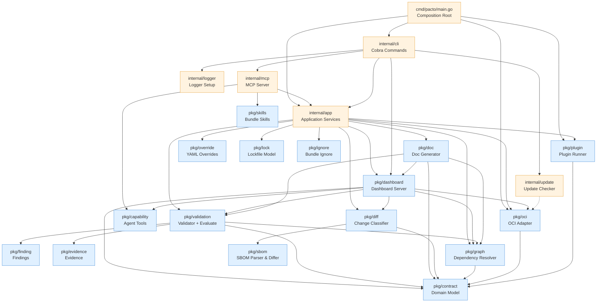
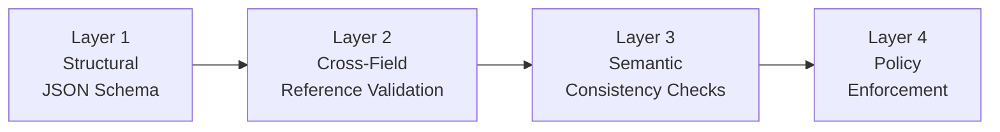

# Architecture
Pacto follows a layered architecture where dependencies flow predominantly in one direction. There are small, deliberate exceptions documented below. This page describes the internal design for contributors and plugin authors.

---

## Conceptual model

> The distinctions this model refuses to collapse — service vs revision vs target,
> declared vs observed, evidence vs finding, empty vs unknown — are indexed on the
> [Concepts](concepts.md) page. This page covers how the code is arranged to keep
> them apart.

A Pacto contract describes the relationships between a service's interfaces and how they change over time — ownership, dependencies, compatibility and readiness. A single JSON Schema describes one interface in isolation and structurally cannot express how interfaces relate or evolve; that relational and temporal layer is Pacto's differentiator. It is why the core splits into `pkg/graph` (dependencies), `pkg/diff` (compatibility and change over time) and `pkg/validation` (structural enforcement and evidence evaluation).

Underneath, Pacto composes the interfaces you already have rather than inventing a configuration language. An interface is a JSON Schema, OpenAPI spec or event schema — a service's config interface is its config JSON Schema, an API interface is its OpenAPI document. Where an interface is already owned by another system, Pacto composes it instead of reinventing it. Composition is the on-ramp; the operational contract is the differentiator.

> This mirrors the classic split between *interfaces* (configuration schema) and *requirements* (dependencies): composition covers the interfaces half, dependencies and compatibility cover the requirements half.

In one line: **JSON Schema describes an interface; Pacto describes the relationships between interfaces and how they change over time.**

### Declaration versus observation

The contract is stable author *intent*: what a service is operationally, independent of any orchestrator. What a service actually looks like at runtime is an *observation*, and it lives entirely outside the declared contract. The V2 core is built around that separation. The `Contract` type (`pkg/contract`) carries only intent — there is no `runtime` block, no port, no scaling and no image field; those are delivery and observation concerns owned by integrations. Runtime facts are carried by a separate `EvidenceSet` (`pkg/evidence`), produced by a collector, and the engine reasons over the two together.

### The engine: `Evaluate(contract, evidence)`

The heart of V2 is a pure function (`pkg/validation/evaluate.go`):

```text
Evaluate(contract.Contract, evidence.EvidenceSet) -> ([]finding.Finding, Coverage)
```

It is stateless and dependency-light: it reads a collector-stamped `Outcome` on each observation and applies no temporal, network or Kubernetes logic. For each required assertion in the contract (an interface's availability, a capability, a required dependency or configuration, the workload, persistence) it looks for a matching observation and produces exactly one of three results:

- **Confirmed violation** — a matching observation has `Outcome=Observed` and its payload contradicts the contract. Emits an `error` finding in the `RuntimeDrift` category (for example `CONFIGURATION_ABSENT`, `CONFIGURATION_MISMATCH`, `INTERFACE_ABSENT`, `DEPENDENCY_UNREACHABLE`).
- **Uncertainty** — no usable observation exists (missing, `Unsupported`, `Failed`, `Stale` or `Insufficient`). Emits an `unknown` finding in the `Inconclusive` category (for example `EVIDENCE_MISSING`, `COLLECTION_FAILED`). A required assertion Pacto cannot observe is never silently treated as a pass.
- **Satisfied** — a matching `Observed` observation is consistent with the contract. No finding.

`Coverage` reports how many required assertions were actually evaluated versus declared. It is explanatory metadata and never changes the aggregate compliance state: an inability to observe is not a violation.

The compliance model consumers derive from these findings has four substantive states — **Compliant**, **NonCompliant**, **Unknown** and **Invalid** — plus the informational **Warning**, **Reference** (the contract declares no runtime target) and **NotEvaluated** (a target exists but no evidence is available yet). The guiding rule: a confirmed contradiction is an error; an inability to observe is Unknown, not a contradiction. See [Compliance scenarios](examples/compliance-scenarios.md) for where each state is exercised.

### Separation of concerns

The V2 model keeps eight roles distinct. Some are first-class Go types; where a concept is useful but not a first-class type, this is stated explicitly.

| Concept | Where it lives | First-class type? |
|---|---|---|
| **Contract** — declared operational intent | `pkg/contract` `Contract` | Yes |
| **Bundle** — the contract plus the interface/config/policy/skill files it composes | `pkg/contract` `Bundle` (a `Contract` + `fs.FS`) | Yes |
| **Interface** — a composed spec (OpenAPI, AsyncAPI, gRPC) the service exposes | `pkg/contract` `Interface` (references a file in the bundle) | Yes |
| **Capability (contract)** — a declared observability capability: `health`, `metrics` or a namespaced `extension` | `pkg/contract` `Capability` | Yes |
| **Generated tool / skill** — an agent-facing *projection* of a bundle, not part of the domain model | `pkg/capability` `BuildTools` (tools from an OpenAPI interface); `pkg/skills` (`skills/*.md`) | Projection, not a contract type |
| **Policy** — a JSON Schema that validates the contract itself | `pkg/contract` `Policy`; resolved and enforced in `pkg/validation` | Yes |
| **Evidence** — a runtime observation, external to the contract | `pkg/evidence` `Observation` / `EvidenceSet` | Yes |
| **Evaluation result** — typed findings plus coverage | `pkg/finding` `Finding`; `pkg/validation` `Coverage` | Yes |
| **Collector** — turns a real system into evidence | any component producing a valid `EvidenceSet` (`pkg/evidence`); the first-party one is the Kubernetes collector (`integrations/kubernetes`) | No core interface — Evidence is the boundary |
| **Plugin / controller / external actor** — interprets a contract and acts through existing tools | `pkg/plugin` (out-of-process); controllers live in `integrations/*` | Boundary, not core logic |

Two clarifications the naming can obscure:

- **Generated tools are not the contract's `capabilities`.** The contract `capabilities` section declares observability endpoints (`health`/`metrics`/`extension`). Separately, `pkg/capability` *derives* agent-callable tools from a bundle's OpenAPI interface. A generated tool is a projection of an interface; it is not a new capability Pacto invents, and it is not the `capabilities` domain type.
- **The engine does not observe or act.** It only reasons over `Contract` and `EvidenceSet`. Observing reality is a collector's job; performing actions is an external actor's job; deciding whether an action is *permitted* is a runtime control's job (OPA, Kyverno, admission, IAM). Pacto supplies the structured operational meaning those systems interpret and verify against — it is not one of them.

### The operational control loop

These roles compose into a loop that a platform or an agent can drive. Steps 1, 2, 5 and 6 are implemented in this codebase (the CLI, the dashboard, the collector and `Evaluate`); steps 3 and 4 are performed by external systems Pacto integrates with, not by Pacto itself.

1. **Declare.** A contract states the service's identity, interfaces, capabilities, configuration, dependencies and policies — its operational intent.
2. **Read.** A platform, a controller or an agent inspects the contract (`pacto explain`, the dashboard API, or generated tools over MCP) to learn what the service is and what it can do.
3. **Constrain.** External controls — policies, permissions, admission, IAM — decide which actions are allowed. Pacto validates a contract against policy schemas; it does not grant runtime permissions.
4. **Act.** Controllers, deploy systems, plugins or agents perform actions through existing infrastructure and tools.
5. **Observe.** Collectors obtain runtime evidence from the real system and produce a `pkg/evidence` `EvidenceSet` (the Kubernetes collector is the first shipped one).
6. **Evaluate.** `Evaluate(contract, evidence)` reports whether observed reality is consistent with the declared contract, producing typed findings and coverage.

---

## Dependency graph



Dependencies flow **downward only**. The OCI adapter (`pkg/oci`) is a public package, importable by external consumers such as the [Kubernetes Operator](integrations/kubernetes/overview.md). So are the engine packages the operator consumes — `pkg/contract`, `pkg/evidence`, `pkg/finding` and `pkg/validation` — none of which import Kubernetes (enforced by the import-boundary gate `tests/architecture/boundary_test.go`). A collector feeds the engine by producing a `pkg/evidence` `EvidenceSet`; there is no core collector interface to implement.

---

## Layer overview

The codebase is organized into three layers:

| Layer | Location | Responsibility |
|-------|----------|----------------|
| **Core** | `pkg/` | Pure, reusable domain logic. No CLI deps, no side effects beyond minimal I/O. |
| **Application** | `internal/app` | Use-case orchestration. Each CLI command maps to one service method. Returns structured results (never prints). |
| **Interfaces** | `internal/cli`, `cmd/` | Thin adapters. Flag parsing, output formatting, process bootstrap. Zero business logic. |

Infrastructure adapters live in `internal/` because they depend on external systems or framework-specific details:

| Package | Role |
|---------|------|
| `internal/mcp` | Model Context Protocol server for AI tool integration |
| `internal/logger` | Global `slog` configuration |
| `internal/update` | Async GitHub version checking and self-update |

Test infrastructure lives in `internal/testutil`, which provides shared mocks and fixtures (`MockBundleStore`, `MockPluginRunner`, `TestBundle()`) used across test packages.

`pkg/dashboard` is the largest core package — a self-contained app component (HTTP server, multi-source aggregation, graph, compliance, K8s client, embedded SPA) that the operator also embeds.

---

## Package responsibilities

### `pkg/contract` -- Domain model

The root public package. Contains pure Go types and logic with **zero I/O and zero framework dependencies**. Imports nothing from the project.

- `Contract` -- the root aggregate. Top-level `Service`, `Interfaces`, `Configurations`, `Dependencies`, `State`, `Workload` (a string), `Capabilities`, `Policies`, `Readiness`, `Verification`, `Metadata`, `Extensions`. There is no `Runtime` wrapper and no port/scaling/image field — those are delivery and observation concerns, external to the declared contract.
- `Service`, `Interface`, `Configuration`, `Policy`, `Dependency`, `Capability`, `State` -- the section types (the V2 model; `ServiceIdentity`/`Runtime`/`ConfigurationSource`/`PolicySource` from v1 no longer exist)
- `Parse()` -- YAML deserialization
- `Bundle` -- `Contract` + `fs.FS` (the contract plus the files it composes)
- `OCIReference` -- OCI reference parsing
- `Range` -- Semver constraint evaluation

### `pkg/validation` -- Validation engine

Four-layer, short-circuit validation:



Each layer short-circuits -- if it produces errors, subsequent layers are skipped. See [Validation layers](contract-reference/validation.md#validation-layers) for the per-layer rules and error codes. `Validate()` resolves policies locally (used by pack/push); `ValidateWithResolver()` resolves referenced policy contracts recursively (used by the validate command).

This package also holds the runtime evaluator, `Evaluate(contract, evidence) -> ([]finding.Finding, Coverage)` (`evaluate.go`) — the pure function described under [The engine](#the-engine-evaluatecontract-evidence). It compares declared intent against a collector-produced `evidence.EvidenceSet` and returns typed findings plus coverage. It is stateless and free of platform dependencies, so the [Kubernetes operator](integrations/kubernetes/overview.md) consumes it without pulling k8s types into the core library. Structural validation and runtime evaluation are distinct: the four layers above decide whether a contract is *valid*; `Evaluate` decides whether a valid contract *matches observed reality*.

### `pkg/evidence` -- Runtime observation model

The external-facts half of the engine. Defines a discriminated `Observation` carrying an `Outcome` (`Observed`, `Unsupported`, `Failed`, `Stale`, `Insufficient`) and a typed payload that is present iff `Outcome == Observed`. Assertion identity lives on `SubjectRef`, so a non-`Observed` observation is still attributable. An `EvidenceSet` is a timestamped, provenance-stamped collection of observations about one service. Constructors (`NewCapabilityObserved`, `NewInterfaceObserved`, …) and JSON marshaling enforce the "Observed implies exactly one payload" invariant at every boundary. Evidence is produced by collectors and consumed by `Evaluate`; it is never part of the declared contract.

### `pkg/finding` -- Evaluation result model

A pure data package with zero external dependencies: no knowledge of collectors, reporters, k8s, OCI or persistence. Defines `Finding` (a typed conclusion with `Code`, `Severity`, `Category`, `Subject`, `ContractPath`, `Message` and optional `EvidenceRefs`), the severity ladder (`error`/`warning`/`info`/`unknown`) and the code registry that maps each stable `Code` to a category and default severity. Family 1 codes are confirmed violations (`{RuntimeDrift, error}`); family 2 codes are evidence uncertainty (`{Inconclusive, unknown}`). Reporters at the edge project `Finding` into external shapes (SARIF, PolicyReport); this package never imports them.

### Collectors -- Evidence is the boundary

There is intentionally **no `pkg/collector.Collector` interface**. Different environments need different collector inputs (the Kubernetes collector needs CR bindings and temporal windows; another environment may need build results or cloud resource identifiers), so forcing them through one speculative input signature would either leak platform concepts into the core or be an abstraction only for symmetry. Instead, the stable extension boundary is the **`EvidenceSet`** (`pkg/evidence`): a *collector* is any component that observes a real system and produces a valid, validated `EvidenceSet` that `Evaluate(contract, evidence)` consumes. Concrete collector APIs live in their integrations (the Kubernetes observer in `integrations/kubernetes/internal/observer`); the pure engine never imports them. This is modularity through a stable Evidence schema — not a dynamically pluggable collector runtime.

### `pkg/capability` -- Agent tool projection

Turns a bundle's OpenAPI interface into agent-callable tools: `BuildTools` derives one `Tool` per operation (input schema from parameters and request body; mutating operations gated behind an opt-in) and `Invoke` calls the live service. This is a *projection* of a declared interface, not a contract type — it is distinct from the contract `capabilities` section (which declares `health`/`metrics`/`extension` observability). Consumed by `internal/mcp` and the dashboard; HTTP/OpenAPI-specific today.

### `pkg/skills` -- Bundle domain knowledge

Reads a bundle's optional `skills/*.md` documents — workflows, business rules and operational guidance an interface alone cannot express. Skills are bundle-level knowledge, independent of interface type, and are surfaced to agents alongside generated tools (via `pacto_skill` in the MCP server). Like generated tools, skills are a projection of the bundle, not part of the contract domain model.

### `pkg/diff` -- Change classifier

Compares two contracts and classifies every change using a deterministic rule table. Sub-analyzers handle specific sections:

- `contract.go` -- service identity, workload, state, capabilities
- `interfaces.go` -- interface additions/removals/changes, configuration and policy diffing
- `dependency.go` -- dependency list changes
- `openapi.go` -- deep OpenAPI diff (paths, methods, parameters, request bodies, responses)
- `schema.go` -- recursive JSON Schema diff (properties, required fields, types, constraints)
- `readiness.go` -- readiness assessment (all changes NonBreaking, still surfaced)

### `pkg/sbom` -- SBOM parser and differ

Parses SPDX 2.3 and CycloneDX 1.5 SBOM files from the bundle's `sbom/` directory and normalizes them into a unified package model. Provides a diff engine that compares two SBOM documents and reports package-level changes (added, removed, version/license modified).

- `ParseFromFS()` -- scans `sbom/` for recognized extensions, auto-detects format
- `HasSBOM()` -- checks whether a bundle contains recognized SBOM files
- `Diff()` -- compares two SBOM documents and returns changes

The diff engine (`pkg/diff`) calls into this package when both bundles contain SBOMs. Results are reported separately from contract changes and don't affect classification.

### `pkg/graph` -- Dependency resolver

Builds a dependency graph by recursively fetching contracts from OCI registries and local paths. Sibling dependencies at each level are resolved concurrently. Detects cycles and version conflicts.

- `ParseDependencyRef()` -- centralized dependency reference parser (`oci://`, `file://`, bare paths)
- `RenderTree()` / `RenderDiffTree()` -- tree-style rendering with connectors
- `DiffGraphs()` -- structural diff between two dependency graphs

### `pkg/catalog` -- Bounded contract catalog

Turns a finite, explicitly supplied set of contract roots plus their dependency closure into a bounded, immutable catalog. Nothing is crawled or inferred: a root exists in the catalog because a caller named it.

- `Build(ctx, Request)` -- resolves every reference exactly once and returns a frozen `*Catalog`. Afterwards queries are pure, network-free, deterministically ordered and safe for concurrent readers; a registry tag that moves later does not move the catalog
- `Resolver` port -- reference parsing, credentials, caching and registry access live in a caller-supplied adapter (`internal/app`'s `CatalogResolver()`), never in the catalog itself
- `Bounds` -- explicit ceilings on roots, revisions, edges, depth and resolver calls, charged before the work they admit
- Three separations the model never collapses: requested ref is not resolved ref is not content identity; a revision is not a declaration is not a path; partial is not empty and is not complete

`pkg/graph` answers "what does this one bundle depend on" for a human reading a tree. `pkg/catalog` answers "what is in this explicit set of roots and their closure" for a machine, with the identity and completeness discipline that answer needs. It is not the operational fleet -- `pkg/fleet` describes runtime targets and observation, and the two share vocabulary but no model. Discovery is not authorization and discovery is not execution.

The catalog core is framework-independent by construction: it imports `pkg/contract`, go-digest and the standard library, and nothing else. `tests/architecture/boundary_test.go` enforces that, so catalog semantics can never become a property of one delivery mechanism. Exposed over MCP by `pacto mcp --root` -- see [MCP integration → Contract catalog discovery](mcp-integration.md#contract-catalog-discovery).

### `pkg/override` -- YAML overrides

Applies value-file and `--set` overrides to raw YAML before parsing. Supports deep merge, dot-separated paths, and array index notation.

### `pkg/doc` -- Documentation generator

Renders the dashboard's single-service `ServiceDetails` snapshot as a Markdown document and as a self-contained static HTML site that reuses the embedded dashboard UI (`dashboard.EmbeddedUI()`) with the snapshot injected as `window.__PACTO_STATIC__`. It no longer re-derives content from the raw contract — the dashboard and the doc read the same model, so they cannot drift. `--serve` serves the static site, and `--ui swagger` serves the API explorer.

### `pkg/openapi` -- OpenAPI parser

A leaf package that parses OpenAPI specs into endpoint lists. Used by `pkg/dashboard` (interface endpoint tables), `pkg/capability` (MCP tool generation) and `internal/mcp`.

### `pkg/plugin` -- Plugin system

Out-of-process plugin execution via JSON stdin/stdout. Discovers plugin binaries and manages the communication protocol. See the [Plugin Development](plugins.md) guide.

### `pkg/dashboard` -- Dashboard server

The exploration and observability layer of the Pacto system. See [Dashboard architecture](#dashboard-architecture) below for a detailed design description.

### `pkg/lock` -- Lockfile builder and verifier

Deterministic lockfile model for dependency and reference closure tracking. Pure, dependency-light package (stdlib + `gopkg.in/yaml.v3` only).

- `Lock` -- root model with `Root`, `Dependencies[]`, `References[]`
- `Marshal()` -- stable-sorted, byte-identical deterministic serialization so re-marshaling an unchanged closure produces identical output
- `HashFS()` -- content hashing for local bundles (sha256 over sorted file list with length-prefixed paths and data)
- Typed errors: `DriftError` (OCI digest mismatch), `LocalDriftError` (local content changed), `StaleError` (pacto.yaml and pacto.lock disagree), `ConflictError` (conflicting version requirements), `UnresolvedError` (resolution failure), `MissingError` (lock required but absent)

Closure building (transitive dependencies and transitive config/policy references) lives in `internal/app`. Verification is wired into validate, graph, diff and push commands with go.sum-style hard-fail semantics. See the [Lockfile](lockfile.md) reference for the file format and workflow.

### `pkg/ignore` -- Bundle ignore matcher

Gitignore-style pattern matching for `.pactoignore` filtering. Determines which files are excluded from bundle packaging.

- `DefaultPatterns` -- `.git/`, `.pactoignore`, `.DS_Store` (a committed `pacto.lock` is intentionally NOT default-ignored — it ships inside the bundle)
- `alwaysKeep` guard -- ensures `pacto.yaml` is never ignorable regardless of user patterns
- `Matcher.Ignored()` -- ancestor-aware filtering (files inside ignored directories are themselves ignored)
- `FS()` -- filtering `fs.FS` wrapper applied at bundle load so pack, push and validation see one consistent file set

Supports gitignore syntax: comments (`#`), negation (`!`), directory-only (`/`), anchoring (`^/`), globs (`*`, `?`, `[]`) and double-star (`**`) for cross-segment matching. Last matching rule wins. See the [Packaging ignore](pactoignore.md) reference for details.

### `internal/app` -- Application services

Each CLI command maps to exactly one service method. This layer orchestrates `pkg/*` packages and infrastructure adapters. Methods are stateless: they take an options struct and return a result struct, never printing directly.

- `Init()`, `Validate()`, `Pack()`, `Push()`, `Pull()`
- `Diff()`, `Graph()`, `Explain()`, `Generate()`, `Doc()`, `Lock()`
- Shared helpers: `resolveBundle()`, `resolveBundleWithOverrides()`, `loadAndValidateLocal()`, `loadAndValidateFull()`

### `internal/cli` -- CLI layer

Cobra command handlers and Viper configuration. **Zero business logic** -- only input parsing, orchestration, and output formatting.

### `pkg/oci` -- OCI adapter

Wraps `go-containerregistry` for OCI registry operations. Public package, imported by the operator. Pushes are content-addressed (immutable digest).

Key components:

- **`BundleStore`** interface -- the core abstraction: `Push()`, `Pull()`, `Resolve()`, `ListTags()`
- **`Client`** -- implements `BundleStore` using `go-containerregistry`. Translates between `contract.Bundle` and OCI images (tar.gz layer with metadata labels)
- **`CachedStore`** -- wraps any `BundleStore` with in-memory and disk caching (`~/.cache/pacto/oci/<registry>/<repo>/<tag>/bundle.tar.gz`). Can be disabled at runtime via `--no-cache`
- **`Resolver`** -- lazy version resolution with semver filtering. `Resolve()` pulls bundles in `LocalOnly` or `RemoteAllowed` mode. `FetchAllVersions()` pulls every semver tag to populate the cache. `FilterSemverTags()` selects valid semver tags sorted descending
- **Credential chain** -- `NewKeychain()` resolves credentials by priority order; see [CLI reference → Authentication](cli-reference.md#authentication) for the full chain
- **Typed errors** -- `AuthenticationError`, `ArtifactNotFoundError`, `RegistryUnreachableError`, `InvalidRefError`, `InvalidBundleError`, `NoMatchingVersionError`

### `internal/mcp` -- MCP server

Thin adapter layer that exposes Pacto operations as [Model Context Protocol](https://modelcontextprotocol.io) tools and resources. Each handler delegates to an `internal/app` service method or projects an already-built core model -- no business logic lives here. The server communicates over stdio (default) or HTTP (`pacto mcp -t http`) and is started via `pacto mcp`. Used by AI tools such as Claude, Cursor and Copilot. See the [MCP integration](mcp-integration.md) guide for setup.

One invocation selects exactly one server, and the modes cannot be combined:

| Invocation | Surface |
|------------|---------|
| `pacto mcp` | Authoring tools over `internal/app` |
| `pacto mcp <bundle-ref>` | Authoring tools plus one bundle's OpenAPI operations and skills (`pkg/capability`) |
| `pacto mcp --fleet` | Authoring tools plus read-only operational-graph queries (`pkg/fleet`) |
| `pacto mcp --root <ref>` | Read-only contract catalog discovery (`pkg/catalog`) — this surface only |

Catalog mode builds the catalog once, before serving, from the repeated `--root` references. It is mostly MCP *resources* rather than tools, and the served session is frozen: handlers project the immutable `*Catalog` and reach neither a registry nor the filesystem. It is also the one mode that does **not** register the authoring tools: two of them write `pacto.yaml` to disk, so a mode whose whole promise is read-only discovery starts from a bare server and adds only the discovery surface.

### `internal/logger` -- Logger setup

Configures Go's standard `log/slog` default logger based on the `--verbose` flag. When verbose mode is enabled, debug-level messages are emitted to stderr; otherwise only warnings and above are shown. Called once during CLI initialization via `PersistentPreRunE` -- all packages use `slog.Debug()` directly with no wrappers.

### `internal/update` -- Update checker

Performs async version checking against the GitHub releases API. Started in a background goroutine during CLI initialization, with a 200ms timeout to avoid blocking. Results are cached on disk for 24 hours (`~/.config/pacto/update-check.json`) to minimize API calls. Suppressed for dev builds and JSON output mode.

---

## Dashboard architecture

The dashboard is complex enough to warrant its own design section. It provides a web-based UI aggregated from multiple data sources. See the [Dashboard Container](dashboard-docker.md) guide for deployment.

The sections below describe the **contract-exploration substrate**: the source model, aggregation and the `/api/services`-family endpoints, which are what a non-fleet host (the offline `pacto doc` export) serves. On a fleet-capable host that substrate is presented through the product IA -- **Overview**, **Services**, **Operational Graph** and **Change analysis** -- served by the bounded `/api/fleet/*` product endpoints described in [operational graph](operational-graph.md).

### Source model

The dashboard exposes up to **four source types**:

| Source type | Role | Key type |
|-------------|------|----------|
| `local` | Contract from filesystem | `LocalSource` |
| `oci` | Contract from OCI registry | `OCISource` |
| `cache` | Contract baseline from the on-disk materialized cache | `CacheSource` |
| `k8s` | Runtime enrichment from Kubernetes | `K8sSource` |

`cache` is an **offline fallback**: it surfaces as a distinct source only when no live OCI registry is configured (see [Internal materialization](#internal-materialization) below).

### Discovery lifecycle

`OCISource` runs a **continuous background loop** (not one-shot):

1. **Shallow scan** (synchronous, at first `ListServices` call) -- one `ListTags` + `Pull` per configured repo. Fast.
2. **Deep discovery** (background goroutine) -- BFS across dependency refs, prefetches all semver versions. Closes `s.done` after the first cycle, ending the "discovering" UI state.
3. **Periodic rediscovery** -- after the first cycle, re-runs every 60 seconds (`ociRediscoverInterval`). Picks up new services, dependencies, and versions pushed since the last scan. Each cycle rescans the internal cache and invalidates in-memory caches so enrichment data (hash, classification) surfaces immediately.

`K8sSource` is query-on-demand with a 3-second list cache TTL. Each API call fetches fresh data -- no background polling or watching.

### Source categories

Sources are divided into two categories with different roles:

**Contract sources** (`local`, `oci`, `cache`) provide the authoritative service definition -- interfaces, configuration, dependencies, version, owner. Exactly one contract snapshot wins per service. Priority: `local` > `oci` > `cache` (explicit dev intent wins over the registry baseline, which wins over the offline disk cache). `cache` only participates when no live `oci` source is configured.

**Runtime source** (`k8s`) enriches the contract with live cluster state -- contract status, conditions, endpoints, resources, observed runtime and readiness. Runtime data **never overrides contract content** (config and policy *content* always comes from the declared contract). The `enrichWithRuntime()` function in `source_resolver.go` enforces this boundary: it copies k8s-specific fields but preserves contract fields. The one computed exception is the `Validation` summary, which is derived (not declarable) and is recomputed from runtime state when k8s data is present — `computeSectionMeta` attributes that section to `k8s` in the section provenance.

### Resolution model

`ResolvedSource` (`source_resolver.go`) is the central aggregation layer. It combines contract and runtime sources into a unified view:

1. **Contract resolution** -- iterates contract sources in priority order (`local`, then `oci`, then `cache`). The first source that has the service wins. This produces one authoritative contract snapshot.
2. **Runtime enrichment** -- if k8s is available and has data for the service, runtime fields are layered on top of the contract snapshot without replacing any contract content.
3. **Service list** -- all sources are queried concurrently. Services are grouped by name across sources, merged using `mergeServiceEntry()`. The `Sources` array on each service lists all source types where that service was found.

`BuildResolvedSource()` constructs the `ResolvedSource` from the map of detected sources, automatically separating contract sources from the runtime source.

### Version history

Version history is merged across sources in a defined order (`resolverVersionSources` in `source_resolver.go` — `["k8s", "oci", "local", "cache"]`):

1. **k8s** -- PactoRevision CRDs are most authoritative (deployed versions with timestamps)
2. **oci** -- registry tags provide the full version catalog
3. **local** -- current on-disk version
4. **cache** -- the offline disk-cache baseline, consulted last

When a live OCI registry is configured, `OCISource.GetVersions()` already enriches its bare tag listings with hash, createdAt, and classification from materialized bundles, so the separate `cache` entry contributes nothing extra. When no live registry is configured, the `cache` source supplies the version catalog from disk.

Versions are deduplicated by version string. When the same version appears in multiple sources, `enrichVersion()` fills empty fields (hash, createdAt, classification, ref) from later sources without overwriting existing values.

### Classification

`ClassifyVersions()` (`version_classify.go`) is a pure derivational function that computes diff classification between consecutive versions. It operates on `BundlePair` structs (tag + parsed bundle) and is independent of any data source.

Classification requires **materialized bundles** -- both the current and previous version must have their contract bundles available locally. If either bundle is missing (not yet fetched from the registry), that version pair is skipped and receives no classification. This is intentional: classification is computed on demand as bundles become available, not assumed.

### Internal materialization

`CacheSource` (`source_cache.go`) reads materialized OCI bundles from the disk cache (`~/.cache/pacto/oci/`). It plays **two distinct roles** depending on whether a live OCI registry is configured:

- **Internal enrichment (live OCI present).** It backs `OCISource`, providing contract hash, classification, and createdAt enrichment for registry tag listings. In this mode it is invisible — `ActiveSources()` exposes the disk cache under the `"oci"` key.
- **Offline contract source (no live OCI).** It is promoted to a first-class `cache` source: `ActiveSources()` exposes it under the `"cache"` key and `BuildResolvedSource()` includes it as the lowest-priority contract source (`local` > `oci` > `cache`).

The flow when live OCI is present:

1. `OCISource.SetCache(cs)` wires a `CacheSource` internally
2. `OCISource.GetVersions()` lists tags from the registry (bare version + ref), then enriches each version with hash, createdAt, and classification from the internal cache
3. Cache rescans happen in three places: after each background discovery cycle (`discoverAndPrefetch`), after resolve operations, and after fetch-all-versions -- all call `RescanCache()` + memory cache invalidation so new data surfaces immediately

The `createdAt` timestamp from cached bundles reflects **local materialization time** (when the bundle was pulled to disk), not the registry push time. OCI registries do not expose push timestamps via tag listing.

### Section provenance (`SectionMeta`)

Every service-detail response carries a `SectionMeta` map so the UI can explain
*why* a section is absent and *where* present data came from — not just show a
blank. Each section reports a `state` and a `source`:

| State | Meaning |
|-------|---------|
| `present` | Has data from an available source. |
| `empty` | The section is applicable but was genuinely not declared. |
| `not_applicable` | Cannot apply to this contract (e.g. runtime sections on a reference-only contract). |
| `unavailable` | A source that would have supplied it was unreachable or absent. |

`SectionInfo` also carries `OverriddenBy` (the source that overrode a contract
value, e.g. `"k8s"` for the deployed `version`/`owner`) and a `Reason` note for
non-present states. `computeSectionMeta` (`sectionmeta.go`) derives the map from
what the resolver assembled; `markRuntimeOverrides` flags fields the k8s overlay
replaced. The top-level `RuntimeEvaluated` flag is true only when a Kubernetes
runtime overlay was actually applied, which lets the UI distinguish "no runtime
data yet" from "runtime evaluated, nothing to report". `SectionMeta` is populated
on **both** the resolved path and the single-source `getService` path, so every
response is fully explained regardless of which sources are active.

**Which source wins, per field.** This is the authoritative multi-source
provenance table — the dashboard and operator attribute fields identically:

| Field / section | Authority | Notes |
|-----------------|-----------|-------|
| interfaces, configurations, policies, dependencies, workload, state, capabilities, readiness, metadata | Declared contract (`local` > `oci` > `cache`) | Config & policy **content** always comes from the declared contract — even for reference-only contracts (the operator extracts schema content into status). |
| `version` | k8s overrides contract when deployed | `OverriddenBy: "k8s"`. |
| `owner` | k8s overrides contract when deployed | `OverriddenBy: "k8s"`. |
| namespace, `resolvedRef` | k8s only | Deployed-state fields; absent off-cluster. |
| contract status, conditions, endpoints, observed runtime, resources, ports | k8s only (runtime overlay) | `not_applicable` for reference-only contracts off-cluster. |
| `Validation` summary | Recomputed from runtime when k8s present | The one computed (non-declarable) field; `SectionMeta` attributes it to `k8s`. |

### `--no-cache` semantics

The `--no-cache` flag is a **cold-start mode**, not a fully stateless mode:

- At startup, `DetectSources()` skips `detectCache()` entirely -- no pre-existing cached bundles are scanned or indexed
- `CachedStore.DisableCache()` skips disk **reads** (no stale data), but disk **writes** remain enabled so same-session pulls are persisted
- The dashboard resolves `cacheDir` from `CachedStore.CacheDir()` when not explicitly set, ensuring `RefreshCacheSources()` knows where to find materialized bundles
- The `memCache` is always wired at startup (even with `--no-cache`) via `SetCacheSource(nil, memCache)`, ensuring `RefreshCacheSources()` can invalidate stale entries after on-the-fly creation
- If the user triggers "Fetch all versions" or lazy dependency resolution, `RefreshCacheSources()` creates a `CacheSource` on the fly from disk and wires it into the OCI source for enrichment
- The `onDiscover` callback is wired to `server.RefreshCacheSources` (not just `memCache.InvalidateAll`), so continuous background discovery also triggers on-the-fly `CacheSource` creation
- This means `--no-cache` ensures a clean start but allows same-session materialization to enrich the current view

### Graph model

The dashboard builds two graph representations:

**Global graph** (`buildGlobalGraph()`) -- a flat structure with `GraphNodeData` and `GraphEdgeData`, designed for D3.js force-directed visualization. Includes unresolved external dependencies as nodes with `status: "external"`. Edges are typed as `"dependency"` (contract deps) or `"reference"` (config/policy refs).

**Per-service graph** (`buildGraph()`) -- a recursive `DependencyGraph` with `GraphNode` and `GraphEdge`, used for tree visualization of a single service's dependency chain. Includes cycle detection.

Both graphs use **ref-alias mapping** (`buildRefAliases()`) to resolve OCI repository names (e.g., `my-service-pacto`) to contract service names (e.g., `my-service`), based on `imageRef` and `chartRef` fields from the service index.

`computeBlastRadius()` performs BFS on the reverse dependency graph (required deps only) to count how many services would be transitively affected if a given service breaks.

Multi-version **conflict detection** (`detectConflicts()` in `pkg/graph`) is a CLI-only concern used during `pacto graph` resolution; the dashboard does not call it, so version conflicts across the aggregated index are not surfaced through the dashboard API. A node can also appear with incomplete edges if its service details failed to load during a concurrent index rebuild; such nodes are rendered from the index alone.

The frontend renders the dependency graph through a single shared `GraphPanel` component (canvas + one toolbar + one legend), reused by the graph page, the service detail dependencies section and the owner detail view. The graph looks and behaves the same everywhere. The per-service view includes an SBOM section sourced from `ServiceDetails.SBOM`.

### Server and API

The HTTP server is built on [Huma v2](https://huma.rocks/) with typed I/O structs and automatic OpenAPI 3.1 spec generation. Static files (embedded SPA) and CORS are served on the raw `http.ServeMux`; only API operations go through Huma.

Key API operations:

| Endpoint | Method | Purpose |
|----------|--------|---------|
| `/health` | GET | Health status + version |
| `/metrics` | GET | Service and source counts |
| `/api/services` | GET | Service list with blast radius, compliance, checks |
| `/api/services/{name}` | GET | Full service details |
| `/api/services/{name}/versions` | GET | Version history |
| `/api/services/{name}/sources` | GET | Per-source breakdown |
| `/api/services/{name}/dependents` | GET | Reverse dependency lookup |
| `/api/services/{name}/refs` | GET | Config/policy cross-references |
| `/api/services/{name}/graph` | GET | Per-service dependency tree |
| `/api/graph` | GET | Global D3-ready dependency graph |
| `/api/diff` | GET | Classified diff between two versions |
| `/api/sources` | GET | Detected source status and discovery state |
| `/api/refresh` | POST | Force-refresh all sources |
| `/api/resolve` | POST | Lazy-resolve a remote dependency |
| `/api/versions` | POST | List registry tags, optionally fetch all |
| `/api/debug/*` | GET | Diagnostics (requires `--diagnostics` flag) |

When running alongside the Kubernetes operator, `EnrichFromK8s()` automatically discovers OCI repositories from CRD `resolvedRef` fields, enabling full contract bundles, version history, and diffs without explicit OCI arguments.

### Version tracking

The dashboard computes version tracking semantics from two sources:

- **Version policy** (`versionPolicy`): the preferred source is the operator's `status.contract.resolutionPolicy` field (`Latest` → `"tracking"`, `PinnedTag` → `"pinned-tag"`, `PinnedDigest` → `"pinned-digest"`), normalized by `normalizeResolutionPolicy()`. When unavailable (non-K8s sources, older operators), `classifyVersionPolicy()` provides a conservative fallback that only classifies unambiguous cases (digest, explicit semver tag) and returns empty for ambiguous refs.
- **Latest available** (`latestAvailable`): the highest semver version from the existing version list. Computed by `computeLatestAvailable()`.
- **Update available** (`updateAvailable`): true when `latestAvailable` is a higher semver than the current `version`. Computed by `isUpdateAvailable()`. This is informational -- it does **not** affect contract compliance status.
- **Current version marker** (`isCurrent`): set on the `Version` entry matching `ServiceDetails.Version` via `markCurrentVersion()`.

Operator-provided `resolutionPolicy` is propagated through the K8s source (`serviceDetailsFromK8sStatus`), carried forward by `enrichWithRuntime()`, and preserved by the index/detail enrichment in `server.go`, which applies the fallback only when no policy is already set.

These fields are populated during the service-index cache rebuild in `server.go` and surfaced through the existing `/api/services` and `/api/services/{name}` endpoints.

---

## Design principles

1. **Pure core** -- `pkg/*` packages have zero CLI/Kubernetes dependencies and are reusable from any Go program
2. **Strict layering** -- CLI → App → Core (`pkg/`) → Domain (`pkg/contract`)
3. **Declaration separated from observation** -- the contract is stable intent (`pkg/contract`); runtime facts are separate evidence (`pkg/evidence`) collected outside the core by a collector (any component that produces a valid `EvidenceSet`; the Kubernetes collector is the first shipped one). The pure `Evaluate` function in `pkg/validation` reasons over both and never observes or acts itself
4. **No global state** -- all instances created in the composition root (`main.go`); the only global is `slog.SetDefault()` configured once at startup
5. **Interface-based** -- engines depend on interfaces (`DataSource`, `BundleStore`, `ContractFetcher`, `PluginRunner`), not concrete implementations
6. **Out-of-process plugins** -- language-agnostic, version-independent
7. **Embedded schemas** -- JSON Schema compiled into the binary
8. **Deterministic validation** -- no configurable rules; same input, same result
9. **Compose, don't replace** -- an interface is a JSON Schema, OpenAPI or event schema that Pacto composes, not a new config language it invents; the contract adds only the relational and temporal layer (ownership, dependencies, compatibility, readiness) that no single interface owns
10. **Single service-information model** -- `ServiceDetails` (built by `ServiceDetailsFromBundle`) is the single service-information model consumed by the dashboard server, the `pacto doc` Markdown renderer and the static HTML exporter, so they cannot drift

---

## Architectural invariants

These rules must be preserved by future changes. Each exists for a specific reason.

| Invariant | Rationale |
|-----------|-----------|
| `pkg/contract` imports nothing from the project | Foundation layer. If it depends on anything above, the entire dependency graph becomes circular. |
| `pkg/*` must not import `internal/cli` or `internal/app` | Core logic must remain reusable outside the CLI (operator, MCP, tests). |
| `pkg/oci` is a public package | OCI primitives (client, credentials, tag resolution) are importable by external consumers such as the Kubernetes operator. |
| K8s enriches runtime only, never overrides contract content | Contract is the source of truth for interfaces, config, dependencies, version. K8s provides live state (contract status, conditions, endpoints), and config/policy *content* always comes from the declared contract. The computed `Validation` summary is the one runtime-recomputed field, and `SectionMeta` attributes it to `k8s` so provenance stays honest. |
| Cache is a public source only as an offline fallback | When a live `oci` source is configured the disk cache stays internal to it (exposed under the `"oci"` key). Only when no live registry is configured is the cache promoted to a distinct `cache` source. A session shows `oci` **or** `cache` for the registry baseline, never both — so users are never confused about which is authoritative. |
| Contract source priority is `local` > `oci` > `cache` | Explicit dev intent beats the registry baseline, which beats the offline disk cache. `cache` only participates when `oci` is absent. |
| `resolverVersionSources` is `["k8s", "oci", "local", "cache"]` | Version history is merged in this order (see [Version history](#version-history)). |
| Classification requires materialized bundles | `ClassifyVersions()` diffs consecutive bundles. Without both bundles available, no classification is computed. This is correct behavior, not a bug. |
| `--no-cache` skips startup scanning, not same-session materialization | Cold-start mode ensures deterministic initial state. `DisableCache()` skips disk reads but never disk writes, so bundles fetched during the session are persisted for enrichment (see [`--no-cache` semantics](#-no-cache-semantics)). |
| `internal/app` methods are stateless | Options in, result out. No side effects beyond the operation itself. This makes testing and composition straightforward. |
| Validation is deterministic | No configurable rule sets. Same contract + same schema = same result, always. |
| `SectionMeta` is populated on every service-detail path | Both the resolved (multi-source) path and the single-source `getService` path compute `SectionMeta`, so the UI can always distinguish `present` / `empty` / `not_applicable` / `unavailable` and label each section's `source`. |
| OCI discovery is continuous, not one-shot | New services and versions pushed after startup must surface without restarting the dashboard. The background loop re-runs discovery every 60 seconds. |
| K8s enrichment retries stop on permanent errors | If the Pacto CRD is not installed (`ListServices` returns "resource not found"), `EnrichFromK8s` nils the K8s source so the retry loop exits immediately instead of waiting 30 seconds. |
| UI data refresh must not disrupt user state | DOM morphing preserves scroll position, form values, `<details>` open/closed state, and D3-managed containers. Debug panels use `patchDOM` instead of `innerHTML` replacement. |
