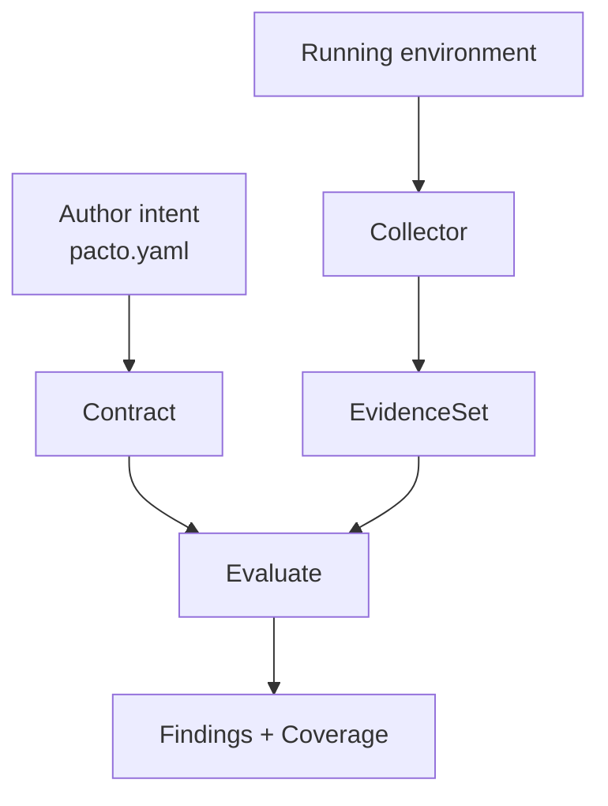
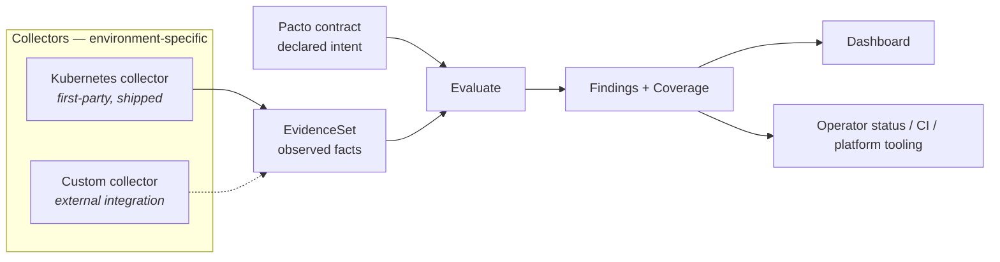
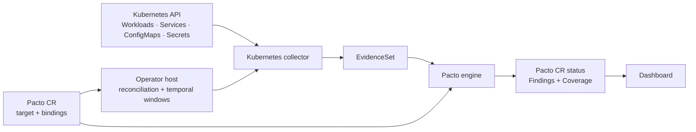

# Collectors and the evidence boundary

Pacto's architecture is four roles, not three tools. The CLI, dashboard and
Kubernetes operator are *products* built around these roles:

- **Contract** — declares stable service intent (`pacto.yaml`).
- **Collectors / evidence producers** — observe one environment and emit `Evidence`.
- **Evaluation engine** — the pure `Evaluate(contract, evidence)` function.
- **Findings consumers / integration hosts** — surface or act on the results.

The stable extension boundary is the **`EvidenceSet`**, not a collector interface.
A *collector* is any component that observes a real system and produces a valid
`EvidenceSet` the engine can evaluate. This is modularity through a stable Evidence
schema — **not** a dynamically pluggable collector runtime.

## Declaration vs observation

The central V2 split: the author declares intent; a collector observes reality; the
engine evaluates one against the other.



## The collector system

Different environments need different collectors; each produces the same
`EvidenceSet`. The Kubernetes collector is the first shipped one. A custom collector
is an architectural extension point, not an included implementation.



The engine is pure and platform-neutral; the dashboard, operator status and CI are
consumers or hosts, not collectors. Pacto does not ship ECS, Nomad, Terraform or
cloud collectors — the dotted "custom collector" is a design extension point only.

## The roles

| Role | Responsibility |
|------|----------------|
| Contract | Declares stable service intent |
| Collector | Observes one environment and emits `Evidence` |
| Integration host | Schedules collection, handles credentials, owns temporal state |
| Engine | Evaluates `Contract × Evidence` (pure) |
| Reporter / consumer | Displays or acts on `Findings` |
| Plugin | Generates artifacts *from* a contract — a different subsystem from collectors |

**Collector vs plugin — not interchangeable.** A *plugin* consumes a contract to
generate an artifact (e.g. an OpenAPI schema or SBOM). A *collector* observes a real
system to produce `Evidence`. They are complementary extension mechanisms in
different directions and must not be conflated.

## Kubernetes composition

In the Kubernetes integration the operator is the host/controller *around* the
collector — it owns reconciliation and stabilization windows. The collector
translates Kubernetes facts into `Evidence`. The core never queries Kubernetes, and
Kubernetes-specific bindings stay out of `pacto.yaml` (they live on the Pacto CR).



## Implementing a third-party collector today

Be exact about what exists. Pacto's engine is collector-agnostic **at the library
boundary**: a custom Go integration constructs and validates `EvidenceSet` values
(`pkg/evidence`) and calls `Evaluate` (`pkg/validation`). The stable surface is:

- the `EvidenceSet` Go/JSON model (subject, contract ref, source, observed-at,
  observations),
- observation identity (kind + subject),
- `Outcome` semantics (Observed / Unsupported / Failed / Stale / Insufficient),
- payload rules and provenance,
- the Evidence validation invariants,
- how `Evaluate` consumes an `EvidenceSet`.

A standalone collector process protocol is **not** currently defined: there is no
public CLI, API or wire protocol that accepts third-party `Evidence`, and collectors
cannot be installed or registered dynamically. A custom collector is a Go integration
that builds evidence and calls the engine directly, for example:

```go
contract := loadContract(...)                     // your bundle load
ev := customCollector.Observe(ctx, subject)       // your collector -> evidence.EvidenceSet
findings, coverage := validation.Evaluate(contract, ev)
```
