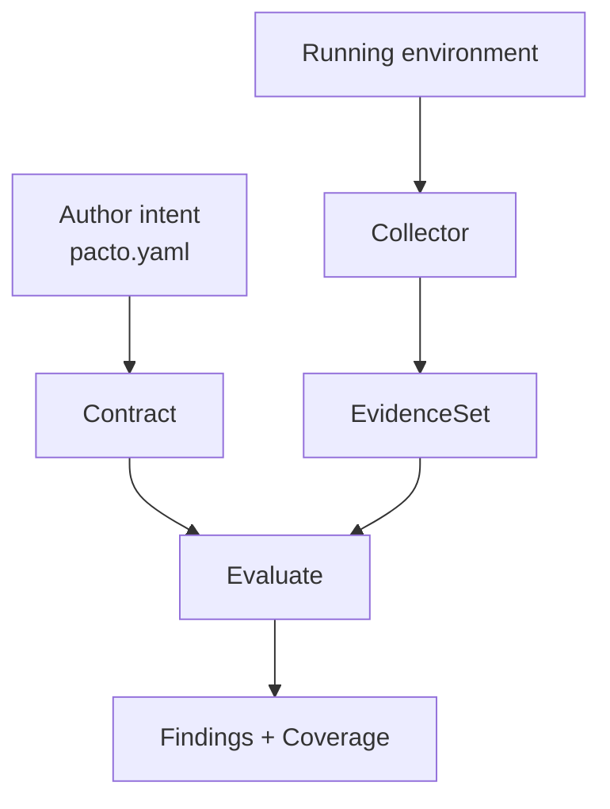
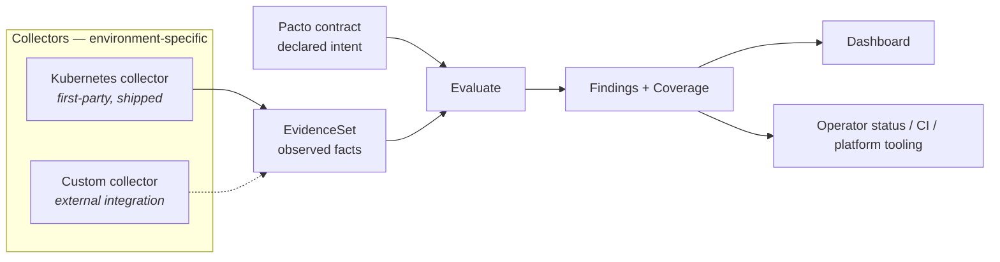
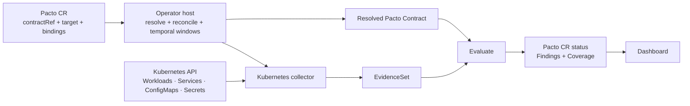

# Collectors and the evidence boundary

The CLI, dashboard and Kubernetes operator are three *products*. Underneath them
the architecture is [five roles](#the-roles), and each product is built around
some of them.

A collector is *not* what the dashboard calls a **data source**. A data source is an
ingestion seam that contributes revisions and targets to the
[operational graph](operational-graph.md#sources); a collector produces the
compliance evidence a source can then carry.

The stable extension boundary is the **`EvidenceSet`**, not a collector interface.
A *collector* is any component that observes a real system and produces a valid
`EvidenceSet` the engine can evaluate. This is modularity through a stable Evidence
schema — **not** a dynamically pluggable collector runtime.

## Declaration vs observation

The central V2 split, stated in full in
[the Pacto model](model.md#declaration-versus-observation): the author declares
intent; a collector observes reality; the engine evaluates one against the other.



## The collector system

Different environments need different collectors; each produces the same
`EvidenceSet`. The Kubernetes collector is the first shipped one. A custom collector
is an architectural extension point, not an included implementation.



The engine is pure and platform-neutral; the dashboard, operator status and CI are
consumers or hosts, not collectors. Pacto does not ship ECS, Nomad, Terraform or
cloud collectors — the "custom collector" box in the diagram above is a design
extension point only.

## The roles

| Role | Responsibility |
|------|----------------|
| Contract | Declares stable service intent |
| Collector | Observes one environment and emits `Evidence` |
| Integration host | Schedules collection, handles credentials, owns temporal state |
| Engine | Evaluates `Contract × Evidence` (pure) |
| Reporter / consumer | Displays or acts on `Findings` |

**Collector vs plugin — not interchangeable.** A *plugin* is not a sixth role;
it belongs to a different subsystem. A *plugin* consumes a contract to
generate an artifact (e.g. an OpenAPI schema or SBOM). A *collector* observes a real
system to produce `Evidence`. They are complementary extension mechanisms in
different directions and must not be conflated.

## Kubernetes composition

In the Kubernetes integration the operator is the host/controller *around* the
collector — it owns reconciliation and stabilization windows. The collector
translates Kubernetes facts into `Evidence`. The core never queries Kubernetes, and
Kubernetes-specific bindings stay out of `pacto.yaml` (they live on the Pacto CR).



The CR is **not** the Contract: the operator host resolves the `contractRef` into a
Contract and owns reconciliation + stabilization windows; the collector translates
Kubernetes facts into Evidence but does not evaluate compliance; `Evaluate` receives
the Contract and the Evidence (the core never queries Kubernetes); the host writes
the results to CR status, which the dashboard consumes (it does not collect or evaluate).

## Implementing a third-party collector today

Be exact about what exists. Pacto's engine is collector-agnostic **at the library
boundary**: a custom Go integration constructs and validates `EvidenceSet` values
(`pkg/evidence`) and calls `Evaluate` (`pkg/validation`). The stable surface is:

- the `EvidenceSet` Go/JSON model (subject, contract ref, source, observed-at,
  observations),
- observation identity (kind + subject),
- `Outcome` semantics (Observed / Unsupported / Failed / Stale / Insufficient),
- payload rules and provenance,
- the Evidence validation invariants,
- how `Evaluate` consumes an `EvidenceSet`.

Two integration surfaces exist today. **In-process**, a custom Go collector builds
an `EvidenceSet` (`pkg/evidence`) and calls `Evaluate` (`pkg/validation`) directly.
**Across a trust boundary**, a remote environment reports a signed `EvidenceSet`
over the [external evidence protocol](evidence-protocol.md) — a versioned,
Ed25519-signed wire format and ingestion API. What is still **not** defined is a
dynamically pluggable collector runtime: collectors cannot be installed or
registered as plugins. The stable surface is the `EvidenceSet` itself, whether
passed in-process or signed and reported over the wire. The in-process path is the
compiled, run example `ExampleEvaluate` in `pkg/validation/collector_example_test.go`:

```go
// 1. The contract declares intent (loaded from a bundle in real use).
c := contract.Contract{
    Service:    contract.Service{Name: "orders", Version: "1.0.0"},
    Interfaces: []contract.Interface{{Name: "public-api", Type: "openapi", Ref: "interfaces/openapi.yaml"}},
}

// 2. A collector observes the environment and produces an EvidenceSet.
prov := evidence.Provenance{Collector: "example", DetectedAt: time.Unix(0, 0)}
ev := evidence.EvidenceSet{
    Subject:     evidence.SubjectRef{Kind: "service", Name: "orders"},
    ContractRef: "oci://example/orders:1.0.0",
    Source:      "example",
    ObservedAt:  time.Unix(0, 0),
    Observations: []evidence.Observation{
        evidence.NewInterfaceObserved(evidence.SubjectRef{Kind: "interface", Name: "public-api"}, "openapi", true, prov),
    },
}

// 3. The pure engine evaluates Contract x Evidence.
findings, coverage := validation.Evaluate(c, ev)
```

## Every assertion needs a possible Evidence path

A contract assertion is only meaningful if some collector can produce the Evidence to
evaluate it. This is why the V2 model has no permanently-unsatisfiable assertions: the
`verification.conformance` opt-in was **removed** because no collector or evaluator
currently produces interface-conformance Evidence — keeping it would only make a
service permanently Unknown. Declaring an `interfaces[]` entry therefore requires
runtime *availability* Evidence, not schema/protocol *conformance*. Conformance
verification can return when there is a real observation kind and evaluator that
produce Observed conformance Evidence — at which point it will have a collector path,
not just a schema field.

---

## See also

- [The Pacto model](model.md) — the engine, the compliance states and the ten
  roles this pipeline sits inside
- [Evidence protocol](evidence-protocol.md) — reporting a signed `EvidenceSet`
  across a trust boundary
- [Runtime observations](integrations/kubernetes/runtime-observations.md) — what
  the first-party collector observes and the findings it produces
- [Core concepts](concepts.md) — the distinctions the evidence boundary rests on
