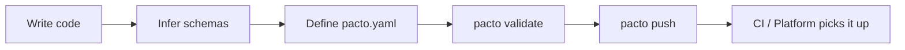

# Pacto for Developers

You own the service — and you own the contract. Pacto gives you a structured way to declare your service's operational contract alongside your code, so platform engineers, CI systems and other teams have an accurate, machine-readable description of what your service needs to run.

It reuses the specs you already have — your OpenAPI document, your config's JSON Schema — and adds the operational layer none of them owns: ownership, dependencies, compatibility, readiness. One validated, versioned YAML file instead of stale wiki pages and tickets.

Already have a contract and want a single answer? [Quickstart](quickstart.md) is
the five-minute path, the [CLI reference](cli-reference.md) is every command and
flag, and [contract sections](contract-reference/sections.md) is every field.

---

## Your workflow



### 1. Initialize your contract

```bash
pacto init my-service
```

This scaffolds a bundle with a valid contract. Edit `pacto.yaml` to match your service.

### 2. Infer schemas from your code (optional)

A configuration interface in Pacto is a JSON Schema. If your config already ships a JSON Schema — for example your Helm chart's `values.schema.json` — vendor that file into your bundle and point `configurations[].schema` at it. If it doesn't, the `schema-infer` plugin generates one from a config file. Use `-o` to write the output into your bundle.

#### Generating a configuration schema

The `--option file=` path is resolved relative to the **bundle directory**, not your shell's working directory, so keep the config file inside the bundle. With `config.yaml` in `my-service/`:

```bash
pacto generate schema-infer my-service --option file=config.yaml -o my-service
```

This generates `my-service/config.schema.json`. Reference it in your contract:

```yaml
configurations:
  - name: default
    required: true
    schema: config.schema.json
```

!!! warning "Two things the plugin's closing message gets wrong for you"
    It says *"add `configuration.schema: config.schema.json` to your pacto.yaml"*.
    There is no `configuration` section — the field is `configurations[].schema`,
    as in the block above. The message comes from the plugin, not from Pacto.

    It also leaves your `config.yaml` sitting in the bundle, and **a bundle
    directory is published whole**: `pacto pack` and `pacto push` upload every file
    under it, so `pacto pull` hands your config values, secrets included, to anyone
    who can read the artifact. The input is not part of the contract — the schema
    inferred from it is. Delete it once the schema exists, or list it in
    [`.pactoignore`](pactoignore.md) if you want to keep it beside the contract.

#### Vendoring or referencing a shared schema

When you define your own configuration schema, you are declaring **what your service requires** to run. This is the most common model for services that need to be portable across environments. If your platform team provides a shared schema instead, you can either vendor it into your bundle or reference it via OCI:

```yaml
configurations:
  - name: platform
    ref: oci://ghcr.io/acme/platform-config-pacto:1.0.0
    required: true
```

See [Configuration Schema Ownership Models](patterns/configuration-schema-ownership.md) for details.

#### Generating an OpenAPI spec

If your service exposes an HTTP API using FastAPI or Huma, use the `openapi-infer` plugin to extract an OpenAPI 3.1 spec from your source code:

```bash
# Auto-detect framework — FastAPI or Huma only (generates interfaces/openapi.yaml)
pacto generate openapi-infer my-service -o my-service

# Override framework detection
pacto generate openapi-infer my-service -o my-service --option framework=fastapi

# Custom output path (format inferred from extension)
pacto generate openapi-infer my-service -o my-service --option output=interfaces/openapi.json
```

Then reference the generated spec in your contract:

```yaml
interfaces:
  - name: api
    type: openapi
    ref: interfaces/openapi.yaml
    visibility: public
```

Both plugins live in a separate repository and are **not** part of the `pacto` binary. The installer script fetches them alongside the CLI; `go install` and `make build` do not. See [Official plugins](plugins.md#official-plugins) for how to get them.

### 3. Declare your interfaces (optional)

List every boundary your service exposes. Services with no network interfaces (e.g. batch jobs or shared libraries) may omit this section:

```yaml
interfaces:
  - name: api
    type: openapi
    ref: interfaces/openapi.yaml
    visibility: public

  - name: events
    type: asyncapi
    ref: interfaces/events.yaml
    visibility: internal
```

Include the actual interface files (OpenAPI documents, AsyncAPI documents, gRPC service descriptors) in the bundle. Pacto references them as-is.

### 4. Define your workload and state (optional)

Tell the platform what the service *is*:

```yaml
workload: service

state:
  type: stateless
  persistence:
    scope: local
    durability: ephemeral
  dataCriticality: low

capabilities:
  - type: health
    binding:
      type: http
      interface: api
      path: /health
```

Choose your `workload` (`service` vs `job`/`scheduled`), `state.type` (`stateless`/`stateful`/`hybrid`) and `dataCriticality`; these determine how platforms provision infrastructure for your service. Declare `health` and `metrics` as [capabilities](contract-reference/sections.md#capabilities). See [state](contract-reference/dependencies-and-state.md#state) in the Contract Reference for the full explanation.

### 5. Declare dependencies

If your service depends on other Pacto-enabled services:

```yaml
dependencies:
  - name: auth
    ref: oci://ghcr.io/acme/auth-pacto@sha256:0123456789abcdef0123456789abcdef0123456789abcdef0123456789abcdef
    required: true
    compatibility: "^2.0.0"

  - name: cache
    ref: oci://ghcr.io/acme/cache-pacto:1.0.0
    required: false
    compatibility: "~1.0.0"

  # Tag omitted — resolves to the highest version matching ^3.0.0
  - name: utils
    ref: oci://ghcr.io/acme/utils-pacto
    required: true
    compatibility: "^3.0.0"
```

During development, you can reference local contracts:

```yaml
dependencies:
  - name: shared-db
    ref: file://../shared-db
    required: true
    compatibility: "^1.0.0"
```

!!! warning
    Local refs are rejected by `pacto push`. Switch all dependencies to `oci://` references before publishing.

If your service depends on a cloud-managed resource (e.g. a database or message queue), create a minimal Pacto contract representing it and reference it as a dependency. This keeps cloud dependencies explicit and version-tracked.

Use `pacto graph` to visualize your dependency tree. Pass `--with-references` to also see config/policy reference edges alongside dependencies, or `--only-references` to show only reference edges. A reference (a config or policy `ref`) points at a shared configuration or policy contract, as opposed to a dependency, which is a runtime relationship to another service.

### 6. Adopt a policy (optional)

If your platform team publishes a policy contract, reference it in your contract:

```yaml
policies:
  - name: platform-policy
    ref: oci://ghcr.io/acme/platform-policy-pacto:1.0.0
```

A policy is a JSON Schema that validates the contract itself — enforcing organizational standards like requiring a health capability or a declared owner. See [policies](contract-reference/configuration-and-policy.md#policies) in the Contract Reference for details.

### 7. Validate before pushing

```bash
pacto validate my-service
```

Validation catches errors in three layers:

1. **Structural** — missing fields, wrong types, invalid enum values
2. **Cross-field** — interface references match, state invariants hold, files exist
3. **Policy enforcement** — referenced policies are resolved and enforced

See [Validation layers](contract-reference/validation.md#validation-layers) for the full rules and error codes.

To also enforce the readiness gate — the `readiness:` block `pacto init` scaffolds into your contract — run `pacto validate --readiness`. It fails if the derived readiness score is below `minScore`. Plain `pacto validate` does not enforce it because the gate is time-dependent (the assessment's expiry is compared against the run time). See [Contract Reference — readiness](contract-reference/dependencies-and-state.md#readiness).

### 8. Push

```bash
pacto push oci://ghcr.io/your-org/my-service-pacto -p my-service
```

`push` reads the bundle directory and uploads it. There is no packing step in
front of it: hand it a `.tar.gz` and it answers `my-service-0.1.0.tar.gz is not
a directory`. Use a [`.pactoignore`](pactoignore.md) file to keep build
artifacts and other cruft out of what gets uploaded.

If the artifact already exists in the registry, `pacto push` prints a warning and exits without pushing. Use `--force` to overwrite:

```bash
pacto push oci://ghcr.io/your-org/my-service-pacto -p my-service --force
```

Either way the push is validated first: `push` resolves `policies[].ref` and
refuses to publish a contract that does not satisfy the referenced schema,
before it opens a connection to the registry. `--force` overwrites an existing
tag; it does not skip that check ([policy enforcement on push](contract-reference/configuration-and-policy.md#policies)).
The gate is Pacto's own — a published bundle
is an ordinary OCI artifact, so anything with push access to the repository can
put one there without going through Pacto at all.

`pacto pack my-service` is a separate path, not a step on this one: it writes
`my-service-0.1.0.tar.gz` for handing to someone with no registry access. No
Pacto command reads that archive back — the recipient extracts it and points
`validate`, `explain` or `diff` at the resulting directory.

---

## Common runtime patterns

Each common shape has a ready-made worked example you can copy:

| Pattern | `state.type` | Worked example |
|---------|-------------|----------------|
| Stateless HTTP API | `stateless` | [nginx](examples/index.md#nginx) |
| Stateful service (database, cache) | `stateful` | [postgresql](examples/index.md#postgresql) |
| API with local cache | `hybrid` | [hybrid-cache](examples/index.md#hybrid-cache-api) |
| Scheduled job | `stateless` (workload `scheduled`) | [cron-worker](examples/index.md#cron-worker) |

See [state](contract-reference/dependencies-and-state.md#state) for the full field spec.

Overriding contract values is in [Contract overrides](contract-reference/overrides.md),
shipping `docs/` and `sbom/` in the bundle is in the
[Contract Reference](contract-reference/index.md#bundle-structure), and driving
Pacto from an AI assistant is in [MCP Integration](mcp-integration.md).

---

## Tips

- **Version your contract alongside your code.** The `pacto.yaml` lives in your repository.
- **Pin dependency digests in production.** Tags are mutable; digests are not. Run [`pacto lock`](lockfile.md) to pin the full transitive closure to digests in a committed `pacto.lock`.
- **Keep interface specs up to date.** The OpenAPI, AsyncAPI and gRPC descriptors in the bundle should match what your service actually serves.
- **Use `pacto explain` to review.** A human-readable summary of identity, workload, state, capabilities, interfaces, dependencies and readiness — but not `configurations` or `policies`, which `pacto doc` renders.
- **Use `pacto doc` to publish the contract as a page.** It generates Markdown with architecture diagrams and interface tables. Use `--serve` to view it in the browser.
- **Leverage caching.** OCI bundles are cached locally in `~/.cache/pacto/oci/` and tag listings are cached in memory per command, so repeated `graph`, `doc`, and `diff` commands resolve instantly. Use `--no-cache` to force a fresh pull.
- **Use `--verbose` for debugging.** Pass `-v` to any command to see debug-level logs (OCI operations, resolution steps, cache hits/misses) on stderr.
- **Use metadata for organizational context.** Team ownership, on-call channels, and service tiers go in `metadata`.
- **Explore contracts visually.** Run `pacto dashboard` to launch the operational dashboard — navigate the operational graph, inspect interfaces, review configuration schemas, and use Change analysis to see what a revision changed and what that change affects. It auto-detects contracts from local directories, OCI registries, and Kubernetes.
- **Or stay in the terminal.** `pacto tui` is the same fleet in a full-screen terminal UI, and unlike the dashboard it can act: validate, explain, lock-check and the neighborhood graph run against the highlighted row, diff and impact against two rows you arm in turn, and push, pull, lock update and generate run as confirmed subprocesses. See [The terminal UI](fleet-tools.md#the-terminal-ui).

---

## See also

- [Contract reference](contract-reference/index.md) — every field, precisely
- [Composition patterns](patterns/index.md) — the compositions these primitives
  are usually assembled into
- [CLI reference](cli-reference.md) — every command and flag
- [For platform engineers](platform-engineers.md) — the other side of the same
  contract
