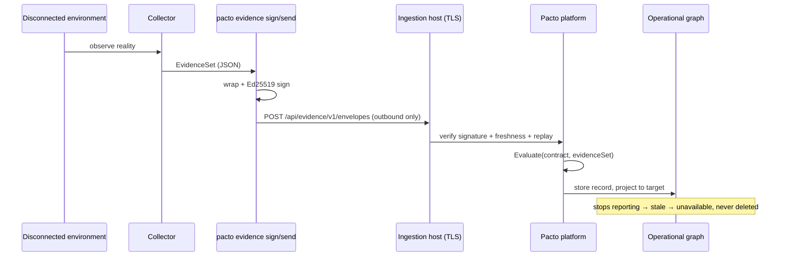

# External evidence protocol

Most runtime evidence reaches Pacto from a cluster the operator watches. Some
environments cannot be watched: an edge site, an air-gapped estate, a customer
tenant, a CI runner that only exists for ninety seconds. The **external evidence
protocol** lets those environments participate anyway, without Pacto ever
reaching into them. A remote environment produces and signs a Pacto `EvidenceSet`
and reports it outbound to an ingestion endpoint. The platform verifies it,
evaluates it against the declared contract and exposes the result as an
operational target in the [operational graph](operational-graph.md).

The wire format is a versioned, Ed25519-signed envelope — `pacto.dev/evidence/v1`
— defined once in `pkg/evidenceenvelope` and shared by producers, the CLI and the
ingestion host. This page is the protocol reference. The HTTP surface is in
[Evidence ingestion API](evidence-ingestion-api.md); for key handling and the
CLI, see [evidence security and tooling](evidence-security.md).

---

## Outbound-only reporting

The protocol is deliberately one-directional. Pacto never dials into a remote
environment, opens a tunnel or holds a credential for it. The remote side is the
only party that initiates contact, and it only ever pushes:

1. A collector in the environment observes reality and produces an `EvidenceSet`.
2. The environment wraps it in an envelope and signs it with its own private key.
3. It reports the envelope outbound to the platform's ingestion endpoint.
4. The platform verifies the signature against a trust store, evaluates the
   carried evidence against the resolved contract revision and stores the result.
5. The operational graph shows that environment as a target with real findings,
   freshness and provenance.

Because reporting is outbound and periodic, **absence of a new report is not
absence of the target**. A target that stops reporting goes `stale`, then its
source goes `unavailable` — it is never silently deleted and never rendered as an
empty result. This is the same invariant the operational graph applies
everywhere: an environment that goes quiet is *missing*, not *gone*.



---

## The envelope

An envelope carries exactly one `EvidenceSet` plus the identity, ordering and
freshness metadata the platform needs to trust and place it.

| Field | Type | Meaning |
|-------|------|---------|
| `apiVersion` | string | Protocol version. Must be `pacto.dev/evidence/v1`. |
| `kind` | string | Must be `EvidenceEnvelope`. |
| `id` | string | Unique envelope id. The CLI defaults it to a `sha256:` hash over `apiVersion`, `producer.id`, `sequence` and the evidence, so two producers reporting identical evidence never collide on one id. |
| `producer.id` | string | The environment that produced the envelope. Becomes the target's scope. |
| `producer.version` | string | Optional producer or collector version. |
| `producer.keyId` | string | Trust-store key id that signed this envelope. |
| `sequence` | uint64 | Monotonic per-producer counter for replay and ordering. |
| `issuedAt` | RFC3339 | When the envelope was signed. |
| `expiresAt` | RFC3339 | End of the validity window. Zero disables expiry. |
| `evidenceSet` | object | The Pacto `EvidenceSet` being reported (see [collectors](collectors.md)). |
| `signature` | object | `{ "algorithm": "Ed25519", "value": "<base64>" }` over the canonical bytes. |

A full envelope on the wire:

```json
{
  "apiVersion": "pacto.dev/evidence/v1",
  "kind": "EvidenceEnvelope",
  "id": "sha256:8f3c…",
  "producer": { "id": "edge-eu-west", "version": "1.4.2", "keyId": "edge-eu-west-2026" },
  "sequence": 42,
  "issuedAt": "2026-07-29T10:00:00Z",
  "expiresAt": "2026-07-30T10:00:00Z",
  "evidenceSet": {
    "Subject": { "kind": "service", "name": "payments-api" },
    "ContractRef": "oci://registry.example.com/acme/payments-api@sha256:1a2b…",
    "Source": "edge-collector",
    "ObservedAt": "2026-07-29T09:59:00Z",
    "Observations": [
      {
        "kind": "WorkloadObserved",
        "subject": { "kind": "service", "name": "payments-api" },
        "outcome": "Observed",
        "value": { "type": "service" },
        "provenance": { "collector": "edge-collector", "detectedAt": "2026-07-29T09:59:00Z" }
      }
    ]
  },
  "signature": { "algorithm": "Ed25519", "value": "2Q6dU2WIsvalLVyjpMZMaZp7NM5UK4nbj0koDwU9TkfY9vjdkkoircs10BxcWwRFvkR+YIibqnzaSJGYgyZhDw==" }
}
```

The `evidenceSet` object uses the `EvidenceSet` shape verbatim, so its top-level
keys are `Subject`, `ContractRef`, `Source`, `ObservedAt` and `Observations`.
`pacto evidence sign` reads a file in exactly this shape and rejects unknown keys.

---

## Canonical bytes and signing

The signature covers the envelope's **canonical bytes**: the envelope JSON with
the `signature` field omitted, re-encoded through a generic decode so map keys
are sorted and whitespace is normalized. A decode then re-encode round trip on
either side reproduces identical bytes, so transport whitespace or field-order
changes never break verification.

Signing and verification are Ed25519. `Sign` fills the `signature` object with
the standard-base64 signature over the canonical bytes; the signer is
responsible for setting `producer.keyId`. `Verify` recomputes the canonical
bytes, resolves `producer.keyId` in the trust store and checks the signature,
then the freshness window. The verification result is a sentinel error whose
message never contains key or signature material.

---

## Key ids and the trust store

`producer.keyId` selects a trust-store entry that binds the key to the **one
producer** it may sign as. A trust store is a single public-key file or a
directory of `.pub` files, each a base64 Ed25519 public key. The file name binds
the producer: `<producerId>__<keyId>.pub` authorizes key `keyId` for producer
`producerId`; a bare `<keyId>.pub` authorizes it for the producer whose id equals
the key id. Authentication and authorization are separate:

- **Authenticate.** An envelope whose `keyId` is not in the trust store is
  rejected as an unknown key; an unsigned envelope, an unsupported algorithm or a
  bad signature is rejected. Verification is mandatory.
- **Authorize.** After the signature checks out, the envelope's `producer.id` must
  match the key's bound producer, or it is rejected — a trusted key can never sign
  as another producer. An optional per-key subject allowlist further scopes which
  subjects it may report.
- **Rotate without impersonation.** Rotating is adding a new
  `<producerId>__<newKeyId>.pub`, signing with the new `keyId`, and removing the
  old entry — the producer identity survives the key change, and no key can assume
  another producer's identity.
- Distributing the trust store is an out-of-band operator responsibility. The
  protocol verifies against whatever keys the host trusts; it never fetches keys.

### Contract references must be immutable

Evidence from a producer you do not control must not steer the ingestion host to
arbitrary storage. A reported `evidenceSet.ContractRef` is accepted only when it
is an immutable `oci://…@sha256:…` digest reference; a local path, a bare ref or a
mutable tag is rejected **before** resolution. A per-key repository allowlist (on
the producer's trust entry) can further restrict which registries or repositories
its evidence may reference.

---

## Freshness, replay and bounds

**Expiry.** `issuedAt` and `expiresAt` bound the validity window. `pacto evidence
sign --ttl` sets `expiresAt = issuedAt + ttl` (default 24h; `--ttl 0` disables
expiry). Verification rejects an envelope after `expiresAt` (expired) or before
`issuedAt` (not yet valid). A zero `expiresAt` means no expiry check.

**Replay and sequence.** Each producer stamps a strictly increasing `sequence`.
The ingestion replay guard rejects a repeated envelope `id` and any `sequence`
not greater than the producer's last accepted value. Re-sent or reordered
reports are therefore safe: the platform keeps the latest report per target and
never regresses to an older one. Replay protection is enforced inside the
serialized commit, over a duplicate-id set and per-producer sequence maximum
re-derived from the registry on every commit — so it survives process and pod
restarts, because there is no local state to lose (see
[durable storage in the registry](#durable-storage-in-the-registry)).

**Size and observation bounds.** A decoded envelope is capped at **1 MiB**, and a
single envelope may carry at most **10,000 observations**. The HTTP handler reads
the body through an `io.LimitReader` of one byte past the cap, so an oversized
payload is refused before it can exhaust memory at the boundary.

**Strict decoding.** Decoding rejects unknown JSON fields and requires
`apiVersion`, `kind`, `id`, `producer.id` and `producer.keyId`. `apiVersion` must
be `pacto.dev/evidence/v1` and `kind` must be `EvidenceEnvelope`. A malformed or
unknown-field payload is refused before any signature work.

---

## Durable storage in the registry

Accepted evidence is durable, and Pacto does not store it. Behind the ingestion
host is the **Evidence Server**, a stateless boundary that publishes every
accepted report to the **contract registry** as an OCI 1.1 referrer of the exact
contract revision the report is about. There is no bucket, no PVC, no database
and no recovery engine. The full operational guide is
[evidence in the registry](evidence-oci-storage.md); the protocol-level shape is:

**One artifact per accepted report.** An untagged OCI manifest whose `subject` is
the contract digest from the signed `EvidenceSet.ContractRef`, with
`artifactType: application/vnd.pacto.evidence.record.v1+json` and exactly one
layer carrying a `pacto.dev/evidence-record/v1` payload. It is built
deterministically, so republishing an identical record yields an identical digest
rather than a second copy.

The rest is operational, and [evidence in the registry](evidence-oci-storage.md)
is where each rule is stated in full:

| Rule | Where |
|---|---|
| **Configured subjects only** — an explicit allow-list of exact `oci://<repo>@sha256:<digest>` revisions; mutable tags, local paths, inferred repositories and catalog-wide discovery are all rejected. | [Configuring subjects](evidence-oci-storage.md#configuring-subjects) |
| **Native Referrers, no tag fallback** — a registry without the native endpoint makes the server not-ready rather than storing evidence where another client would not look. | [Registry requirements](evidence-oci-storage.md#registry-requirements) |
| **State is re-derived, never kept** — every commit re-enumerates the history from the registry, so replay protection survives a restart because there was never local state to lose. | [The commit protocol](evidence-oci-storage.md#the-commit-protocol) |
| **Reads fail honest, writes fail closed** — an unreadable store is reported as `partial` or refused, never rendered as an empty one; a replay check over a partial history is not a replay check. | [Readiness, partial and unavailable](evidence-oci-storage.md#readiness-partial-and-unavailable) |
| **Single active writer, no distributed lock** — one replica with the `Recreate` rollout strategy, because the registry offers no compare-and-set two writers could agree on. | [The commit protocol](evidence-oci-storage.md#the-commit-protocol) |
| **Retention is the registry's** — Pacto never deletes an evidence artifact. | [Retention, backup and garbage collection](evidence-oci-storage.md#retention-backup-and-garbage-collection) |

---

## Deployment

The Evidence Server, the dashboard and the operator are three independent
processes with one clean responsibility split — the Evidence Server owns
ingestion, verification, evaluation and publication, the dashboard consumes the
server's read-only contribution and the operator manages the Kubernetes
lifecycle.

- **In Kubernetes** it is an optional operator-managed component of the single
  `pacto-operator` Helm chart: set `evidence.enabled=true` and name at least one
  `evidence.registry.subjects` entry. The operator reconciles a separate Evidence
  Server Deployment and an internal Service, and **nothing durable** — no PVC and
  no data volume, because the store is your registry. There is no standalone
  evidence chart and no subchart. When both `dashboard.enabled` and
  `evidence.enabled` are set, the operator auto-wires the dashboard to the
  internal server via `PACTO_EVIDENCE_SOURCE_URL`, and the dashboard consumes it
  read-only over HTTP without ever holding a registry credential.
- **Outside Kubernetes** the same component runs via `pacto evidence serve` — see
  [evidence security and tooling](evidence-security.md#running-the-ingestion-endpoint).

Disabling the component removes its whole footprint and loses no evidence: the
records stay where they were written, in the contract registry.

---

## Trust boundary

Pacto ships two things that look adjacent but are not the same trust level.

- The **offline target-state fixture** (`pacto fleet --target-state`,
  `pacto mcp --fleet --target-state`) is a demo and test adapter. It supplies
  targets from a local file with **no signature and no verification**. It exists
  to run cluster-free demos and tests. It is not this protocol and carries none
  of its guarantees.
- The **signed EvidenceSet envelope** described here is the real external-evidence
  boundary. Every envelope is Ed25519-signed and verified against a trust store,
  bounded in size, protected against replay and evaluated against the declared
  contract before it becomes a target.

When you need to actually trust evidence from an environment you do not control,
use this protocol, not the fixture.

---

## See also

- [Operational graph](operational-graph.md) — where ingested targets appear and how freshness and completeness work
- [Evidence security and tooling](evidence-security.md) — keygen, sign, verify, serve, send and key handling
- [Collectors and the evidence boundary](collectors.md) — how an `EvidenceSet` is produced and evaluated
