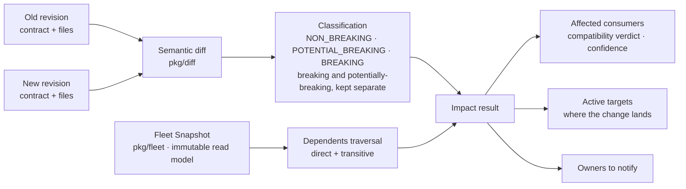

# Impact analysis (`pacto impact`)

A semantic diff tells you *how* a revision changed. The operational graph tells
you *who depends on the service and where it runs*. **Impact analysis** composes
the two to answer the question a reviewer actually asks before merging: *if this
revision ships, what is the real blast radius?*

Impact is framework-independent (`pkg/impact`). It consumes the pure diff engine
([change classification](contract-reference/diff.md)) and the immutable
[operational-graph](operational-graph.md) read model, and imports no Kubernetes,
OCI, dashboard, MCP or HTTP code. The same analysis therefore backs the CLI, an
MCP tool and the dashboard, and every one of them returns the identical answer.

---

## Diff × graph → impact



The diff is computed once over the old→new revision. The changed service is then
looked up in the operational graph and traversed in the **dependents** direction,
direct and transitive. Each dependent becomes an *affected consumer*, annotated
with the evidence Pacto actually has for that edge. The result also rolls up the
**active targets** the change would land in and the **owners** to notify.

Every answer inherits the snapshot's `asOf` time, `completeness` and
`limitations`, so a partial fleet is never presented as a complete blast radius.
If the changed service is not present in the graph at all, the result says so with
a `SERVICE_NOT_IN_FLEET` limitation rather than reporting an empty blast radius.

---

## What an affected consumer carries

For each dependent the analysis records:

| Field | Meaning |
|-------|---------|
| **service / domain / owner** | Who is affected and who owns them. |
| **depth / direct / path** | `depth` 1 is a direct dependent, `>1` is transitive. `path` is the dependency chain from the consumer to the changed service. |
| **required** | Whether the consumer declared this dependency as required. |
| **compatibility** | The consumer's declared compatibility range against the changed service. |
| **compatibilityVerdict** | Whether the new version satisfies that range (see below). |
| **provenance** | Where the edge came from: `declared`, `observed`, `declared+observed` or `inferred`. |
| **confidence** | How strongly the evidence supports the claim (see below). |
| **status / targets** | The consumer's aggregate status and the operational targets it runs in. |

### Compatibility verdict

The verdict checks the *new* version against the consumer's declared
compatibility range:

| Verdict | When |
|---------|------|
| **compatible** | The consumer declares a range and the new version satisfies it. |
| **incompatible** | The consumer declares a range and the new version does not satisfy it. |
| **unknown** | No declared range, or a range or version that cannot be parsed. Absence of a range is not a pass — it is uncertainty. |

### Confidence model

Confidence grades how strongly the available evidence supports each
affected-consumer claim. This is the heart of impact's honesty: a declared
dependency is stronger evidence than a transitive guess, and Pacto never dresses a
guess up as a fact.

| Confidence | Exact meaning |
|------------|---------------|
| **contractual** | A declared dependency **with** a usable compatibility range. The consumer's own contract says it depends on this service and pins the versions it accepts. |
| **declared** | A declared dependency **without** a usable compatibility range. The dependency is stated, but no version constraint was pinned, so a compatibility verdict cannot be computed. |
| **observed** | Runtime use of the dependency was observed in a window. Requires `--include-observed`. |
| **corroborated** | The declared dependency and an observed one agree — the strongest grade, contract and runtime saying the same thing. |
| **inferred** | A transitive effect reached *through* another affected service (`depth > 1`). It follows from the graph, not from a direct declaration or observation. |
| **unknown** | A direct edge with no declaration and no observation — the effect is possible but unverified. |

Two rules follow directly from this model and are load-bearing:

> **An inferred path is not a confirmed runtime impact.** A transitive consumer is
> reached through the graph. It tells you where to *look*, not that the consumer
> will break. Treat `inferred` as a lead to verify, never as a settled fact.

> **Observed evidence only raises confidence when you opt in.** Without
> `--include-observed` the analysis is declared-only. Runtime observations then
> let a direct edge become `observed` or `corroborated`.

Observed edges come from OpenTelemetry traces via `--traces <file>` (which
implies `--include-observed`). Beyond corroborating declared consumers, traces
surface **observed-only (shadow) consumers** — services seen calling the changed
service that never declared the dependency. A declared-only analysis cannot see
them; with traces they appear as direct consumers at `observed` confidence, so a
release check is not blind to undeclared traffic.

---

## CLI

```bash
pacto impact <old> <new> --local .
```

`<old>` and `<new>` are the two revisions to compare — bundle paths or refs. The
fleet source flags are shared with [`pacto fleet`](operational-graph.md): repeat
`--local` for each bundle root to scan when building the snapshot.

Turn on runtime corroboration with `--include-observed`, or supply an OTLP/JSON
trace export with `--traces` (which implies it) so observed traffic raises
consumer confidence and surfaces shadow consumers:

```bash
pacto impact ./payments-api@1.4.0 ./payments-api@2.0.0 \
  --local ./services \
  --traces ./traces.json
```

The output reports the classification, the breaking and potentially-breaking
changes (kept separate — a potential break is never counted as a confirmed one),
every affected consumer with its compatibility verdict and confidence, the active
targets and the owners to notify — along with the snapshot's completeness and any
limitations.

---

## MCP tool: `pacto_impact`

The same analysis is exposed to agents as the read-only `pacto_impact` MCP tool.
It belongs to the **fleet query** family — see
[MCP integration](mcp-integration.md#three-tool-families-and-their-boundaries) —
and shares that family's boundaries: it projects the operational graph, observes
nothing, changes nothing and authorizes nothing. An agent uses `pacto_impact` to
*understand* a proposed change's blast radius before recommending a review, never
to act on it. Every answer carries `asOf`, `completeness` and `limitations`, so an
agent can tell how much of the system the answer actually covers.

---

## Dashboard: `/api/fleet/impact`

The dashboard serves the analysis at the `/api/fleet/impact` endpoint, returning
the same result model the CLI and MCP tool produce. It lets a reviewer see the
affected consumers, targets, owners and per-consumer confidence for a proposed
old→new change directly in the operational view, without leaving the browser.

---

## It recommends review, it does not act

Impact analysis lists **review targets**. It never recommends or performs an
autonomous action, and it never authorizes one.

- **It does not act.** Rolling back, blocking a deploy, paging an owner or
  gating a pipeline is done by external controllers and delivery systems. Impact
  tells them what is affected and how sure it is; it performs no action itself.
- **It does not authorize.** Whether a change *may* proceed stays with policy and
  IAM systems. Impact supplies verifiable evidence for that decision, it is not
  the decision.
- **It never overstates certainty.** A `partial` snapshot is incomplete
  knowledge, an `unknown` verdict is uncertainty and an `inferred` consumer is a
  lead to verify — none of them is a confirmed runtime impact.

This is the same discipline the operational graph holds to: Pacto makes the
system knowable so controllers can act on it and authorization systems can reason
about it. It is not either of them.

---

## See also

- [The Pacto Operational Graph](operational-graph.md) — the read model impact
  projects onto
- [Change classification rules](contract-reference/diff.md) — the semantic diff
  impact composes with the graph
- [MCP integration](mcp-integration.md) — the fleet query tool family
  `pacto_impact` belongs to
