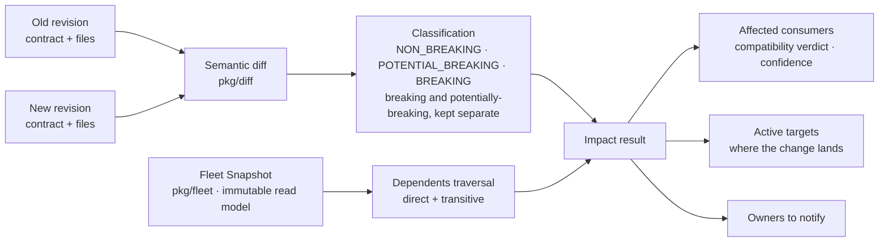

# Impact analysis (`pacto impact`)

A semantic diff tells you *how* a revision changed. The operational graph tells
you *who depends on the service and where it runs*. **Impact analysis** composes
the two to answer the question a reviewer actually asks before merging: *if this
revision ships, who is affected?*

Impact is framework-independent (`pkg/impact`). It consumes the pure diff engine
([change classification](contract-reference/diff.md)) and the immutable
[operational-graph](operational-graph.md) read model, and imports no Kubernetes,
OCI, dashboard, MCP or HTTP code. One analysis therefore backs the CLI command,
the MCP tool and the dashboard's **Change analysis** workspace, and given the same
snapshot all three return the identical answer.

## Diff × graph → impact


```mermaid
flowchart LR
    OLD["Old revision<br/>contract + files"] --> DIFF["Semantic diff<br/>pkg/diff"]
    NEW["New revision<br/>contract + files"] --> DIFF
    DIFF --> CLASS["Classification<br/>NON_BREAKING · POTENTIAL_BREAKING · BREAKING<br/>breaking and potentially-breaking, kept separate"]

    SNAP["Fleet Snapshot<br/>pkg/fleet · immutable read model"] --> GRAPH["Dependents traversal<br/>direct + transitive"]

    CLASS --> IMPACT["Impact result"]
    GRAPH --> IMPACT
    IMPACT --> CONS["Affected consumers<br/>compatibility verdict · confidence"]
    IMPACT --> TARGETS["Active targets<br/>where the change lands"]
    IMPACT --> OWNERS["Owners to notify"]
```

The diff is computed once over the old→new revision. The changed service is then
looked up in the graph and traversed in the **dependents** direction, direct and
transitive. Each dependent becomes an *affected consumer*, annotated with the
evidence Pacto actually has for that edge, and the result rolls up the **active
targets** the change would land in and the **owners** to notify.

Every answer inherits the snapshot's `asOf` time, `completeness` and
`limitations`, so a partial fleet is never presented as a complete list of
affected consumers. A changed service that is not in the graph at all gets a
`SERVICE_NOT_IN_FLEET` limitation rather than an empty consumer list.

## What an affected consumer carries

For each dependent the analysis records:

| Field | Meaning |
|-------|---------|
| **service / domain / owner** | Who is affected and who owns them. |
| **depth / direct / path** | `depth` 1 is a direct dependent, `>1` is transitive. `path` is the dependency chain from the consumer to the changed service. |
| **required** | Whether the consumer declared this dependency as required. |
| **compatibility** | The consumer's declared compatibility range against the changed service. |
| **compatibilityVerdict** | Whether the new version satisfies that range. `compatible` and `incompatible` both need a declared range *and* a range and version `semver` can parse; without all three the verdict is `unknown`, because an unreadable or absent range is uncertainty rather than a pass. |
| **provenance** | Where the edge came from: `declared`, `observed`, `declared+observed` or `inferred`. |
| **confidence** | How strongly the evidence supports the claim (see below). |
| **status / targets** | The consumer's aggregate status and the operational targets it runs in. |

### Confidence model

Confidence grades how strongly the available evidence supports each
affected-consumer claim.

| Confidence | Exact meaning |
|------------|---------------|
| **contractual** | A declared dependency **with** a usable compatibility range. The consumer's own contract says it depends on this service and pins the versions it accepts. |
| **declared** | A declared dependency **without** a usable compatibility range. The dependency is stated, but no version constraint was pinned, so a compatibility verdict cannot be computed. |
| **observed** | Runtime use of the dependency was observed in a window. Requires `--include-observed`. |
| **corroborated** | The declared dependency and an observed one agree — the strongest grade, contract and runtime saying the same thing. |
| **inferred** | A transitive effect reached *through* another affected service (`depth > 1`). It follows from the graph, not from a direct declaration or observation. |
| **unknown** | A direct edge with no declaration and no observation — the effect is possible but unverified. |

> **An inferred path is not a confirmed runtime impact.** A transitive consumer is
> reached through the graph. It tells you where to *look*, not that the consumer
> will break. Treat `inferred` as a lead to verify, never as a settled fact.
>
> **Observed evidence only raises confidence when you opt in.** Without
> `--include-observed` the analysis is declared-only. Runtime observations then
> let a direct edge become `observed` or `corroborated`.

None of this overstates certainty. A `partial` snapshot is incomplete knowledge,
an `unknown` verdict is uncertainty and an `inferred` consumer is a lead to
verify — none of them is a confirmed runtime impact.

Observed edges come from OpenTelemetry traces via `--traces <file>`. Beyond
corroborating declared consumers, traces surface **observed-only (shadow)
consumers** — services seen calling the changed service that never declared the
dependency. A declared-only analysis cannot see them; with traces they appear as
direct consumers at `observed` confidence.

## CLI

```bash
pacto impact <old> <new> --local .
```

`<old>` and `<new>` are the two revisions to compare — bundle paths or refs. They
are separate from the fleet snapshot and may be `oci://` references either way.

`pacto impact` reads the fleet through the same
[source flags](operational-graph.md#sources) `pacto fleet` does, `--local`
included, which defaults to `.`. Point it only at offline sources and the whole
analysis stays offline.

Turn on runtime corroboration with `--include-observed`, or supply an OTLP/JSON
trace export with `--traces`, which implies it:

```bash
pacto impact ./payments-api@1.4.0 ./payments-api@2.0.0 \
  --local ./services \
  --traces ./traces.json
```

The output reports the classification and the breaking and potentially-breaking
changes, kept separate — a potential break is never counted as a confirmed one.
It then lists every affected consumer with its verdict and confidence, the active
targets, the owners to notify and the snapshot's completeness.

### Exit status: what makes a consumer *active*

`pacto impact` exits **1** only when both halves are true — the change is
`BREAKING` **and** at least one incompatible consumer is *active*. Anything else
exits **0**, including a run that prints `Classification: BREAKING` and a list of
consumers every one of which says `compat=incompatible`.

**Active means the snapshot knows of somewhere that consumer is deployed** — at
least one operational target. Compatibility is a statement about contracts;
active is a statement about the world. A consumer that is incompatible on paper
but runs nowhere the snapshot can see is a review item, not a release blocker.

The consequence catches people out, because `--local` defaults to `.` and local
bundles declare no targets: **a declared-only run can never exit non-zero.**

```console
$ pacto impact ./api-v1 ./api-v2 --local ./fleet
Classification: BREAKING
Affected consumers (1):
  web    direct   confidence=contractual  compat=incompatible  owner=frontend
$ echo $?
0
```

Give the snapshot a source that knows where things run and the same command
blocks:

```console
$ pacto impact ./api-v1 ./api-v2 --local ./fleet --target-state ./targets.yaml
Classification: BREAKING
Affected consumers (1):
  web    direct   confidence=contractual  compat=incompatible  owner=frontend
Active targets (1): [production/kubernetes-workload/shop%2Fweb]
breaking changes affect active consumers
$ echo $?
1
```

#### Gating in CI

In CI that is one of two deliberate choices. Gate on the exit code and you gate on
*deployed* impact, which is what a promotion pipeline wants — but only if the job
supplies targets. Gate on the JSON instead (`--output-format json`, then
`classification == "BREAKING"`) and you gate on the contract alone, which is what
you want before anything is deployed. That JSON carries
`schemaVersion: pacto.dev/impact/v1`, the compatibility contract to branch on
before reading any other field. The file `--target-state` expects is documented
under [target-state
fixtures](operational-graph.md#what-a-target-state-fixture-looks-like).

## The MCP tool and the dashboard

Agents get the same analysis as the read-only `pacto_impact` MCP tool. It belongs
to the **fleet query**
[family](mcp-integration.md#three-tool-families-and-their-boundaries) and shares
that family's boundaries: it projects the operational graph, observes nothing,
changes nothing and authorizes nothing. It is the one fleet tool that does not
serve a frozen snapshot: it rebuilds the graph on every call. Its `asOf`
therefore advances, while the `pacto_fleet_*` tools' stays at the value they were
started with. When the two disagree they are describing two moments, not two systems.

In the dashboard the analysis is one half of the **Change analysis** workspace,
served by `/api/fleet/impact`. It is entered from the service or revision you are
already looking at, and the analyzed pair is in the URL so the answer is
shareable. It reads the **currently published** snapshot — the same one the
Operational Graph shows — so its `snapshotId` matches the graph rather than a
divergent rebuild. The **include-observed** control is enabled only when the host
declares an observation source, because observed evidence needs a real source.

## See also

- [The Pacto Operational Graph](operational-graph.md) — the read model impact
  projects onto, and the knowledge vocabulary every answer carries
- [Change classification rules](contract-reference/diff.md) — the semantic diff
  impact composes with the graph
- [MCP integration](mcp-integration.md) — the fleet query tool family
  `pacto_impact` belongs to
