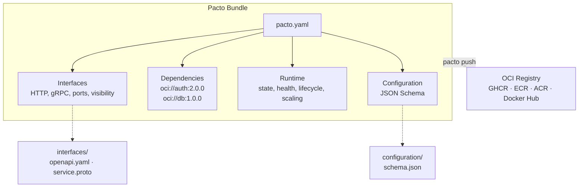
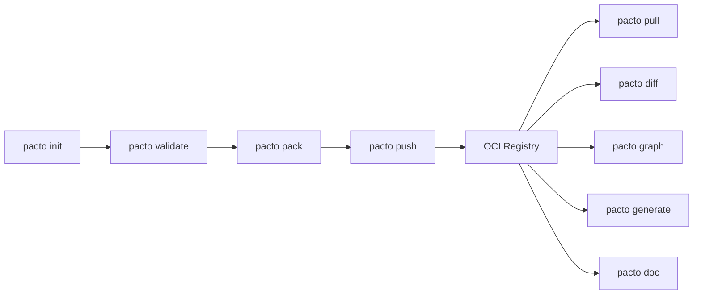

# Pacto
{: .no_toc }

**One contract to describe how a service behaves.**
{: .fs-6 .fw-300 }

Pacto is an open, OCI-distributed contract standard for cloud-native services. A single YAML file captures everything a platform needs to know — interfaces, runtime behavior, dependencies, configuration, and scaling — machine-validated and versioned as an OCI artifact.

[Get Started]({{ site.baseurl }}){: .btn .btn-primary .fs-5 .mb-4 .mb-md-0 .mr-2 }
[Specification]({{ site.baseurl }}){: .btn .fs-5 .mb-4 .mb-md-0 .mr-2 }
[Examples]({{ site.baseurl }}){: .btn .fs-5 .mb-4 .mb-md-0 }

---

<details open markdown="block">
  <summary>Table of contents</summary>
- TOC
{:toc}
</details>

---

## Why Pacto?

### The problem: fragmented service knowledge

Today, a cloud service is described across six different places — none of which talk to each other:

| Where | What it captures | What's missing |
|-------|-----------------|----------------|
| OpenAPI spec | API endpoints and schemas | Runtime behavior, state model, dependencies |
| Helm chart / Terraform | Deployment configuration | Service semantics, interface contracts |
| Environment variables | Config keys (maybe) | Validation, schema, defaults |
| Kubernetes manifests | Ports, probes, replicas | Why those values were chosen |
| Slack / wiki | Dependencies, tribal knowledge | Everything — it's already outdated |
| README.md | High-level overview | Machine-readability, accuracy |

The consequences are real:

- **Platforms guess service behavior.** *Is payments-api stateful? Does it need persistent storage?*
- **Dev ↔ Platform friction.** Developers ship code; platform engineers reverse-engineer how to run it.
- **Breaking changes detected too late.** A port change or removed health endpoint breaks production, not CI.
- **No dependency visibility.** No one knows what depends on what until something breaks.

### The solution: one operational contract

Pacto introduces a **formal service contract** — a versioned, machine-validated YAML file that replaces the six fragmented sources with a single source of truth:

```yaml
pactoVersion: "1.0"

service:
  name: payments-api
  version: 2.1.0
  owner: team/payments

interfaces:
  - name: rest-api
    type: http
    port: 8080
    visibility: public
    contract: interfaces/openapi.yaml
  - name: grpc-internal
    type: grpc
    port: 9090
    visibility: internal

dependencies:
  - ref: oci://ghcr.io/acme/auth-pacto@sha256:abc123
    required: true
    compatibility: "^2.0.0"

runtime:
  workload: service
  state:
    type: stateful
    persistence:
      scope: local
      durability: persistent
    dataCriticality: high
  health:
    interface: rest-api
    path: /health

configuration:
  schema: configuration/schema.json

scaling:
  min: 2
  max: 10
```

Every question a platform could ask — *What port? Stateful or stateless? What does it depend on? How should it scale?* — is answered in one file, validated by tooling, and versioned in a registry. Only `pactoVersion` and `service` are required; everything else is opt-in, so a contract can be as minimal or as detailed as needed.

### What it enables

Once services have contracts, everything else follows:

- **`pacto validate`** — three-layer validation catches structural errors, cross-field inconsistencies, and semantic issues before deployment
- **`pacto diff`** — compare two versions and know exactly what changed — including dependency graph shifts
- **`pacto graph`** — resolve the full dependency tree from OCI registries and local paths
- **`pacto generate`** — plugins consume the contract to produce deployment artifacts for any platform
- **CI gates** — block PRs that introduce breaking changes or invalid contracts

---

## What's inside a Pacto bundle



A bundle is a self-contained directory (or OCI artifact) containing:

- **`pacto.yaml`** — the contract: interfaces, dependencies, runtime semantics, scaling
- **`interfaces/`** — OpenAPI specs, protobuf definitions, event schemas
- **`configuration/`** — JSON Schema for environment variables and settings

All files referenced by `pacto.yaml` must exist within the bundle. Validation enforces this.

---

## Quickstart

```bash
# Install
curl -fsSL https://raw.githubusercontent.com/TrianaLab/pacto/main/scripts/get-pacto.sh | bash

# Create a contract
$ pacto init my-service
Created my-service/
  my-service/pacto.yaml
  my-service/interfaces/
  my-service/configuration/

# Validate it
$ pacto validate my-service
my-service is valid

# Push to a registry
$ pacto push oci://ghcr.io/your-org/my-service-pacto -p my-service
Pushed my-service@0.1.0 -> ghcr.io/your-org/my-service-pacto:0.1.0
Digest: sha256:a1b2c3...
```

See the full [Quickstart guide]({{ site.baseurl }}) for a complete walkthrough.

---

## See it in action

### Detect breaking changes — with full dependency graph diff

`pacto diff` doesn't just compare fields — it resolves both dependency trees and shows exactly what shifted:

```bash
$ pacto diff oci://ghcr.io/acme/payments-api-pacto:1.0.0 \
             oci://ghcr.io/acme/payments-api-pacto:2.0.0
Classification: BREAKING
Changes (4):
  [BREAKING] runtime.state.type (modified): runtime.state.type modified
  [BREAKING] runtime.state.persistence.durability (modified): runtime.state.persistence.durability modified
  [BREAKING] interfaces (removed): interfaces removed
  [BREAKING] dependencies (removed): dependencies removed

Dependency graph changes:
payments-api
├─ auth-service  1.5.0 → 2.3.0
└─ postgres      -16.0.0
```

Version upgrades, added services, removed dependencies — all visible in one command. Use the exit code in CI to gate deployments.

### Visualize the full dependency tree

```bash
$ pacto graph oci://ghcr.io/acme/api-gateway:2.0.0
api-gateway@2.0.0
├─ auth-service@2.3.0
│  └─ user-store@1.0.0
└─ payments-api@1.0.0
   └─ postgres@16.0.0
```

---

## Use cases

### Platform engineering

CI validates service contracts before deploy. `pacto diff` gates PRs that introduce breaking changes. `pacto graph` reveals the blast radius of any upgrade.

```bash
# CI pipeline: block breaking changes
pacto diff oci://ghcr.io/acme/my-service:latest .
# Exit code 1 if breaking → pipeline fails
```

### Internal developer platforms

Automate service onboarding. When a developer runs `pacto init` and pushes a contract, the platform knows everything it needs to provision the service — no tickets, no forms, no meetings.

### Microservice ecosystems

Detect incompatible service changes before they reach production. `pacto graph` resolves the full dependency tree; `pacto diff` classifies every change as `NON_BREAKING`, `POTENTIAL_BREAKING`, or `BREAKING`.

### Machine-readable services

Contracts are structured YAML with a formal JSON Schema. AI agents, policy engines, and automation tools can consume them directly — no scraping docs, no parsing READMEs.

---

## Why OCI?

Pacto bundles are distributed as **OCI artifacts** — the same standard behind container images. This means:

| Benefit | What it means |
|---------|---------------|
| **Versioned and immutable** | Every contract is content-addressed with a digest |
| **Works with existing registries** | GHCR, ECR, ACR, Docker Hub, Harbor — no new infrastructure |
| **Signable and scannable** | Use cosign, Notary, or any OCI-compatible signing tool |
| **Pull from anywhere** | CI, platforms, scripts — standard tooling, no proprietary clients |

You already have a container registry. Pacto uses it.

---

## Key commands



| Command | Purpose |
|---------|---------|
| `pacto init` | Scaffold a new service contract |
| `pacto validate` | Three-layer validation (structural, cross-field, semantic) |
| `pacto pack` | Create an OCI-ready tar.gz bundle |
| `pacto push` | Push bundle to any OCI registry |
| `pacto pull` | Pull bundle from an OCI registry |
| `pacto diff` | Compare two contracts and classify changes |
| `pacto graph` | Resolve and visualize the dependency graph |
| `pacto explain` | Human-readable contract summary |
| `pacto doc` | Generate rich Markdown documentation from a contract |
| `pacto generate` | Generate deployment artifacts via plugins |
| `pacto login` | Authenticate with an OCI registry |

---

## Who is Pacto for?

### Developers

Define your service's operational interface alongside your code. Declare interfaces, configuration schema, health checks, and dependencies. Validate locally before pushing. [Learn more]({{ site.baseurl }})

### Platform engineers

Consume contracts to generate deployment manifests, enforce policies, detect breaking changes, and build dependency graphs — deterministically and automatically. [Learn more]({{ site.baseurl }})

---

## What Pacto is not

- **Not a deployment tool** — it describes *what* to deploy, not *how*
- **Not a registry** — it uses existing OCI registries (GHCR, ECR, ACR, Docker Hub)
- **Not a cloud abstraction** — no provider-specific constructs
- **Not a replacement for Helm or Terraform** — it complements them as input
- **Not a CI system** — it integrates into any CI pipeline

Pacto is a **contract standard**. It tells platforms what a service *is* so they can decide how to run it.
