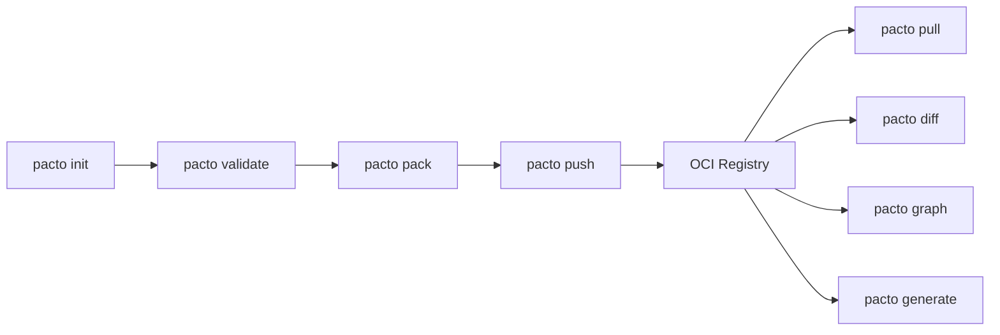

# Pacto

**Pacto** (/ˈpak.to/ — from Spanish: *pact*, *agreement*) is an open, OCI-distributed contract standard for cloud-native services.

It provides a single, declarative source of truth that bridges the gap between **developers** who build services and **platform engineers** who run them. A Pacto contract captures everything a platform needs to know about a service — its interfaces, configuration, runtime semantics, dependencies, and scaling requirements — without assuming any specific infrastructure.

---

## The problem

Modern cloud systems suffer from a recurring misalignment:

- Developers describe APIs but not runtime behavior.
- Platform engineers describe infrastructure but lack service context.
- CI systems validate fragments, not the whole picture.
- Documentation drifts from reality.
- State and persistence assumptions are implicit.
- Dependencies are loosely defined and unversioned.

**There is no shared operational contract.**

## The solution

Pacto introduces a **formal service contract** — a versioned, machine-validated YAML file that:

- Is **declarative** — describes *what*, not *how*
- Is **machine-validated** — three-layer validation catches errors before deployment
- Is **OCI-distributed** — bundles are versioned artifacts in any OCI registry
- Encodes **state semantics explicitly** — stateless, stateful, or hybrid
- Enables **deterministic platform behavior** — no guessing about workload type or persistence
- Remains **infrastructure-agnostic** — no Kubernetes, no cloud provider, no platform assumptions

**Without Pacto** — knowledge is scattered across wikis, Slack threads, Helm values, and tribal memory:

> *"Is ai-orchestrator stateful? What port? Does it need persistent storage? What databases does it depend on? Can we safely roll it out? What events does it emit?"*
>
> Nobody knows. The on-call engineer pages the original author at 2 AM.

**With Pacto** — one file answers every operational question:

```yaml
pactoVersion: "1.0"

service:
  name: ai-orchestrator
  version: 1.2.0
  owner: team/ai-platform

interfaces:
  - name: rest-api
    type: http
    port: 8000
    visibility: public
  - name: agent-events
    type: event
    contract: events/agent-lifecycle.proto

configuration:
  schema: config.schema.json

runtime:
  workload: service
  state:
    type: stateful
    persistence: { scope: shared, durability: persistent }
    dataCriticality: high
  lifecycle:
    upgradeStrategy: rolling
    gracefulShutdownSeconds: 30
  health:
    interface: rest-api
    path: /health

dependencies:
  - ref: ghcr.io/acme/postgres-pacto:16.4.0
    required: true
    compatibility: "^16.0.0"
  - ref: ghcr.io/acme/qdrant-pacto:1.9.0
    required: true
    compatibility: "^1.8.0"

scaling: { min: 2, max: 10 }
```

Stateful with shared persistent storage and high data criticality? The platform provisions PVCs and enables backups. Rolling upgrade with a 30-second graceful shutdown? The deployment strategy is set automatically. Two infrastructure dependencies? `pacto graph` resolves and validates the full tree. A public REST API on port 8000 and an event contract? Services, ingresses, and schema validation are all derived from this single source of truth.

---

## Key capabilities



| Command | Purpose |
|---------|---------|
| `pacto init` | Scaffold a new service contract |
| `pacto validate` | Three-layer validation (structural, cross-field, semantic) |
| `pacto pack` | Create an OCI-ready tar.gz bundle |
| `pacto push` | Push bundle to any OCI registry |
| `pacto pull` | Pull bundle from an OCI registry |
| `pacto diff` | Compare two contracts and classify changes |
| `pacto graph` | Resolve and visualize the dependency graph |
| `pacto explain` | Human-readable contract summary |
| `pacto generate` | Generate deployment artifacts via plugins |
| `pacto login` | Authenticate with an OCI registry |
| `pacto version` | Print version information |

---

## Who is Pacto for?

### Developers
Define your service's operational interface alongside your code. Declare interfaces, configuration schema, health checks, and dependencies. Validate locally before pushing. [Learn more]({{ site.baseurl }})

### Platform Engineers
Consume contracts to generate deployment manifests, enforce policies, detect breaking changes, and build dependency graphs. [Learn more]({{ site.baseurl }})

---

## What Pacto is not

- **Not a deployment tool** — it describes *what* to deploy, not *how*
- **Not a registry** — it uses existing OCI registries (GHCR, ECR, ACR, Docker Hub)
- **Not a cloud abstraction** — no provider-specific constructs
- **Not a replacement for Helm or Terraform** — it complements them as input
- **Not a CI system** — it integrates into any CI pipeline

Pacto is a **contract standard**.
