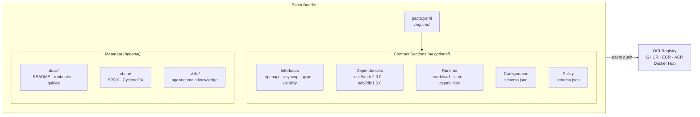

```yaml title="pacto.yaml"
pactoVersion: "2.0"

service:
  name: payments-api
  version: 2.1.0
  owner: { team: payments, dri: alice }

interfaces:
  - name: rest-api
    type: openapi
    ref: interfaces/openapi.yaml
    visibility: public

dependencies:
  - name: auth
    ref: oci://ghcr.io/acme/auth-pacto:2.0.0
    required: true
    compatibility: "^2.0.0"

workload: service

state:
  type: stateful
  persistence: { scope: shared, durability: persistent }
  dataCriticality: high
```

!!! success "One file, checked and shipped"
    Everything above is validated (structure, cross-references and policy), versioned with semver, and distributed as an OCI artifact.

## What is Pacto?

Pacto (/ˈpak.to/ — Spanish for *pact*) is the machine-readable operational contract for a service. It captures what a platform, a pipeline or an agent needs to know about a service — its identity and ownership, the interfaces and capabilities it exposes, its state model, its dependencies, its configuration and the policies that apply to it — in one versioned YAML file that machines can validate and tooling can consume, instead of reassembling it from Helm values, OpenAPI, Kubernetes manifests and READMEs.

Pacto doesn't invent a new configuration language. An interface is a JSON Schema, OpenAPI spec or protobuf definition you already maintain — Pacto composes the interfaces you already have instead of redefining them. On top of that it adds what no single schema can express: how interfaces relate, what they depend on and how they change over time. *JSON Schema describes an interface; Pacto describes the relationships between interfaces and how they change over time.*

The contract states stable operational *intent*. It is deliberately not a deployment manifest and not a snapshot of every runtime detail — how a service is scheduled, scaled and wired stays with the platform, and what reality currently looks like is an *observation* gathered separately and evaluated against the contract. Pacto is an **operational contract system** made of three complementary pieces:

- **CLI** — author, validate, diff, explain and publish contracts
- **Dashboard** — see operational state, the service inventory, the operational graph and change analysis visually
- **Kubernetes Operator** — one runtime evidence source that verifies live workloads still match the contract

No sidecars. No new distribution plane. The CLI runs at build time and CI time. The dashboard and operator extend the same contracts into exploration and runtime verification.

Underneath those products is one model — **author → publish → observe → evaluate → consume**: the contract declares intent, a **collector** observes an environment and emits **Evidence**, the pure engine evaluates `Contract × Evidence`, and consumers surface or act on the results. The stable extension boundary is the `EvidenceSet`; the Kubernetes operator hosts the first shipped collector, and other collectors may live inside or outside this repo. See [Collectors and the evidence boundary](collectors.md).

---

## From one contract to an operational graph

A single contract describes one service. Composed across a whole platform, those
contracts, their revisions and the targets they run in become a **versioned,
verifiable operational graph that humans, automation and agents can reason over**.
Pacto is to service operations what OpenAPI is to HTTP APIs — and where an OpenAPI
document describes one interface, the operational graph describes the relationships
*between* many services and how far a change reaches. Its four capabilities are
**Diff · Graph · Enforce · Verify**.

Think of it against Internal Developer Platforms. IDPs make platform *capabilities*
consumable by humans through portals, golden paths, catalogues and workflows.
Pacto makes platform *knowledge* consumable by machines through contracts,
relationships, constraints, tools and evidence. Pacto is not an IDP, a portal, a
deployment engine or an authorization system — it is the machine-readable
operational layer *over* a platform. A human portal and an agent can consume the
same Pacto graph. See [The Pacto Operational Graph](operational-graph.md), and
[Concepts](concepts.md) for the distinctions that graph is careful never to
collapse.

---

## Who reads a contract?

A contract is written once and read by everything that needs to understand the service:

- **Platform engineering** — controllers and generators consume the contract to provision infrastructure, wire networking and gate promotion, instead of reverse-engineering a service from its Helm chart.
- **CI pipelines** — `pacto diff` classifies breaking changes and `pacto validate` enforces policy before a merge or a publish.
- **Runtime controllers** — the Kubernetes operator observes live workloads and reports whether reality still matches the declared contract.
- **Autonomous agents** — because the contract is machine-readable, an agent can discover what a service is and what it can do rather than infer it. `pacto mcp` projects a bundle's operations into callable tools over the [Model Context Protocol](https://modelcontextprotocol.io); MCP is one integration surface, not the definition of Pacto.

Pacto is useful without any agents at all — the diff, graph, policy and verification loops stand on their own. Agents do not justify the contract; they raise the cost of not having one, because safe autonomy needs explicit, versioned, verifiable knowledge and external guardrails rather than fragmented docs. See the [MCP Integration](mcp-integration.md) guide.

---

## The problem

Today, a cloud service is described across **six different places** — none of which talk to each other:

```
OpenAPI spec    → describes one interface, but not the service
Helm values     → describes deployment, but not the service's intent
env vars        → documented in a wiki (maybe), validated never
K8s manifests   → health checks and wiring, no link to a service definition
Dependencies    → tribal knowledge in Slack threads
README.md       → outdated the day it was written
```

The consequences:

- **Platforms guess service behavior.** *Is it stateful? Does it need persistent storage? What does it depend on?*
- **Dev ↔ Platform friction.** Developers ship code; platform engineers reverse-engineer how to run it.
- **Breaking changes detected too late.** A port change or removed dependency breaks production, not CI.
- **No dependency visibility.** No one knows what depends on what until something breaks.

---

## The solution: one operational contract

Pacto replaces those six fragmented sources with the single file shown at the top of this page — interfaces, dependencies, runtime behavior, configuration and capabilities — validated by tooling and versioned in a registry. Only `pactoVersion` and `service` are required; every other section is opt-in, so a contract stays as small as the service needs.

See the [contract reference](contract-reference/index.md) for every field, including the [`readiness`](contract-reference/sections.md#readiness) section (a `pactoVersion: "2.0"` feature).

---

## When should I use Pacto?

Pacto earns its keep when operational knowledge is scattered, implicit, or outdated:

- **You manage many services** and discover their runtime needs in production — Pacto makes every service self-describing up front, not reverse-engineered from Helm charts.
- **Runtime assumptions live in deployment configs** — Pacto separates *what a service is* from *how it's deployed*.
- **Dependencies are undocumented** — declare them once; `pacto diff` shows the full blast radius (every service transitively affected) before a change ships.
- **CI can't catch operational breaking changes** — a removed interface, an incompatible dependency bump or a dropped capability is caught when contracts are validated and diffed in the pipeline.
- **Onboarding is slow** — a developer runs `pacto init`, fills in the contract, and pushes; the platform has everything it needs to provision the service.

---

## How it works — 30 seconds

```
1. Developer writes a pacto.yaml alongside their code
2. pacto validate checks it (structure, cross-references, policy)
3. pacto push ships the contract to an OCI registry as a versioned artifact
4. pacto dashboard shows operational state, the graph, and change analysis
5. The Kubernetes operator verifies runtime stays faithful to the contract
```

The real value of Pacto appears across the full loop: **author → validate → publish → explore → verify at runtime**.

---

## What's inside a Pacto bundle


```mermaid
graph LR
    subgraph Bundle["Pacto Bundle"]
        direction TB
        YAML["pacto.yaml<br/><i>required</i>"]

        subgraph Sections["Contract Sections <i>(all optional)</i>"]
            direction TB
            Interfaces["Interfaces<br/>openapi · asyncapi · grpc · visibility"]
            Dependencies["Dependencies<br/>oci://auth:2.0.0 · oci://db:1.0.0"]
            Runtime["Runtime<br/>workload · state · capabilities"]
            Config["Configuration<br/>schema.json"]
            Policy["Policy<br/>schema.json"]
        end

        subgraph Extras["Metadata <i>(optional)</i>"]
            direction TB
            Docs["docs/<br/>README · runbooks · guides"]
            SBOM["sbom/<br/>SPDX · CycloneDX"]
            Skills["skills/<br/>agent domain knowledge"]
        end

        YAML --> Sections
    end

    Bundle -- "pacto push" --> Registry["OCI Registry<br/>GHCR · ECR · ACR<br/>Docker Hub"]
```

A bundle is a self-contained directory (or OCI artifact): `pacto.yaml` (required) plus optional `interfaces/`, `configuration/`, `policy/`, `docs/`, `sbom/` and `skills/` directories. These are schemas you already maintain — an OpenAPI spec, a JSON Schema for your config — composed into the bundle rather than rewritten in a Pacto-specific format; `pacto.yaml` adds the relational layer around them (dependencies, compatibility, runtime semantics). Validation enforces that every referenced file exists within the bundle. See the [contract reference](contract-reference/index.md#bundle-structure) for the full bundle layout.

---

## Key capabilities

- **3-layer validation** — structural (JSON Schema), cross-field (reference and consistency checks including state vs. persistence), and policy enforcement
- **Breaking change detection** — `pacto diff` compares two contract versions field-by-field *and* resolves both dependency trees to show the full blast radius
- **Dependency graph resolution** — recursively resolve transitive dependencies from OCI registries; sibling deps are fetched in parallel
- **OCI distribution** — push/pull contracts to any OCI registry (GHCR, ECR, ACR, Docker Hub, Harbor); bundles are cached locally for fast repeated operations
- **Plugin-based generation** — `pacto generate` invokes out-of-process plugins to produce deployment artifacts from a contract
- **Rich documentation** — `pacto doc` generates Markdown with architecture diagrams, interface tables, and configuration details
- **SBOM diffing** — optional SPDX or CycloneDX SBOM inclusion with automatic package-level change detection on `pacto diff`
- **Operational dashboard** — `pacto dashboard` launches a web UI organised around four workflows — an operational **Overview**, the **Services** inventory, the **Operational Graph** and **Change analysis** — across local, OCI, and Kubernetes data sources
- **Runtime fidelity verification** — the optional [Kubernetes Operator](integrations/kubernetes/overview.md) continuously checks that deployed services match their contracts — workload alignment, state model, capability reachability, and more
- **AI assistant integration** — `pacto mcp` exposes contract create, edit, validate and schema operations as [MCP](https://modelcontextprotocol.io) tools for Claude, Cursor and GitHub Copilot

---

## See it in action

### Detect breaking changes — with full dependency graph diff

```bash
$ pacto diff oci://ghcr.io/acme/payments-api-pacto:1.0.0 \
             oci://ghcr.io/acme/payments-api-pacto:2.0.0
Classification: BREAKING
Changes (4):
  [BREAKING] state.type (modified): state.type modified [stateless -> stateful]
  [BREAKING] state.persistence.durability (modified): ... [ephemeral -> persistent]
  [BREAKING] interfaces (removed): interfaces removed [- metrics]
  [BREAKING] dependencies (removed): dependencies removed [- redis]

Dependency graph changes:
payments-api
├─ auth-service  1.5.0 → 2.3.0
└─ postgres      -16.0.0
```

Version upgrades, added services, removed dependencies — all visible in one command, with the exit code gating deployments in CI. `pacto graph` renders the full resolved dependency tree the same way.

---

## Who is Pacto for?

### Developers

Define your service's operational interface alongside your code. Declare interfaces, configuration schema, health checks, and dependencies. Validate locally before pushing. [Learn more](developers.md)

### Platform engineers

Consume contracts to generate deployment manifests, enforce policies, detect breaking changes, and build dependency graphs — deterministically and automatically. [Learn more](platform-engineers.md)

### Building a platform on Pacto?

These primitives compose into reusable platform patterns — root + component contracts for monorepos, infrastructure contracts with provisioner metadata, configurations as composable claims, platform-published policy + schema bundles, progressive policy versioning, and per-environment override files. See [Composition Patterns](patterns/index.md).

---

## What Pacto is not

- **Not a deployment tool** — it describes *what* to deploy, not *how*
- **Not another configuration language** — an interface is a JSON Schema, OpenAPI or protobuf definition you already own; Pacto composes those rather than replacing them
- **Not a registry** — it uses existing OCI registries (GHCR, ECR, ACR, Docker Hub)
- **Not a service catalog** — it produces the structured data that a catalog (Backstage, Port, Cortex) could consume
- **Not an IDP, portal or authorization system** — it is the machine-readable operational layer *over* a platform, not the portal humans click or the system that decides who may act

See the [Manifesto](manifesto.md) for the full positioning and rationale.

Pacto is an **operational contract system** that tells platforms, pipelines and agents what a service *is* — and whether observed reality still matches what was declared.
