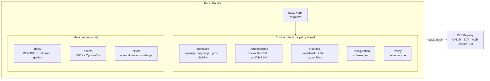

<h1 hidden>One contract for every cloud-native service</h1>

```yaml title="pacto.yaml"
pactoVersion: "2.0"                       # the contract format, not the CLI version

service:
  name: payments-api
  version: 2.1.0
  owner: { team: payments, dri: alice }   # dri: directly responsible individual

interfaces:
  - name: rest-api
    type: openapi
    ref: interfaces/openapi.yaml
    visibility: public

dependencies:
  - name: auth
    ref: oci://ghcr.io/acme/auth-pacto:2.0.0
    required: true
    compatibility: "^2.0.0"

workload: service

state:
  type: stateful
  persistence: { scope: shared, durability: persistent }
  dataCriticality: high
```

!!! success "One file, checked and shipped"
    Everything above is validated (structure, cross-references and policy), versioned with semver — semantic versioning, the `MAJOR.MINOR.PATCH` scheme — and distributed as an OCI (Open Container Initiative) artifact: the same registries that already hold your container images.

## What is Pacto?

Pacto (/ˈpak.to/ — Spanish for *pact*) is the machine-readable operational contract for a service. It captures what a platform, a pipeline or an agent needs to know about a service — its identity and ownership, the interfaces and capabilities it exposes, its state model, its dependencies, its configuration and the policies that apply to it — in one versioned YAML file that machines can validate and tooling can consume, instead of reassembling it from Helm values, OpenAPI, Kubernetes manifests and READMEs.

Pacto doesn't invent a new configuration language. An interface is an OpenAPI document, an AsyncAPI document or a gRPC service descriptor you already maintain, and a configuration is the JSON Schema you already publish — Pacto composes the interfaces you already have instead of redefining them. On top of that it adds what no single schema can express: how interfaces relate, what they depend on and how they change over time.

The contract states stable operational *intent*. It is deliberately not a deployment manifest and not a snapshot of every runtime detail — how a service is scheduled, scaled and wired stays with the platform, and what reality currently looks like is an *observation* gathered separately and evaluated against the contract. Pacto is an **operational contract system** made of three products:

- **CLI** (command-line interface) — author, validate, diff, explain and publish contracts
- **Dashboard** — see operational state, the service inventory, the operational graph and change analysis visually
- **Kubernetes Operator** (optional) — one runtime evidence source that verifies live workloads still match the contract

No sidecars. No new distribution plane. The CLI runs at build time and CI time.

Underneath those products is [one model](model.md) — **author → publish → observe → evaluate → consume**: the contract declares intent, a **collector** observes an environment and emits **evidence** — observed facts about a running system, gathered outside the contract and never written into it — a pure engine evaluates the contract against that evidence, and consumers surface or act on the result. The Kubernetes operator hosts the first shipped collector; anything that produces valid evidence can be one. An environment Pacto cannot watch — an edge site, an air-gapped estate, a CI runner — signs and reports its own evidence inbound instead, over the [external evidence protocol](evidence-protocol.md). See [Collectors and the evidence boundary](collectors.md).

---

## What Pacto is not

- **Not a deployment tool** — it describes *what* to deploy, not *how*
- **Not another configuration language** — see above: it points at the schemas you already maintain
- **Not a registry** — it uses existing OCI registries (GHCR, ECR, ACR, Docker Hub)
- **Not a service catalog** — it produces the structured data that a catalog (Backstage, Port, Cortex) could consume
- **Not an IDP, portal or authorization system** — it is the machine-readable operational layer *over* an Internal Developer Platform (IDP), not the portal humans click or the system that decides who may act

---

## The problem

Today, a cloud service is described across **six different places** — none of which talk to each other:

```
OpenAPI spec    → describes one interface, but not the service
Helm values     → describes deployment, but not the service's intent
env vars        → documented in a wiki (maybe), validated never
K8s manifests   → health checks and wiring, no link to a service definition
Dependencies    → tribal knowledge in Slack threads
README.md       → outdated the day it was written
```

If any of these are familiar, Pacto is aimed at you:

- **Platforms guess service behavior.** *Is it stateful? Does it need persistent storage? What does it depend on?*
- **Dev ↔ Platform friction.** Developers ship code; platform engineers reverse-engineer how to run it.
- **Breaking changes are detected too late.** A removed endpoint or a dropped dependency breaks production, not CI.
- **No dependency visibility.** No one knows what depends on what until something breaks.
- **Onboarding is slow.** Every new service starts another round of reverse-engineering.

The contract at the top of this page answers all six sources at once. Only `pactoVersion` and `service` are required; every other section is opt-in, so a contract stays as small as the service needs — that example declares no `configurations`, `capabilities`, `policies` or `readiness` because that service does not need them. See the [contract reference](contract-reference/index.md) for every field.

---

## Who is Pacto for?

### Developers

Define your service's operational interface alongside your code. Declare interfaces, configuration schema, health checks and dependencies. Validate locally before pushing. [The developer guide](developers.md)

### Platform engineers

Consume contracts to generate deployment manifests, enforce policies, detect breaking changes and build dependency graphs — deterministically and automatically. [The platform engineer guide](platform-engineers.md)

### Building a platform on Pacto?

These primitives compose into reusable platform patterns — root + component contracts for monorepos, infrastructure contracts with provisioner metadata, configurations as composable claims, platform-published policy + schema bundles, progressive policy versioning and per-environment override files. See [Composition Patterns](patterns/index.md).

---

## From one contract to an operational graph

A single contract describes one service. Composed across a whole platform, those
contracts, their *revisions* and their *targets* — a revision being one immutable
published version of a contract, a target one concrete place a revision runs, such
as a workload in one cluster — become a **versioned, verifiable operational graph
that humans, automation and agents can reason over**.

Think of it against an Internal Developer Platform (IDP). An IDP makes platform
*capabilities* consumable by humans through portals, golden paths, catalogues and
workflows. Pacto makes platform *knowledge* consumable by machines through
contracts, relationships, constraints, tools and evidence. See
[The Pacto Operational Graph](operational-graph.md) and [Concepts](concepts.md)
for the distinctions that graph is careful never to collapse.

---

## What consumes a contract?

A contract is written once and read by every *system* that needs to understand the
service. (For the people, see [Who is Pacto for?](#who-is-pacto-for) above.)

- **Platform engineering** — controllers and generators consume the contract to provision infrastructure, wire networking and gate promotion, instead of reverse-engineering a service from its Helm chart.
- **CI pipelines** — `pacto diff` classifies breaking changes and `pacto validate` enforces policy before a merge or a publish.
- **Runtime controllers** — the Kubernetes operator observes live workloads and reports whether reality still matches the declared contract.
- **Autonomous agents** — because the contract is machine-readable, an agent can discover what a service is and what it can do rather than infer it. `pacto mcp` projects a bundle's operations into callable tools over the [Model Context Protocol](https://modelcontextprotocol.io); MCP is one integration surface, not the definition of Pacto.

Pacto is useful without any agents at all — the diff, graph, policy and verification loops stand on their own. Agents do not justify the contract; they raise the cost of not having one. See the [MCP Integration](mcp-integration.md) guide.

---

## How it works — 30 seconds

```
1. Developer writes a pacto.yaml alongside their code
2. pacto validate checks it (structure, cross-references, policy)
3. pacto push ships the contract to an OCI registry as a versioned artifact
4. pacto dashboard shows operational state, the graph and change analysis
5. The Kubernetes operator verifies runtime stays faithful to the contract
```

---

## What's inside a Pacto bundle


```mermaid
graph LR
    subgraph Bundle["Pacto Bundle"]
        direction TB
        YAML["pacto.yaml<br/><i>required</i>"]

        subgraph Sections["Contract Sections <i>(all optional)</i>"]
            direction TB
            Interfaces["Interfaces<br/>openapi · asyncapi · grpc · visibility"]
            Dependencies["Dependencies<br/>oci://auth:2.0.0 · oci://db:1.0.0"]
            Runtime["Runtime<br/>workload · state · capabilities"]
            Config["Configuration<br/>schema.json"]
            Policy["Policy<br/>schema.json"]
        end

        subgraph Extras["Metadata <i>(optional)</i>"]
            direction TB
            Docs["docs/<br/>README · runbooks · guides"]
            SBOM["sbom/<br/>SPDX · CycloneDX"]
            Skills["skills/<br/>agent domain knowledge"]
        end

        YAML --> Sections
    end

    Bundle -- "pacto push" --> Registry["OCI Registry<br/>GHCR · ECR · ACR<br/>Docker Hub"]
```

A bundle is a self-contained directory (or OCI artifact): `pacto.yaml` (required) plus optional `interfaces/`, `configuration/`, `policy/`, `docs/`, `sbom/` and `skills/` directories, holding the schemas you already maintain. Validation enforces that every *schema* a contract points at exists in the bundle and parses — `interfaces[].ref`, `configurations[].schema` and `policies[].schema`. Free-form pointers are not resolved: a `readiness` claim may cite a runbook, a ticket or a URL, and Pacto checks that the citation is non-empty, never that its target exists. See the [contract reference](contract-reference/index.md#bundle-structure) for the full bundle layout and [validation layers](contract-reference/validation.md) for every rule.

---

## Key capabilities

- **3-layer validation** — structural (JSON Schema), cross-field (reference and consistency checks including state vs. persistence) and policy enforcement
- **Breaking change detection** — `pacto diff` compares two contract versions field-by-field *and* resolves both dependency trees, so a change inside a dependency is classified too. It looks *down* the tree; [`pacto impact`](impact.md) is the one that looks up it, naming the consumers a breaking change would reach. [Worked output, read line by line](platform-engineers.md#breaking-change-detection)
- **Dependency graph resolution** — recursively resolve transitive dependencies from OCI registries; sibling deps are fetched in parallel
- **OCI distribution** — push/pull contracts to any OCI registry: GitHub Container Registry (GHCR), Amazon Elastic Container Registry (ECR), Azure Container Registry (ACR), Docker Hub, Harbor; bundles are cached locally for fast repeated operations. A contract is an ordinary OCI artifact and needs nothing special; storing *evidence* beside it does — see [registry requirements](evidence-oci-storage.md#registry-requirements), which GHCR does not currently meet
- **Plugin-based generation** — `pacto generate` invokes out-of-process plugins to produce deployment artifacts from a contract
- **Rich documentation** — `pacto doc` generates Markdown with architecture diagrams, interface tables and configuration details
- **SBOM diffing** — an optional software bill of materials (SBOM) in SPDX or CycloneDX format with automatic package-level change detection on `pacto diff`
- **Operational dashboard** — `pacto dashboard` launches a web UI organised around four workflows — an operational **Overview**, the **Services** inventory, the **Operational graph** and **Change analysis** — across local, OCI and Kubernetes data sources
- **Runtime fidelity verification** — the optional [Kubernetes Operator](integrations/kubernetes/overview.md) continuously checks that deployed services match their contracts across seven dimensions — workload, persistence, interfaces, dependencies, configuration, health and metrics — and reports what it could not observe as `Unknown` rather than guessing. Two are narrower than they sound on a Helm install: health falls back to passive readiness signals, and metrics reports `Unsupported`, because [the chart renders no flag that turns either on](integrations/kubernetes/limitations.md#opt-in-features)
- **AI assistant integration** — `pacto mcp` serves contracts to Claude, Cursor and GitHub Copilot over [MCP](https://modelcontextprotocol.io): authoring tools, read-only operational-graph queries, blast-radius analysis, and a bundle's own API operations as callable tools

---

## What you keep if you stop using Pacto

Pacto invents three files —
`pacto.yaml`, the `pacto.lock` that [`pacto lock`](lockfile.md) writes, and an
optional [`.pactoignore`](pactoignore.md) — and nothing outside Pacto reads any
of them. That is the whole of the lock-in. Everything those files wrap stays
yours, and that is checkable rather than a promise:

- **The contract source is yours already.** `pacto.yaml` and the files beside it
  are plain YAML and JSON living in your repository, and the interfaces inside
  are the OpenAPI, AsyncAPI, gRPC and JSON Schema documents you maintained
  before Pacto existed. Delete the tooling and those files are unchanged.
- **The registry is yours already.** Pacto is [not a registry](#what-pacto-is-not);
  a published bundle is an ordinary OCI artifact in your own GHCR, ECR, ACR or
  Artifactory. Nothing is stored on infrastructure operated by the project.
- **A published bundle opens without Pacto** — it is a gzipped tar layer, so
  standard OCI tooling is enough to get the files back out (below).
- **Removing the runtime side leaves your workloads untouched.** The operator
  observes and never modifies them, so uninstalling it stops the checking and
  leaves every workload exactly as it was. It does take Pacto's own components
  with it — the managed dashboard and Evidence Server are garbage-collected
  along with the controller — and a few cluster-scoped objects outlive the
  release and need deleting by hand. Both removal paths, and every object that
  survives them, are written down: [uninstall the CLI](installation.md#uninstall)
  and [uninstall the operator](integrations/kubernetes/installation.md#uninstall).

Unpacking a published bundle with no Pacto binary anywhere in reach — this needs
[`oras`](https://oras.land/docs/installation) and [`jq`](https://jqlang.org/download/),
neither of which is a Pacto tool:

```bash
REPO=ghcr.io/your-org/your-service
TAG=1.0.0
DIGEST=$(oras manifest fetch "$REPO:$TAG" | jq -r '.layers[0].digest')
oras blob fetch --output bundle.tar.gz "$REPO@$DIGEST"
tar -xzf bundle.tar.gz    # pacto.yaml, interfaces/, configuration/, sbom/
```

[`pacto pull`](cli-reference.md#pacto-pull) writes the same files and is the
easier route while you still have the CLI.

What you lose by leaving is the checking — the validation, the change
classification, the operational graph and the compliance verdicts. What you
lose is never the data.

---

## Where to go next

Ready to try it? The [live dashboard demo](examples/dashboard-demo.md) puts the
whole dashboard in your browser, against a fixture fleet, with nothing to
install — and the [Docker Compose demo](examples/compose-demo.md) runs a real
one on your own machine. When you want your own contract, the
[Quickstart](quickstart.md) takes about five minutes from an empty directory to
a published bundle. To understand the system rather than drive it, read
[the Pacto model](model.md); for the positioning and rationale behind it, the
[Manifesto](manifesto.md).

## Getting help

Pacto is [MIT licensed](https://github.com/TrianaLab/pacto/blob/main/LICENSE) and
developed in the open at
[github.com/TrianaLab/pacto](https://github.com/TrianaLab/pacto). There is no
commercial support offering and no paid support channel; the routes that exist
are these:

- **Something is broken, or a document is wrong** — report a bug on the
  [issue tracker](https://github.com/TrianaLab/pacto/issues/new/choose), which
  has a bug-report template. Every documentation page also has an *edit* pencil
  that opens a pull request against its source.
- **A security vulnerability** — use a
  [private advisory](https://github.com/TrianaLab/pacto/security/advisories/new),
  never a public issue.
- **Something is behaving oddly rather than failing** — the
  [Kubernetes troubleshooting guide](integrations/kubernetes/troubleshooting.md)
  and the [MCP troubleshooting section](mcp-integration.md#troubleshooting) cover
  the diagnosable cases, including the ones where Pacto reports `Unknown`
  because it genuinely cannot observe something.
