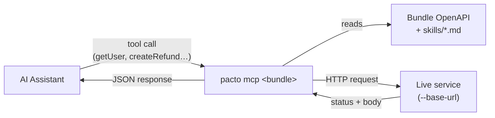

# Agent capabilities

The mental model is **bundle → capability → generated tools**. A bundle publishes interfaces; each interface represents a capability the service offers; Pacto *projects* every operation in that interface into a generated tool an agent can call, with no per-tool glue written by the bundle author. Two things this deliberately keeps separate:

- **Generated tools are projections, not the contract's `capabilities` section.** The contract [`capabilities`](contract-reference/sections.md#capabilities) section declares observability endpoints (`health`/`metrics`/`extension`). The tools here are derived from a service's *interface* operations. Pacto invents no new capability on the service's behalf — it renders what the interface already describes.
- **The contract gives the agent context around the tools.** The tools say what can be invoked; the surrounding contract (identity, dependencies, policies, state) tells the agent what the service *is*, so it can reason rather than guess.

When you additionally pass a **bundle reference** — a local directory or an `oci://` reference — Pacto turns that bundle's interfaces into executable agent tools:

```bash
pacto mcp ./my-service --base-url https://api.example.com
```

For every operation in each `openapi` interface's contract, Pacto registers one MCP tool whose input schema is derived from the operation's parameters and request body, and whose handler invokes the live endpoint. (`openapi` is the interface *type*; an interface's *name* is free-form, so a bundle may well name one `http`.)

The tool's name is the operation's `operationId`. When an operation declares none, Pacto derives `<method>_<path>` with every non-alphanumeric character collapsed to a single `_` — `GET /health` becomes `get_health` — and disambiguates a collision with a numeric suffix (`get_health_2`). An agent allow-list keyed on tool names therefore depends on the OpenAPI document declaring `operationId` for every operation.

## The `pacto_` names are reserved

`operationId` is bundle content, and MCP tool registration *replaces* a tool of
the same name. A contract declaring `operationId: pacto_check` would otherwise
take over the authoring tool: an agent asking Pacto to validate a contract would
issue a bundle-chosen HTTP request to a bundle-chosen host, while the tool list
still showed the trusted description. Pacto skips such an operation and says so
on stderr:

```text
pacto mcp: skipped operation "pacto_check" in interface "http" (that name belongs to a Pacto tool)
```

It is skipped rather than renamed, because a silently renamed tool is a
capability nobody asked for — and the bundle can pick a name of its own.

The server also sets its MCP *instructions* to tell the assistant that these tools invoke the live service, whether writes are enabled, and how to use `pacto_skill`. That generic guidance lives in Pacto itself; bundles ship only *domain-specific* skills (below), never a boilerplate usage guide.



## Read-only by default

Only safe read operations (`GET`/`HEAD`) are exposed unless you opt in to mutating ones.

```bash
# expose mutating operations (POST/PUT/PATCH/DELETE) too
pacto mcp ./my-service --base-url https://api.example.com --allow-writes
```

A per-interface count of skipped operations is logged to stderr:

```text
pacto mcp: skipped 2 mutating operation(s) in interface "api" (use --allow-writes to expose)
```

The individual operations are not named, at any verbosity — to see exactly which ones would appear, compare `tools/list` with and without `--allow-writes`.

## Base URL

The live host comes from `--base-url`, falling back to the spec's `servers[0]` URL when the flag is omitted. If neither is available the server refuses to start. When you supply credentials (below), `--base-url` is **required** — Pacto will not send credentials to a host chosen by bundle content.

## Service authentication (`--auth`) { #service-authentication-auth }

These are the *service's* credentials, not the registry's — for pulling the bundle
itself see [Connecting to a bundle](#connecting-to-a-bundle).
Credentials are supplied per OpenAPI security scheme with the repeatable `--auth name=value` flag and applied to each request according to the scheme's declaration. The `http` in the table below is an OpenAPI *security-scheme* type, unrelated to Pacto's interface types (`openapi`, `asyncapi`, `grpc`):

| Scheme type | How the credential is applied |
|-------------|-------------------------------|
| `apiKey` | Sent as the declared header or query parameter |
| `http` `bearer` (and `oauth2` / `openIdConnect`) | `Authorization: Bearer <value>` |
| `http` `basic` | `Authorization: Basic <value>` (supply pre-encoded `user:pass`) |

```bash
pacto mcp oci://ghcr.io/acme/svc:1.0.0 \
  --base-url https://api.example.com \
  --auth bearerAuth=$TOKEN --allow-writes
```

No server-issued redirect is followed, same-origin included, so credentials cannot leak to another origin and a 3xx is returned to the agent as the result. The fixed 30-second timeout bounding every call is not configurable.

## pacto_skill

Bundles may ship optional domain knowledge as `skills/*.md` — workflows and business rules that an interface alone can't express (for example `skills/refund_customer.md`). These are packaged with the bundle automatically. The `pacto_skill` tool lists them when called with no arguments, and returns a skill's Markdown when given its `name`.

```text
bundle/
    pacto.yaml
    interfaces/openapi.json
    skills/
        refund_customer.md
        onboard_customer.md
```

## Connecting to a bundle

Point any MCP client at a bundle by adding the reference (and flags) to the server args. For Claude Code (`.mcp.json`):

```json
{
  "mcpServers": {
    "acme-svc": {
      "command": "pacto",
      "args": ["mcp", "oci://ghcr.io/acme/svc:1.0.0", "--base-url", "https://api.example.com"]
    }
  }
}
```

An `oci://` reference resolves with the same registry credentials as the rest of
the CLI, so run [`pacto login <registry>`](cli-reference.md#pacto-login) first
if the repository is private. The server is launched by your editor and inherits
its environment, so a login that works in your shell may not be visible to it —
a private repository failing with `artifact not found` is the usual symptom.

## What a session freezes, and what it does not

Every mode resolves its input **once, at startup**, and the tool list is fixed
from that moment. Add an operation to a bundle's OpenAPI while the server runs
and no new tool appears: `tools/list` keeps returning exactly what startup
registered. The same rule governs the [catalog](mcp-catalog-discovery.md#requested-resolved-identity)
(a tag that moves does not change an answer) and the
[fleet snapshot](mcp-integration.md#three-tool-families-and-their-boundaries). To pick up a
changed interface, a moved tag or a newly deployed service, restart the server.

Two things in that same process are *not* frozen:

- **`pacto_skill` reads from disk on every call.** On a local bundle an edited
  `skills/*.md` returns its new content immediately, and a skill file added after
  startup appears in the listing without a restart. An `oci://` bundle has no
  disk to change, so this only shows up locally.
- **The authoring tools act on whatever is on disk when you call them.**
  `pacto_check` and `pacto_edit` take a path and read it at call time; they are
  not bound to the bundle or the snapshot the server started with.

!!! warning "`--fleet` reads the current directory by default"
    `--local` defaults to `[.]`, so `pacto mcp --fleet` folds any bundles under
    the working directory into the snapshot. An MCP server launched by an editor
    or a CI runner inherits that runner's working directory, which may not be the
    one you had in mind. Pass `--local` explicitly to say what you meant.

## End-to-end example: a demo bundle with Claude Code

The Pacto dashboard describes itself with a real OpenAPI contract, so pointing
Claude at `examples/demo/pacto-dashboard` while the dashboard runs gives you
tools that reach a live server, not a stub.

**1. Install Pacto** so the `pacto` binary is on your `PATH`:

```bash
make build   # or: go install ./cmd/pacto
```

See [Installation](installation.md) for all methods.

**2. Start the service the contract describes** — the dashboard from the
[guided tour](examples/demo-tour.md), serving the demo fleet:

```bash
pacto dashboard examples/demo/bundles --port 8899
```

**3. Register the bundle with Claude Code** (from the repository root):

```bash
claude mcp add --scope local pacto-dashboard \
  -- pacto mcp ./examples/demo/pacto-dashboard \
     --base-url http://127.0.0.1:8899
```

The server name (`pacto-dashboard`) goes *before* the `--`; everything after it is
the command Claude runs.

**4. Verify the connection and inspect the tools:**

```bash
claude mcp list          # pacto-dashboard → ✔ Connected
```

or, inside a Claude Code session:

```text
/mcp
```

You'll see one tool per read-only OpenAPI operation (`health`, `fleet-search`,
`fleet-status`, `fleet-graph`, …) plus `pacto_skill` and the four authoring
tools. The four mutating operations are withheld, and the server says so on
stderr:

```console
pacto mcp: skipped 4 mutating operation(s) in interface "http-api" (use --allow-writes to expose)
```

**5. Just ask, in plain language.** Claude calls the generated tool, which calls
the running dashboard; the answer carries the real status code and body:

```console
{"jsonrpc":"2.0","id":2,"result":{"content":[{"type":"text","text":"{\n  \"StatusCode\": 200,\n  \"Headers\": {\n    \"Content-Length\": \"32\",\n    \"Content-Type\": \"application/json\",\n    \"Date\": \"Sun, 06 Sep 2026 16:59:12 GMT\"\n  },\n  \"Body\": \"{\\\"status\\\":\\\"ok\\\",\\\"version\\\":\\\"dev\\\"}\\n\"\n}"}]}}
```

Nobody wrote a `health` tool: Claude discovered the operation from the OpenAPI
contract the dashboard publishes about itself.

!!! note
    The model calls these tools under a server-namespaced name, e.g.
    `mcp__pacto-dashboard__health`. With `--allow-writes` the four mutating
    operations (`refresh`, `resolve-ref`, `list-remote-versions`,
    `fleet-impact-post`) appear alongside them.

`examples/demo/bundles/payments-service/v2.1.0` bundles a `refund_customer.md`
skill next to its OpenAPI interface, which [`pacto_skill`](#pacto_skill) reads.
Nothing here serves the payments API, so register that bundle to see which tools
and skills a contract produces, not to call one.

When you're done: `claude mcp remove pacto-dashboard`.
