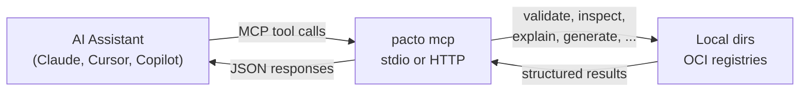

# MCP Integration
{: .no_toc }

Pacto includes a built-in [Model Context Protocol](https://modelcontextprotocol.io) (MCP) server that exposes contract operations as tools for AI assistants. This enables AI tools like Claude, Cursor, and GitHub Copilot to validate, inspect, and generate Pacto contracts directly.

---

<details open markdown="block">
  <summary>Table of contents</summary>
- TOC
{:toc}
</details>

---

## Why MCP?

[MCP](https://modelcontextprotocol.io) (Model Context Protocol) is an open standard that lets AI tools call external functions through structured tool calls — similar to how a browser calls an API, but designed for LLMs. Instead of pasting CLI output into a chat window, the assistant calls `pacto_validate` or `pacto_resolve_dependencies` directly and gets structured JSON back.

This matters because Pacto contracts are already machine-readable. MCP turns that into a two-way interaction: the assistant doesn't just *read* contracts — it can validate them, generate new ones, resolve dependencies, and explain changes, all within a single conversation.

---

## How it works



An AI assistant sends MCP tool calls to the `pacto mcp` server. Pacto executes the operation against local contract directories or OCI registries and returns structured JSON results. The assistant works entirely through the tool interface — no direct file access needed.

---

## Available tools

| Tool | Description |
|------|-------------|
| `pacto_validate` | Validate a contract file and return errors/warnings |
| `pacto_inspect` | Return the full structured representation of a contract |
| `pacto_resolve_dependencies` | Resolve the complete dependency graph, detecting cycles and conflicts |
| `pacto_list_interfaces` | List interfaces exposed by a service |
| `pacto_generate_docs` | Generate Markdown documentation from a contract |
| `pacto_explain` | Return a human-readable summary of a contract |
| `pacto_generate_contract` | Generate a new contract YAML from structured inputs |
| `pacto_suggest_dependencies` | Suggest likely dependencies based on service characteristics |
| `pacto_schema` | Return the Pacto format explanation and full JSON Schema (call first before writing contracts) |

All tools accept both local directory paths and `oci://` references.

---

## Transports

Pacto supports two MCP transports:

| Transport | Flag | Use case |
|-----------|------|----------|
| **stdio** (default) | `pacto mcp` | Direct integration with CLI-based AI tools (Claude Code, Cursor) |
| **HTTP** | `pacto mcp -t http` | Network-accessible server for web-based or remote AI tools |

The HTTP transport serves the [Streamable HTTP](https://modelcontextprotocol.io/specification/2025-03-26/basic/transports#streamable-http) protocol at the `/mcp` endpoint. The port defaults to `8585` and can be changed with `--port`.

---

## Claude integration

### Claude Code (CLI)

Add Pacto as an MCP server in your project's `.mcp.json` file:

```json
{
  "mcpServers": {
    "pacto": {
      "command": "pacto",
      "args": ["mcp"]
    }
  }
}
```

Claude Code uses stdio transport — no port configuration needed. Once configured, Claude can validate contracts, inspect dependencies, and generate new contracts directly from your conversation.

### Claude Desktop

Add the server to your `claude_desktop_config.json`:

```json
{
  "mcpServers": {
    "pacto": {
      "command": "pacto",
      "args": ["mcp"]
    }
  }
}
```

{: .tip }
The config file is located at `~/Library/Application Support/Claude/claude_desktop_config.json` on macOS or `%APPDATA%\Claude\claude_desktop_config.json` on Windows.

### Example prompts

Once connected, you can interact with contracts conversationally:

```
You:    Validate the contract in ./payments-api
Claude: ✓ payments-api is valid. No errors or warnings.

You:    Generate a pacto.yaml for a stateless Go HTTP API called user-service
Claude: Here's a contract for user-service: [generates complete pacto.yaml]

You:    Explain the breaking changes between payments-api:1.0.0 and 2.0.0
Claude: The state model changed from stateless to stateful, and the
        metrics interface was removed. Both are classified as BREAKING.

You:    What does oci://ghcr.io/acme/api-gateway-pacto:2.0.0 depend on?
Claude: api-gateway depends on auth-service@2.3.0 (required) and
        cache@1.0.0 (optional). auth-service transitively depends
        on user-store@1.0.0.
```

---

## Cursor

Add Pacto as an MCP server in your Cursor settings (`.cursor/mcp.json`):

```json
{
  "mcpServers": {
    "pacto": {
      "command": "pacto",
      "args": ["mcp"]
    }
  }
}
```

---

## GitHub Copilot

### VS Code

Add Pacto as an MCP server in your VS Code settings (`.vscode/settings.json`):

```json
{
  "mcp": {
    "servers": {
      "pacto": {
        "command": "pacto",
        "args": ["mcp"]
      }
    }
  }
}
```

Alternatively, create a `.vscode/mcp.json` file in your project root:

```json
{
  "servers": {
    "pacto": {
      "command": "pacto",
      "args": ["mcp"]
    }
  }
}
```

Once configured, Copilot Chat in agent mode can use Pacto tools. Try asking: *"@workspace validate the contract in ./my-service"*.

{: .note }
MCP support in GitHub Copilot requires VS Code 1.99+ and the GitHub Copilot Chat extension.

---

## HTTP transport

For tools that connect over HTTP rather than stdio, start the server with:

```bash
# Default port (8585)
pacto mcp -t http

# Custom port
pacto mcp -t http --port 9090
```

The server listens on `127.0.0.1` and serves the MCP Streamable HTTP protocol at `/mcp`. Connect your MCP client to `http://127.0.0.1:8585/mcp` (or your chosen port).

---

## Troubleshooting

**Tools not showing up in your AI assistant?**

1. Verify Pacto is installed and in your `PATH`:
   ```bash
   pacto version
   ```

2. Test the MCP server directly:
   ```bash
   pacto mcp --help
   ```

3. Check your MCP configuration file for JSON syntax errors.

4. Use verbose mode to see debug output:
   ```bash
   pacto mcp -v
   ```

**OCI references not resolving?**

Ensure you are authenticated to the registry. See [Authentication]({{ site.baseurl }}#authentication) for the credential resolution chain.
