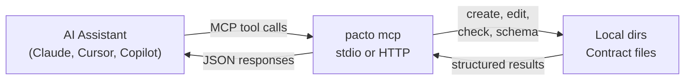
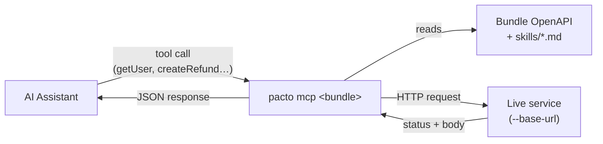

# MCP Integration
Pacto includes a built-in [Model Context Protocol](https://modelcontextprotocol.io) (MCP) server that exposes contract operations as tools for AI assistants. This enables AI tools like Claude, Cursor, and GitHub Copilot to create, edit, and validate Pacto contracts directly.

Point the server at a bundle (`pacto mcp <bundle-ref>`) and it goes further: every operation in the bundle's OpenAPI interface becomes an executable agent tool, and any `skills/*.md` domain guides the bundle ships are exposed too — making an existing contract immediately agent-ready without writing per-tool glue. See [Agent capabilities](#agent-capabilities) below.

---
## Three tool families and their boundaries

Pacto exposes three distinct families of MCP tools. They do very different things,
so their safety boundaries differ — knowing which family a tool belongs to tells
you exactly what invoking it can and cannot do.

| Family | Tools | What they do | Safety boundary |
|--------|-------|--------------|-----------------|
| **Authoring** | `pacto_create`, `pacto_edit`, `pacto_check`, `pacto_schema` | Create, edit and validate Pacto *contracts*. | Operate on contract files, not live systems. `pacto_edit` writes only after validation. |
| **Generated service** | Derived per operation from a bundle's OpenAPI interfaces (`getUser`, `createRefund`, …) | Invoke the *live service* the contract describes. | Read-only (`GET`/`HEAD`) unless you pass `--allow-writes`; every call is bounded by a timeout and does not follow cross-origin redirects. |
| **Fleet query** | `pacto_fleet_search`, `pacto_fleet_get`, `pacto_fleet_graph`, `pacto_fleet_status`, `pacto_fleet_explain` | Read-only understanding of the *operational system* — services, revisions, targets, relationships and status. | Read-only always; they observe nothing and change nothing. |

The three families answer three different questions: authoring tools shape *what a
contract says*, generated service tools *do something to a running service*, and
fleet query tools *understand the system as it is*. An agent should never confuse
them — invoking `createRefund` moves money; `pacto_fleet_get` never leaves the
read model.

Fleet query tools deserve explicit safety framing:

- **They are read-only.** They project the [Pacto Operational Graph](operational-graph.md)
  — an immutable read model — and perform no I/O against live systems.
- **Pacto does not determine authorization.** These tools expose knowledge; they
  never grant, scope or revoke a permission. Whether an agent *may* act stays with
  policy and IAM systems.
- **Partial or stale results are incomplete knowledge.** Every answer carries an
  `asOf` time, a `completeness` value and structured `limitations`. Branch on
  those before trusting an answer.
- **A missing result under partial coverage does not prove absence.** If a source
  was unavailable, a "not found" means "not known here", not "does not exist". An
  unavailable source is never rendered as an empty result.

See [The Pacto Operational Graph](operational-graph.md) for the read model these
tools query and the query semantics they expose.

---
## Why MCP?

[MCP](https://modelcontextprotocol.io) is an open standard that lets AI tools invoke external functions through structured tool calls. With the Pacto MCP server, an assistant calls tools like `pacto_create` or `pacto_check` and gets structured JSON back — creating, editing and validating contracts in a single conversation instead of copy-pasting CLI output.

MCP is an *integration surface*, not the definition of Pacto. The projection that turns a bundle's interface into callable tools lives in the framework-independent `pkg/capability` package; MCP is simply the transport this page uses to expose it. A different agent runtime could consume the same projection without MCP, and everything Pacto does — validate, diff, graph, enforce policy, evaluate evidence — works with no agent at all.

---

## How it works


```mermaid
flowchart LR
    AI["AI Assistant<br/>(Claude, Cursor, Copilot)"] -->|"MCP tool calls"| MCP["pacto mcp<br/>stdio or HTTP"]
    MCP -->|"create, edit,<br/>check, schema"| Sources["Local dirs<br/>Contract files"]
    Sources -->|"structured results"| MCP
    MCP -->|"JSON responses"| AI
```

The assistant works entirely through the tool interface — Pacto runs each operation against local contract directories and returns JSON.

---

## Available tools

| Tool | Description |
|------|-------------|
| `pacto_create` | Create a new contract from intent-level inputs (name, description, interfaces, runtime semantics). Supports dry run. |
| `pacto_edit` | Edit an existing contract — add/remove interfaces and dependencies, change runtime, update metadata. Supports dry run. |
| `pacto_check` | Validate a contract and return errors, warnings, and actionable improvement suggestions. |
| `pacto_schema` | Return the Pacto format explanation and full JSON Schema reference. Call this first if the assistant needs schema details. |

### pacto_create

Creates a new Pacto contract from structured input. The tool infers contract details from a natural-language description and explicit parameters.

**Key inputs:**
- `name` (required) — service name
- `description` — natural-language description (triggers automatic inference of interfaces and runtime)
- `interfaces` — JSON array of `{name, type, port?, visibility?}` objects
- `stores_data`, `data_survives_restart`, `data_shared_across_instances` — intent-level runtime flags mapped to contract primitives
- `dry_run` — validate and return the result without writing files

**Description inference:** When a description mentions terms like "REST API" or "gRPC", the tool infers the matching interface; a datastore term like "PostgreSQL" or "Redis" flips the runtime to stateful; and a messaging term like "Kafka" adds an event interface. Dependencies are never inferred — declare them explicitly via the `dependencies` input. Explicit inputs always override inferred values.

**Runtime mapping:** Intent-level flags are deterministically mapped to contract primitives:

| Intent | Contract field |
|--------|---------------|
| `stores_data=true` + `data_survives_restart=false` | `state.type: stateful`, `persistence.durability: ephemeral`, `dataCriticality: medium` |
| `stores_data=true` + `data_survives_restart=true` | `state.type: stateful`, `persistence.durability: persistent` |
| `data_shared_across_instances=true` | `persistence.scope: shared` |
| `data_loss_impact=high` | `dataCriticality: high` |

The persistence rows take effect only when `stores_data=true` — `stores_data` is what sets `state.type: stateful` and the default `dataCriticality: medium`. With `stores_data=false` the state stays stateless, local and ephemeral, and `data_shared_across_instances` is ignored; `data_loss_impact` still sets `dataCriticality` independently of `stores_data`. See [Contract reference](contract-reference/index.md) for the full workload and state field definitions.

### pacto_edit

Modifies an existing contract. Reads the current `pacto.yaml`, applies changes, validates the result, and writes back atomically.

**Key inputs:**
- `path` — directory containing `pacto.yaml` (defaults to `.`)
- `add_interfaces` / `remove_interfaces` — add or remove interfaces
- `add_dependencies` / `remove_dependencies` — add or remove dependencies
- Runtime flags (`stores_data`, `data_survives_restart`, etc.)
- `dry_run` — validate without writing

!!! warning
    `pacto_edit` only scaffolds stub files for HTTP and gRPC interfaces. Other interface types (e.g. `event`) are added to `pacto.yaml` with a `contract:` path, but no file is created for them, so `pacto_edit` can report success while a referenced interface file is missing. Create those files yourself after the edit.

### pacto_check

Validates a contract and returns structured results including errors, warnings, a contract summary, and actionable suggestions for improvement.

**Output includes:**
- `valid` — whether the contract passes validation
- `errors` / `warnings` — validation issues with path, code, and message
- `summary` — parsed contract overview (name, version, interfaces, runtime state)
- `suggestions` — actionable improvements with tool call references (e.g., "add a health interface" with the exact `pacto_edit` call to do it)

### pacto_schema

Returns the Pacto format description and the full JSON Schema for `pacto.yaml`. Useful as a first call so the assistant understands the contract structure before creating or editing.

---

## Agent capabilities

The mental model is **bundle → capability → generated tools**. A bundle publishes interfaces; each interface represents a capability the service offers; Pacto *projects* every operation in that interface into a generated tool an agent can call, with no per-tool glue written by the bundle author. Two things this deliberately keeps separate:

- **Generated tools are projections, not the contract's `capabilities` section.** The contract [`capabilities`](contract-reference/sections.md#capabilities) section declares observability endpoints (`health`/`metrics`/`extension`). The tools here are derived from a service's *interface* operations. Pacto invents no new capability on the service's behalf — it renders what the interface already describes.
- **The contract gives the agent context around the tools.** The tools say what can be invoked; the surrounding contract (identity, dependencies, policies, state) tells the agent what the service *is*, so it can reason rather than guess.

Skills, described below, layer optional domain knowledge on top of the generated tools.

The authoring tools above are always available. When you additionally pass a **bundle reference** — a local directory or an `oci://` reference — Pacto turns that bundle's interfaces into executable agent tools:

```bash
pacto mcp ./my-service --base-url https://api.example.com
```

For every operation in each `http` interface's OpenAPI contract, Pacto registers one MCP tool whose input schema is derived from the operation's parameters and request body, and whose handler invokes the live endpoint. The bundle author writes nothing extra — the interface already describes what the tool needs.

The server also sets its MCP *instructions* to tell the assistant that these tools invoke the live service, whether writes are enabled, and how to use `pacto_skill`. That generic "how to use these capabilities" guidance lives in Pacto itself — bundles only ship *domain-specific* skills (below), never a boilerplate usage guide.


```mermaid
flowchart LR
    AI["AI Assistant"] -->|"tool call<br/>(getUser, createRefund…)"| MCP["pacto mcp &lt;bundle&gt;"]
    MCP -->|"reads"| Spec["Bundle OpenAPI<br/>+ skills/*.md"]
    MCP -->|"HTTP request"| Svc["Live service<br/>(--base-url)"]
    Svc -->|"status + body"| MCP
    MCP -->|"JSON response"| AI
```

### Read-only by default

Only safe read operations (`GET`/`HEAD`) are exposed unless you opt in to mutating ones. This prevents an assistant from creating, updating, or deleting live resources by accident.

```bash
# expose mutating operations (POST/PUT/PATCH/DELETE) too
pacto mcp ./my-service --base-url https://api.example.com --allow-writes
```

Skipped operations are logged to stderr, so nothing is silently dropped.

### Base URL

The live host comes from `--base-url`, falling back to the spec's `servers[0]` URL when the flag is omitted. If neither is available the server refuses to start. When you supply credentials (below), `--base-url` is **required** — Pacto will not send credentials to a host chosen by bundle content.

### Authentication

Credentials are supplied per OpenAPI security scheme with the repeatable `--auth name=value` flag and applied to each request according to the scheme's declaration:

| Scheme type | How the credential is applied |
|-------------|-------------------------------|
| `apiKey` | Sent as the declared header or query parameter |
| `http` `bearer` (and `oauth2` / `openIdConnect`) | `Authorization: Bearer <value>` |
| `http` `basic` | `Authorization: Basic <value>` (supply pre-encoded `user:pass`) |

```bash
pacto mcp oci://ghcr.io/acme/svc:1.0.0 \
  --base-url https://api.example.com \
  --auth bearerAuth=$TOKEN --allow-writes
```

Server-issued redirects are **not** followed, so credentials cannot leak to another origin, and every call is bounded by a timeout.

### pacto_skill

Bundles may ship optional domain knowledge as `skills/*.md` — workflows and business rules that an interface alone can't express (for example `skills/refund_customer.md`). These are packaged with the bundle automatically. The `pacto_skill` tool lists them when called with no arguments, and returns a skill's Markdown when given its `name`.

```
bundle/
    pacto.yaml
    interfaces/openapi.json
    skills/
        refund_customer.md
        onboard_customer.md
```

### Connecting to a bundle

Point any MCP client at a bundle by adding the reference (and flags) to the server args. For Claude Code (`.mcp.json`):

```json
{
  "mcpServers": {
    "acme-svc": {
      "command": "pacto",
      "args": ["mcp", "oci://ghcr.io/acme/svc:1.0.0", "--base-url", "https://api.example.com"]
    }
  }
}
```

### End-to-end example: a demo bundle with Claude Code

This repository ships demo bundles you can point Claude at directly. We'll use
`payments-service`, which declares an OpenAPI interface **and** a
`refund_customer.md` skill — so it exercises both halves of the feature.

**1. Install Pacto** so the `pacto` binary is on your `PATH`:

```bash
make build   # or: go install ./cmd/pacto
```

See [Installation](installation.md) for all methods.

**2. Start a throwaway backend.** The demo service isn't actually running, so give
the generated tools something to call. In a real setup `--base-url` points at your
live service instead.

```bash
python3 - <<'EOF'
from http.server import BaseHTTPRequestHandler, HTTPServer
class H(BaseHTTPRequestHandler):
    def r(self):
        self.send_response(200); self.send_header("Content-Type","application/json"); self.end_headers()
        self.wfile.write(f'{{"ok":true,"path":"{self.path}"}}'.encode())
    do_GET = do_POST = r
    def log_message(self, *a): pass
HTTPServer(("127.0.0.1", 8080), H).serve_forever()
EOF
```

**3. Register the bundle with Claude Code** (from the repo root). A refund is a
`POST`, so pass `--allow-writes` to expose mutating operations:

```bash
claude mcp add --scope local payments-demo \
  -- pacto mcp ./examples/demo/bundles/payments-service/v2.1.0 \
     --base-url http://127.0.0.1:8080 --allow-writes
```

The server name (`payments-demo`) goes *before* the `--`; everything after it is
the command Claude runs. (Equivalent `.mcp.json` form: the `command`/`args` shape
shown above.)

**4. Verify the connection and inspect the tools:**

```bash
claude mcp list          # payments-demo → ✔ Connected
```

or, inside a Claude Code session:

```
/mcp
```

You'll see one tool per OpenAPI operation (`createRefund`, `getPaymentIntent`,
`listPaymentIntents`, …) plus `pacto_skill` and the four authoring tools
(`pacto_create`, `pacto_edit`, `pacto_check`, `pacto_schema`), which are always
registered. Claude also receives the server's
instructions telling it these tools invoke the live payments service and how to
use `pacto_skill`.

**5. Just ask, in plain language:**

```
You:    Refund payment intent pi_123 — it was a duplicate charge.

Claude: [calls pacto_skill to read refund_customer.md]
        [follows the workflow: confirms the intent is refundable via
         getPaymentIntent, sets reason="duplicate"]
        [calls createRefund with {payment_intent_id:"pi_123", reason:"duplicate"}]
        Done — issued a refund for pi_123 (reason: duplicate).
```

Claude discovered the *operation* from the OpenAPI contract and the *procedure*
from the bundled skill — neither was hand-written as an agent tool.

!!! note
    The model calls these tools under a server-namespaced name, e.g.
    `mcp__payments-demo__createRefund`. Drop `--allow-writes` and the mutating
    tools (including `createRefund`) disappear — only the read-only operations
    (`getPaymentIntent`, `listPaymentIntents`, `healthCheck`) and `pacto_skill`
    remain.

When you're done: `claude mcp remove payments-demo`.

---

## Transports

Pacto supports two MCP transports:

| Transport | Flag | Use case |
|-----------|------|----------|
| **stdio** (default) | `pacto mcp` | Direct integration with CLI-based AI tools (Claude Code, Cursor) |
| **HTTP** | `pacto mcp -t http` | Local HTTP endpoint for tools that speak HTTP rather than stdio |

The HTTP transport serves the [Streamable HTTP](https://modelcontextprotocol.io/specification/2025-03-26/basic/transports#streamable-http) protocol at the `/mcp` endpoint. The port defaults to `8585` and can be changed with `--port`. The server binds to loopback (`127.0.0.1`) only; remote access requires an explicit tunnel or reverse proxy.

---

## Connect your MCP client

Every client points the same way — it runs the `pacto` binary over stdio. Pick yours:

=== "Claude Code"

    Add to your project's `.mcp.json`:

    ```json
    {
      "mcpServers": {
        "pacto": { "command": "pacto", "args": ["mcp"] }
      }
    }
    ```

=== "Claude Desktop"

    Add to `claude_desktop_config.json` (`~/Library/Application Support/Claude/` on macOS, `%APPDATA%\Claude\` on Windows):

    ```json
    {
      "mcpServers": {
        "pacto": { "command": "pacto", "args": ["mcp"] }
      }
    }
    ```

=== "Cursor"

    Add to `.cursor/mcp.json`:

    ```json
    {
      "mcpServers": {
        "pacto": { "command": "pacto", "args": ["mcp"] }
      }
    }
    ```

=== "GitHub Copilot"

    Add to `.vscode/mcp.json` (requires VS Code 1.99+ and the Copilot Chat extension):

    ```json
    {
      "servers": {
        "pacto": { "command": "pacto", "args": ["mcp"] }
      }
    }
    ```

To serve a bundle's operations as executable tools, append the bundle reference and flags to `args` — see [Agent capabilities](#agent-capabilities).

### Example prompts

Once connected, you can work with contracts conversationally:

```
You:    Create a pacto contract for a stateful Go HTTP API called user-service
        that stores data in PostgreSQL
Claude: [creates pacto.yaml with HTTP interface, postgres dependency,
         stateful runtime, and persistent storage]

You:    Check the contract in ./payments-api
Claude: payments-api is valid. Suggestions: declare a health capability
        bound to the rest-api interface, add an owner.
```

---

## HTTP transport

For tools that connect over HTTP rather than stdio (see [Transports](#transports) for the protocol and defaults), start the server with:

```bash
# Default port (8585)
pacto mcp -t http

# Custom port
pacto mcp -t http --port 9090
```

Connect your client to `http://127.0.0.1:8585/mcp` (or your chosen port).

---

## Troubleshooting

**Tools not showing up in your AI assistant?**

1. Verify Pacto is installed and in your `PATH`:
   ```bash
   pacto version
   ```

2. Test the MCP server directly:
   ```bash
   pacto mcp --help
   ```

3. Check your MCP configuration file for JSON syntax errors.

4. Use verbose mode to see debug output:
   ```bash
   pacto mcp -v
   ```
