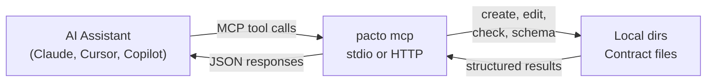
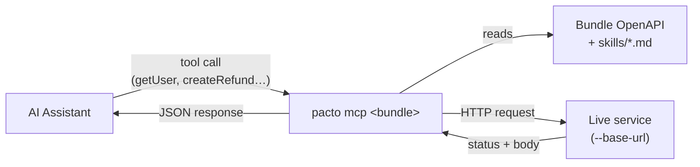

# MCP Integration
Pacto includes a built-in [Model Context Protocol](https://modelcontextprotocol.io) (MCP) server that exposes contract operations as tools for AI assistants. This enables AI tools like Claude, Cursor, and GitHub Copilot to create, edit, and validate Pacto contracts directly.

Point the server at a bundle (`pacto mcp <bundle-ref>`) and it goes further: every operation in the bundle's OpenAPI interface becomes an executable agent tool, and any `skills/*.md` domain guides the bundle ships are exposed too — making an existing contract immediately agent-ready without writing per-tool glue. See [Agent capabilities](#agent-capabilities) below.

---
## Three tool families and their boundaries

Pacto exposes three distinct families of MCP tools. They do very different things,
so their safety boundaries differ — knowing which family a tool belongs to tells
you exactly what invoking it can and cannot do.

| Family | Tools | What they do | Safety boundary |
|--------|-------|--------------|-----------------|
| **Authoring** | `pacto_create`, `pacto_edit`, `pacto_check`, `pacto_schema` | Create, edit and validate Pacto *contracts*. | Operate on contract files, not live systems. `pacto_edit` writes only after validation — with a [known gap](#pacto_edit). |
| **Generated service** | Derived per operation from a bundle's OpenAPI interfaces (`getUser`, `createRefund`, …) | Invoke the *live service* the contract describes. | Read-only (`GET`/`HEAD`) unless you pass `--allow-writes`; every call is bounded by a timeout and does not follow cross-origin redirects. |
| **Fleet query** | `pacto_fleet_search`, `pacto_fleet_get`, `pacto_fleet_graph`, `pacto_fleet_status`, `pacto_fleet_explain`, [`pacto_impact`](impact.md#mcp-tool-pacto_impact) | Read-only understanding of the *operational system* — services, revisions, targets, relationships and status. `pacto_impact` projects a contract diff onto that system to report a change's blast radius. | Read-only always; they observe nothing and change nothing. |

The three families answer three different questions: authoring tools shape *what a
contract says*, generated service tools *do something to a running service*, and
fleet query tools *understand the system as it is*. An agent should never confuse
them — invoking `createRefund` moves money; `pacto_fleet_get` never leaves the
read model.

!!! warning "The boundary is documented, not machine-advertised"
    Pacto ships **no MCP tool annotations**. A `tools/list` response carries no
    `annotations` member on any tool — not `readOnlyHint`, not `destructiveHint`,
    not `idempotentHint` — including on `pacto_create` and `pacto_edit`, which
    write contract files, and on a generated tool such as `createRefund`, which
    moves money. The [annotations](https://modelcontextprotocol.io/specification/2025-06-18/server/tools#tool-annotations)
    MCP defines for exactly this purpose are absent, so a client **cannot** tell a
    read tool from a write tool automatically and **will not** warn you before a
    write. The boundary described on this page is enforced by you, not by your
    client: build allow-lists by hand. The only machine-usable signal is the tool
    name. `pacto_check`, `pacto_schema`, `pacto_fleet_*`, `pacto_impact` and
    `pacto_catalog_revision` are read-only; `pacto_create` and `pacto_edit` write
    contract files; generated service tools carry no `pacto_` prefix at all and
    reach a live service, so treat every unprefixed tool as unsafe unless you
    started the server without `--allow-writes`.

Fleet query tools deserve explicit safety framing:

- **They are read-only.** They project the [Pacto Operational Graph](operational-graph.md)
  — an immutable read model — and perform no I/O against live systems.
- **Pacto does not determine authorization.** These tools expose knowledge; they
  never grant, scope or revoke a permission. Whether an agent *may* act stays with
  policy and IAM systems.
- **Partial or stale results are incomplete knowledge.** Every answer carries an
  `asOf` time, a `completeness` value and structured `limitations`. Branch on
  those before trusting an answer.
- **A missing result under partial coverage does not prove absence.** If a source
  was unavailable, a "not found" means "not known here", not "does not exist". An
  unavailable source is never rendered as an empty result.
- **The snapshot is frozen for the session.** `pacto mcp --fleet` builds one
  snapshot at startup, and every `pacto_fleet_*` answer is served from it: the same
  `asOf` and the same `snapshotId` for the life of the process, however far the
  cluster or the registry moves underneath. A service deployed after the server
  started will not appear until you restart it. `pacto_impact` is the one
  exception — it resolves its two refs and rebuilds the snapshot on every call, so
  its `asOf` advances while the fleet tools' does not. When the two disagree, they
  are describing two different moments, not two different worlds.
- **It reads; it does not reconcile and does not store.** Answering is all it
  does. Acting on a contract in a cluster is the
  [Kubernetes operator's](integrations/kubernetes/overview.md) job, and durable
  evidence lives in an [Evidence Server](evidence-protocol.md) someone else runs —
  `--evidence-url` reads one, it never becomes one. Nothing survives the process.

`--fleet` names its sources the same way `pacto fleet` does, and the flags mean
the same things:

```bash
pacto mcp --fleet --k8s --oci ghcr.io/acme/payments-api-pacto:2.1.0
```

`--local`, `--oci`, `--k8s`, `--cache`, `--evidence-url`, `--target-state`,
`--namespace` and `--freshness` are all accepted — every `pacto fleet` source
except `--traces`, which the MCP server does not take; the
[`pacto mcp` reference](cli-reference.md#pacto-mcp) lists them with their
defaults. See [The Pacto Operational Graph](operational-graph.md) for the read
model these tools query and the query semantics they expose.

A fourth server mode — [contract catalog discovery](#contract-catalog-discovery) —
is not a tool family: it is mostly MCP *resources*, with a single lookup tool. It
is also the one mode that does not carry the authoring tools alongside its own.
The other three do: `pacto mcp <bundle-ref>` and `pacto mcp --fleet` each add
their family on top of `pacto_create`, `pacto_edit`, `pacto_check` and
`pacto_schema`.

---
## Contract catalog discovery

`pacto mcp --root <ref>` starts a **read-only contract catalog**: the roots you
name, plus their dependency closure, resolved once at startup and then frozen for
the life of the process.

```bash
# One published platform, one contract you are still working on
pacto mcp \
  --root oci://ghcr.io/acme/platform:1.4.0 \
  --root ./experimental-platform
```

`--root` is repeatable and takes either a local bundle directory or an `oci://`
reference. Nothing is discovered that you did not name: Pacto does not crawl a
registry, guess repository names or read a catalog file. The set of roots is the
whole input, and the closure of those roots is the whole output.

### The surface

| URI / tool | What it answers |
|------------|-----------------|
| `pacto://catalog` | What this catalog is: schema version, catalog id, generation time, the bounds that applied, the completeness of the whole answer, and every requested root — including roots that did not resolve, and why. |
| `pacto://catalog/closure` | What is in it: every deduplicated revision with its content identity, rank and retained paths; every resolved dependency edge; every dependency that did not resolve; and the conflicts and cycles left visible rather than resolved — under the same catalog metadata. |
| `pacto_catalog_revision` | One revision by its full identity — service name, domain, content scheme and content digest. |

That is the whole surface. Catalog mode registers no authoring tools:
`pacto_create` and `pacto_edit` write contract files, and a server started for
read-only discovery must not be a way to modify one.

`pacto://catalog` is the cheaper read, so reading it first is the recommended
order — but it is not a precondition. Both resources carry the same catalog
metadata, so either one is safe to read on its own. The repetition is
deliberate: a resource can be read alone, in any order, and a payload carrying
only data would be indistinguishable from an authoritative answer whenever the
data happened to be empty. Ask for two roots that both fail to resolve and the
closure is empty in every collection — the metadata travelling with it is what
says `partial`, names each `ROOT_UNRESOLVED`, and keeps the two roots you
actually requested visible.

The lookup is a tool rather than a URI template because a revision's identity is
four structured fields, and a service name or domain may contain `/`, `:`, `%` or
arbitrary UTF-8. Encoding that into a path segment would mean re-parsing it at
the other end, and two different identities could arrive as one. The identity
stays structured from the query to the answer.

### What it is not

- **A catalog is not the fleet.** The catalog describes *contracts* reachable
  from the roots you named. It says nothing about deployments, environments,
  runtime targets or observed state — those are [Fleet query tools](#three-tool-families-and-their-boundaries)
  over the [Operational Graph](operational-graph.md). A requested root is an
  input to discovery, never a runtime target.
- **Discovery is not authorization.** Learning that a revision exists says
  nothing about whether you may read, deploy or call it. Authorization stays with
  your policy and IAM systems.
- **Discovery is not execution.** Nothing in this surface invokes anything. If
  you want a bundle's operations as callable tools, that is the separate
  [Agent capabilities](#agent-capabilities) mode.
- **It is a session, not a store.** There is no database, no daemon state and no
  background refresh. The catalog lives in the process and disappears with it.

### Partial is not empty, and not complete

Every catalog reports its `completeness`. A root or a dependency that could not
be resolved stays visible — with a category such as `NOT_FOUND`, `AUTH_FAILED` or
`UNAVAILABLE`, never a raw registry error — and the whole answer is marked
`partial`.

Treat the three states as different facts:

- `complete` — everything reachable from the roots resolved.
- `partial` — some of it did not. A revision you cannot find here is *unknown*,
  not proven absent.
- An empty catalog is never started at all: `pacto mcp --root ""` fails rather
  than serve an authoritative "there is nothing here".

### Requested, resolved, identity

Three things that look alike and are not:

| | Example | Stability |
|---|---|---|
| Requested reference | `oci://ghcr.io/acme/platform:1.4.0` | A tag. It can move. |
| Resolved reference | `ghcr.io/acme/platform@sha256:…` | Immutable, as of startup. |
| Content identity | scheme `oci` + digest `sha256:…` | What the bytes *are*. This is identity. |

A mutable tag is resolved exactly once, at startup. If someone re-points that tag
while the server is running, the session does not change: the same query returns
the same digest it returned before. To pick up a moved tag, restart the server.

Local roots work the same way, with a content hash over the bundle's files in
place of a registry digest: two byte-identical directories are one revision, and
a path is never an identity. Local and registry roots go through the same
reference parsing, credentials and cache the rest of the CLI uses — catalog mode
adds no second client and no second credential path.

---
## Why MCP?

[MCP](https://modelcontextprotocol.io) is an open standard that lets AI tools invoke external functions through structured tool calls. With the Pacto MCP server, an assistant calls tools like `pacto_create` or `pacto_check` and gets structured JSON back — creating, editing and validating contracts in a single conversation instead of copy-pasting CLI output.

MCP is an *integration surface*, not the definition of Pacto. The projection that turns a bundle's interface into callable tools lives in the framework-independent `pkg/capability` package; MCP is simply the transport this page uses to expose it. A different agent runtime could consume the same projection without MCP, and everything Pacto does — validate, diff, graph, enforce policy, evaluate evidence — works with no agent at all.

---

## How it works


```mermaid
flowchart LR
    AI["AI Assistant<br/>(Claude, Cursor, Copilot)"] -->|"MCP tool calls"| MCP["pacto mcp<br/>stdio or HTTP"]
    MCP -->|"create, edit,<br/>check, schema"| Sources["Local dirs<br/>Contract files"]
    Sources -->|"structured results"| MCP
    MCP -->|"JSON responses"| AI
```

The assistant works entirely through the tool interface, and Pacto returns JSON. What it reaches for depends on the mode: the authoring tools above touch local contract directories and nothing else, while a bundle server calls the live service, `--fleet` reads clusters, registries and Evidence Servers, and `--root` resolves contracts from a registry. Only the default server is purely local.

---

## The authoring tools

These four are the default server, and every mode except `--root` carries them
as well. The other families — a bundle's generated service tools, the
`pacto_fleet_*` tools, `pacto_impact` and the catalog surface — are covered
above in [three tool families](#three-tool-families-and-their-boundaries).

| Tool | Description |
|------|-------------|
| `pacto_create` | Create a new contract from intent-level inputs (name, description, interfaces, runtime semantics). Supports dry run. |
| `pacto_edit` | Edit an existing contract — add/remove interfaces and dependencies, change runtime, update metadata. Supports dry run. |
| `pacto_check` | Validate a contract and return errors, warnings, and actionable improvement suggestions. |
| `pacto_schema` | Return the Pacto format explanation and full JSON Schema reference. Call this first if the assistant needs schema details. |

### Structured inputs are JSON-encoded strings

Every authoring-tool input that carries structure has the MCP wire type `string`,
and the value is JSON *serialised into a string* — not a JSON array or object.
That is true of `interfaces`, `dependencies`, `config_properties` and `metadata`
on `pacto_create`, and of `add_interfaces`, `remove_interfaces`,
`add_dependencies`, `remove_dependencies`, `add_config_properties`,
`set_metadata` and `remove_metadata` on `pacto_edit`:

```json
{
  "name": "orders",
  "interfaces": "[{\"name\":\"api\",\"type\":\"openapi\"}]"
}
```

!!! warning
    Passing a real JSON array or object where the JSON-encoded string is expected
    is a **silent no-op**. The argument is discarded, the call still succeeds and
    `changes` comes back `null` — nothing is written and nothing is reported. An
    absent error is therefore not evidence that the edit happened: check the
    result's `changes` and `summary`.

### pacto_create

Creates a new Pacto contract from structured input. The tool infers contract details from a natural-language description and explicit parameters.

**Key inputs:**

- `name` (required) — service name
- `description` — natural-language description (triggers automatic inference of interfaces and runtime)
- `interfaces` — [JSON-encoded](#structured-inputs-are-json-encoded-strings) array of `{name, type, visibility?}` objects. `type` is one of `openapi`, `asyncapi` or `grpc` — the only three the [contract schema](contract-reference/sections.md#interfaces) allows. There is no `ref` input: the contract's required `interfaces[].ref` is derived as `interfaces/<name>.yaml`.
- `stores_data`, `data_survives_restart`, `data_shared_across_instances` — intent-level runtime flags mapped to contract primitives
- `dry_run` — validate and return the result without writing files

**Description inference:** When a description mentions terms like "REST API" or "gRPC", the tool infers the matching interface; a datastore term like `postgres` or `redis` flips the runtime to stateful; and a messaging term like `kafka` adds an `asyncapi` interface. Matching is case-insensitive but **whole-word**, so `Postgres` and `postgres` are recognised while `PostgreSQL` is not. Dependencies are never inferred — declare them explicitly via the `dependencies` input. Explicit inputs always override inferred values.

**Runtime mapping:** Intent-level flags are deterministically mapped to contract primitives:

| Intent | Contract field |
|--------|---------------|
| `stores_data=true` + `data_survives_restart=false` | `state.type: stateful`, `persistence.durability: ephemeral`, `dataCriticality: medium` |
| `stores_data=true` + `data_survives_restart=true` | `state.type: stateful`, `persistence.durability: persistent` |
| `data_shared_across_instances=true` | `persistence.scope: shared` |
| `data_loss_impact=high` | `dataCriticality: high` |

The persistence rows take effect only when `stores_data=true` — `stores_data` is what sets `state.type: stateful` and the default `dataCriticality: medium`. With `stores_data=false` the state stays stateless, local and ephemeral, and `data_shared_across_instances` is ignored; `data_loss_impact` still sets `dataCriticality` independently of `stores_data`. See [Contract reference](contract-reference/index.md) for the full workload and state field definitions.

### pacto_edit

Modifies an existing contract. Reads the current `pacto.yaml`, applies changes, validates the result, and writes back atomically. The validation step has a real gap — see the warning below.

**Key inputs:**

- `path` — directory containing `pacto.yaml` (defaults to `.`)
- `add_interfaces` / `remove_interfaces` — add or remove interfaces. `add_interfaces` takes the same [JSON-encoded](#structured-inputs-are-json-encoded-strings) `{name, type, visibility?}` objects as `pacto_create`; `remove_interfaces` takes a JSON-encoded array of interface names.
- `add_dependencies` / `remove_dependencies` — add or remove dependencies
- Runtime flags (`stores_data`, `data_survives_restart`, etc.)
- `dry_run` — validate without writing

!!! warning "`pacto_edit` can write a bundle that `pacto validate` rejects"
    `pacto_edit` scaffolds a stub spec file only for `openapi` and `grpc`
    interfaces. An `asyncapi` interface is added to `pacto.yaml` with a derived
    `ref: interfaces/<name>.yaml` and **no file is created**, so the tool reports
    success — `changes: ["added interface …"]` — while the referenced file is
    missing, and `pacto validate` then exits non-zero with `FILE_NOT_FOUND`. The
    tool's "validates the result before writing" does not catch this: it validates
    an in-memory bundle in which every missing `ref` is substituted with a stub, so
    the check passes against a filesystem that is not the one written to disk.
    Create the AsyncAPI document yourself after the edit.

### pacto_check

Validates a contract and returns structured results including errors, warnings, a contract summary, and actionable suggestions for improvement.

**Output includes:**

- `valid` — whether the contract passes validation
- `errors` / `warnings` — validation issues with path, code, and message
- `summary` — parsed contract overview (name, version, interfaces, runtime state)
- `suggestions` — improvements for a contract that is already valid. There are
  four, each fired by an absent section: no interfaces, no `state`, no
  configuration, no dependencies. Only the first carries a `toolCall` (the exact
  `pacto_edit` arguments to add an `openapi` interface); the other three are
  prose. An invalid contract returns no suggestions at all — fix the errors first.

### pacto_schema

Returns the Pacto format description and the full JSON Schema for `pacto.yaml`. Useful as a first call so the assistant understands the contract structure before creating or editing.

---

## Agent capabilities

The mental model is **bundle → capability → generated tools**. A bundle publishes interfaces; each interface represents a capability the service offers; Pacto *projects* every operation in that interface into a generated tool an agent can call, with no per-tool glue written by the bundle author. Two things this deliberately keeps separate:

- **Generated tools are projections, not the contract's `capabilities` section.** The contract [`capabilities`](contract-reference/sections.md#capabilities) section declares observability endpoints (`health`/`metrics`/`extension`). The tools here are derived from a service's *interface* operations. Pacto invents no new capability on the service's behalf — it renders what the interface already describes.
- **The contract gives the agent context around the tools.** The tools say what can be invoked; the surrounding contract (identity, dependencies, policies, state) tells the agent what the service *is*, so it can reason rather than guess.

Skills, described below, layer optional domain knowledge on top of the generated tools.

The authoring tools above are always available. When you additionally pass a **bundle reference** — a local directory or an `oci://` reference — Pacto turns that bundle's interfaces into executable agent tools:

```bash
pacto mcp ./my-service --base-url https://api.example.com
```

For every operation in each `openapi` interface's contract, Pacto registers one MCP tool whose input schema is derived from the operation's parameters and request body, and whose handler invokes the live endpoint. (`openapi` is the interface *type*; an interface's *name* is free-form, so a bundle may well name one `http`.) The bundle author writes nothing extra — the interface already describes what the tool needs.

The tool's name is the operation's `operationId`. When an operation declares none, Pacto derives `<method>_<path>` with every non-alphanumeric character collapsed to a single `_` — `GET /health` becomes `get_health` — and disambiguates a collision with a numeric suffix (`get_health_2`). An agent allow-list keyed on tool names therefore depends on the OpenAPI document declaring `operationId` for every operation.

The server also sets its MCP *instructions* to tell the assistant that these tools invoke the live service, whether writes are enabled, and how to use `pacto_skill`. That generic "how to use these capabilities" guidance lives in Pacto itself — bundles only ship *domain-specific* skills (below), never a boilerplate usage guide.


```mermaid
flowchart LR
    AI["AI Assistant"] -->|"tool call<br/>(getUser, createRefund…)"| MCP["pacto mcp &lt;bundle&gt;"]
    MCP -->|"reads"| Spec["Bundle OpenAPI<br/>+ skills/*.md"]
    MCP -->|"HTTP request"| Svc["Live service<br/>(--base-url)"]
    Svc -->|"status + body"| MCP
    MCP -->|"JSON response"| AI
```

### Read-only by default

Only safe read operations (`GET`/`HEAD`) are exposed unless you opt in to mutating ones. This prevents an assistant from creating, updating, or deleting live resources by accident.

```bash
# expose mutating operations (POST/PUT/PATCH/DELETE) too
pacto mcp ./my-service --base-url https://api.example.com --allow-writes
```

A per-interface count of skipped operations is logged to stderr, so nothing is dropped silently:

```
pacto mcp: skipped 2 mutating operation(s) in interface "api" (use --allow-writes to expose)
```

The individual operations are not named, at any verbosity — to see exactly which ones would appear, compare `tools/list` with and without `--allow-writes`.

### Base URL

The live host comes from `--base-url`, falling back to the spec's `servers[0]` URL when the flag is omitted. If neither is available the server refuses to start. When you supply credentials (below), `--base-url` is **required** — Pacto will not send credentials to a host chosen by bundle content.

### Authentication

Credentials are supplied per OpenAPI security scheme with the repeatable `--auth name=value` flag and applied to each request according to the scheme's declaration. The `http` in the table below is an OpenAPI *security-scheme* type, unrelated to Pacto's interface types (`openapi`, `asyncapi`, `grpc`):

| Scheme type | How the credential is applied |
|-------------|-------------------------------|
| `apiKey` | Sent as the declared header or query parameter |
| `http` `bearer` (and `oauth2` / `openIdConnect`) | `Authorization: Bearer <value>` |
| `http` `basic` | `Authorization: Basic <value>` (supply pre-encoded `user:pass`) |

```bash
pacto mcp oci://ghcr.io/acme/svc:1.0.0 \
  --base-url https://api.example.com \
  --auth bearerAuth=$TOKEN --allow-writes
```

Server-issued redirects are **not** followed, so credentials cannot leak to another origin, and every call is bounded by a timeout.

### pacto_skill

Bundles may ship optional domain knowledge as `skills/*.md` — workflows and business rules that an interface alone can't express (for example `skills/refund_customer.md`). These are packaged with the bundle automatically. The `pacto_skill` tool lists them when called with no arguments, and returns a skill's Markdown when given its `name`.

```
bundle/
    pacto.yaml
    interfaces/openapi.json
    skills/
        refund_customer.md
        onboard_customer.md
```

### Connecting to a bundle

Point any MCP client at a bundle by adding the reference (and flags) to the server args. For Claude Code (`.mcp.json`):

```json
{
  "mcpServers": {
    "acme-svc": {
      "command": "pacto",
      "args": ["mcp", "oci://ghcr.io/acme/svc:1.0.0", "--base-url", "https://api.example.com"]
    }
  }
}
```

### End-to-end example: a demo bundle with Claude Code

This repository ships demo bundles you can point Claude at directly. We'll use
`payments-service`, which declares an OpenAPI interface **and** a
`refund_customer.md` skill — so it exercises both halves of the feature.

**1. Install Pacto** so the `pacto` binary is on your `PATH`:

```bash
make build   # or: go install ./cmd/pacto
```

See [Installation](installation.md) for all methods.

**2. Start a throwaway backend.** The demo service isn't actually running, so give
the generated tools something to call. In a real setup `--base-url` points at your
live service instead.

```bash
python3 - <<'EOF'
from http.server import BaseHTTPRequestHandler, HTTPServer
class H(BaseHTTPRequestHandler):
    def r(self):
        self.send_response(200); self.send_header("Content-Type","application/json"); self.end_headers()
        self.wfile.write(f'{{"ok":true,"path":"{self.path}"}}'.encode())
    do_GET = do_POST = r
    def log_message(self, *a): pass
HTTPServer(("127.0.0.1", 8080), H).serve_forever()
EOF
```

**3. Register the bundle with Claude Code** (from the repo root). A refund is a
`POST`, so pass `--allow-writes` to expose mutating operations:

```bash
claude mcp add --scope local payments-demo \
  -- pacto mcp ./examples/demo/bundles/payments-service/v2.1.0 \
     --base-url http://127.0.0.1:8080 --allow-writes
```

The server name (`payments-demo`) goes *before* the `--`; everything after it is
the command Claude runs. (Equivalent `.mcp.json` form: the `command`/`args` shape
shown above.)

**4. Verify the connection and inspect the tools:**

```bash
claude mcp list          # payments-demo → ✔ Connected
```

or, inside a Claude Code session:

```
/mcp
```

You'll see one tool per OpenAPI operation (`createRefund`, `getPaymentIntent`,
`listPaymentIntents`, …) plus `pacto_skill` and the four authoring tools
(`pacto_create`, `pacto_edit`, `pacto_check`, `pacto_schema`), which are always
registered. Claude also receives the server's
instructions telling it these tools invoke the live payments service and how to
use `pacto_skill`.

**5. Just ask, in plain language:**

```
You:    Refund payment intent pi_123 — it was a duplicate charge.

Claude: [calls pacto_skill to read refund_customer.md]
        [follows the workflow: confirms the intent is refundable via
         getPaymentIntent, sets reason="duplicate"]
        [calls createRefund with {payment_intent_id:"pi_123", reason:"duplicate"}]
        Done — issued a refund for pi_123 (reason: duplicate).
```

Claude discovered the *operation* from the OpenAPI contract and the *procedure*
from the bundled skill — neither was hand-written as an agent tool.

!!! note
    The model calls these tools under a server-namespaced name, e.g.
    `mcp__payments-demo__createRefund`. Drop `--allow-writes` and the mutating
    tools (including `createRefund`) disappear — only the read-only operations
    (`getPaymentIntent`, `listPaymentIntents`, `healthCheck`) and `pacto_skill`
    remain.

When you're done: `claude mcp remove payments-demo`.

---

## Transports

Pacto supports two MCP transports:

| Transport | Flag | Use case |
|-----------|------|----------|
| **stdio** (default) | `pacto mcp` | Direct integration with CLI-based AI tools (Claude Code, Cursor) |
| **HTTP** | `pacto mcp -t http` | Local HTTP endpoint for tools that speak HTTP rather than stdio |

The HTTP transport serves the [Streamable HTTP](https://modelcontextprotocol.io/specification/2025-03-26/basic/transports#streamable-http) protocol at the `/mcp` endpoint. The port defaults to `8585` and can be changed with `--port`. The server binds to loopback (`127.0.0.1`) only; remote access requires an explicit tunnel or reverse proxy.

---

## Connect your MCP client

Every client points the same way — it runs the `pacto` binary over stdio. Pick yours:

=== "Claude Code"

    Add to your project's `.mcp.json`:

    ```json
    {
      "mcpServers": {
        "pacto": { "command": "pacto", "args": ["mcp"] }
      }
    }
    ```

=== "Claude Desktop"

    Add to `claude_desktop_config.json` (`~/Library/Application Support/Claude/` on macOS, `%APPDATA%\Claude\` on Windows):

    ```json
    {
      "mcpServers": {
        "pacto": { "command": "pacto", "args": ["mcp"] }
      }
    }
    ```

=== "Cursor"

    Add to `.cursor/mcp.json`:

    ```json
    {
      "mcpServers": {
        "pacto": { "command": "pacto", "args": ["mcp"] }
      }
    }
    ```

=== "GitHub Copilot"

    Add to `.vscode/mcp.json` (requires VS Code 1.99+ and the Copilot Chat extension):

    ```json
    {
      "servers": {
        "pacto": { "command": "pacto", "args": ["mcp"] }
      }
    }
    ```

To serve a bundle's operations as executable tools, append the bundle reference and flags to `args` — see [Agent capabilities](#agent-capabilities).

### Example prompts

Once connected, you can work with contracts conversationally:

```
You:    Create a pacto contract for a stateful Go HTTP API called user-service
        that stores data in PostgreSQL
Claude: [creates pacto.yaml with an http-api openapi interface, state.type
         stateful and persistence.durability persistent -- and no dependency]

You:    Add a dependency on payments-api
Claude: [calls pacto_edit with add_dependencies]

You:    Check the contract in ./payments-api
Claude: payments-api is valid. Suggestion: "No dependencies declared. If this
        service depends on others, declare them explicitly."
```

The first answer is the honest one, and it is worth reading twice.
[Dependencies are never inferred](#pacto_create) — a description that names
PostgreSQL still produces no `dependencies` section, which is why the second
prompt exists. `PostgreSQL` is also not the word that made this contract
stateful: matching is whole-word, so `postgres` counts and `PostgreSQL` does not.
Here "stateful" and "stores data" did the work. Ask for the same contract without
those two phrases and you get a stateless one.

---

## HTTP transport

For tools that connect over HTTP rather than stdio (see [Transports](#transports) for the protocol and defaults), start the server with:

```bash
# Default port (8585)
pacto mcp -t http

# Custom port
pacto mcp -t http --port 9090
```

Connect your client to `http://127.0.0.1:8585/mcp` (or your chosen port).

---

## Troubleshooting

**Tools not showing up in your AI assistant?**

1. Verify Pacto is installed and in your `PATH`:
   ```bash
   pacto version
   ```

2. Test the MCP server directly:
   ```bash
   pacto mcp --help
   ```

3. Check your MCP configuration file for JSON syntax errors.

4. Use verbose mode to see debug output for the server's *startup* work — resolving a bundle reference or a `--root` against a registry:
   ```bash
   pacto mcp ./my-service --base-url https://api.example.com -v
   ```
   Once the server is running it logs nothing per tool call, and plain `pacto mcp`
   resolves nothing at startup, so there `-v` adds no output beyond the single
   `MCP server running on stdio` line. To inspect what the server actually
   exposes, call `tools/list` from your client (in Claude Code, `/mcp`).
