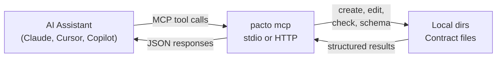
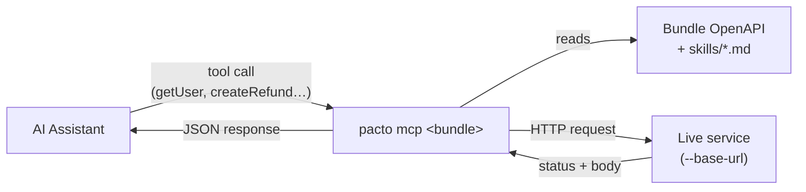

# MCP Integration
Pacto includes a built-in [Model Context Protocol](https://modelcontextprotocol.io) (MCP) server that exposes contract operations as tools for AI assistants. This enables AI tools like Claude, Cursor, and GitHub Copilot to create, edit, and validate Pacto contracts directly.

Point the server at a bundle (`pacto mcp <bundle-ref>`) and it goes further: every operation in the bundle's OpenAPI interface becomes an executable agent tool, and any `skills/*.md` domain guides the bundle ships are exposed too — making an existing contract immediately agent-ready without writing per-tool glue. See [Agent capabilities](#agent-capabilities) below.

---
## Why MCP?

[MCP](https://modelcontextprotocol.io) is an open standard that lets AI tools invoke external functions through structured tool calls. With the Pacto MCP server, an assistant calls tools like `pacto_create` or `pacto_check` and gets structured JSON back — creating, editing and validating contracts in a single conversation instead of copy-pasting CLI output.

---

## How it works


```mermaid
flowchart LR
    AI["AI Assistant<br/>(Claude, Cursor, Copilot)"] -->|"MCP tool calls"| MCP["pacto mcp<br/>stdio or HTTP"]
    MCP -->|"create, edit,<br/>check, schema"| Sources["Local dirs<br/>Contract files"]
    Sources -->|"structured results"| MCP
    MCP -->|"JSON responses"| AI
```

The assistant works entirely through the tool interface — Pacto runs each operation against local contract directories and returns JSON.

---

## Available tools

| Tool | Description |
|------|-------------|
| `pacto_create` | Create a new contract from intent-level inputs (name, description, interfaces, runtime semantics). Supports dry run. |
| `pacto_edit` | Edit an existing contract — add/remove interfaces and dependencies, change runtime, update metadata. Supports dry run. |
| `pacto_check` | Validate a contract and return errors, warnings, and actionable improvement suggestions. |
| `pacto_schema` | Return the Pacto format explanation and full JSON Schema reference. Call this first if the assistant needs schema details. |

### pacto_create

Creates a new Pacto contract from structured input. The tool infers contract details from a natural-language description and explicit parameters.

**Key inputs:**
- `name` (required) — service name
- `description` — natural-language description (triggers automatic inference of interfaces and runtime)
- `interfaces` — JSON array of `{name, type, port?, visibility?}` objects
- `stores_data`, `data_survives_restart`, `data_shared_across_instances` — intent-level runtime flags mapped to contract primitives
- `dry_run` — validate and return the result without writing files

**Description inference:** When a description mentions terms like "REST API" or "gRPC", the tool infers the matching interface; a datastore term like "PostgreSQL" or "Redis" flips the runtime to stateful; and a messaging term like "Kafka" adds an event interface. Dependencies are never inferred — declare them explicitly via the `dependencies` input. Explicit inputs always override inferred values.

**Runtime mapping:** Intent-level flags are deterministically mapped to contract primitives:

| Intent | Contract field |
|--------|---------------|
| `stores_data=true` + `data_survives_restart=false` | `state.type: stateful`, `persistence.durability: ephemeral`, `dataCriticality: medium` |
| `stores_data=true` + `data_survives_restart=true` | `state.type: stateful`, `persistence.durability: persistent` |
| `data_shared_across_instances=true` | `persistence.scope: shared` |
| `data_loss_impact=high` | `dataCriticality: high` |

The persistence rows take effect only when `stores_data=true` — `stores_data` is what sets `state.type: stateful` and the default `dataCriticality: medium`. With `stores_data=false` the state stays stateless, local and ephemeral, and `data_shared_across_instances` is ignored; `data_loss_impact` still sets `dataCriticality` independently of `stores_data`. See [Contract reference](contract-reference/index.md) for the full runtime and state field definitions.

**Scaling inputs:** `replicas` and `min_replicas`/`max_replicas` are mutually exclusive. If `replicas` is set, the min/max values are silently ignored (current behavior) — set either a fixed replica count or an auto-scaling range, not both.

### pacto_edit

Modifies an existing contract. Reads the current `pacto.yaml`, applies changes, validates the result, and writes back atomically.

**Key inputs:**
- `path` — directory containing `pacto.yaml` (defaults to `.`)
- `add_interfaces` / `remove_interfaces` — add or remove interfaces
- `add_dependencies` / `remove_dependencies` — add or remove dependencies
- Runtime flags (`stores_data`, `data_survives_restart`, etc.)
- `dry_run` — validate without writing

Scaling inputs follow the same rule as `pacto_create`: `replicas` and `min_replicas`/`max_replicas` are mutually exclusive, and setting `replicas` silently ignores the min/max values (current behavior).

!!! warning
    `pacto_edit` only scaffolds stub files for HTTP and gRPC interfaces. Other interface types (e.g. `event`) are added to `pacto.yaml` with a `contract:` path, but no file is created for them, so `pacto_edit` can report success while a referenced interface file is missing. Create those files yourself after the edit.

### pacto_check

Validates a contract and returns structured results including errors, warnings, a contract summary, and actionable suggestions for improvement.

**Output includes:**
- `valid` — whether the contract passes validation
- `errors` / `warnings` — validation issues with path, code, and message
- `summary` — parsed contract overview (name, version, interfaces, runtime state)
- `suggestions` — actionable improvements with tool call references (e.g., "add a health interface" with the exact `pacto_edit` call to do it)

### pacto_schema

Returns the Pacto format description and the full JSON Schema for `pacto.yaml`. Useful as a first call so the assistant understands the contract structure before creating or editing.

---

## Agent capabilities

Interfaces describe how software can be invoked; a **capability** is the agent-facing projection of a published interface — the same OpenAPI contract, rendered as tools an autonomous agent can call, with no per-tool glue written by the bundle author. Skills, described below, layer optional domain knowledge on top of that capability.

The authoring tools above are always available. When you additionally pass a **bundle reference** — a local directory or an `oci://` reference — Pacto turns that bundle's interfaces into executable agent tools:

```bash
pacto mcp ./my-service --base-url https://api.example.com
```

For every operation in each `http` interface's OpenAPI contract, Pacto registers one MCP tool whose input schema is derived from the operation's parameters and request body, and whose handler invokes the live endpoint. The bundle author writes nothing extra — the interface already describes what the tool needs.

The server also sets its MCP *instructions* to tell the assistant that these tools invoke the live service, whether writes are enabled, and how to use `pacto_skill`. That generic "how to use these capabilities" guidance lives in Pacto itself — bundles only ship *domain-specific* skills (below), never a boilerplate usage guide.


```mermaid
flowchart LR
    AI["AI Assistant"] -->|"tool call<br/>(getUser, createRefund…)"| MCP["pacto mcp &lt;bundle&gt;"]
    MCP -->|"reads"| Spec["Bundle OpenAPI<br/>+ skills/*.md"]
    MCP -->|"HTTP request"| Svc["Live service<br/>(--base-url)"]
    Svc -->|"status + body"| MCP
    MCP -->|"JSON response"| AI
```

### Read-only by default

Only safe read operations (`GET`/`HEAD`) are exposed unless you opt in to mutating ones. This prevents an assistant from creating, updating, or deleting live resources by accident.

```bash
# expose mutating operations (POST/PUT/PATCH/DELETE) too
pacto mcp ./my-service --base-url https://api.example.com --allow-writes
```

Skipped operations are logged to stderr, so nothing is silently dropped.

### Base URL

The live host comes from `--base-url`, falling back to the spec's `servers[0]` URL when the flag is omitted. If neither is available the server refuses to start. When you supply credentials (below), `--base-url` is **required** — Pacto will not send credentials to a host chosen by bundle content.

### Authentication

Credentials are supplied per OpenAPI security scheme with the repeatable `--auth name=value` flag and applied to each request according to the scheme's declaration:

| Scheme type | How the credential is applied |
|-------------|-------------------------------|
| `apiKey` | Sent as the declared header or query parameter |
| `http` `bearer` (and `oauth2` / `openIdConnect`) | `Authorization: Bearer <value>` |
| `http` `basic` | `Authorization: Basic <value>` (supply pre-encoded `user:pass`) |

```bash
pacto mcp oci://ghcr.io/acme/svc:1.0.0 \
  --base-url https://api.example.com \
  --auth bearerAuth=$TOKEN --allow-writes
```

Server-issued redirects are **not** followed, so credentials cannot leak to another origin, and every call is bounded by a timeout.

### pacto_skill

Bundles may ship optional domain knowledge as `skills/*.md` — workflows and business rules that an interface alone can't express (for example `skills/refund_customer.md`). These are packaged with the bundle automatically. The `pacto_skill` tool lists them when called with no arguments, and returns a skill's Markdown when given its `name`.

```
bundle/
    pacto.yaml
    interfaces/openapi.json
    skills/
        refund_customer.md
        onboard_customer.md
```

### Connecting to a bundle

Point any MCP client at a bundle by adding the reference (and flags) to the server args. For Claude Code (`.mcp.json`):

```json
{
  "mcpServers": {
    "acme-svc": {
      "command": "pacto",
      "args": ["mcp", "oci://ghcr.io/acme/svc:1.0.0", "--base-url", "https://api.example.com"]
    }
  }
}
```

### End-to-end example: a demo bundle with Claude Code

This repository ships demo bundles you can point Claude at directly. We'll use
`payments-service`, which declares an OpenAPI interface **and** a
`refund_customer.md` skill — so it exercises both halves of the feature.

**1. Install Pacto** so the `pacto` binary is on your `PATH`:

```bash
make build   # or: go install ./cmd/pacto
```

See [Installation](installation.md) for all methods.

**2. Start a throwaway backend.** The demo service isn't actually running, so give
the generated tools something to call. In a real setup `--base-url` points at your
live service instead.

```bash
python3 - <<'EOF'
from http.server import BaseHTTPRequestHandler, HTTPServer
class H(BaseHTTPRequestHandler):
    def r(self):
        self.send_response(200); self.send_header("Content-Type","application/json"); self.end_headers()
        self.wfile.write(f'{{"ok":true,"path":"{self.path}"}}'.encode())
    do_GET = do_POST = r
    def log_message(self, *a): pass
HTTPServer(("127.0.0.1", 8080), H).serve_forever()
EOF
```

**3. Register the bundle with Claude Code** (from the repo root). A refund is a
`POST`, so pass `--allow-writes` to expose mutating operations:

```bash
claude mcp add --scope local payments-demo \
  -- pacto mcp ./examples/demo/bundles/payments-service/v2.1.0 \
     --base-url http://127.0.0.1:8080 --allow-writes
```

The server name (`payments-demo`) goes *before* the `--`; everything after it is
the command Claude runs. (Equivalent `.mcp.json` form: the `command`/`args` shape
shown above.)

**4. Verify the connection and inspect the tools:**

```bash
claude mcp list          # payments-demo → ✔ Connected
```

or, inside a Claude Code session:

```
/mcp
```

You'll see one tool per OpenAPI operation (`createRefund`, `getPaymentIntent`,
`listPaymentIntents`, …) plus `pacto_skill` and the four authoring tools
(`pacto_create`, `pacto_edit`, `pacto_check`, `pacto_schema`), which are always
registered. Claude also receives the server's
instructions telling it these tools invoke the live payments service and how to
use `pacto_skill`.

**5. Just ask, in plain language:**

```
You:    Refund payment intent pi_123 — it was a duplicate charge.

Claude: [calls pacto_skill to read refund_customer.md]
        [follows the workflow: confirms the intent is refundable via
         getPaymentIntent, sets reason="duplicate"]
        [calls createRefund with {payment_intent_id:"pi_123", reason:"duplicate"}]
        Done — issued a refund for pi_123 (reason: duplicate).
```

Claude discovered the *operation* from the OpenAPI contract and the *procedure*
from the bundled skill — neither was hand-written as an agent tool.

!!! note
    The model calls these tools under a server-namespaced name, e.g.
    `mcp__payments-demo__createRefund`. Drop `--allow-writes` and the mutating
    tools (including `createRefund`) disappear — only the read-only operations
    (`getPaymentIntent`, `listPaymentIntents`, `healthCheck`) and `pacto_skill`
    remain.

When you're done: `claude mcp remove payments-demo`.

---

## Transports

Pacto supports two MCP transports:

| Transport | Flag | Use case |
|-----------|------|----------|
| **stdio** (default) | `pacto mcp` | Direct integration with CLI-based AI tools (Claude Code, Cursor) |
| **HTTP** | `pacto mcp -t http` | Local HTTP endpoint for tools that speak HTTP rather than stdio |

The HTTP transport serves the [Streamable HTTP](https://modelcontextprotocol.io/specification/2025-03-26/basic/transports#streamable-http) protocol at the `/mcp` endpoint. The port defaults to `8585` and can be changed with `--port`. The server binds to loopback (`127.0.0.1`) only; remote access requires an explicit tunnel or reverse proxy.

---

## Claude integration

### Claude Code (CLI)

Add Pacto as an MCP server in your project's `.mcp.json` file:

```json
{
  "mcpServers": {
    "pacto": {
      "command": "pacto",
      "args": ["mcp"]
    }
  }
}
```

Claude Code uses stdio, so no port configuration is needed.

### Claude Desktop

Add the server to your `claude_desktop_config.json`:

```json
{
  "mcpServers": {
    "pacto": {
      "command": "pacto",
      "args": ["mcp"]
    }
  }
}
```

!!! tip
    The config file is located at `~/Library/Application Support/Claude/claude_desktop_config.json` on macOS or `%APPDATA%\Claude\claude_desktop_config.json` on Windows.

### Example prompts

Once connected, you can interact with contracts conversationally:

```
You:    Create a pacto contract for a stateful Go HTTP API called user-service
        that stores data in PostgreSQL
Claude: [creates pacto.yaml with HTTP interface, postgres dependency,
         stateful runtime, and persistent storage]

You:    Check the contract in ./payments-api
Claude: payments-api is valid. Suggestions: add a health interface,
        consider adding scaling configuration.

You:    Add a gRPC interface called "internal-api" on port 9090
        to the payments-api contract
Claude: [edits pacto.yaml, adds gRPC interface, validates result]

You:    What's the Pacto schema format?
Claude: [returns full JSON Schema and format description]
```

---

## Cursor

Add Pacto as an MCP server in your Cursor settings (`.cursor/mcp.json`):

```json
{
  "mcpServers": {
    "pacto": {
      "command": "pacto",
      "args": ["mcp"]
    }
  }
}
```

---

## GitHub Copilot

### VS Code

Add Pacto as an MCP server in your VS Code settings (`.vscode/settings.json`):

```json
{
  "mcp": {
    "servers": {
      "pacto": {
        "command": "pacto",
        "args": ["mcp"]
      }
    }
  }
}
```

Alternatively, create a `.vscode/mcp.json` file in your project root:

```json
{
  "servers": {
    "pacto": {
      "command": "pacto",
      "args": ["mcp"]
    }
  }
}
```

Once configured, Copilot Chat in agent mode can use Pacto tools. Try asking: *"@workspace create a pacto contract for my-service"*.

!!! note
    MCP support in GitHub Copilot requires VS Code 1.99+ and the GitHub Copilot Chat extension.

---

## HTTP transport

For tools that connect over HTTP rather than stdio (see [Transports](#transports) for the protocol and defaults), start the server with:

```bash
# Default port (8585)
pacto mcp -t http

# Custom port
pacto mcp -t http --port 9090
```

Connect your client to `http://127.0.0.1:8585/mcp` (or your chosen port).

---

## Troubleshooting

**Tools not showing up in your AI assistant?**

1. Verify Pacto is installed and in your `PATH`:
   ```bash
   pacto version
   ```

2. Test the MCP server directly:
   ```bash
   pacto mcp --help
   ```

3. Check your MCP configuration file for JSON syntax errors.

4. Use verbose mode to see debug output:
   ```bash
   pacto mcp -v
   ```
