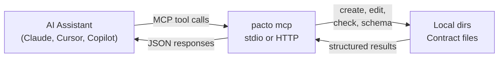

# MCP Integration

Pacto includes a built-in [Model Context Protocol](https://modelcontextprotocol.io) (MCP) server that exposes contract operations as tools, so an AI assistant like Claude, Cursor or GitHub Copilot can create, edit and validate Pacto contracts directly.

Point the server at a bundle (`pacto mcp <bundle-ref>`) and it goes further: every operation in the bundle's OpenAPI interface becomes an executable agent tool, and any `skills/*.md` domain guides the bundle ships are exposed too. See [Agent capabilities](mcp-agent-capabilities.md) below.

MCP is an *integration surface*, not the definition of Pacto. The projection that turns a bundle's interface into callable tools lives in the framework-independent `pkg/capability` package; MCP is the transport this page uses to expose it.

---

## How it works


```mermaid
flowchart LR
    AI["AI Assistant<br/>(Claude, Cursor, Copilot)"] -->|"MCP tool calls"| MCP["pacto mcp<br/>stdio or HTTP"]
    MCP -->|"create, edit,<br/>check, schema"| Sources["Local dirs<br/>Contract files"]
    Sources -->|"structured results"| MCP
    MCP -->|"JSON responses"| AI
```

The assistant works entirely through the tool interface, and Pacto returns JSON. What it reaches for depends on the mode: the [authoring tools](mcp-authoring-tools.md) touch local contract directories and nothing else, while a bundle server calls the live service, `--fleet` reads clusters, registries and Evidence Servers, and `--root` resolves contracts from a registry.

---

## Three tool families and their boundaries

| Family | Tools | What they do | Safety boundary |
|--------|-------|--------------|-----------------|
| **Authoring** | `pacto_create`, `pacto_edit`, `pacto_check`, `pacto_schema` | Create, edit and validate Pacto *contracts*. | Operate on contract files, not live systems. `pacto_edit` writes only after validation — with a [known gap](mcp-authoring-tools.md#pacto_edit). |
| **Generated service** | Derived per operation from a bundle's OpenAPI interfaces (`getUser`, `createRefund`, …) | Invoke the *live service* the contract describes. | Read-only (`GET`/`HEAD`) unless you pass `--allow-writes`; every call is bounded by a 30-second timeout and follows no redirect at all — a 3xx comes back to the agent as the result. |
| **Fleet query** | `pacto_fleet_search`, `pacto_fleet_get`, `pacto_fleet_graph`, `pacto_fleet_status`, `pacto_fleet_explain`, [`pacto_impact`](impact-surfaces.md#mcp-tool-pacto_impact) | Read-only understanding of the *operational system* — services, revisions, targets, relationships and status. `pacto_impact` projects a contract diff onto that system to report a change's blast radius. | Read-only always: they write nothing, anywhere. Two things that boundary does *not* cover — read-only is not offline, and a read-only *family* is not a read-only *server*: see [Fleet query safety](#fleet-query-safety). The only server with no write tool is [`--root`](mcp-catalog-discovery.md). |

Two tools sit outside these families: `pacto_skill`, serving a bundle's
own [domain guides](mcp-agent-capabilities.md), and `pacto_catalog_revision`, the
lookup tool of the fourth server mode, [catalog discovery](mcp-catalog-discovery.md)
— which also publishes two MCP *resources*, the only non-tool part of the surface.

Not in the surface: inspecting a registry contract, resolving a dependency graph,
diffing revisions, generating docs, and the two non-query `pacto fleet`
operations — `reconcile` (declared dependencies against observed traffic) and
`snapshot` (the whole read model as one document). These stay CLI-only. No tool pushes, pulls or deploys
anything. [Server modes](cli-reference.md#server-modes) lists which tools each
invocation registers; [Boundaries](concepts-boundaries.md#boundaries) tells the MCP surface,
the catalog and the fleet apart.

!!! warning "The boundary is documented, not machine-advertised"
    Pacto ships **no MCP tool annotations**. A `tools/list` response carries no
    [`annotations`](https://modelcontextprotocol.io/specification/2025-06-18/server/tools#tool-annotations)
    member on any tool — not `readOnlyHint`, `destructiveHint` or
    `idempotentHint` — including `pacto_create`, `pacto_edit` and a generated
    tool such as `createRefund`, which moves money. A client therefore cannot
    tell a read tool from a write tool, and will not warn before a write: this
    boundary is enforced by you, not by your client, so build allow-lists by
    hand. The only machine-usable signal is the
    tool name. `pacto_check`, `pacto_schema`, `pacto_skill`, `pacto_fleet_*`,
    `pacto_impact` and `pacto_catalog_revision` are read-only; `pacto_create` and
    `pacto_edit` write contract files; generated service tools carry no `pacto_`
    prefix and reach a live service, so treat every unprefixed tool as unsafe
    unless the server was started without `--allow-writes`. That holds because
    [the `pacto_` names are reserved](mcp-agent-capabilities.md#the-pacto_-names-are-reserved):
    a bundle cannot claim one.

### Fleet query safety

- **They are read-only.** They project the [Pacto Operational Graph](operational-graph.md)
  — an immutable read model — and write nothing, to a contract, a registry or a
  running service. Read-only is not the same as offline. The `pacto_fleet_*` tools
  answer from the snapshot built at startup and touch nothing afterwards, but
  `pacto_impact` re-resolves both of its refs and rebuilds the snapshot on **every**
  call — so each invocation reaches your registry, and your cluster if `--k8s` is
  on, using the server's own credentials. Allow-list it on that basis, not on the
  family's.
- **Pacto does not determine authorization.** These tools expose knowledge; they
  never grant, scope or revoke a permission. Whether an agent *may* act stays with
  policy and IAM systems.
- **Partial or stale results are incomplete knowledge.** Every answer that comes
  back as a *result* carries an `asOf` time, a `completeness` value and structured
  `limitations`. Branch on those before trusting an answer.
- **A missing result under partial coverage does not prove absence.** If a source
  was unavailable, a "not found" means "not known here", not "does not exist". An
  unavailable source is never rendered as an empty result.
- **A subject miss is an error, and it carries no envelope.** `pacto_fleet_get`,
  `pacto_fleet_graph` and `pacto_fleet_explain` answer an unknown service or target
  with an MCP tool error — the bare string `service "x" not found in the fleet
  snapshot`, with no `meta`, so no `completeness` to branch on even when the
  snapshot is partial. The two list-shaped tools do carry it. To find out whether
  such an absence is trustworthy, call `pacto_fleet_search` or `pacto_fleet_status`
  on the same server and read the `completeness` from there; both are served from
  the same frozen snapshot, so the reading applies.
- **The snapshot is frozen for the session.** `pacto mcp --fleet` builds one
  snapshot at startup, and every `pacto_fleet_*` answer is served from it: the same
  `asOf` and the same `snapshotId` for the life of the process, however far the
  cluster or the registry moves underneath. A service deployed after the server
  started will not appear until you restart it. `pacto_impact` is the one
  exception — it resolves its two refs and rebuilds the snapshot on every call, so
  its `asOf` advances while the fleet tools' does not. When the two disagree, they
  are describing two different moments, not two different worlds.
- **It reads; it does not reconcile and does not store.** Answering is all it
  does. Acting on a contract in a cluster is the
  [Kubernetes operator's](integrations/kubernetes/overview.md) job, and durable
  evidence lives in an [Evidence Server](evidence-protocol.md) someone else runs —
  `--evidence-url` reads one, it never becomes one. Nothing survives the process.

`--fleet` names its sources the same way `pacto fleet` does, and the flags mean
the same things:

```bash
pacto mcp --fleet --k8s --oci ghcr.io/acme/payments-api-pacto:2.1.0
```

`--local`, `--oci`, `--k8s`, `--cache`, `--evidence-url`, `--target-state`,
`--traces`, `--namespace` and `--freshness` are all accepted, and the
[`pacto mcp` reference](cli-reference.md#pacto-mcp) lists them with their
defaults. The one `pacto fleet` source flag that does *not* carry over is
`--root`: on `pacto mcp` it selects the catalog server described above, so it
cannot be combined with `--fleet`. `pacto_impact` still accepts a per-call
`traces` argument, and that one reads a path off the local filesystem — see the
table below. See [The Pacto Operational Graph](operational-graph.md) for the
read model these tools query and the query semantics they expose.

The arguments each tool takes, since none of them is required except where marked:

| Tool | Arguments |
|------|-----------|
| `pacto_fleet_search` | `text`, `owner`, `status`, `compliance`, `workload`, `scope`, `source`, `ready`, `not_ready`, `has_capability`, `has_dependency`, `limit` |
| `pacto_fleet_get` | `service` **or** `target` — one names a logical service, the other an operational target by key or name |
| `pacto_fleet_graph` | `service`, `revision` or `target` to root the traversal, then `direction`, `transitive` and `max_depth` (`0` = unlimited) |
| `pacto_fleet_status` | `needs_attention` for every category, or any of `invalid`, `non_compliant`, `unknown`, `stale`, `unresolved_deps`, `missing_readiness`; plus `limit` |
| `pacto_fleet_explain` | `subject` (**required**) — a service name or a target key or name |
| `pacto_impact` | `old_ref` and `new_ref` (**both required**), plus `include_observed` and `traces` |

Argument names are not flag names: the substring filter is `text`, not `query`,
and an unrecognised key is ignored rather than rejected, so a wrong guess reads as
an unfiltered answer rather than an error.

---

## Transports

| Transport | Flag | Use case |
|-----------|------|----------|
| **stdio** (default) | `pacto mcp` | Direct integration with CLI-based AI tools (Claude Code, Cursor) |
| **HTTP** | `pacto mcp -t http` | Local HTTP endpoint for tools that speak HTTP rather than stdio |

The HTTP transport serves the [Streamable HTTP](https://modelcontextprotocol.io/specification/2025-03-26/basic/transports#streamable-http) protocol at the `/mcp` endpoint. The server binds to loopback (`127.0.0.1`) only; remote access requires an explicit tunnel or reverse proxy.

```bash
# Default port (8585)
pacto mcp -t http

# Custom port
pacto mcp -t http --port 9090
```

Connect your client to `http://127.0.0.1:8585/mcp` (or your chosen port).

---

## Connect your MCP client

Every client points the same way — it runs the `pacto` binary over stdio. Pick yours:

=== "Claude Code"

    Add to your project's `.mcp.json`:

    ```json
    {
      "mcpServers": {
        "pacto": { "command": "pacto", "args": ["mcp"] }
      }
    }
    ```

=== "Claude Desktop"

    Add to `claude_desktop_config.json` (`~/Library/Application Support/Claude/` on macOS, `%APPDATA%\Claude\` on Windows):

    ```json
    {
      "mcpServers": {
        "pacto": { "command": "pacto", "args": ["mcp"] }
      }
    }
    ```

=== "Cursor"

    Add to `.cursor/mcp.json`:

    ```json
    {
      "mcpServers": {
        "pacto": { "command": "pacto", "args": ["mcp"] }
      }
    }
    ```

=== "GitHub Copilot"

    Add to `.vscode/mcp.json` (requires VS Code 1.99+ and the Copilot Chat extension):

    ```json
    {
      "servers": {
        "pacto": { "command": "pacto", "args": ["mcp"] }
      }
    }
    ```

To serve a bundle's operations as executable tools, append the bundle reference and flags to `args` — see [Agent capabilities](mcp-agent-capabilities.md).

Every snippet above is the **authoring** server, and `pacto_create` and
`pacto_edit` write files. If the agent must change nothing, use [catalog
mode](mcp-catalog-discovery.md) instead:

```json
{
  "mcpServers": {
    "pacto": { "command": "pacto", "args": ["mcp", "--root", "oci://ghcr.io/acme/platform:1.4.0"] }
  }
}
```

`--fleet` is not the read-only choice, despite its tools being read-only: it adds
the fleet family *beside* the authoring tools rather than instead of them.

### Example prompts

```text
You:    Create a pacto contract for a stateful Go HTTP API called user-service
        that stores data in PostgreSQL
Claude: [creates pacto.yaml with an http-api openapi interface, state.type
         stateful and persistence.durability persistent -- and no dependency]

You:    Add a dependency on payments-api
Claude: [calls pacto_edit with add_dependencies]

You:    Check the contract in ./payments-api
Claude: payments-api is valid. Suggestion: "No dependencies declared. If this
        service depends on others, declare them explicitly."
```

The first answer is the honest one.
[Dependencies are never inferred](mcp-authoring-tools.md#pacto_create) — a description that names
PostgreSQL still produces no `dependencies` section, which is why the second
prompt exists. `PostgreSQL` is also not the word that made this contract
stateful: [matching is whole-word](mcp-authoring-tools.md#pacto_create).
Here "stateful" and "stores data" did the work. Ask for the same contract without
those two phrases and you get a stateless one.

---

## Troubleshooting

**Tools not showing up in your AI assistant?**

1. Verify Pacto is installed and in your `PATH`:

   ```bash
   pacto version
   ```

2. Test the MCP server directly:

   ```bash
   pacto mcp --help
   ```

3. Check your MCP configuration file for JSON syntax errors.

4. Use verbose mode to see debug output for the server's *startup* work — resolving a bundle reference or a `--root` against a registry:

   ```bash
   pacto mcp ./my-service --base-url https://api.example.com -v
   ```

   Once the server is running it logs nothing per tool call, and plain `pacto mcp`
   resolves nothing at startup, so there `-v` adds no output beyond the single
   `MCP server running on stdio` line. To inspect what the server actually
   exposes, call `tools/list` from your client (in Claude Code, `/mcp`).
