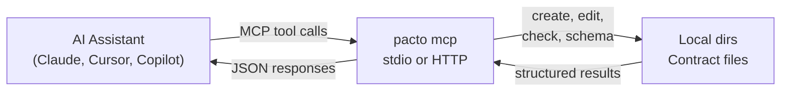

# MCP Integration

Pacto includes a built-in [Model Context Protocol](https://modelcontextprotocol.io) (MCP) server that exposes contract operations as tools, so an AI assistant can create, edit and validate Pacto contracts directly.

Point the server at a bundle and every operation in the bundle's OpenAPI interface becomes an executable agent tool.

MCP is an integration surface. The projection that turns a bundle's interface into callable tools lives in `pkg/capability`; MCP is the transport.

---

## How it works


```mermaid
flowchart LR
    AI["AI Assistant<br/>(Claude, Cursor, Copilot)"] -->|"MCP tool calls"| MCP["pacto mcp<br/>stdio or HTTP"]
    MCP -->|"create, edit,<br/>check, schema"| Sources["Local dirs<br/>Contract files"]
    Sources -->|"structured results"| MCP
    MCP -->|"JSON responses"| AI
```

The assistant works through the tool interface. What it reaches depends on the mode: authoring tools touch local contract directories, bundle mode calls the live service, `--fleet` reads clusters and registries, and `--root` resolves contracts from a registry.

---

## Three tool families and their boundaries

| Family | Tools | What they do | Safety boundary |
|--------|-------|--------------|-----------------|
| **Authoring** | `pacto_create`, `pacto_edit`, `pacto_check`, `pacto_schema` | Create, edit and validate Pacto *contracts*. | Operate on contract files, not live systems. `pacto_edit` writes only after validation — with a known gap. |
| **Generated service** | Derived per operation from a bundle's OpenAPI interfaces (`getUser`, `createRefund`, …) | Invoke the *live service* the contract describes. | Read-only (`GET`/`HEAD`) unless you pass `--allow-writes`; every call is bounded by a 30-second timeout and follows no redirect at all — a 3xx comes back to the agent as the result. |
| **Fleet query** | `pacto_fleet_search`, `pacto_fleet_get`, `pacto_fleet_graph`, `pacto_fleet_status`, `pacto_fleet_explain`, [`pacto_impact`](impact.md#the-mcp-tool-and-the-dashboard) | Read-only understanding of the *operational system* — services, revisions, targets, relationships and status. `pacto_impact` projects a contract diff onto that system to report a change's blast radius. | Read-only always: they write nothing, anywhere. Two things that boundary does *not* cover — read-only is not offline, and a read-only *family* is not a read-only *server*: see [Fleet query safety](#fleet-query-safety). The only server with no write tool is catalog mode. |

Two tools sit outside these families: `pacto_skill`, serving a bundle's own domain guides, and `pacto_catalog_revision`, the lookup tool of the fourth server mode, catalog discovery — which also publishes two MCP *resources*, the only non-tool part of the surface.

Not in the surface: inspecting a registry contract, resolving a dependency graph,
diffing revisions, generating docs, and the two non-query `pacto fleet`
operations — `reconcile` (declared dependencies against observed traffic) and
`snapshot` (the whole read model as one document). These stay CLI-only. No tool pushes, pulls or deploys
anything. [Server modes](cli-reference.md#server-modes) lists which tools each
invocation registers; [What Pacto is not](model.md#what-pacto-is-not) tells the
MCP surface, the catalog and the fleet apart.

!!! warning "The boundary is documented, not machine-advertised"
    Pacto ships **no MCP tool annotations**. A `tools/list` response carries no
    [`annotations`](https://modelcontextprotocol.io/specification/2025-06-18/server/tools#tool-annotations)
    member on any tool — not `readOnlyHint`, `destructiveHint` or
    `idempotentHint` — including `pacto_create`, `pacto_edit` and a generated
    tool such as `createRefund`, which moves money. A client therefore cannot
    tell a read tool from a write tool, and will not warn before a write: this
    boundary is enforced by you, not by your client, so build allow-lists by
    hand. The only machine-usable signal is the
    tool name. `pacto_check`, `pacto_schema`, `pacto_skill`, `pacto_fleet_*`,
    `pacto_impact` and `pacto_catalog_revision` are read-only; `pacto_create` and
    `pacto_edit` write contract files; generated service tools carry no `pacto_`
    prefix and reach a live service, so treat every unprefixed tool as unsafe
    unless the server was started without `--allow-writes`. That holds because
    the `pacto_` names are reserved: a bundle cannot claim one.

### Fleet query safety

- **They are read-only.** They project the [Pacto Operational Graph](operational-graph.md) and write nothing. The `pacto_fleet_*` tools answer from the snapshot built at startup, but `pacto_impact` re-resolves both refs and rebuilds the snapshot on every call — so each invocation reaches your registry and cluster using the server's credentials.
- **Pacto does not determine authorization.** These tools expose knowledge; they never grant, scope or revoke a permission.
- **Partial or stale results are incomplete knowledge.** Every answer carries an `asOf` time, a `completeness` value and structured `limitations`. Branch on those before trusting an answer.
- **A missing result under partial coverage does not prove absence.** If a source was unavailable, "not found" means "not known here", not "does not exist".
- **The snapshot is frozen for the session.** `pacto mcp --fleet` builds one snapshot at startup, and every `pacto_fleet_*` answer is served from it. A service deployed after the server started will not appear until you restart it. `pacto_impact` is the one exception — it rebuilds the snapshot on every call.
- **It reads; it does not reconcile and does not store.** Acting on a contract in a cluster is the [Kubernetes operator's](integrations/kubernetes/overview.md) job, and durable evidence lives in an [Evidence Server](evidence.md) someone else runs. Nothing survives the process.

`--fleet` names its sources the same way `pacto fleet` does:

```bash
pacto mcp --fleet --k8s --oci ghcr.io/acme/payments-api-pacto:2.1.0
```

See [`pacto mcp` reference](cli-reference.md#pacto-mcp) for source flags and [The Pacto Operational Graph](operational-graph.md) for the read model.

---

## The authoring tools

These four are the default server, and every mode except `--root` carries them as well.

| Tool | Description |
|------|-------------|
| `pacto_create` | Create a new contract from intent-level inputs. Supports dry run. |
| `pacto_edit` | Edit an existing contract. Supports dry run. |
| `pacto_check` | Validate a contract and return errors, warnings and suggestions. |
| `pacto_schema` | Return the full JSON Schema reference. |

**Structured inputs are JSON-encoded strings.** Every input that carries structure has the MCP wire type `string`, and the value is JSON serialised into a string — not a JSON array or object:

```json
{
  "name": "orders",
  "interfaces": "[{\"name\":\"api\",\"type\":\"openapi\"}]"
}
```

!!! warning
    Passing a real JSON array or object where the JSON-encoded string is expected is a **silent no-op**. The argument is discarded, the call still succeeds, `changes` comes back `null` and nothing is written — check the result's `changes` and `summary`.

**`pacto_edit` can write a bundle that `pacto validate` rejects.** It scaffolds a stub spec file only for `openapi` and `grpc` interfaces. An `asyncapi` interface is added to `pacto.yaml` with a derived ref and no file is created, so the tool reports success while the referenced file is missing. Create the AsyncAPI document yourself after the edit.

---

## Bundle capabilities

Pass a bundle reference and Pacto turns that bundle's OpenAPI operations into executable agent tools:

```bash
pacto mcp ./my-service --base-url https://api.example.com
```

Each operation becomes an MCP tool named by its `operationId` (or derived as `<method>_<path>`).

**The `pacto_` names are reserved.** A contract declaring `operationId: pacto_check` would take over the authoring tool. Pacto skips such operations.

**Read-only by default.** Only `GET`/`HEAD` operations are exposed unless you pass `--allow-writes`. The live host comes from `--base-url`, falling back to the spec's `servers[0]` URL. When you supply credentials, `--base-url` is required.

**Service authentication (`--auth`).** Credentials are supplied per OpenAPI security scheme with `--auth name=value`:

| Scheme type | How the credential is applied |
|-------------|-------------------------------|
| `apiKey` | Sent as the declared header or query parameter |
| `http` `bearer` (and `oauth2` / `openIdConnect`) | `Authorization: Bearer <value>` |
| `http` `basic` | `Authorization: Basic <value>` (supply pre-encoded `user:pass`) |

No redirect is followed. The 30-second timeout is not configurable.

**`pacto_skill`.** Bundles may ship domain knowledge as `skills/*.md`. The `pacto_skill` tool lists them and returns their content.

**What a session freezes.** Every mode resolves its input once at startup. To pick up changes, restart the server. Exceptions: `pacto_skill` reads from disk on every call, and the authoring tools act on whatever is on disk.

---

## Catalog mode

`pacto mcp --root <ref>` starts a read-only contract catalog: the roots you name, plus their dependency closure, resolved once at startup and then frozen for the life of the process.

```bash
# One published platform, one contract you are still working on
pacto mcp \
  --root oci://ghcr.io/acme/platform:1.4.0 \
  --root ./experimental-platform
```

`--root` is repeatable and takes either a local bundle directory or an `oci://` reference. Nothing is discovered that you did not name: Pacto does not crawl a registry, guess repository names or read a catalog file.

The surface is two MCP *resources* (`pacto://catalog` and `pacto://catalog/closure`) plus one tool (`pacto_catalog_revision`). The catalog resource answers: schema version (`pacto.dev/catalog/v1`), catalog id, generation time, bounds, completeness and every requested root — including roots that did not resolve, and why. The closure resource answers: every deduplicated revision with its content identity, rank and retained paths; every resolved dependency edge; every dependency that did not resolve; and the conflicts and cycles left visible rather than resolved.

That is the whole surface. Catalog mode registers no authoring tools: a server started for read-only discovery must not be a way to modify a contract. A root or a dependency that could not be resolved stays visible — with a category such as `NOT_FOUND`, `AUTH_FAILED` or `UNAVAILABLE`, never a raw registry error — and the whole answer is marked `partial`. Treat `complete` and `partial` as different facts: under partial, a revision you cannot find here is *unknown*, not proven absent.

---

## Transports

| Transport | Flag | Use case |
|-----------|------|----------|
| **stdio** (default) | `pacto mcp` | Direct integration with CLI-based AI tools (Claude Code, Cursor) |
| **HTTP** | `pacto mcp -t http` | Local HTTP endpoint for tools that speak HTTP rather than stdio |

The HTTP transport serves the [Streamable HTTP](https://modelcontextprotocol.io/specification/2025-03-26/basic/transports#streamable-http) protocol at the `/mcp` endpoint. The server binds to loopback (`127.0.0.1`) only; remote access requires an explicit tunnel or reverse proxy.

```bash
# Default port (8585)
pacto mcp -t http

# Custom port
pacto mcp -t http --port 9090
```

Connect your client to `http://127.0.0.1:8585/mcp` (or your chosen port).

---

## Connect your MCP client

Every client points the same way — it runs the `pacto` binary over stdio. Pick yours:

=== "Claude Code"

    Add to your project's `.mcp.json`:

    ```json
    {
      "mcpServers": {
        "pacto": { "command": "pacto", "args": ["mcp"] }
      }
    }
    ```

=== "Claude Desktop"

    Add to `claude_desktop_config.json` (`~/Library/Application Support/Claude/` on macOS, `%APPDATA%\Claude\` on Windows):

    ```json
    {
      "mcpServers": {
        "pacto": { "command": "pacto", "args": ["mcp"] }
      }
    }
    ```

=== "Cursor"

    Add to `.cursor/mcp.json`:

    ```json
    {
      "mcpServers": {
        "pacto": { "command": "pacto", "args": ["mcp"] }
      }
    }
    ```

=== "GitHub Copilot"

    Add to `.vscode/mcp.json` (requires VS Code 1.99+ and the Copilot Chat extension):

    ```json
    {
      "servers": {
        "pacto": { "command": "pacto", "args": ["mcp"] }
      }
    }
    ```

To serve a bundle's operations as executable tools, append the bundle reference and flags to `args`.

Every snippet above is the **authoring** server, and `pacto_create` and `pacto_edit` write files. If the agent must change nothing, use catalog mode instead:

```json
{
  "mcpServers": {
    "pacto": { "command": "pacto", "args": ["mcp", "--root", "oci://ghcr.io/acme/platform:1.4.0"] }
  }
}
```

`--fleet` is not the read-only choice, despite its tools being read-only: it adds the fleet family *beside* the authoring tools rather than instead of them.

### Example prompts

```text
You:    Create a pacto contract for a stateful Go HTTP API called user-service
        that stores data in PostgreSQL
Claude: [creates pacto.yaml with an http-api openapi interface, state.type
         stateful and persistence.durability persistent -- and no dependency]

You:    Add a dependency on payments-api
Claude: [calls pacto_edit with add_dependencies]

You:    Check the contract in ./payments-api
Claude: payments-api is valid. Suggestion: "No dependencies declared. If this
        service depends on others, declare them explicitly."
```

The first answer is the honest one. Dependencies are never inferred — a description that names PostgreSQL still produces no `dependencies` section, which is why the second prompt exists. `PostgreSQL` is also not the word that made this contract stateful: matching is whole-word. Here "stateful" and "stores data" did the work. Ask for the same contract without those two phrases and you get a stateless one.

---

## Troubleshooting

**Tools not showing up in your AI assistant?**

1. Verify Pacto is installed and in your `PATH`:

   ```bash
   pacto version
   ```

2. Test the MCP server directly:

   ```bash
   pacto mcp --help
   ```

3. Check your MCP configuration file for JSON syntax errors.

4. Use verbose mode to see debug output for the server's *startup* work — resolving a bundle reference or a `--root` against a registry:

   ```bash
   pacto mcp ./my-service --base-url https://api.example.com -v
   ```

   Once the server is running it logs nothing per tool call, and plain `pacto mcp`
   resolves nothing at startup, so there `-v` adds no output beyond the single
   `MCP server running on stdio` line. To inspect what the server actually
   exposes, call `tools/list` from your client (in Claude Code, `/mcp`).
