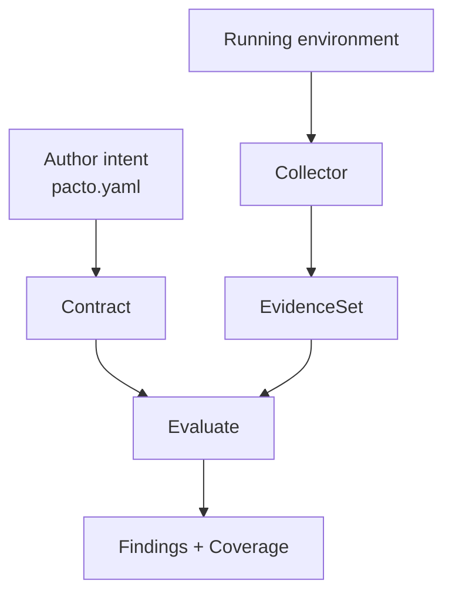
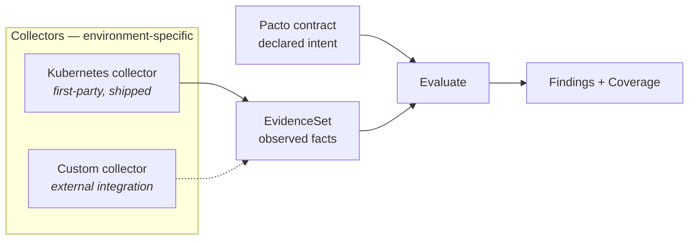

# The Pacto model

How Pacto reaches an answer: what a contract declares, what a collector observes
and what the engine concludes from the two. One rule governs the whole model:
**a confirmed contradiction is an error; an inability to observe is `Unknown`,
not a contradiction**. Most of what follows is the machinery that keeps those two
apart.

## Declaration versus observation

The contract is stable author *intent*: what a service is operationally,
independent of any orchestrator. What it looks like at runtime is an
*observation*, and it lives entirely outside the contract. The `Contract` type
(`pkg/contract`) carries only intent — no `runtime` block, no port, no scaling
and no image field, because those are delivery concerns owned by integrations.
Runtime facts travel in a separate `EvidenceSet` (`pkg/evidence`), produced by a
collector, and the engine reasons over the two together.



## The engine: `Evaluate(contract, evidence)` { #the-engine }

The heart of the system is a pure function (`pkg/validation/evaluate.go`):

```text
Evaluate(contract.Contract, evidence.EvidenceSet) -> ([]finding.Finding, Coverage)
```

It is stateless: it reads a collector-stamped `Outcome` on each observation and
applies no temporal, network or Kubernetes logic. For each required assertion —
an interface's availability, a capability, a dependency, a configuration, the
workload, persistence — it looks for a matching observation and produces exactly
one of three results:

| Result | When | Finding |
|---|---|---|
| **Confirmed violation** | A matching observation has `Outcome=Observed` and its payload contradicts the contract. | `error`, category `RuntimeDrift` — e.g. `CONFIGURATION_ABSENT`, `CONFIGURATION_MISMATCH`, `INTERFACE_ABSENT`, `DEPENDENCY_UNREACHABLE`. |
| **Uncertainty** | No usable observation exists — missing, `Unsupported`, `Failed`, `Stale` or `Insufficient`. | `unknown`, category `Inconclusive` — e.g. `EVIDENCE_MISSING`, `COLLECTION_FAILED`. |
| **Satisfied** | A matching `Observed` observation is consistent with the contract. | None. |

A required assertion Pacto cannot observe is never silently treated as a pass.
`Coverage` reports how many required assertions were evaluated versus declared.
It never changes the aggregate compliance state, because an inability to observe
is not a violation.

## Compliance model { #compliance-model }

The compliance model consumers derive from these findings has four substantive
states — **Compliant**, **NonCompliant**, **Unknown** and **Invalid** — plus three
informational ones:

| State | Meaning |
|---|---|
| **Warning** | A non-blocking finding. |
| **Reference** | The contract declares no workload, so there is nothing to run and nothing to observe. |
| **NotEvaluated** | The contract declares a workload but was never runtime-evaluated *at all* — what an offline OCI, cache or local source looks like. This is what `pacto doc`, `pacto fleet` and the dashboard report for a bundle read off disk or out of a registry. |

A workload that *is* being evaluated but has no usable evidence yet resolves to
`Unknown`, not `NotEvaluated`. The two answer different questions: "we looked and
could not tell" versus "nothing has looked". The Kubernetes operator only ever
reports the former — it never emits `NotEvaluated`, though the value is in the
CRD enum for parity with the engine (see [Kubernetes
limitations](integrations/kubernetes/limitations.md#notevaluated-is-reserved)).

## Collectors and the evidence boundary

A *collector* is any component that observes a real system and produces a valid
`EvidenceSet`. That `EvidenceSet` is the stable extension boundary, not a
collector interface: a collector is not a plugin and cannot be installed as one.
The two extend Pacto in opposite directions — a plugin consumes a contract to
generate an artifact, a collector observes a system to produce evidence. The
Kubernetes collector (`integrations/kubernetes`) is the first shipped one, and
the "custom collector" box below is a design extension point.



In-process, a custom Go collector builds an `EvidenceSet` (`pkg/evidence`) and
calls `Evaluate` (`pkg/validation`) directly. This is the compiled, run
`ExampleEvaluate` in `pkg/validation/collector_example_test.go`:

```go
// 1. The contract declares intent (loaded from a bundle in real use).
c := contract.Contract{
    Service:    contract.Service{Name: "orders", Version: "1.0.0"},
    Interfaces: []contract.Interface{{Name: "public-api", Type: "openapi", Ref: "interfaces/openapi.yaml"}},
}

// 2. A collector observes the environment and produces an EvidenceSet.
prov := evidence.Provenance{Collector: "example", DetectedAt: time.Unix(0, 0)}
ev := evidence.EvidenceSet{
    Subject:     evidence.SubjectRef{Kind: "service", Name: "orders"},
    ContractRef: "oci://example/orders:1.0.0",
    Source:      "example",
    ObservedAt:  time.Unix(0, 0),
    Observations: []evidence.Observation{
        evidence.NewInterfaceObserved(evidence.SubjectRef{Kind: "interface", Name: "public-api"}, "openapi", true, prov),
    },
}

// 3. The pure engine evaluates Contract x Evidence.
findings, coverage := validation.Evaluate(c, ev)
```

Across a trust boundary a remote environment reports a signed `EvidenceSet` over
the [evidence protocol](evidence.md) instead.

## Distinctions the model never collapses

Collapsing any of these produces an answer that is confidently wrong rather than
honestly uncertain.

- **A requested reference is not a resolved identity.** `payments-api:latest` is
  a question; `payments-api@sha256:…` is an answer. A tag is mutable, so resolve
  the reference before treating it as exact content.
- **The same name in two domains is two services.** Identity is
  domain-qualified, so two organizations that both run a `payments-api` do not
  merge. A repository basename or a path leaf is a label, never an identity.
- **An exact revision match is not retrievable content.** A target can pin a
  digest that names a revision unambiguously while that content sits in a
  registry Pacto cannot read. Anything needing the content says so when it is
  missing; anything needing only the identity does not.
- **Declared ownership is not a canonical owner identity.** An owner identity
  carries both its kind and its value, so a team and a person who share a string
  never merge. An email address is how you reach an owner, not who they are.
- **Readiness is not compliance.** Readiness is a team's own scored
  self-assessment of a revision. Compliance is evidence-derived. A revision that
  passes every readiness check can run on a target that is non-compliant.
- **Absence of evidence is not evidence of absence.** An observation is recorded
  as observed, unsupported, failed, stale or insufficient. "We could not look"
  has no way to be stored as "we looked and it was missing".

## What Pacto is not

- **Not a developer portal or an internal developer platform (IDP).** There is
  nothing to onboard into, no scaffolding templates and no golden paths. A portal
  decides what people see; Pacto records what a revision guarantees.
- **Not a service catalog, and no replacement for one.** A catalog lists
  services for people to browse. Pacto records what a revision guarantees so
  tools can compute against it.
- **Not a registry.** It publishes to the OCI registries you already run.
- **Not a universal model of every infrastructure resource.** It models one
  service's operational intent, not your databases, queues and networks.
- **It grants no permission.** Pacto validates a contract against policy
  schemas. Whether an action is *permitted* stays with the runtime controls you
  already run — OPA, Kyverno, admission, IAM.
- **It does not observe or act.** The engine only reasons over `Contract` and
  `EvidenceSet`. Observing is a collector's job; acting is an external actor's.
- **Discovery is not authorization.** Being able to find and read a contract
  grants no permission to change anything and performs no action.

## The operational control loop

These roles compose into a loop a platform or an agent can drive. Steps 1, 2, 5
and 6 are implemented here — the CLI, the dashboard, the collector and
`Evaluate`. Steps 3 and 4 belong to systems you already run.

1. **Declare.** A contract states the service's identity, interfaces, capabilities, configuration, dependencies and policies.
2. **Read.** A platform, a controller or an agent inspects the contract (`pacto explain`, the dashboard API or generated tools over MCP).
3. **Constrain.** *(External.)* Policies, permissions, admission and IAM decide which actions are allowed.
4. **Act.** *(External.)* Controllers, deploy systems, plugins or agents act through existing infrastructure.
5. **Observe.** Collectors obtain runtime evidence from the real system and produce an `EvidenceSet`.
6. **Evaluate.** `Evaluate(contract, evidence)` reports whether observed reality is consistent with the declared contract.

## See also

- [The Pacto Operational Graph](operational-graph.md) — the read model over many
  such evaluations, and the vocabulary for how much of the world an answer saw
- [Validation layers](contract-reference/validation.md) — whether a contract is *valid*, a separate question from whether it *matches reality*
- [Evidence protocol](evidence.md) — reporting a signed `EvidenceSet` across a trust boundary
- [Impact analysis](impact.md) — the confidence model over a change
