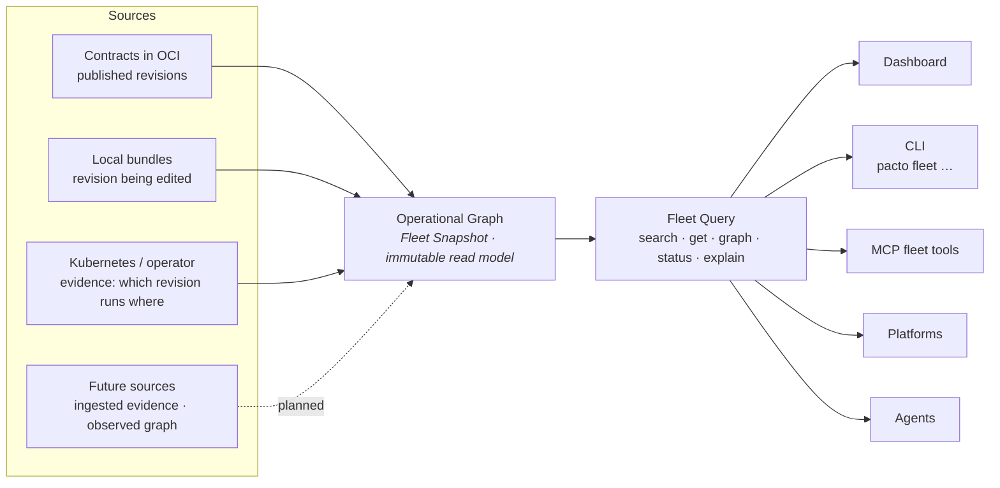
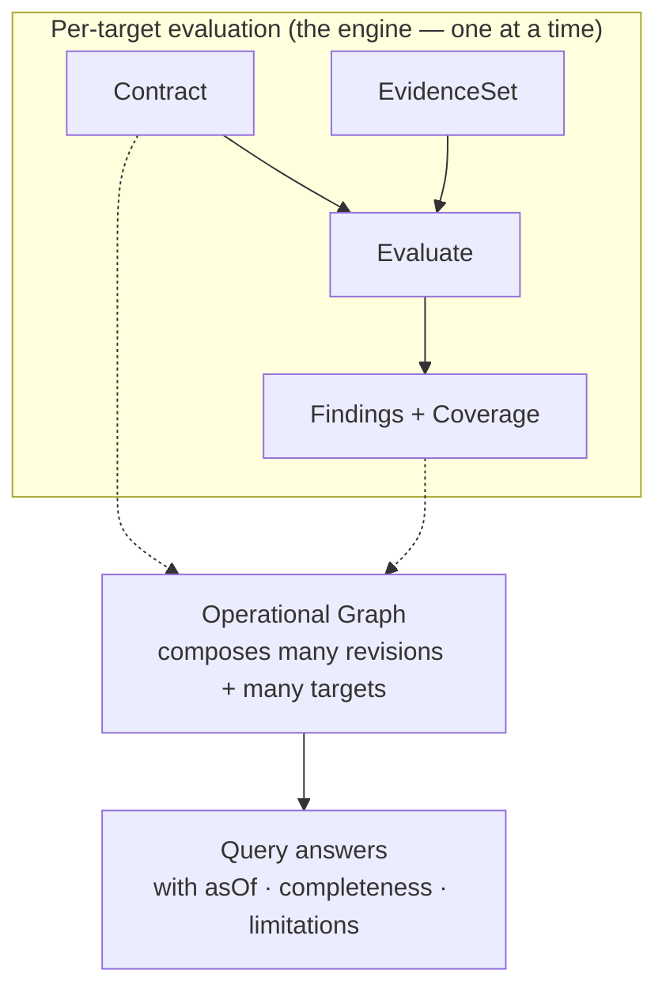

# The Pacto Operational Graph

A single contract tells you what one service is. Most questions worth asking span
many: *what depends on payments-api, which revision is running in `production-eu`,
is any of it non-compliant, and how sure are we?* The **Pacto Operational Graph**
answers those questions. It composes many independent contracts, contract
revisions and operational targets into one versioned, navigable, verifiable read
model that humans, CLIs, platforms and agents can reason over.

It is framework-independent (`pkg/fleet`), pure and read-only. It observes no
environment and evaluates nothing on its own — it is a query model built *around*
the sources and evaluations Pacto already produces. Internally the immutable read
model is a **Fleet Snapshot** and the pure query layer over it is a **Fleet
Query**; the sections below use those terms wherever precision matters.

---

## Three identities, never flattened

The graph models three distinct things and never collapses them into one. This is
the single most important idea on this page: a name, a revision and a running
instance are different questions with different answers.

| Identity | What it is | Example |
|----------|-----------|---------|
| **Logical service** | A stable name and owner. It has revisions and runs in targets, but it is neither. | `payments-api` (owner: payments) |
| **Contract revision** | An immutable resolved revision — what it declares and how it differs from another revision. Identity prefers the digest, then the resolved ref, then the version; a mutable tag alone is never a revision identity. | `payments-api@sha256:…` |
| **Operational target** | A concrete place a revision runs, generic as `scope/kind/name`. | `production-eu/customer-a → kubernetes-workload payments/payments-api` |

A logical service is not its latest revision. A revision is not the thing running
in a cluster. A target is not the service. Keeping them separate is what lets the
graph answer "which *revision* runs *where*, and is *that instance* compliant"
without guessing.

---

## Relationships: declared, observed, inferred

Edges in the graph carry a **provenance** discriminator so a fact's origin is
never ambiguous:

- **declared** — the relationship comes from a contract (`dependencies[]`, and
  config/policy `ref`s). This is the only provenance produced today.
- **observed** — a relationship seen in running traffic (see [the future OTel
  graph](#a-future-observed-graph-otel) below). Reserved, not yet produced.
- **inferred** — a relationship deduced heuristically. Reserved, not yet produced.

The discriminator exists now so a future observed or inferred graph can be added
without ever conflating "what a team declared" with "what a tracer saw". Today
every edge is `declared`, and the graph says so.

---

## Sources

The graph is assembled from **sources** — a framework-neutral ingestion seam. Each
source observes what it can right now and contributes revisions and targets:

- **Contracts in OCI** — the published revision catalogue.
- **Local bundles** — the revision a developer is editing, before it is pushed.
- **Kubernetes / operator evidence** — which revision runs in which target and its
  compliance, from the runtime the operator hosts.
- **Future sources** — a remote environment's [ingested evidence](#future-external-evidence-ingestion),
  an [observed graph](#a-future-observed-graph-otel), or any other component that
  implements the source seam.

No source leaks its transport into the graph. A Kubernetes-backed source, an
OCI-backed source, a local source and the dashboard adapter each implement the
same small interface, so the read model stays free of Kubernetes, MCP and
dashboard code.

---

## Freshness and completeness

Incompleteness is always explicit. A source reports its state; a snapshot and
every query answer carry an **as-of** time, a **completeness** and a list of
**limitations**. Two rules are absolute:

> **An unavailable source is never an empty result.** If a registry is unreachable
> or a cluster is disconnected, its records are *missing*, and the answer says so —
> it is never rendered as "nothing is there".

> **Absence of telemetry is not evidence of absence.** A missing observation under
> partial coverage is uncertainty, not a confirmed "no".

Every source reports one status, and the snapshot rolls those up into one
completeness value:

| Term | Where it applies | Meaning |
|------|------------------|---------|
| **available** | source | Reachable and current. |
| **partial** | source and snapshot | The source returned some but not all of its records, or at least one source is degraded. Treat the answer as incomplete knowledge. |
| **stale** | source | The most recent data is older than the freshness window. |
| **unavailable** | source | The source could not be observed at all; its records are absent, not empty. |
| **complete** | snapshot | Every source was available and current. |
| **empty** | snapshot | Every source was available and produced no record. A genuine empty, not a hidden failure. |

The dashboard uses a matching per-section vocabulary — `present`, `empty`,
`not_applicable`, `unavailable` — for the same reason: a blank must always explain
*why* it is blank. When a source fails, its error is sanitized to a category code
(`AUTH_FAILED`, `NOT_FOUND`, `UNAVAILABLE`, `CANCELLED`) and a generic message, so
credentials, tokens and host names never leak to a consumer.

---

## Query semantics

The read model is queried through five pure operations. None performs I/O; a
single snapshot serves concurrent queries. **Every answer carries a `meta`
envelope with `asOf`, `completeness` and `limitations`** — a consumer can always
tell how much of the system the answer actually covers.

| Query | Answers |
|-------|---------|
| **search** | Which logical services match this filter (owner, label, status, compliance, capability, dependency, readiness). Bounded and deterministically ordered. |
| **get** | Everything about one service (its revisions, targets, declared dependencies, dependents, tools and skills) or one target. |
| **graph** | Traverse dependencies or dependents from a service — direct or transitive, cycle-safe, with unresolved edges surfaced. |
| **status** | What needs attention: non-compliant or unknown targets, invalid contracts, stale evidence, missing readiness, unresolved dependencies. |
| **explain** | Deterministic, structured reasons for a subject's state. Pacto embeds no model — it hands an agent structured reasons to turn into prose. |

A `not found` under `partial` completeness is not proof the thing does not exist —
the answer's `meta.completeness` tells the caller whether absence is trustworthy.
Errors are typed: a missing identity is a not-found, an ambiguous one lists its
matches.

```json
{
  "meta": {
    "asOf": "2026-07-29T10:00:00Z",
    "completeness": "partial",
    "limitations": [
      { "code": "SOURCE_UNAVAILABLE", "source": "oci",
        "message": "source oci is unavailable; its records are missing from this snapshot" }
    ]
  },
  "total": 1,
  "services": [
    { "name": "payments-api", "owner": "payments", "status": "Compliant" }
  ]
}
```

---

## Who consumes it

The read model is one thing with several front doors. A human portal and an agent
consume the *same* graph.



- **Dashboard** — the visual front door. It merges local, OCI and Kubernetes
  sources into one fleet view and navigates services, revisions, targets and the
  graph.
- **CLI (`pacto fleet …`)** — the same five queries on the command line:
  `pacto fleet search`, `pacto fleet get`, `pacto fleet graph`, `pacto fleet
  status`, `pacto fleet explain`. Scriptable, deterministic output.
- **MCP fleet tools** — `pacto_fleet_search`, `pacto_fleet_get`,
  `pacto_fleet_graph`, `pacto_fleet_status` and `pacto_fleet_explain` give an
  agent read-only understanding of the operational system. They are one of three
  MCP tool families — see [MCP integration](mcp-integration.md#three-tool-families-and-their-boundaries)
  for how they differ from authoring tools and generated service tools.

---

## A read model around many evaluations, not a new evaluator

The operational graph does not replace the engine. Compliance is still the pure
`Evaluate(Contract, EvidenceSet)` function producing findings for one service in
one environment (see [Collectors and the evidence boundary](collectors.md)). The
graph is the read/query model *around* many such evaluations — it references each
target's findings and coverage rather than re-computing them.



Read the two diagrams together: the first shows *where* the data comes from, the
second shows *what the graph is made of*. The graph indexes and navigates the
outputs of many evaluations; it never becomes a second, parallel evaluator.

---

## Impact analysis, built on this substrate

The graph maintains a reverse-dependency index: for any service, which services
declare a required dependency on it. **[Impact analysis](impact.md)** builds
directly on that index. `pacto impact <old> <new>` composes a semantic contract
diff with this graph to answer "if this revision ships, what is the transitive
blast radius" — direct and transitive affected consumers, active targets, owners,
a compatibility verdict and a per-consumer confidence grade. No new data, a new
question over the same graph the dashboard and CLI already query. It is shipped
today and exposed on the CLI, as the `pacto_impact` MCP tool and at the
dashboard's `/api/fleet/impact` endpoint. See [Impact analysis](impact.md) for
the full model.

---

## Where this is heading

Two further capabilities build directly on the substrate the graph already
maintains. Neither changes the model above — each consumes it.

### Future external evidence ingestion

Today runtime evidence comes from a cluster the operator watches. The source seam
is deliberately environment-neutral so a **remote environment** can participate
without Pacto reaching into it: the remote side produces a signed, versioned
`EvidenceSet`, a platform ingests it, and the graph exposes the resulting targets
with honest freshness — `stale` when the evidence ages past the window,
`partial` when a remote environment did not report. The invariants hold across the
boundary: an environment that goes quiet becomes `unavailable`, never a silent
empty.

### A future observed graph (OTel)

Every relationship already carries a `provenance` discriminator, and only
`declared` is produced today. A future **observed** graph — for example
dependencies seen in OpenTelemetry traces — slots in as `observed` edges
alongside the declared ones, never overwriting them. "What a team declared" and
"what a tracer saw" stay distinguishable, and a consumer can ask for either or
compare them.

---

## Why the fleet is not a new contract kind

There is **no `kind: Fleet`** and **no `fleet:` section** in a contract. The graph
is *discovered* from the sources you already have — published contracts, local
bundles and runtime evidence — not declared in a new document a team would have to
author and keep in sync. Adding a fleet manifest would recreate the exact problem
Pacto exists to remove: a hand-maintained aggregate that drifts from reality the
moment a service is added or a revision ships. The fleet is a *view*, computed on
demand, versioned by its as-of time — not a thing anyone writes down.

---

## Why Pacto does not act or authorize

The operational graph makes the system knowable. It does not run it. Pacto's verbs
are bounded and deliberate: it **declares** intent, **resolves** references,
**diffs** changes, **graphs** relationships, **evaluates** evidence and
**explains** state. That is the whole list.

- **It does not act.** Deploying, scaling, provisioning and remediating are done by
  external controllers and delivery systems. The graph tells them what is true; it
  performs no action itself.
- **It does not authorize.** Whether a human or an agent *may* do something stays
  with policy and IAM systems (OPA, Kyverno, admission control, your identity
  provider). The graph never grants, scopes or revokes a permission.

This is why the fleet query tools are read-only and why a `partial` answer is
labelled as incomplete knowledge rather than a decision. Pacto supplies the
verifiable operational meaning that controllers act on and that authorization
systems reason about — it is not either of them.

---

## See also

- [MCP integration](mcp-integration.md) — the three MCP tool families, including
  the read-only fleet query tools
- [Collectors and the evidence boundary](collectors.md) — how per-target evidence
  and evaluation work
- [Architecture](architecture.md) — the engine, the layers and the declaration
  vs observation split
