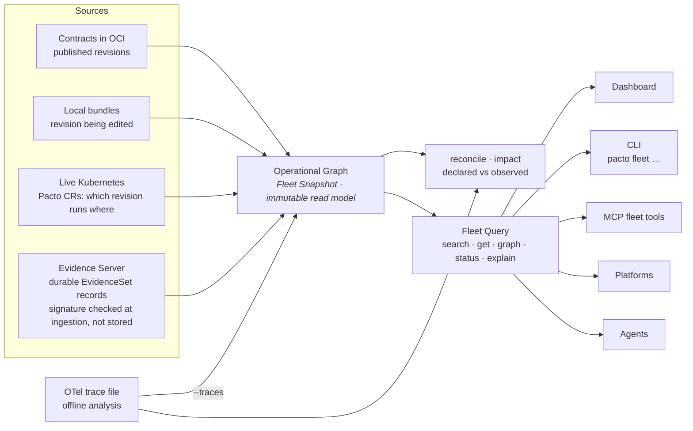
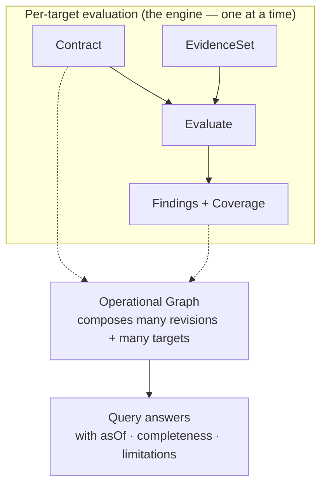

# The Pacto Operational Graph

A single contract tells you what one service is. Most questions worth asking span
many: *what depends on payments-api, which revision is running in `production-eu`,
is any of it non-compliant, and how sure are we?* The **Pacto Operational Graph**
composes many contracts, revisions and operational targets into one versioned,
verifiable read model that humans, CLIs, platforms and agents can query.

It is framework-independent (`pkg/fleet`), pure and read-only: it observes no
environment and evaluates nothing itself. Internally the immutable read model is a
**Fleet Snapshot** and the pure query layer over it a **Fleet Query**.

---

## Three identities, never flattened

The graph models three distinct things and never collapses them into one: a name,
a revision and a running instance are different questions with different answers.

| Identity | What it is | Example |
|----------|-----------|---------|
| **Logical service** | A stable name and owner. It has revisions and runs in targets, but it is neither. | `payments-api` (owner: payments) |
| **Contract revision** | An immutable resolved revision — what it declares and how it differs from another revision. Identity is the service plus a content digest: the source's immutable digest, or one derived from the whole bundle when the source has none. Never a ref, never a version; a revision that can be neither pinned nor hashed is omitted rather than given a weaker identity. | `payments-api@sha256:…` |
| **Operational target** | A concrete place a revision runs, generic as `scope/kind/name`. | `production-eu/customer-a → kubernetes-workload payments/payments-api` |

### How certainly a target is matched to a revision

Knowing a target exists is not the same as knowing which revision it runs, so
every target records **how** the link was made. Four outcomes:

| Match | What Pacto knows |
|-------|------------------|
| `exact` | The target's content digest matches a revision's. Authoritative: this is the revision running there. |
| `inferred` | A *unique* correlation by mutable tag or version suffix. Probably right, not proof. |
| `ambiguous` | Several revisions match that mutable reference. **No link is made** — a guess is never presented as fact — and the target carries a `REVISION_LINK_AMBIGUOUS` limitation. |
| `unresolved` | Nothing matched, or the target's identity contradicts itself (a recorded digest that disagrees with its digest-pinned reference). No link, and a limitation on the target saying so. |

The bottom two are not a failure to report: they sit on the target itself, so a
consumer can classify a link without parsing snapshot-level messages. The two read
surfaces spell this differently, and the CLI's spelling has a trap:

- **Snapshot and `pacto fleet get --target` JSON** carry `revisionMatch`, which
  is `omitempty` and only ever `exact` or `inferred`. **An absent
  `revisionMatch` is the finding** — it means ambiguous or unresolved. Read the
  target's `limitations` to learn which.
- **The entity-detail API** (`GET /api/fleet/entities/target?key=…`, what the
  dashboard reads) carries `linkState`, always present, with all four values
  spelled out.

This axis is not content retrievability: an `exact` match can name content in a
registry Pacto cannot read ([match certainty is not content
retrievability](concepts.md#identity)). Its `inferred` is also a different word
from the `inferred` relationship provenance below — one is how a *target* was
matched to a revision, the other how an *edge* was derived.

---

## Relationships: declared, observed, inferred

Edges in the graph carry a **provenance** discriminator so a fact's origin is
never ambiguous:

- **declared** — the relationship comes from a contract (`dependencies[]`, and
  config/policy `ref`s).
- **observed** — a relationship seen in running traffic. Observed dependencies
  are produced by the [OTel observer](#observed-dependencies-and-reconciliation)
  and, when an observation source is configured, folded into the snapshot's edges
  as `observed`-provenance relationships (kept in a separate adjacency index from
  the declared graph). Reconciliation and impact consume them; because every edge
  keeps its provenance, an observed edge is never mistaken for a declared one.
- **inferred** — a relationship deduced heuristically. Reserved, not yet produced.
- **declared+observed** — one edge backed by *both* a declaration and an
  observation. The neighborhood projection merges the two adjacency indexes for
  display and emits this combined value, so a consumer branching on provenance
  must handle all four.

---

## Who consumes it

A human portal and an agent consume the *same* graph.



- **Dashboard** — the visual front door. It builds one snapshot from every
  source it detects — local bundles, OCI, the disk cache and the live cluster —
  and serves the operational graph and change analysis through `/api/fleet/*`.
  The Operational Graph view offers three **perspectives** — **Services**
  (logical), **Revisions** (content-addressed) and **Operational targets** (the
  places a revision runs) — and a **Knowledge** control (Expected · Observed ·
  Differences). The Operational targets perspective is honest about what it can
  know: an operational target links to the dependency **service** it depends on,
  never to each peer target — a full target-to-target mesh would assert runtime
  routing the snapshot never observed, so it is never drawn. Its overview and its
  list pages draw every figure from the [aggregate](fleet-queries.md#aggregates-what-a-bounded-list-can-still-tell-you-about-the-whole),
  so a figure and the rows
  beneath it always describe the same population: narrowing the filter narrows
  both, and a bucket of a figure is a link to the rows it counted. The **data
  sources** everything above was built from are a product surface of their own
  rather than a diagnostic panel: the overview carries them as a section with the
  fleet-wide health tally, and each source has a page saying what it is, whether
  it is healthy, when it last synced, how many records it sent and which product
  entities are attributable to it.
- **CLI (`pacto fleet …`)** — the five queries on the command line:
  `pacto fleet search`, `pacto fleet get`, `pacto fleet graph`, `pacto fleet
  status`, `pacto fleet explain`, plus `pacto fleet reconcile` (declared vs
  observed) and `pacto fleet snapshot` (the whole read model as one document).
  Scriptable, deterministic output.
- **MCP fleet tools** — `pacto_fleet_search`, `pacto_fleet_get`,
  `pacto_fleet_graph`, `pacto_fleet_status` and `pacto_fleet_explain` give an
  agent read-only understanding of the operational system, and
  [`pacto_impact`](impact-surfaces.md#mcp-tool-pacto_impact) is the sixth tool of the same
  family — the one that re-reads its sources on every call. They are one of three
  MCP tool families — see [MCP integration](mcp-integration.md#three-tool-families-and-their-boundaries)
  for how they differ from authoring tools and generated service tools.

---

## A read model around many evaluations, not a new evaluator

Compliance is still the pure `Evaluate(Contract, EvidenceSet)` function
producing findings for one service in one environment (see [Collectors and the
evidence boundary](collectors.md)). The graph is the read/query model *around*
many such evaluations — it references each target's findings and coverage rather
than re-computing them.



---

## Impact analysis, built on this substrate

The graph maintains a reverse-dependency index: for any service, which services
declare a required dependency on it. **[Impact analysis](impact.md)** builds on
it. `pacto impact <old> <new>` composes a semantic contract diff with the graph to
answer "if this revision ships, what is the transitive blast radius" — affected
consumers direct and transitive, active targets, owners, a compatibility verdict
and a per-consumer confidence grade. It ships on the CLI, as an MCP tool and,
under the name **Change analysis**, in the dashboard.

---

## External evidence ingestion

The source seam is environment-neutral, so a **remote or disconnected
environment** can participate without Pacto reaching into it: the remote side
reports its signed, versioned `EvidenceSet` outbound to an ingestion endpoint.
Freshness rules hold across the boundary — a target goes `stale` when its evidence
ages past the window and its source `unavailable` when it stops reporting, never
deleted. This is the [external evidence protocol](evidence-protocol.md); for keys
and CLI usage see [evidence security and tooling](evidence-security.md).

Ingested evidence is backed by the **Evidence Server**, a stateless boundary in
front of your contract registry. Every accepted envelope is published as an OCI
1.1 referrer of the exact contract revision it reports on before it becomes a
target, so replay protection and latest-target state survive a restart with no
local state at all — see [evidence in the
registry](evidence-oci-storage.md). It is an optional operator-managed component
of the `pacto-operator` Helm chart (`evidence.enabled=true`) and runs the same way
outside Kubernetes via `pacto evidence serve`; there is no standalone evidence
chart. With both it and the dashboard enabled, the operator wires them over HTTP
and the dashboard never holds a registry credential. The [deployment
topology](evidence-protocol.md#deployment) splits the responsibility: the Evidence
Server owns ingestion, verification, evaluation and publication, the operator the
Kubernetes lifecycle.

---

## Observed dependencies and reconciliation

Declared intent is half the picture; the other half is what traffic actually does.
The **OTel observer** (`pacto otel observe <traces.json>`) is an offline analyzer:
it reads an exported OTLP/JSON trace file and derives the caller-to-callee
reachability edges its outbound spans prove. It is not a receiver or a live
collector — no OTLP endpoint, nothing deployed — and it never asserts a dependency
is absent.

Those observed edges meet the declared graph in three places:

- **The snapshot itself** — `pacto fleet --traces <file>` adds an *observation
  source*, and [building the snapshot](fleet-sources.md#sources) resolves each raw observed
  endpoint name to a
  **unique domain-qualified service** and folds resolved edges into the snapshot
  as `observed` relationships. `pacto dashboard --traces` folds the same edges
  into the dashboard's snapshot, so runtime evidence is no longer confined to a
  one-off report. `pacto mcp --fleet` has no `--traces` flag: its snapshot is
  declared-only, and `pacto_impact` is the one MCP tool that reads a trace file,
  per call. An endpoint name that matches zero or more than one service (the same name in
  two domains) is **never** coerced to a domain; it is preserved as an
  `OBSERVED_IDENTITY_UNRESOLVED` limitation, so observed traffic can never be
  misattributed across domains.
- **Reconciliation** — `pacto fleet reconcile --traces <file>` compares what the
  fleet's contracts declare against what traffic proves, labelling each
  dependency **matched**, **declared-not-observed** (dormant or simply unseen in
  the window) or **observed-not-declared** (a *shadow* dependency the contract
  never mentions). The caller must resolve to a unique service; the callee is
  resolved within the caller's domain (mirroring declared-dependency resolution),
  and anything unresolvable is reported in a distinct **unresolved** category
  rather than force-fit to the default domain.
- **Impact** — `pacto impact --traces <file>` (or any snapshot that already
  carries observed edges) lets observed traffic raise a declared consumer to
  **corroborated** confidence and surface **observed-only (shadow) consumers** a
  declared-only analysis would miss. A shadow consumer must itself be a registered
  fleet service; an unknown caller name is preserved as an unresolved limitation,
  never a phantom default-domain consumer.

### Emitting observed dependencies as evidence

The OTel observer can also emit signable EvidenceSets
(`pacto otel observe --evidence`), so observed dependencies can travel the same
[external evidence protocol](evidence-protocol.md) as any other report. That is
two steps rather than a pipe, because traces name services and not contract
revisions:

```bash
# One EvidenceSet per calling service, as a JSON array
$ pacto otel observe traces.json --evidence --output-format json > sets.json
```

Each set comes out with an empty `ContractRef` — a trace cannot know which
revision was running. Split the array into one file per set:

```bash
$ for i in $(seq 0 $(( $(jq length sets.json) - 1 ))); do
    jq ".[$i]" sets.json > "set-$i.json"
  done
```

Then edit each file's `ContractRef` to the revision that service was serving —
this is the step only you can do — and sign one set at a time:

```bash
$ pacto evidence sign set-0.json \
    --key k.key --key-id k --producer prod > envelope-0.json
$ pacto evidence send envelope-0.json \
    --url https://evidence.example.com/api/evidence/v1/envelopes
```

`pacto evidence sign` reads a file and one `EvidenceSet` at a time: hand it the
array and it answers
`decode evidence set: json: cannot unmarshal array into Go value of type evidence.EvidenceSet`,
and hand it a set with no `ContractRef` and it answers
`invalid evidence set: contract ref is empty`. Both are the tool asking for the
one thing the traces could not supply.

### Reconciliation in the dashboard

In the dashboard's Operational Graph the declared/observed split is the
**Knowledge** control: **Expected** (contract-declared intent), **Observed**
(backed by runtime observation) and **Differences** (where the two diverge). A
snapshot with no observation data says so — the edges come back `insufficient` and
the knowledge banner states what is missing — rather than drawing an empty
Observed view that would read as "there is no traffic".

Reconciliation is an **explicit backend fact**, not a frontend guess. Every
declared dependency edge carries a `reconciliation` state computed against the
snapshot's observed edges: **matched** (an observed edge corroborates it),
**declared-not-observed** (observation data exists but did not witness this edge)
or **insufficient** (no observation data at all). The dashboard's *reconciled*
layer shows only `matched` edges and never infers reconciliation from name
resolution or from whether a provider is deployed. Feeding observation data to the
normal dashboard means configuring [observation
sources](observation-sources.md); the observed capability the UI advertises is
derived from the published snapshot, never a hardcoded flag.

---

## Why the fleet is not a new contract kind

There is **no `kind: Fleet`** and **no `fleet:` section** in a contract. The graph
is *discovered* from the sources you already have — published contracts, local
bundles and runtime evidence. Adding a fleet manifest would recreate the exact problem
Pacto exists to remove: a hand-maintained aggregate that drifts from reality the
moment a service is added or a revision ships. The fleet is a *view*, computed on
demand, versioned by its as-of time — not a thing anyone writes down.

---

## Why Pacto does not act or authorize

The operational graph makes the system knowable. It does not run it. Pacto's verbs
are bounded and deliberate: it **declares** intent, **resolves** references,
**diffs** changes, **graphs** relationships, **evaluates** evidence and
**explains** state. That is the whole list.

- **It does not act.** Deploying, scaling, provisioning and remediating are done by
  external controllers and delivery systems. The graph tells them what is true; it
  performs no action itself.
- **It does not authorize.** Whether a human or an agent *may* do something stays
  with policy and IAM systems (OPA, Kyverno, admission control, your identity
  provider). The graph never grants, scopes or revokes a permission.

Pacto supplies the verifiable operational meaning that controllers act on and that authorization
systems reason about — it is not either of them.

---

## See also

- [Fleet sources and freshness](fleet-sources.md) — where the graph gets its
  facts, and how it reports the parts it could not see
- [Fleet query semantics](fleet-queries.md) — the five queries, their `meta`
  envelope and the aggregates over a bounded answer
- [Concepts](concepts.md) — the index of distinctions this page's model rests on,
  each one stated in a sentence
- [MCP integration](mcp-integration.md) — the three MCP tool families, including
  the read-only fleet query tools
- [Collectors and the evidence boundary](collectors.md) — how per-target evidence
  and evaluation work
- [Observation sources](observation-sources.md) — configuring the offline trace
  exports the observed layer reads
- [The Pacto model](model.md) — the engine and the declaration vs observation
  split
- [Dashboard architecture](dashboard-architecture.md) — the source model behind
  the contract-exploration substrate
