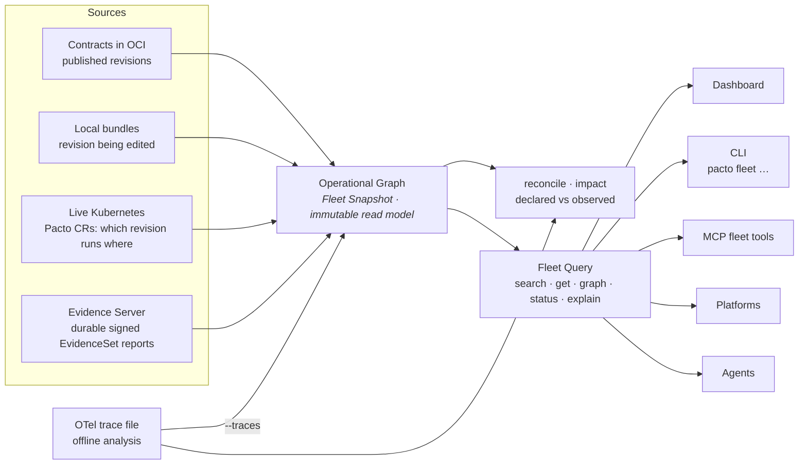
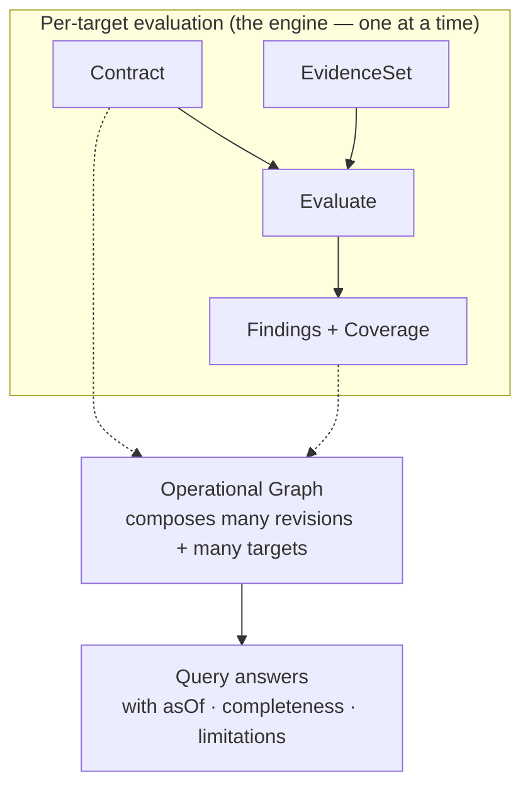

# The Pacto Operational Graph

A single contract tells you what one service is. Most questions worth asking span
many: *what depends on payments-api, which revision is running in `production-eu`,
is any of it non-compliant, and how sure are we?* The **Pacto Operational Graph**
answers those questions. It composes many independent contracts, contract
revisions and operational targets into one versioned, navigable, verifiable read
model that humans, CLIs, platforms and agents can reason over.

It is framework-independent (`pkg/fleet`), pure and read-only. It observes no
environment and evaluates nothing on its own — it is a query model built *around*
the sources and evaluations Pacto already produces. Internally the immutable read
model is a **Fleet Snapshot** and the pure query layer over it is a **Fleet
Query**; the sections below use those terms wherever precision matters.

---

## Three identities, never flattened

The graph models three distinct things and never collapses them into one. This is
the single most important idea on this page: a name, a revision and a running
instance are different questions with different answers.

| Identity | What it is | Example |
|----------|-----------|---------|
| **Logical service** | A stable name and owner. It has revisions and runs in targets, but it is neither. | `payments-api` (owner: payments) |
| **Contract revision** | An immutable resolved revision — what it declares and how it differs from another revision. Identity is the service plus a content digest: the source's immutable digest, or one derived from the whole bundle when the source has none. Never a ref, never a version; a revision that can be neither pinned nor hashed is omitted rather than given a weaker identity. | `payments-api@sha256:…` |
| **Operational target** | A concrete place a revision runs, generic as `scope/kind/name`. | `production-eu/customer-a → kubernetes-workload payments/payments-api` |

A logical service is not its latest revision. A revision is not the thing running
in a cluster. A target is not the service. Keeping them separate is what lets the
graph answer "which *revision* runs *where*, and is *that instance* compliant"
without guessing.

---

## Relationships: declared, observed, inferred

Edges in the graph carry a **provenance** discriminator so a fact's origin is
never ambiguous:

- **declared** — the relationship comes from a contract (`dependencies[]`, and
  config/policy `ref`s).
- **observed** — a relationship seen in running traffic. Observed dependencies
  are produced by the [OTel observer](#observed-dependencies-and-reconciliation)
  and, when an observation source is configured, folded into the snapshot's edges
  as `observed`-provenance relationships (kept in a separate adjacency index from
  the declared graph). Reconciliation and impact consume them; because every edge
  keeps its provenance, an observed edge is never mistaken for a declared one.
- **inferred** — a relationship deduced heuristically. Reserved, not yet produced.

The discriminator keeps "what a team declared" and "what a tracer saw" separable
wherever they meet, so an observed or inferred edge can never be mistaken for a
declared one.

---

## Sources

The graph is assembled from **sources** — a framework-neutral ingestion seam. Each
source observes what it can right now and contributes revisions and targets.
(The dashboard lists these as **Data sources**. They are not the same thing as an
evidence [collector](collectors.md), which produces compliance evidence *for* a
source to carry.)

- **Local bundles** (`--local`) — the revision a developer is editing, before it
  is pushed.
- **Contracts in OCI** (`--oci <ref>`) — the published revision catalogue,
  resolved cache-first so a pulled ref works offline.
- **Local OCI cache** (`--cache`) — every bundle already pulled to disk, as an
  offline baseline.
- **Live Kubernetes** (`--k8s [--namespace]`) — Pacto CRs read straight from a
  running cluster: which revision runs in which target and its operator-computed
  compliance, findings, coverage and observed runtime.
- **Ingested external evidence** (`--evidence-url <url>`) — a remote
  environment's signed, versioned [EvidenceSet report](evidence-protocol.md),
  verified and evaluated at ingestion by the
  [Evidence Server](evidence-protocol.md#durable-storage-in-the-registry) and
  published to the contract registry, then exposed as an operational target.
  `--evidence-url` consumes a running Evidence Server's read-only contribution
  over HTTP — the only way in, because the store is a registry the CLI has no
  business holding a credential for.
- **Offline target-state fixtures** (`--target-state`) — an unsigned demo and
  test adapter for supplying targets without a cluster.

Every source flag above is shared by `pacto fleet` and the MCP fleet server, so
the same graph is reachable from either. `pacto impact` reads a narrower set —
`--local` and `--target-state` only, alongside `--freshness`, a single-file
`--traces` and `--include-observed` — so a blast-radius question is answered from
an offline graph. No source leaks its transport
into the graph: a Kubernetes-backed source, an OCI-backed source, a local source
and the dashboard adapter each implement the same small interface, so the read
model stays free of Kubernetes, MCP and dashboard code.

**What a source sent is not what it contributed.** A source's record counts
(`revisionCount`, `targetCount`) are the raw records it supplied, counted as
ingested. The product entities attributable to it (`contributed`, broken down by
kind) are a different and usually larger set, so the two are reported side by side
and never reconciled into one number. A revision that two sources both reported is
one record in each of their counts and one shared entity contributed by both. A
*service* is derived from the revisions and targets a source reported — no source
ever sends a service record — so a source whose records are entirely revisions
still contributes services, and the same service is attributable to several
sources at once. Both counts are computed over the complete population, never over
the bounded entity preview beside them.

---

## Freshness and completeness

Incompleteness is always explicit. A source reports its state; a snapshot and
every query answer carry an **as-of** time, a **completeness** and a list of
**limitations**. Two rules are absolute:

> **An unavailable source is never an empty result.** If a registry is unreachable
> or a cluster is disconnected, its records are *missing*, and the answer says so —
> it is never rendered as "nothing is there".

> **Absence of telemetry is not evidence of absence.** A missing observation under
> partial coverage is uncertainty, not a confirmed "no".

Every source reports one status, and the snapshot rolls those up into one
completeness value:

| Term | Where it applies | Meaning |
|------|------------------|---------|
| **available** | source | Reachable and current. |
| **partial** | source and snapshot | The source returned some but not all of its records, or at least one source is degraded. Treat the answer as incomplete knowledge. |
| **stale** | source | The most recent data is older than the freshness window. |
| **unavailable** | source | The source could not be observed at all; its records are absent, not empty. |
| **complete** | snapshot | Every source was available and current. |
| **empty** | snapshot | Every source was available and produced no record. A genuine empty, not a hidden failure. |

The dashboard uses a matching per-section vocabulary — `present`, `empty`,
`not_applicable`, `unavailable` — for the same reason: a blank must always explain
*why* it is blank. When a source fails, its error is sanitized to a category code
(`AUTH_FAILED`, `NOT_FOUND`, `UNAVAILABLE`, `CANCELLED`) and a generic message, so
credentials, tokens and host names never leak to a consumer.

The list of sources on a query answer's `meta` is bounded, so the answer also
carries `sourceCounts`: every source in the snapshot tallied by health state, over
the complete population that list was cut from. Counting the sources a consumer
received would understate the fleet precisely when it matters, because the capped
list is deliberately biased toward the least healthy. A status the read model does
not recognize is never folded into a bucket — `total` simply stays above the sum
of the buckets, rather than the tally adding up perfectly and being wrong.

---

## Query semantics

The read model is queried through five pure operations. None performs I/O; a
single snapshot serves concurrent queries. **Every answer carries a `meta`
envelope with `asOf`, `completeness` and `limitations`** — a consumer can always
tell how much of the system the answer actually covers.

| Query | Answers |
|-------|---------|
| **search** | Which logical services match this filter (owner, label, status, compliance, capability, dependency, readiness). Bounded and deterministically ordered. |
| **get** | Everything about one service (its revisions, targets, declared dependencies, dependents, tools and skills) or one target. |
| **graph** | Traverse dependencies or dependents from a service — direct or transitive, cycle-safe, with unresolved edges surfaced. |
| **status** | What needs attention: non-compliant or unknown targets, invalid contracts, stale evidence, missing readiness, unresolved dependencies. |
| **explain** | Deterministic, structured reasons for a subject's state. Pacto embeds no model — it hands an agent structured reasons to turn into prose. |

A `not found` under `partial` completeness is not proof the thing does not exist —
the answer's `meta.completeness` tells the caller whether absence is trustworthy.
Errors are typed: a missing identity is a not-found, an ambiguous one lists its
matches.

```json
{
  "meta": {
    "asOf": "2026-07-29T10:00:00Z",
    "completeness": "partial",
    "limitations": [
      { "code": "SOURCE_UNAVAILABLE", "source": "oci",
        "message": "source oci is unavailable; its records are missing from this snapshot" }
    ]
  },
  "total": 1,
  "services": [
    { "name": "payments-api", "owner": "payments", "status": "Compliant" }
  ]
}
```

---

## Aggregates: what a bounded list can still tell you about the whole

Every list answer is bounded, so the rows a consumer receives are one slice of the
population its filter matched. Alongside them the read model returns an
**aggregate computed over the complete matched population, before paging**. A
distribution drawn from the rows would present the first page as the fleet; this
is the reason the aggregate is computed in the backend and not in a client.

The matched population is heterogeneous by design — one query can match services,
revisions and targets at once — so **every tally names the population it
partitions** instead of sharing one denominator, and the per-kind counts are
reported rather than derived by summing buckets, so a disagreement between a
denominator and its buckets stays visible.

| Tally | Partitions | Buckets |
|-------|-----------|---------|
| **serviceCompliance** | matched services | the compliance states, rolled up from each service's targets |
| **targetCompliance** | matched operational targets | the compliance states as observed per target |
| **ownership** | matched services | `consistent` · `conflicting` · `unowned` |
| **readiness** | matched contract revisions | `passing` · `belowThreshold` · `expired` · `notDeclared` |

`serviceCompliance` and `targetCompliance` are never summed: a service status is
already a roll-up of its targets, so adding them counts the same operational
reality twice.

**Ownership** is a property of revisions agreeing, not of one field somebody set —
`service.owner` is authored on each contract revision. A service is `consistent`
when every revision that declares an owner declares the *same* one; a revision
that declares none is silence, not a contradiction. `conflicting` is never folded
into `unowned`: "two teams claim this" and "nobody claims this" need opposite
fixes. Neither is folded into `consistent`, because the owner shown on a service
is a documented tie-break, and counting a conflicted service as owned would
present that tie-break as agreement.

Beside the partition, an aggregate carries a **bounded ranking** of the
consistently owned services by owner (`byOwner`), largest first. It is explicitly
not a partition: conflicted and unowned services have no single owner to rank
under, `beyondRanking` holds the services whose owner fell past the bound,
`unidentifiedOwnership` holds the consistently owned services whose declared owner
resolves to no canonical identity and `distinctOwners` says how many owners exist
in total — so
`sum(byOwner.services) + beyondRanking + unidentifiedOwnership == ownership.consistent`,
and a consumer can state exactly what the ranking omits.

An owner identity is **namespaced**: `team:payments` and `dri:payments` are two
owners that happen to print the same word. A ranking row whose human label is
shared by an owner of the other kind is flagged `ambiguous`, and a consumer must
show the namespace for it. Ambiguity is decided over the complete population of
distinct owner keys, never over the rows that survived the ranking cut — otherwise
the same owner would read one way when its collider ranked second and another way
when it ranked two hundredth, and a canonical identity would depend on where the
bound happened to fall.

A revision's declared **contact points** — an email address, a chat channel or a
URL — travel with its ownership as bounded metadata and are never identity: no owner
key, no link and no ranking row is derivable from one. That is what
`unidentifiedOwnership` exists to count. A contract naming a mailing list but no
Team or DRI *has* declared an owner, so folding it into `unowned` would report a
governance gap the team already closed, and minting an owner key out of the
address would invent an identity nobody authored. The contacts preview is a
pointer: its absence means "not carried here", never "none declared".

**Readiness** is bucketed per contract revision and never per service, per target
or per fleet: readiness is the authored preparedness of one immutable contract,
assessed against the threshold that contract set for itself. It is orthogonal to
compliance — a revision whose readiness passes can be running on a target observed
to violate its contract, and a revision nobody assessed can be running perfectly.
`notDeclared` is its own bucket because "nobody wrote an assessment" is not the
same answer as "the assessment does not pass", and `expired` is its own bucket
because an assessment past its `expires` date earns no weight and cannot be read
as current.

The overview carries the same two tallies over the whole snapshot rather than over
a filtered population. They sit there, and not in the attention backlog, because
neither is an operational failure: "is ownership declared at all" and "is anyone
assessing readiness" are systemic questions about how the fleet is organized and
authored, and no per-entity page can answer them.

---

## Who consumes it

The read model is one thing with several front doors. A human portal and an agent
consume the *same* graph.



- **Dashboard** — the visual front door. It builds one snapshot from every
  source it detects — local bundles, OCI, the disk cache and the live cluster —
  and serves the operational graph and change analysis through `/api/fleet/*`.
  The Operational Graph view offers three **perspectives** — **Services**
  (logical), **Revisions** (content-addressed) and **Operational targets** (the
  places a revision runs) — and a **Knowledge** control (Expected · Observed ·
  Differences). The Operational targets perspective is honest about what it can
  know: an operational target links to the dependency **service** it depends on,
  never to each peer target — a full target-to-target mesh would assert runtime
  routing the snapshot never observed, so it is never drawn. Its overview and its
  list pages draw every figure from the aggregate above, so a figure and the rows
  beneath it always describe the same population: narrowing the filter narrows
  both, and a bucket of a figure is a link to the rows it counted. The **data
  sources** everything above was built from are a product surface of their own
  rather than a diagnostic panel: the overview carries them as a section with the
  fleet-wide health tally, and each source has a page saying what it is, whether
  it is healthy, when it last synced, how many records it sent and which product
  entities are attributable to it.
- **CLI (`pacto fleet …`)** — the five queries on the command line:
  `pacto fleet search`, `pacto fleet get`, `pacto fleet graph`, `pacto fleet
  status`, `pacto fleet explain`, plus `pacto fleet reconcile` (declared vs
  observed). Scriptable, deterministic output.
- **MCP fleet tools** — `pacto_fleet_search`, `pacto_fleet_get`,
  `pacto_fleet_graph`, `pacto_fleet_status` and `pacto_fleet_explain` give an
  agent read-only understanding of the operational system. They are one of three
  MCP tool families — see [MCP integration](mcp-integration.md#three-tool-families-and-their-boundaries)
  for how they differ from authoring tools and generated service tools.

---

## A read model around many evaluations, not a new evaluator

The operational graph does not replace the engine. Compliance is still the pure
`Evaluate(Contract, EvidenceSet)` function producing findings for one service in
one environment (see [Collectors and the evidence boundary](collectors.md)). The
graph is the read/query model *around* many such evaluations — it references each
target's findings and coverage rather than re-computing them.



Read the two diagrams together: the first shows *where* the data comes from, the
second shows *what the graph is made of*. The graph indexes and navigates the
outputs of many evaluations; it never becomes a second, parallel evaluator.

---

## Impact analysis, built on this substrate

The graph maintains a reverse-dependency index: for any service, which services
declare a required dependency on it. **[Impact analysis](impact.md)** builds
directly on that index. `pacto impact <old> <new>` composes a semantic contract
diff with this graph to answer "if this revision ships, what is the transitive
blast radius" — direct and transitive affected consumers, active targets, owners,
a compatibility verdict and a per-consumer confidence grade. No new data, a new
question over the same graph the dashboard and CLI already query. It is shipped
today and exposed on the CLI, as the `pacto_impact` MCP tool and — under the
name **Change analysis**, paired with the semantic diff it composes with — in the
dashboard. See [Impact analysis](impact.md) for the full model.

---

## External evidence ingestion

Runtime evidence no longer has to come only from a cluster the operator watches.
The source seam is deliberately environment-neutral, so a **remote or
disconnected environment** can participate without Pacto reaching into it: the
remote side produces a signed, versioned `EvidenceSet`, reports it outbound to an
ingestion endpoint, and the platform verifies the signature, evaluates the
evidence and exposes the result as an operational target. The freshness rules
hold across the boundary — a target goes `stale` when its evidence ages past the
window and its source becomes `unavailable` when it stops reporting, never a
silent empty and never deleted. This is the shipped
[external evidence protocol](evidence-protocol.md); for keys and CLI usage see
[evidence security and tooling](evidence-security.md).

Ingested evidence is backed by the **Evidence Server**, a stateless boundary in
front of your contract registry. Every accepted envelope is published as an OCI
1.1 referrer of the exact contract revision it reports on before it becomes a
target, so replay protection and latest-target state survive a restart with no
local state at all — see
[evidence in the registry](evidence-oci-storage.md). The Evidence Server is an
optional operator-managed component of the `pacto-operator` Helm chart
(`evidence.enabled=true`), and it runs the same way outside Kubernetes via
`pacto evidence serve`. There is no standalone evidence chart. When both the
dashboard and the Evidence Server are enabled, the operator wires the dashboard
to the server over HTTP; the dashboard consumes its read-only contribution and
never holds a registry credential. The
[deployment topology](evidence-protocol.md#deployment) keeps the responsibility
split clean: the Evidence Server owns ingestion, verification, evaluation and
publication, the dashboard consumes the read-only contribution and the operator
manages the Kubernetes lifecycle.

---

## Observed dependencies and reconciliation

Declared intent is only half the picture; the other half is what traffic
actually does. The **OTel observer** (`pacto otel observe <traces.json>`) is an
offline analyzer: it reads an exported OTLP/JSON trace file and derives the
caller-to-callee reachability edges its outbound spans prove. It is not a
receiver or a live collector — there is no OTLP endpoint and nothing is
deployed; it processes a file you hand it. It reports only what it saw and never
asserts a dependency is absent — an unseen dependency is uncertainty, not a
confirmed "no".

Those observed edges meet the declared graph in three places:

- **The snapshot itself** — `pacto fleet --traces <file>` adds an *observation
  source*: [Build](#sources) resolves each raw observed endpoint name to a
  **unique domain-qualified service** and folds resolved edges into the snapshot
  as `observed` relationships. So `pacto fleet graph`, the dashboard and the MCP
  tools all see runtime evidence — it is no longer confined to a one-off report.
  An endpoint name that matches zero or more than one service (the same name in
  two domains) is **never** coerced to a domain; it is preserved as an
  `OBSERVED_IDENTITY_UNRESOLVED` limitation, so observed traffic can never be
  misattributed across domains.
- **Reconciliation** — `pacto fleet reconcile --traces <file>` compares what the
  fleet's contracts declare against what traffic proves, labelling each
  dependency **matched**, **declared-not-observed** (dormant or simply unseen in
  the window) or **observed-not-declared** (a *shadow* dependency the contract
  never mentions). The caller must resolve to a unique service; the callee is
  resolved within the caller's domain (mirroring declared-dependency resolution),
  and anything unresolvable is reported in a distinct **unresolved** category
  rather than force-fit to the default domain.
- **Impact** — `pacto impact --traces <file>` (or any snapshot that already
  carries observed edges) lets observed traffic raise a declared consumer to
  **corroborated** confidence and surface **observed-only (shadow) consumers** a
  declared-only analysis would miss. A shadow consumer must itself be a registered
  fleet service; an unknown caller name is preserved as an unresolved limitation,
  never a phantom default-domain consumer.

The OTel observer can also emit signable EvidenceSets
(`pacto otel observe --evidence`), so observed dependencies can travel the same
[external evidence protocol](evidence-protocol.md) as any other report.

Observed edges live in a **separate** adjacency index from declared edges, so the
declared graph stays declared and consumers layer observed evidence on top rather
than conflating the two. In the dashboard's Operational Graph this is the
**Knowledge** control: **Expected** (contract-declared intent), **Observed**
(backed by runtime observation) and **Differences** (where the two diverge). When
a snapshot carries no observation data the graph says so — the edges come back
`insufficient` and the knowledge banner states what is missing — rather than
drawing an empty Observed view that would read as "there is no traffic".

Reconciliation is an **explicit backend fact**, not a frontend guess. Every
declared dependency edge in a snapshot carries a `reconciliation` state computed
against the snapshot's observed edges: **matched** (an observed edge corroborates
it), **declared-not-observed** (observation data exists but did not witness this
edge) or **insufficient** (no observation data at all — so it cannot be
reconciled). The dashboard's *reconciled* layer shows only `matched` edges and
never infers reconciliation from name resolution or from whether a provider is
deployed. To feed observation data to the normal dashboard (so its Operational
Graph, reconciliation and Change analysis see observed edges), pass offline OTLP/JSON
trace files with `pacto dashboard --traces <file>` (repeatable) or the
`PACTO_DASHBOARD_TRACES` environment variable; the observed capability the UI
advertises is derived from the published snapshot, never a hardcoded flag.

### Named observation sources

`--traces <file>` is the ad-hoc form: it names its sources by position
(`observation`, `observation-1`, ...), which is honest for a one-off command line
and wrong for anything written down. A configuration that is written down uses
`pacto dashboard --trace-source NAME=PATH` (repeatable, or
`PACTO_DASHBOARD_TRACE_SOURCES`), where `NAME` is the source's **identity**: it is
what the fleet, the API and the Product's Data Source list call it.

Identity and location are deliberately separate. Reordering the configuration
never renames a source; moving the file never renames it either; and two sources
whose files happen to share a basename stay two sources.

A name must be unique across **every** Data Source the dashboard assembles, not
just among the trace sources. The live Kubernetes source, the OCI and local-cache
sources, local bundle roots, target-state fixtures, evidence stores and Evidence
Servers all claim names in the same namespace — so a trace source called `k8s`,
`local` or `oci` collides with one of them, and inside a pod (where there is no
kubeconfig context to name the cluster) the live Kubernetes source is called
exactly `k8s`. A collision is refused **before a snapshot is built**, with an
error naming both claimants. Neither source is renamed: an identity two sources
share is not an identity, and picking a winner would make the Product's answer
depend on assembly order.

What that refusal costs depends on who asked for the snapshot. A command that
builds one and exits fails with that error. The long-running dashboard is not
killed by it — the HTTP host keeps serving, and the refused build is an ordinary
refresh failure: a snapshot that was already published stays published and served
while the failure is recorded as degraded, and if no build has ever succeeded
there is no snapshot to serve, so the operational-graph endpoints answer with the
collision error until the names are distinct and a refresh succeeds. The one
outcome that never happens is the ambiguous snapshot: no Product ever publishes a
Data Source key owned by two sources.

A named source may read **only inside the directory its file sits in**. That
directory is the source's root, and the read is resolved through it, so a symlink
placed in the storage — by whoever produces the export, or by anyone who can
write to it — cannot walk out to the container's own filesystem. Symlinks
themselves are fine: the internal indirection a projected Kubernetes ConfigMap
volume is built from resolves normally. Only leaving the root is refused, and it
is refused as a source failure, so the Data Source becomes explicitly
unavailable rather than quietly reading something else.

### Operator-managed observation sources

The operator-managed dashboard declares its sources in Helm values:

```yaml
dashboard:
  enabled: true
  observation:
    sources:
      - name: orders            # the stable Data Source identity
        file: traces.json       # a file name, directly inside this source's mount
        existingClaim: orders-trace-export
```

The operator mounts each declared backing **read-only** at
`/var/lib/pacto/observation/<name>/` and configures the dashboard to read exactly
`<mount>/<file>` under the name `<name>`. Nothing is scanned: Pacto opens the
files you declared and no others, never recursively, and never writes to them.
Changing a source changes the pod template, so Kubernetes rolls the dashboard;
reordering the list does not, because order is not identity.

`file` is a plain file name, not a path: no `/`, no whitespace, and no comma
(the character that separates fields on the controller's flag). Give a source
its own backing and mount its export at the top of it, rather than reaching into
a subdirectory — which also makes the mount the read root, with nothing above it
in reach. `existingClaim` and `configMap` must be valid Kubernetes object names,
checked when the values are read rather than left to fail at admission after the
Deployment is already being applied. Every value the chart accepts survives the
trip through the controller's flag unchanged; a
[Helm-rendering test](https://github.com/TrianaLab/pacto/blob/main/integrations/kubernetes/internal/dashboard/observation_wire_test.go)
parses the actual rendered argument rather than a second copy of the grammar.

Exactly one backing supplies each source:

| Backing | Use for | Limits |
|---|---|---|
| `existingClaim` | Real exports. Some other workload writes the file into a PVC; the dashboard only reads it. | The claim must exist; a missing PVC blocks pod scheduling, as it would for any workload. |
| `configMap` | Small, static exports — fixtures and deterministic tests. | A ConfigMap caps near 1 MiB. Mounted optional, so a missing ConfigMap degrades that Data Source instead of wedging the pod. |

Storage ownership stays outside Pacto. Whoever owns the claim or the ConfigMap
owns producing, sizing, rotating and deleting the trace export; Pacto is a reader
with no retention policy and no opinion about how the file got there.

This is configuration of **offline** input. Pacto still ships **no live OTLP
receiver**: nothing listens on 4317 or 4318, there is no `/v1/traces` endpoint,
and no collector is deployed as part of the dashboard. If you need live
collection, run a Collector you own and point one of these sources at whatever
file it exports. Two architecture gates hold the line —
`TestOTelObserverStaysOffline` on the analyzer and
`TestOperatorObservationPackagingStaysOffline` on the packaging.

### Source health is not evidence freshness

A configured trace source is a Data Source like any other, and it answers two
independent questions:

- **Source health** — could Pacto read and parse the file? A missing file, an
  unreadable mount, a read that would leave the mount or malformed OTLP/JSON
  makes that source explicitly
  `unavailable`, with a `SOURCE_UNAVAILABLE` limitation naming it. It is never
  silently absent, and a failing source never takes the dashboard down: the k8s,
  OCI, local and evidence sources keep answering, and any other healthy trace
  source keeps contributing.
- **Evidence freshness** — how recent is what the file witnessed? A perfectly
  readable export of last month's traffic is an **available** source carrying
  **stale** evidence; the observed edges carry the window they were seen in.

Keeping the two apart is what stops the two most tempting wrong readings: that a
source Pacto cannot read means "no dependencies were observed", and that an old
export proves a dependency has gone away. Neither is knowledge Pacto has.

The Evidence Server is a **different** concept and stays separate: it is the
verification boundary for signed evidence envelopes, which the dashboard consumes
read-only over HTTP. Trace exports do not travel through it, and the registry it
publishes to is never reachable from the dashboard.

---

## Why the fleet is not a new contract kind

There is **no `kind: Fleet`** and **no `fleet:` section** in a contract. The graph
is *discovered* from the sources you already have — published contracts, local
bundles and runtime evidence — not declared in a new document a team would have to
author and keep in sync. Adding a fleet manifest would recreate the exact problem
Pacto exists to remove: a hand-maintained aggregate that drifts from reality the
moment a service is added or a revision ships. The fleet is a *view*, computed on
demand, versioned by its as-of time — not a thing anyone writes down.

---

## Why Pacto does not act or authorize

The operational graph makes the system knowable. It does not run it. Pacto's verbs
are bounded and deliberate: it **declares** intent, **resolves** references,
**diffs** changes, **graphs** relationships, **evaluates** evidence and
**explains** state. That is the whole list.

- **It does not act.** Deploying, scaling, provisioning and remediating are done by
  external controllers and delivery systems. The graph tells them what is true; it
  performs no action itself.
- **It does not authorize.** Whether a human or an agent *may* do something stays
  with policy and IAM systems (OPA, Kyverno, admission control, your identity
  provider). The graph never grants, scopes or revokes a permission.

This is why the fleet query tools are read-only and why a `partial` answer is
labelled as incomplete knowledge rather than a decision. Pacto supplies the
verifiable operational meaning that controllers act on and that authorization
systems reason about — it is not either of them.

---

## See also

- [Concepts](concepts.md) — the index of distinctions this page's model rests on,
  each one stated in a sentence
- [MCP integration](mcp-integration.md) — the three MCP tool families, including
  the read-only fleet query tools
- [Collectors and the evidence boundary](collectors.md) — how per-target evidence
  and evaluation work
- [Architecture](architecture.md) — the engine, the layers and the declaration
  vs observation split
