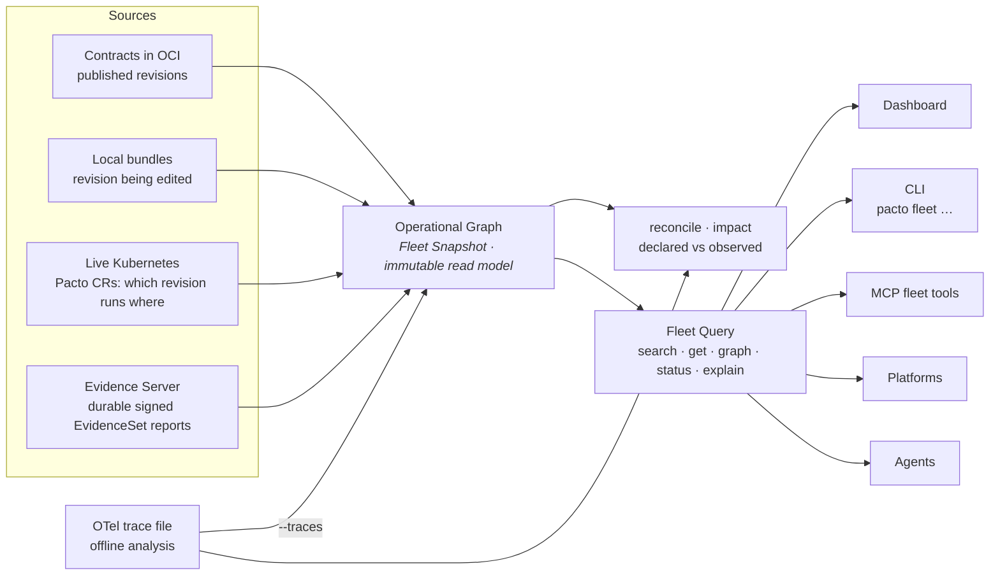
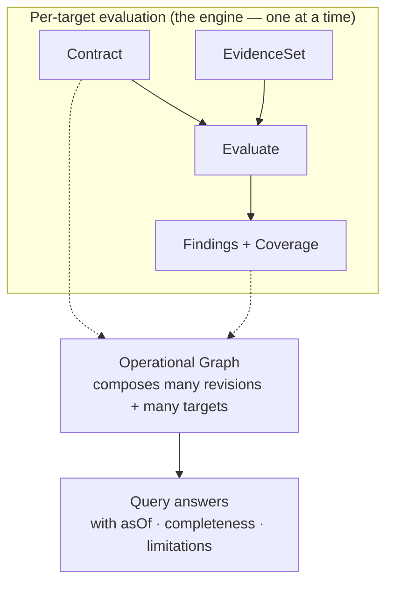

# The Pacto Operational Graph

A single contract tells you what one service is. Most questions worth asking span
many: *what depends on payments-api, which revision is running in `production-eu`,
is any of it non-compliant, and how sure are we?* The **Pacto Operational Graph**
answers those questions. It composes many independent contracts, contract
revisions and operational targets into one versioned, navigable, verifiable read
model that humans, CLIs, platforms and agents can reason over.

It is framework-independent (`pkg/fleet`), pure and read-only. It observes no
environment and evaluates nothing on its own — it is a query model built *around*
the sources and evaluations Pacto already produces. Internally the immutable read
model is a **Fleet Snapshot** and the pure query layer over it is a **Fleet
Query**; the sections below use those terms wherever precision matters.

---

## Three identities, never flattened

The graph models three distinct things and never collapses them into one. This is
the single most important idea on this page: a name, a revision and a running
instance are different questions with different answers.

| Identity | What it is | Example |
|----------|-----------|---------|
| **Logical service** | A stable name and owner. It has revisions and runs in targets, but it is neither. | `payments-api` (owner: payments) |
| **Contract revision** | An immutable resolved revision — what it declares and how it differs from another revision. Identity prefers the digest, then the resolved ref, then the version; a mutable tag alone is never a revision identity. | `payments-api@sha256:…` |
| **Operational target** | A concrete place a revision runs, generic as `scope/kind/name`. | `production-eu/customer-a → kubernetes-workload payments/payments-api` |

A logical service is not its latest revision. A revision is not the thing running
in a cluster. A target is not the service. Keeping them separate is what lets the
graph answer "which *revision* runs *where*, and is *that instance* compliant"
without guessing.

---

## Relationships: declared, observed, inferred

Edges in the graph carry a **provenance** discriminator so a fact's origin is
never ambiguous:

- **declared** — the relationship comes from a contract (`dependencies[]`, and
  config/policy `ref`s).
- **observed** — a relationship seen in running traffic. Observed dependencies
  are produced by the [OTel observer](#observed-dependencies-and-reconciliation)
  and, when an observation source is configured, folded into the snapshot's edges
  as `observed`-provenance relationships (kept in a separate adjacency index from
  the declared graph). Reconciliation and impact consume them; because every edge
  keeps its provenance, an observed edge is never mistaken for a declared one.
- **inferred** — a relationship deduced heuristically. Reserved, not yet produced.

The discriminator keeps "what a team declared" and "what a tracer saw" separable
wherever they meet, so an observed or inferred edge can never be mistaken for a
declared one.

---

## Sources

The graph is assembled from **sources** — a framework-neutral ingestion seam. Each
source observes what it can right now and contributes revisions and targets.
(The dashboard lists these as **Data sources**. They are not the same thing as an
evidence [collector](collectors.md), which produces compliance evidence *for* a
source to carry.)

- **Local bundles** (`--local`) — the revision a developer is editing, before it
  is pushed.
- **Contracts in OCI** (`--oci <ref>`) — the published revision catalogue,
  resolved cache-first so a pulled ref works offline.
- **Local OCI cache** (`--cache`) — every bundle already pulled to disk, as an
  offline baseline.
- **Live Kubernetes** (`--k8s [--namespace]`) — Pacto CRs read straight from a
  running cluster: which revision runs in which target and its operator-computed
  compliance, findings, coverage and observed runtime.
- **Ingested external evidence** (`--evidence-store <dir>` or `--evidence-url
  <url>`) — a remote environment's signed, versioned
  [EvidenceSet report](evidence-protocol.md), verified and evaluated at ingestion
  into the durable [Evidence Server](evidence-protocol.md#durable-storage-and-recovery),
  then exposed as an operational target. `--evidence-store` reads the server's
  accepted-evidence records straight off disk; `--evidence-url` consumes a running
  Evidence Server's read-only contribution over HTTP.
- **Offline target-state fixtures** (`--target-state`) — an unsigned demo and
  test adapter for supplying targets without a cluster.

Every source flag is shared by `pacto fleet`, `pacto impact` and the MCP fleet
server, so the same graph is reachable from each. No source leaks its transport
into the graph: a Kubernetes-backed source, an OCI-backed source, a local source
and the dashboard adapter each implement the same small interface, so the read
model stays free of Kubernetes, MCP and dashboard code.

---

## Freshness and completeness

Incompleteness is always explicit. A source reports its state; a snapshot and
every query answer carry an **as-of** time, a **completeness** and a list of
**limitations**. Two rules are absolute:

> **An unavailable source is never an empty result.** If a registry is unreachable
> or a cluster is disconnected, its records are *missing*, and the answer says so —
> it is never rendered as "nothing is there".

> **Absence of telemetry is not evidence of absence.** A missing observation under
> partial coverage is uncertainty, not a confirmed "no".

Every source reports one status, and the snapshot rolls those up into one
completeness value:

| Term | Where it applies | Meaning |
|------|------------------|---------|
| **available** | source | Reachable and current. |
| **partial** | source and snapshot | The source returned some but not all of its records, or at least one source is degraded. Treat the answer as incomplete knowledge. |
| **stale** | source | The most recent data is older than the freshness window. |
| **unavailable** | source | The source could not be observed at all; its records are absent, not empty. |
| **complete** | snapshot | Every source was available and current. |
| **empty** | snapshot | Every source was available and produced no record. A genuine empty, not a hidden failure. |

The dashboard uses a matching per-section vocabulary — `present`, `empty`,
`not_applicable`, `unavailable` — for the same reason: a blank must always explain
*why* it is blank. When a source fails, its error is sanitized to a category code
(`AUTH_FAILED`, `NOT_FOUND`, `UNAVAILABLE`, `CANCELLED`) and a generic message, so
credentials, tokens and host names never leak to a consumer.

---

## Query semantics

The read model is queried through five pure operations. None performs I/O; a
single snapshot serves concurrent queries. **Every answer carries a `meta`
envelope with `asOf`, `completeness` and `limitations`** — a consumer can always
tell how much of the system the answer actually covers.

| Query | Answers |
|-------|---------|
| **search** | Which logical services match this filter (owner, label, status, compliance, capability, dependency, readiness). Bounded and deterministically ordered. |
| **get** | Everything about one service (its revisions, targets, declared dependencies, dependents, tools and skills) or one target. |
| **graph** | Traverse dependencies or dependents from a service — direct or transitive, cycle-safe, with unresolved edges surfaced. |
| **status** | What needs attention: non-compliant or unknown targets, invalid contracts, stale evidence, missing readiness, unresolved dependencies. |
| **explain** | Deterministic, structured reasons for a subject's state. Pacto embeds no model — it hands an agent structured reasons to turn into prose. |

A `not found` under `partial` completeness is not proof the thing does not exist —
the answer's `meta.completeness` tells the caller whether absence is trustworthy.
Errors are typed: a missing identity is a not-found, an ambiguous one lists its
matches.

```json
{
  "meta": {
    "asOf": "2026-07-29T10:00:00Z",
    "completeness": "partial",
    "limitations": [
      { "code": "SOURCE_UNAVAILABLE", "source": "oci",
        "message": "source oci is unavailable; its records are missing from this snapshot" }
    ]
  },
  "total": 1,
  "services": [
    { "name": "payments-api", "owner": "payments", "status": "Compliant" }
  ]
}
```

---

## Who consumes it

The read model is one thing with several front doors. A human portal and an agent
consume the *same* graph.



- **Dashboard** — the visual front door. It builds one snapshot from every
  source it detects — local bundles, OCI, the disk cache and the live cluster —
  and serves the operational graph and change analysis through `/api/fleet/*`.
  The Operational Graph view offers three **perspectives** — **Services**
  (logical), **Revisions** (content-addressed) and **Operational targets** (the
  places a revision runs) — and a **Knowledge** control (Expected · Observed ·
  Differences). The Operational targets perspective is honest about what it can
  know: an operational target links to the dependency **service** it depends on,
  never to each peer target — a full target-to-target mesh would assert runtime
  routing the snapshot never observed, so it is never drawn.
- **CLI (`pacto fleet …`)** — the five queries on the command line:
  `pacto fleet search`, `pacto fleet get`, `pacto fleet graph`, `pacto fleet
  status`, `pacto fleet explain`, plus `pacto fleet reconcile` (declared vs
  observed). Scriptable, deterministic output.
- **MCP fleet tools** — `pacto_fleet_search`, `pacto_fleet_get`,
  `pacto_fleet_graph`, `pacto_fleet_status` and `pacto_fleet_explain` give an
  agent read-only understanding of the operational system. They are one of three
  MCP tool families — see [MCP integration](mcp-integration.md#three-tool-families-and-their-boundaries)
  for how they differ from authoring tools and generated service tools.

---

## A read model around many evaluations, not a new evaluator

The operational graph does not replace the engine. Compliance is still the pure
`Evaluate(Contract, EvidenceSet)` function producing findings for one service in
one environment (see [Collectors and the evidence boundary](collectors.md)). The
graph is the read/query model *around* many such evaluations — it references each
target's findings and coverage rather than re-computing them.



Read the two diagrams together: the first shows *where* the data comes from, the
second shows *what the graph is made of*. The graph indexes and navigates the
outputs of many evaluations; it never becomes a second, parallel evaluator.

---

## Impact analysis, built on this substrate

The graph maintains a reverse-dependency index: for any service, which services
declare a required dependency on it. **[Impact analysis](impact.md)** builds
directly on that index. `pacto impact <old> <new>` composes a semantic contract
diff with this graph to answer "if this revision ships, what is the transitive
blast radius" — direct and transitive affected consumers, active targets, owners,
a compatibility verdict and a per-consumer confidence grade. No new data, a new
question over the same graph the dashboard and CLI already query. It is shipped
today and exposed on the CLI, as the `pacto_impact` MCP tool and — under the
name **Change analysis**, paired with the semantic diff it composes with — in the
dashboard. See [Impact analysis](impact.md) for the full model.

---

## External evidence ingestion

Runtime evidence no longer has to come only from a cluster the operator watches.
The source seam is deliberately environment-neutral, so a **remote or
disconnected environment** can participate without Pacto reaching into it: the
remote side produces a signed, versioned `EvidenceSet`, reports it outbound to an
ingestion endpoint, and the platform verifies the signature, evaluates the
evidence and exposes the result as an operational target. The freshness rules
hold across the boundary — a target goes `stale` when its evidence ages past the
window and its source becomes `unavailable` when it stops reporting, never a
silent empty and never deleted. This is the shipped
[external evidence protocol](evidence-protocol.md); for keys and CLI usage see
[evidence security and tooling](evidence-security.md).

Ingested evidence is now backed by the durable **Evidence Server**. Every
accepted envelope is committed to an immutable record before it becomes a target,
so replay protection and latest-target state survive a restart — see
[durable storage and recovery](evidence-protocol.md#durable-storage-and-recovery).
The Evidence Server is an optional operator-managed component of the
`pacto-operator` Helm chart (`evidence.enabled=true`), and it runs the same way
outside Kubernetes via `pacto evidence serve`. There is no standalone evidence
chart. When both the dashboard and the Evidence Server are enabled, the operator
wires the dashboard to the server over HTTP; the dashboard consumes its read-only
contribution and never touches the evidence bucket. The
[deployment topology](evidence-protocol.md#deployment) keeps the responsibility
split clean: the Evidence Server owns ingestion, verification, recovery and
storage, the dashboard consumes the read-only contribution and the operator
manages the Kubernetes lifecycle.

---

## Observed dependencies and reconciliation

Declared intent is only half the picture; the other half is what traffic
actually does. The **OTel observer** (`pacto otel observe <traces.json>`) is an
offline analyzer: it reads an exported OTLP/JSON trace file and derives the
caller-to-callee reachability edges its outbound spans prove. It is not a
receiver or a live collector — there is no OTLP endpoint and nothing is
deployed; it processes a file you hand it. It reports only what it saw and never
asserts a dependency is absent — an unseen dependency is uncertainty, not a
confirmed "no".

Those observed edges meet the declared graph in three places:

- **The snapshot itself** — `pacto fleet --traces <file>` adds an *observation
  source*: [Build](#sources) resolves each raw observed endpoint name to a
  **unique domain-qualified service** and folds resolved edges into the snapshot
  as `observed` relationships. So `pacto fleet graph`, the dashboard and the MCP
  tools all see runtime evidence — it is no longer confined to a one-off report.
  An endpoint name that matches zero or more than one service (the same name in
  two domains) is **never** coerced to a domain; it is preserved as an
  `OBSERVED_IDENTITY_UNRESOLVED` limitation, so observed traffic can never be
  misattributed across domains.
- **Reconciliation** — `pacto fleet reconcile --traces <file>` compares what the
  fleet's contracts declare against what traffic proves, labelling each
  dependency **matched**, **declared-not-observed** (dormant or simply unseen in
  the window) or **observed-not-declared** (a *shadow* dependency the contract
  never mentions). The caller must resolve to a unique service; the callee is
  resolved within the caller's domain (mirroring declared-dependency resolution),
  and anything unresolvable is reported in a distinct **unresolved** category
  rather than force-fit to the default domain.
- **Impact** — `pacto impact --traces <file>` (or any snapshot that already
  carries observed edges) lets observed traffic raise a declared consumer to
  **corroborated** confidence and surface **observed-only (shadow) consumers** a
  declared-only analysis would miss. A shadow consumer must itself be a registered
  fleet service; an unknown caller name is preserved as an unresolved limitation,
  never a phantom default-domain consumer.

The OTel observer can also emit signable EvidenceSets
(`pacto otel observe --evidence`), so observed dependencies can travel the same
[external evidence protocol](evidence-protocol.md) as any other report.

Observed edges live in a **separate** adjacency index from declared edges, so the
declared graph stays declared and consumers layer observed evidence on top rather
than conflating the two. In the dashboard's Operational Graph this is the
**Knowledge** control: **Expected** (contract-declared intent), **Observed**
(backed by runtime observation) and **Differences** (where the two diverge). When
a snapshot carries no observation data the graph says so — the edges come back
`insufficient` and the knowledge banner states what is missing — rather than
drawing an empty Observed view that would read as "there is no traffic".

Reconciliation is an **explicit backend fact**, not a frontend guess. Every
declared dependency edge in a snapshot carries a `reconciliation` state computed
against the snapshot's observed edges: **matched** (an observed edge corroborates
it), **declared-not-observed** (observation data exists but did not witness this
edge) or **insufficient** (no observation data at all — so it cannot be
reconciled). The dashboard's *reconciled* layer shows only `matched` edges and
never infers reconciliation from name resolution or from whether a provider is
deployed. To feed observation data to the normal dashboard (so its Operational
Graph, reconciliation and Change analysis see observed edges), pass offline OTLP/JSON
trace files with `pacto dashboard --traces <file>` (repeatable) or the
`PACTO_DASHBOARD_TRACES` environment variable; the observed capability the UI
advertises is derived from the published snapshot, never a hardcoded flag.

---

## Why the fleet is not a new contract kind

There is **no `kind: Fleet`** and **no `fleet:` section** in a contract. The graph
is *discovered* from the sources you already have — published contracts, local
bundles and runtime evidence — not declared in a new document a team would have to
author and keep in sync. Adding a fleet manifest would recreate the exact problem
Pacto exists to remove: a hand-maintained aggregate that drifts from reality the
moment a service is added or a revision ships. The fleet is a *view*, computed on
demand, versioned by its as-of time — not a thing anyone writes down.

---

## Why Pacto does not act or authorize

The operational graph makes the system knowable. It does not run it. Pacto's verbs
are bounded and deliberate: it **declares** intent, **resolves** references,
**diffs** changes, **graphs** relationships, **evaluates** evidence and
**explains** state. That is the whole list.

- **It does not act.** Deploying, scaling, provisioning and remediating are done by
  external controllers and delivery systems. The graph tells them what is true; it
  performs no action itself.
- **It does not authorize.** Whether a human or an agent *may* do something stays
  with policy and IAM systems (OPA, Kyverno, admission control, your identity
  provider). The graph never grants, scopes or revokes a permission.

This is why the fleet query tools are read-only and why a `partial` answer is
labelled as incomplete knowledge rather than a decision. Pacto supplies the
verifiable operational meaning that controllers act on and that authorization
systems reason about — it is not either of them.

---

## See also

- [MCP integration](mcp-integration.md) — the three MCP tool families, including
  the read-only fleet query tools
- [Collectors and the evidence boundary](collectors.md) — how per-target evidence
  and evaluation work
- [Architecture](architecture.md) — the engine, the layers and the declaration
  vs observation split
