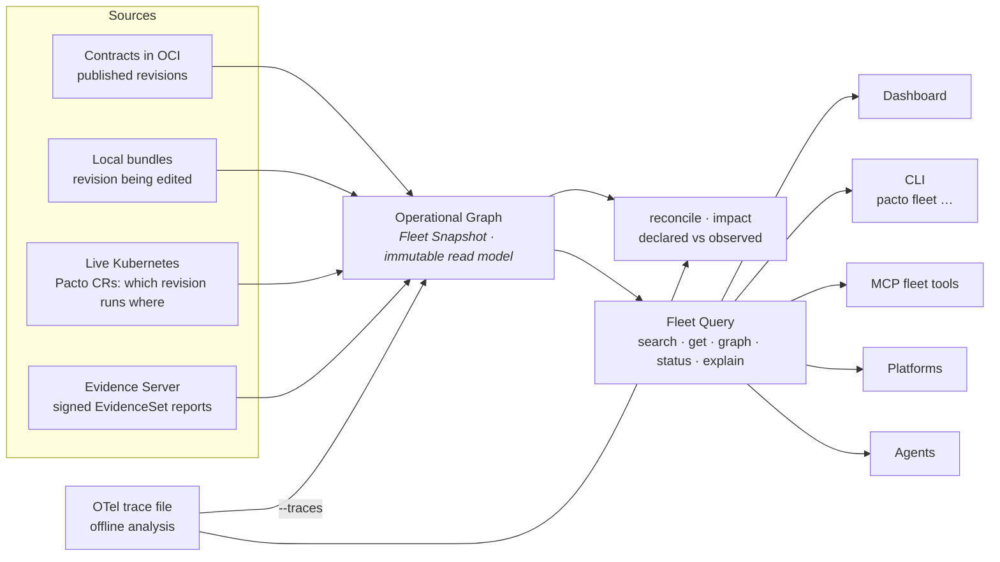
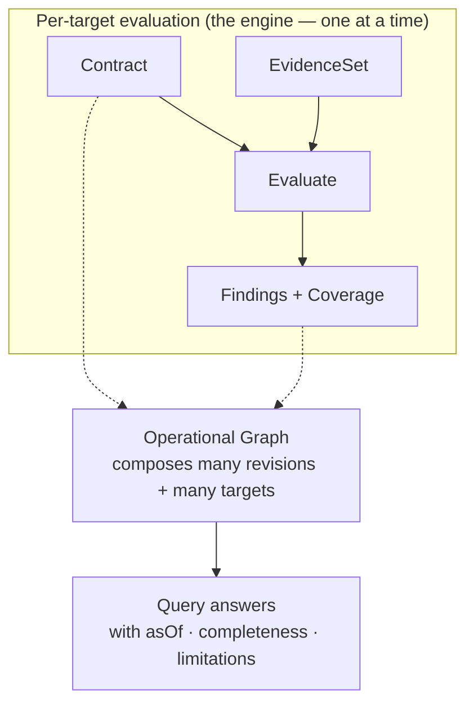

# The Pacto Operational Graph

A single contract tells you what one service is. Most questions span many: *what
depends on payments-api, which revision runs in `production-eu`, is any of it
non-compliant and how sure are we?* The **Pacto Operational Graph** composes
contracts, revisions and operational targets into one versioned read model that
humans, CLIs, platforms and agents can query.

It is framework-independent (`pkg/fleet`), pure and read-only: it observes no
environment and evaluates nothing itself. Internally the immutable read model is a
**Fleet Snapshot** and the pure query layer over it a **Fleet Query**.

## Three identities, never flattened

The graph models three distinct things and never collapses them into one: a name,
a revision and a running instance are different questions with different answers.

| Identity | What it is | Example |
|----------|-----------|---------|
| **Logical service** | A stable name and owner. It has revisions and runs in targets, but it is neither. | `payments-api` (owner: payments) |
| **Contract revision** | An immutable resolved revision. Identity is the service plus a content digest: the source's immutable digest, or one derived from the whole bundle when the source has none. Never a ref, never a version; a revision that can be neither pinned nor hashed is omitted rather than given a weaker identity. | `payments-api@sha256:…` |
| **Operational target** | A concrete place a revision runs, generic as `scope/kind/name`. | `production-eu/customer-a → kubernetes-workload payments/payments-api` |

### How certainly a target is matched to a revision

Knowing a target exists is not the same as knowing which revision it runs, so
every target records **how** the link was made.

| Match | What Pacto knows |
|-------|------------------|
| `exact` | The target's content digest matches a revision's. Authoritative: this is the revision running there. |
| `inferred` | A *unique* correlation by mutable tag or version suffix. Probably right, not proof. |
| `ambiguous` | Several revisions match that mutable reference. **No link is made** — a guess is never presented as fact — and the target carries a `REVISION_LINK_AMBIGUOUS` limitation. |
| `unresolved` | Nothing matched, or the target's identity contradicts itself. No link, and a limitation on the target saying so. |

The bottom two sit on the target itself, so a consumer can classify a link without
parsing snapshot-level messages. The two read surfaces spell it differently, and
the CLI's spelling has a trap:

- **Snapshot and `pacto fleet get --target` JSON** carry `revisionMatch`, which
  is `omitempty` and only ever `exact` or `inferred`. **An absent
  `revisionMatch` is the finding** — it means ambiguous or unresolved. Read the
  target's `limitations` to learn which.
- **The entity-detail API** (`GET /api/fleet/entities/target?key=…`, what the
  dashboard reads) carries `linkState`, always present, with all four values.

Its `inferred` is a different word from the `inferred` relationship provenance
below: one is how a *target* was matched to a revision, the other how an *edge*
was derived.

## Relationships: declared, observed, inferred

Edges carry a **provenance** discriminator so a fact's origin is never ambiguous:

- **declared** — from a contract (`dependencies[]`, and config/policy `ref`s).
- **observed** — seen in running traffic, kept in a separate adjacency index from
  the declared graph so the two can never leak into each other's answers.
- **inferred** — deduced heuristically. Reserved, not yet produced.
- **declared+observed** — one edge backed by both. The neighborhood projection
  merges the two indexes for display and emits this combined value, so a consumer
  branching on provenance must handle all four.

## Sources

The graph is assembled from **sources**, each contributing the revisions and
targets it can observe right now. The dashboard lists them as **Data sources**. A
source is where the graph reads records *from*, not a
[collector](model.md#collectors-and-the-evidence-boundary), which produces the
compliance evidence a source then carries.

- **Local bundles** (`--local`) — the revision a developer is editing. The scan
  defaults to the working directory, descends 8 levels and skips hidden
  directories, `node_modules` and `vendor`. A directory the operating system
  refuses is reported as a gap and stepped over.
- **A contract root and its closure** (`--root <path|oci://ref>`) — the root you
  name *plus every revision it declares*, followed transitively. It is the same
  discovery [`pacto mcp --root`](mcp-integration.md) freezes into a catalog,
  through the same resolver. Roots and dependencies that do not resolve stay
  visible as limitations rather than vanishing.
- **Contracts in OCI** (`--oci <ref>`) — the published revision catalogue,
  resolved cache-first so a pulled ref works offline.
- **Local OCI cache** (`--cache`) — every bundle already pulled to disk. Opt-in:
  on a machine that has been pulling contracts for months the cache is a record
  of everything anyone ever fetched, which is an offline baseline worth asking
  for and a fleet nobody operates.
- **Live Kubernetes** (`--k8s [--namespace]`) — Pacto CRs read from a running
  cluster: which revision runs in which target, and its operator-computed
  compliance, findings, coverage and observed runtime.
- **Ingested external evidence** (`--evidence-url <url>`) — a running [Evidence
  Server](evidence.md)'s read-only contribution over HTTP, exposing a
  remote environment's signed `EvidenceSet` reports as operational targets.
- **Offline target-state fixtures** (`--target-state`) — an unsigned demo and
  test adapter for supplying targets without a cluster.
- **Offline trace exports** (`--traces`, or `--trace-source NAME=PATH` on `pacto
  dashboard` only) — observed dependency edges rather than revisions and targets.
  Pacto ships **no live OTLP receiver**: nothing listens on 4317 or 4318, and no
  collector ships with the dashboard. Run a Collector you own and point a source
  at the file it exports.

`pacto fleet` and `pacto impact` read every source flag above. `pacto mcp
--fleet` reads all but `--root`, which on `pacto mcp` selects a frozen catalog
and cannot be combined with `--fleet`. Two are narrower: `impact` takes one
`--traces` file, not a repeatable list, and `--trace-source` is `pacto dashboard`
only.

### What a target-state fixture looks like

`--target-state` is the only source you author yourself: a single YAML or JSON
document, read by a strict decoder. A second `---` document, an unknown field or a
`schemaVersion` other than `pacto.dev/fleet-targets/v1` is rejected and the whole
file contributes nothing.

```yaml
schemaVersion: pacto.dev/fleet-targets/v1
targets:
  - service: orders-service          # required: the service this target runs
    name: commerce/orders-service    # required: unique within the scope
    scope: production-eu             # the environment, e.g. a cluster
    kind: kubernetes-workload        # what sort of target it is
    labels: { env: production, region: eu }
    requestedRef: oci://ghcr.io/acme/orders-service:1.2.0
    resolvedRef: oci://ghcr.io/acme/orders-service:1.2.0
    digest: sha256:…
    compliance: NonCompliant
    coverage: { evaluated: 5, required: 5 }
    evidenceAt: 2026-07-29T09:40:00Z     # when the evidence was gathered
    reconciledAt: 2026-07-29T09:41:00Z   # when the target was last reconciled
    observedRuntime: { replicas: 3 }     # free-form; surfaced as a bounded preview
    findings:
      - code: STATELESS_PERSISTENT_CONFLICT   # required within a finding
        severity: error
        category: RuntimeDrift
        subjectKind: state
        subjectName: orders-db
        message: declared stateless but the observed workload mounts a volume
state:                               # optional: the source's own health
  status: available
  message: ""
```

Only `service` and `name` are required, and an omitted `evidenceAt` is exactly how
you model a target the collector could not observe. A file may declare at most
5000 targets. An entry that fails validation is skipped with a
`SOURCE_RECORD_INVALID` limitation and the rest is kept; a failure of the *file*
drops the whole source with `SOURCE_UNAVAILABLE` and marks the snapshot
`partial`.

!!! warning "A malformed fixture is reported the same way as a missing one"
    Both produce exactly `SOURCE_UNAVAILABLE`, and the parse error itself is not
    surfaced — `-v` does not add it. If the source drops and the path is right,
    suspect the file: check `schemaVersion` first, then field spelling.

[`examples/demo/fleet-targets.yaml`](https://github.com/TrianaLab/pacto/blob/main/examples/demo/fleet-targets.yaml)
is a complete worked fixture, and it is the file the live demo runs on.

## Knowledge

Every Pacto answer carries how much of the world it actually saw. The words below
are not degrees of the same thing — they are different claims.

| Word | Claim |
|------|-------|
| **complete** | Every source answered. Nothing is missing. |
| **empty** | Every source answered and there is genuinely nothing. This is *complete* knowledge of an empty result. |
| **partial** | At least one source was unavailable, stale or itself partial. What you see is a floor, not a total. |
| **stale** | Every source answered, but one of them last saw the world a while ago. Its records are real and may have moved on since. |
| **unavailable** | A source did not answer at all. Whatever it knows is missing from this answer entirely. |
| **unknown** | We never received a completeness we could assert. Not the same as empty. |

Three of these travel on the wire, in every answer's `meta.completeness`:
`complete`, `partial` and `empty`. The other three are a consumer's reading of the
same envelope — `stale` and `unavailable` come from the per-source health reported
alongside it, and `unknown` is what is left when no envelope arrived at all. The
dashboard takes the worst of the six and gates every all-clear on that: a source
that is down must not be masked by the word the snapshot chose for itself.

**An unavailable source is never an empty result**, and a partial answer with
zero rows is not an empty result set — it is a set Pacto could not finish
building.

## Query semantics

The read model answers five kinds of question, each a pure operation. None
performs I/O, and a single snapshot serves concurrent queries.

| Query | Answers |
|-------|---------|
| **search** | Which logical services match this filter (owner, label, status, compliance, capability, dependency, readiness). Bounded and deterministically ordered. |
| **get** | Everything about one service (its revisions, targets, declared dependencies, dependents, tools and skills) or one target. |
| **graph** | Traverse dependencies or dependents from a service — direct or transitive, cycle-safe, with unresolved edges surfaced. |
| **status** | What needs attention: non-compliant or unknown targets, invalid contracts, stale evidence, missing readiness, unresolved dependencies. |
| **explain** | Deterministic, structured reasons for a subject's state. Pacto embeds no model — it hands an agent structured reasons to turn into prose. |

Two more operations are not queries: `snapshot` emits the whole read model as one
document, `reconcile` reports declared dependencies against observed ones. Every
answer carries a `meta` envelope, here from
`pacto fleet search --output-format json` with an unreachable OCI source:

```json
{
  "meta": {
    "schemaVersion": "pacto.dev/fleet/v1",
    "snapshotId": "sha256:c81df8fd572ecaa7c884968e728daff5b47c40b8e8c5cbcf1926c19740db95a9",
    "asOf": "2026-07-29T10:00:00Z",
    "completeness": "partial",
    "limitations": [
      { "code": "SOURCE_UNAVAILABLE", "source": "oci",
        "message": "source oci is unavailable; its records are missing from this snapshot" }
    ],
    "sources": [
      { "id": "local", "kind": "local", "status": "available",
        "lastSuccessfulSync": "2026-07-29T10:00:00Z",
        "revisionCount": 25, "targetCount": 0 },
      { "id": "oci", "kind": "oci", "status": "unavailable",
        "error": { "code": "UNAVAILABLE", "message": "the source is unavailable" },
        "revisionCount": 0, "targetCount": 0 }
    ]
  },
  "total": 1,
  "count": 1,
  "services": [
    { "key": "payments-service", "name": "payments-service",
      "owner": "team/payments", "status": "NotEvaluated",
      "revisionCount": 6, "targetCount": 0, "sources": ["local"] }
  ]
}
```

`schemaVersion` is the compatibility contract to branch on and `snapshotId` the
content digest that proves two answers came from the same system view. On this
envelope `count` is how many rows the page carries and `total` the whole matched
population; `key` is the canonical identity to match on because `name` is not
unique across domains. A bounded preview nested in a `get` answer is the
exception: it omits `total` when the walk was itself bounded, so an absent
`total` means "we stopped counting", never "there are none".

Beside the rows, the dashboard's entity list and the TUI carry an aggregate over
the complete matched population, computed before paging:

| Tally | Partitions | Buckets |
|-------|-----------|---------|
| `serviceCompliance` | matched services | compliance states, rolled up from each service's targets |
| `targetCompliance` | matched operational targets | compliance states as observed per target |
| `ownership` | matched services | `consistent` · `conflicting` · `unowned` |
| `readiness` | matched contract revisions | `passing` · `belowThreshold` · `expired` · `notDeclared` |

`notDeclared` is its own readiness bucket because "nobody wrote an assessment" is
not "the assessment does not pass".

`get`, `graph` and `explain` name a single subject and carry no envelope: a
missing subject is a *failure*. `pacto fleet get ghost` exits 1
with `service "ghost" not found in the fleet snapshot` on stderr. With no `meta`
there is no `completeness`, so read that from `search` before reading a subject
miss as an absence.

## Ownership and the canonical owner key

The graph aggregates and navigates by a canonical owner key **namespaced by which
field named the owner**, written `kind:name`:

1. If owner has `team` → `team:<team>`
2. If owner has `dri` (no team) → `dri:<dri>`
3. If owner has neither (contacts only) → no canonical key. The service is still
   owned and counted as such, but there is no owner to rank or link to.

The namespace is part of the identity: `team:payments` never resolves to
`dri:payments`, and only the name is shown on screen, with a `Team` / `DRI` badge
where two owners would otherwise be indistinguishable. The separate free-text
`owner` filter is a human search over team, DRI and contacts — deliberately not
an identity, and it may match several owners at once.

## Who consumes it

A human portal and an agent consume the *same* graph.


```mermaid
flowchart LR
    subgraph Sources["Sources"]
        OCI["Contracts in OCI<br/>published revisions"]
        LOCAL["Local bundles<br/>revision being edited"]
        K8S["Live Kubernetes<br/>Pacto CRs: which revision runs where"]
        EVI["Evidence Server<br/>signed EvidenceSet reports"]
    end
    OTEL["OTel trace file<br/>offline analysis"]
    OCI --> OG
    LOCAL --> OG
    K8S --> OG
    EVI --> OG
    OTEL -->|--traces| OG
    OG["Operational Graph<br/><i>Fleet Snapshot · immutable read model</i>"]
    OTEL --> RECON["reconcile · impact<br/>declared vs observed"]
    OG --> RECON
    OG --> Q["Fleet Query<br/>search · get · graph · status · explain"]
    Q --> DASH["Dashboard"]
    Q --> CLI["CLI<br/>pacto fleet …"]
    Q --> MCP["MCP fleet tools"]
    Q --> PLAT["Platforms"]
    Q --> AGENT["Agents"]
```

- **Dashboard** — the visual front door. It builds one snapshot from every source
  it detects and serves the graph and change analysis through `/api/fleet/*`. The
  Operational Graph view offers three **perspectives** — Services, Revisions and
  Operational targets — and a **Knowledge** control (Expected · Observed ·
  Differences). It is honest about what it cannot know. An operational target
  links to the dependency *service* it depends on, never to each peer target,
  because a full target-to-target mesh would assert runtime routing the snapshot
  never observed.
- **CLI (`pacto fleet …`)** — the five queries on the command line, plus
  `reconcile` and `snapshot`. Scriptable, deterministic output.
- **MCP fleet tools** — `pacto_fleet_search`, `pacto_fleet_get`,
  `pacto_fleet_graph`, `pacto_fleet_status` and `pacto_fleet_explain`, plus
  [`pacto_impact`](impact.md), give an agent read-only understanding of the
  operational system. See [MCP integration](mcp-integration.md#three-tool-families-and-their-boundaries)
  for how they differ from authoring tools and generated service tools.

## A read model around many evaluations, not a new evaluator

Compliance is still the pure `Evaluate(Contract, EvidenceSet)` function producing
findings for one service in one environment (see [the Pacto
model](model.md#the-engine)). The graph is the read model *around* many such
evaluations — it references each target's findings and coverage rather than
re-computing them.


```mermaid
flowchart TB
    subgraph Eval["Per-target evaluation (the engine — one at a time)"]
        C["Contract"] --> EV["Evaluate"]
        E["EvidenceSet"] --> EV
        EV --> F["Findings + Coverage"]
    end
    C -.-> OG
    F -.-> OG
    OG["Operational Graph<br/>composes many revisions + many targets"]
    OG --> ANS["Query answers<br/>with asOf · completeness · limitations"]
```

The graph also maintains a reverse-dependency index, which is what
[impact analysis](impact.md) traverses to answer "if this revision ships, which
consumers are affected, directly and transitively".

## Observed dependencies and reconciliation

Declared intent is half the picture; the other half is what traffic actually does.
The **OTel observer** (`pacto otel observe <traces.json>`) is an offline analyzer:
it reads an exported OTLP/JSON trace file and derives the caller-to-callee edges
its outbound spans prove. It never asserts a dependency is absent. It can also
emit signable EvidenceSets (`pacto otel observe --evidence`) so observed
dependencies travel the same [evidence protocol](evidence.md) as any
other report.

Those observed edges meet the declared graph in three places:

- **The snapshot itself** — `pacto fleet --traces <file>` and `pacto dashboard
  --traces` resolve each raw observed endpoint name to a **unique
  domain-qualified service** and fold resolved edges in as `observed`
  relationships. A name that matches zero or more than one service is **never**
  coerced to a domain; it is preserved as an `OBSERVED_IDENTITY_UNRESOLVED`
  limitation, so observed traffic can never be misattributed across domains.
- **Reconciliation** — `pacto fleet reconcile --traces <file>` labels each
  dependency **matched**, **declared-not-observed** (dormant or simply unseen in
  the window) or **observed-not-declared** (a *shadow* dependency the contract
  never mentions). Anything unresolvable is reported in a distinct **unresolved**
  category rather than force-fit to the default domain.
- **Impact** — `pacto impact --traces <file>` feeds the same observed edges into
  the affected-consumer list; the [confidence model](impact.md#confidence-model)
  has what they change there.

Reconciliation is an explicit backend fact, not a frontend guess: every declared
edge carries a state computed against the snapshot's observed edges. A snapshot
with no observation data returns `insufficient` and says so, rather than drawing
an empty Observed view that would read as "there is no traffic".

## Why the fleet is not a new contract kind

There is **no `kind: Fleet`** and **no `fleet:` section** in a contract. The graph
is *discovered* from the sources you already have. A fleet manifest would recreate
the problem Pacto exists to remove: a hand-maintained aggregate that drifts the
moment a service is added. The fleet is a *view*, computed on demand and versioned
by its as-of time.

## See also

- [The Pacto model](model.md) — the engine, the compliance states and the
  boundaries the graph inherits
- [Impact analysis](impact.md) — the consumers a change affects, projected onto
  this graph
- [Fleet tools](fleet-tools.md) — the dashboard, `pacto fleet` and the terminal UI
- [MCP integration](mcp-integration.md) — the three MCP tool families
