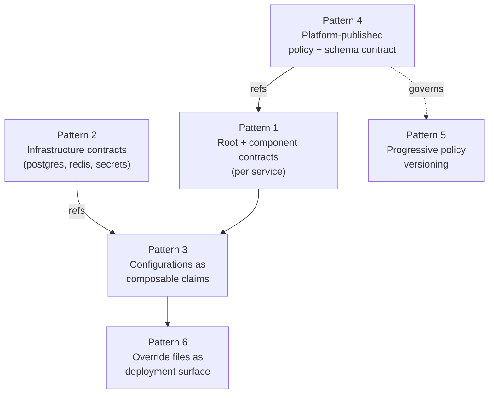

# Composition Patterns
Pacto's primitives — bundles, references, configurations, policies, metadata — compose into platform interfaces. This page documents the patterns teams use in production: when to reach for them, which primitives they rely on, and minimal worked examples.

Each pattern is independent. Stack what you need; ignore what you don't.

Across every pattern, two things are happening. Pacto composes interfaces you already have — a Helm chart's `values.schema.json`, a provisioning claim's schema — rather than inventing a parallel configuration language: compose, don't replace. And it adds the layer no single schema owns — ownership, dependencies, compatibility and how those interfaces change over time. A JSON Schema describes one interface; Pacto describes the relationships between them.

---
## 1. Root + component contracts (the monorepo pattern)

**Problem.** A repository ships several deployable units that release together — an HTTP API and a background worker, a Prefect server and its workers, a service plus its CLI shim. You want one deployment unit (one ArgoCD Application, one Helm release) but distinct runtime semantics, dependencies, and configurations for each component.

**Primitives.**

- **Multiple bundles in one repo**, each with its own `pacto.yaml`
- **Root contract** — declares the application boundary, owns `service.chart`, lists components as `dependencies[]`
- **Component contracts** — declare runtime, interfaces, and configurations for a single deployable. They do **not** set `service.chart`

**Layout.**

```
my-service/
├── charts/
│   └── my-service/                         # service chart (one per repo)
│       ├── Chart.yaml                      # depends on the per-component chart, aliased
│       └── values.yaml
└── pactos/
    ├── my-service-root/
    │   └── pacto.yaml                      # service.chart, components as deps
    ├── my-service-api/
    │   ├── pacto.yaml                      # runtime, configurations
    │   └── overrides/
    │       └── values.<env>.yaml
    └── my-service-worker/
        ├── pacto.yaml
        └── overrides/
            └── values.<env>.yaml
```

**Root contract.**

```yaml
pactoVersion: "1.2"

service:
  name: my-service-root
  version: 1.2.0
  owner:
    team: example
  chart:
    ref: oci://ghcr.io/example/charts/my-service
    version: 1.2.0

dependencies:
  # Components — built from this repo, not deployed independently
  - name: api
    ref: oci://ghcr.io/example/pactos/my-service-api:1.2.0
    required: true
    compatibility: "^1.0.0"
  - name: worker
    ref: oci://ghcr.io/example/pactos/my-service-worker:1.2.0
    required: true
    compatibility: "^1.0.0"

  # External services this app talks to at runtime
  - name: auth
    ref: oci://ghcr.io/example/pactos/auth-root:4.0.0
    required: true
    compatibility: "^4.0.0"
```

**Component contract.**

```yaml
pactoVersion: "1.2"

service:
  name: my-service-api
  version: 1.2.0
  owner:
    team: example

runtime:
  workload: service
  state:
    type: stateless
    persistence:
      scope: local
      durability: ephemeral
    dataCriticality: low
  health:
    interface: api
    path: /health

interfaces:
  - name: api
    type: http
    port: 8080
    visibility: internal

configurations:
  - name: deployment
    ref: oci://ghcr.io/example/pactos/platform-service:2.0.0
```

**Why this works.** A one-component repo pays almost nothing for this layout, and adding a second component is one new bundle dir plus one root dependency. The root maps to a single deployment unit; each component is validated and versioned independently. The root is a lean aggregator — it carries only `service`, `chart` and `dependencies[]` (plus any `policies`), deliberately omitting `runtime`, `interfaces` and `configurations`. Your own tooling can distinguish a root from a component by naming convention (e.g. a `-root` suffix) or structurally — `dependencies[]` present, `configurations` absent — since Pacto itself does not key off the name.

**Cross-links:** [`service.chart`](contract-reference.md#chart) · [`dependencies`](contract-reference.md#dependencies)

---

## 2. Infrastructure contracts

**Problem.** Your platform offers a fixed set of infrastructure types — Postgres, Redis, object storage, secrets — provisioned by some declarative tool (Crossplane, Terraform, an internal operator). You want each infrastructure type to be self-describing, governed like services, and machine-readable by the tool that turns claims into real resources.

**Primitives.**

- **A pacto contract per infrastructure type**, published by the platform team
- **`policies[]`** carrying the platform rules (HA, backups, version floors)
- **`configurations[]`** carrying the provisioning schema (the team-controllable subset of fields)
- **`metadata.labels`** carrying provisioner hints — opaque to pacto, meaningful to your CI tool

**Example: a postgres infrastructure contract.**

```yaml
pactoVersion: "1.2"

service:
  name: postgres
  version: 17.0.0
  owner:
    team: platform

metadata:
  labels:
    platform/provisioner: crossplane
    platform/claim-kind: PostgreSQLClaim
    platform/claim-api-version: database.platform.example.com/v1alpha1

policies:
  - name: postgres-policy
    schema: policy/schema.json   # enforces version >= 17, backups enabled, HA in prod

configurations:
  - name: provisioning
    schema: configuration/schema.json   # hand-authored mirror of the provisioner's XRD / module spec — Pacto does not derive it
```

**The provisioning schema** validates "did the team write a sensible claim?" — instances in range, valid size enum, schedule cron syntax, etc.

Pacto doesn't invent this schema — it's a hand-authored mirror of the provisioner's own interface (a Crossplane XRD, a Terraform module's variables), the team-controllable subset of the claim. Configuring the resource through the contract is configuring the underlying claim; the contract adds what the claim can't express on its own — an owner, a version, a policy and a stable ref other contracts depend on.

```json
{
  "type": "object",
  "properties": {
    "instances": { "type": "integer", "minimum": 1, "maximum": 5 },
    "size": { "type": "string", "enum": ["small", "medium", "large"] },
    "backups": {
      "type": "object",
      "properties": {
        "enabled": { "type": "boolean" },
        "schedule": { "type": "string" }
      }
    }
  }
}
```

**How services consume it.** A service contract references the infra contract as a configuration (see [pattern 3](#3-configurations-as-composable-claims)). When CI generates deployment artifacts, it reads `metadata.labels` from the resolved infra contract to dispatch — no hardcoded mapping from "this configuration name" to "that claim kind". Adding a new infrastructure type is one new contract, not a code change in CI.

**Versioning the contract is versioning the platform interface.** A bump from `postgres:17.0.0` to `postgres:18.0.0` lets services migrate at their own pace by ref-pinning, and the policy can tighten with each major version (see [pattern 5](#5-progressive-policy-versioning)).

**Cross-links:** [`metadata`](contract-reference.md#metadata) · [`policies`](contract-reference.md#policies) · [`configurations`](contract-reference.md#configurations)

---

## 3. Configurations as composable claims

**Problem.** A single deployable needs several distinct configuration inputs — Helm values for the chart, claim values for a database, declared keys for a secret store. Each has a different schema. You want all of them validated together at CI time, supplied through one file per environment, with no parallel `claims/` or `values/` directories to keep in sync.

**Primitives.**

- **`configurations` is an array.** Each entry is independently resolved against its own schema (`schema:` local file, or `ref:` another contract)
- **Override files** ([Contract overrides](contract-reference.md#contract-overrides)) replace the array wholesale per environment

**One file, multiple typed outputs.**

```yaml
# pactos/my-service-api/overrides/values.stg.yaml
# Value-carrying entries use a local (vendored) schema — `ref:` and `values:`
# are mutually exclusive, so a schema you supply values for must live in the bundle.
configurations:
  - name: deployment
    schema: configuration/deployment/schema.json
    values:
      replicas: 3
      resources:
        requests:
          cpu: 1000m
          memory: 1Gi

  - name: postgres
    schema: configuration/postgres/schema.json
    values:
      instances: 2
      size: medium
      backups:
        enabled: true
        schedule: "0 */6 * * *"

  - name: secrets
    schema: configuration/secrets/schema.json
    values:
      secrets:
        - key: api-key
        - key: openai-token
```

`pacto validate -f overrides/values.stg.yaml` validates each entry's `values` against its local `schema`. (Values for `ref`-based configs are resolved and validated at deploy/runtime, not at validate time.) Your deployment tooling reads the same file and produces:

- Helm values (`deployment` entry → values nested under the component's chart alias)
- A Postgres claim (`postgres` entry → fields land in the claim's `spec`)
- A secret-store claim (`secrets` entry → declared keys provisioned)

**Each value is written once** — no drift between a chart's `values.yaml` and a separate `claims/postgres.yaml`.

!!! info
    Override files use **Helm-style array replacement** for `configurations` — the override's array replaces the contract's array entirely, not merged by name (see [Contract overrides](contract-reference.md#contract-overrides)). Each override file must therefore include every configuration it cares about, each with its `schema` (and `values`) or a `ref` (schema-only). Inline `values` require a local `schema`; a `ref`-based entry carries neither.

**Cross-links:** [`configurations`](contract-reference.md#configurations) · [Contract overrides](contract-reference.md#contract-overrides) · [Environment-specific values files](contract-reference.md#environment-specific-values-files)

---

## 4. The platform-published policy + schema contract

**Problem.** As a platform team you want to enforce contract structure rules ("every service must declare an owner and a health endpoint") *and* publish the schema that validates deployment values for your standard chart. You want both to live in one versioned artifact that every service references — so updates propagate via a version bump, not a wiki announcement.

**Primitives.**

- **One contract** carrying both `policies[].schema` (the rules contract authors must follow) and `configurations[].schema` (the values shape the chart accepts)
- Service contracts reference it for either or both via `policies[].ref` and `configurations[].ref`

**The platform contract.**

```yaml
# pactos/platform-service/pacto.yaml
pactoVersion: "1.2"

service:
  name: platform-service
  version: 2.0.0
  owner:
    team: platform

policies:
  - name: platform-policy
    schema: policy/schema.json     # requires owner, runtime.health, runtime.workload

configurations:
  - name: deployment
    schema: configuration/schema.json   # the standard chart's values.schema.json
```

**A service references both.**

```yaml
# pactos/my-service-api/pacto.yaml
policies:
  - name: platform-policy
    ref: oci://ghcr.io/example/pactos/platform-service:2.0.0

configurations:
  - name: deployment
    ref: oci://ghcr.io/example/pactos/platform-service:2.0.0
```

**Mix and match.** Teams using the platform's standard chart reference both. Teams that ship their own chart (a third-party Keycloak chart, a custom operator) still reference the policy — contract structure rules are universal — but vendor their own configuration schema locally. The moment a team needs inline or override `values`, it must vendor the schema: a `ref`-ed config is schema-only (see [Configuration Schema Ownership Models](contract-reference.md#configuration-schema-ownership-models)).

```yaml
policies:
  - name: platform-policy
    ref: oci://ghcr.io/example/pactos/platform-service:2.0.0

configurations:
  - name: deployment
    schema: configuration/values.schema.json   # vendored from their chart
```

**One bundle, versioned.** The same JSON Schema validates the contract at CI time *and* the chart values at install time.

**Cross-links:** [Configuration Schema Ownership Models](contract-reference.md#configuration-schema-ownership-models) · [`policies`](contract-reference.md#policies) · [Policy as a contract](platform-engineers.md#policy-enforcing-contract-standards)

---

## 5. Progressive policy versioning

**Problem.** You want to raise the bar on what a "compliant service" means — without breaking every service that's already on the platform. New services should adopt the strictest rules; existing services should migrate at their pace.

**How it works.** The policy contract is versioned. Each major version represents a new compliance bar. Services pin to whichever version they've achieved, and migrate forward by bumping the ref.

| Version | What it enforces |
|---------|-----------------|
| `1.0.0` | `service.owner` declared, `runtime.health` defined |
| `2.0.0` | + `runtime.workload` declared, `interfaces[]` if exposed |
| `3.0.0` | + `configurations[]` schema present, SBOM in bundle |
| `4.0.0` | + `runtime.health` includes liveness *and* readiness, `scaling.min >= 2` for `service` workloads |

A service pinned to `platform-policy:2.0.0` keeps validating against v2's rules until the team is ready to bump — the platform never forces the change.

**Why this works.**

- **Forwards is opt-in, never forced.** Teams migrate when they have time
- **Backwards is enforced.** A service can never silently weaken its policy — `pacto diff` flags removing or changing a policy ref as potentially breaking (classification `potentially-breaking`)
- **The version is the negotiation point.** Conversations about "should we require X?" become "should we publish v4 that requires X, with a six-month adoption window?"

**Two dials.** Pinning the policy's major version (above) makes each new bar opt-in and negotiated. Alternatively, a rule layer referenced *transitively* through the platform contract can be left unpinned: republishing that one schema propagates a new rule fleet-wide immediately, with no per-service bump — at the cost of lockfile drift, since every republish changes the resolved digest and forces services to re-lock ([`pacto lock --check`](lockfile.md) fails until they do). Pinned is opt-in and negotiated; floating is instant and unilateral but forces re-locks.

**Coordinate with `pacto validate`.** When a service ref-bumps from `2.0.0` to `3.0.0`, `pacto diff` reports the changed policy ref; `pacto validate` resolves the new policy and fails *before* merge if the contract does not satisfy it — the team sees the gap and either fixes it or stays on `2.0.0`.

**Cross-links:** [`policies`](contract-reference.md#policies) · [Change classification — Policy](contract-reference.md#policy)

---

## 6. Override files as the deployment surface

**Problem.** The same component runs in dev, staging, and production with different replica counts, resource limits, database sizes, and secret sets. You want each environment self-contained, validated against the same schemas, and not maintained alongside Helm `values.yaml` files.

**Primitives.** YAML files per environment, applied with `-f` (see [Contract overrides](contract-reference.md#contract-overrides)). One file per component per environment.

**Layout.**

```
pactos/my-service-api/
├── pacto.yaml
└── overrides/
    ├── values.dev.yaml
    ├── values.stg.yaml
    └── values.prod.yaml
```

Each file is self-contained and follows the same shape as [pattern 3](#3-configurations-as-composable-claims) — it lists every configuration the component cares about for that environment, value-carrying entries using a local `schema:` (a `ref:` entry is schema-only):

```yaml
# overrides/values.prod.yaml
configurations:
  - name: deployment
    schema: configuration/deployment/schema.json
    values:
      replicas: 5
      resources:
        requests: { cpu: 2000m, memory: 2Gi }

  - name: postgres
    schema: configuration/postgres/schema.json
    values:
      instances: 3
      size: large
      backups:
        enabled: true
        schedule: "0 */4 * * *"
```

Each file is validated independently by `pacto validate -f overrides/values.<env>.yaml`, so a change scopes to one component — a typo in staging Postgres can't break an unrelated one, and reviewers see a small diff.

**Precedence.** Contract inline `values` → `-f overrides/values.<env>.yaml` → `--set` (wins). Use inline values for cross-environment defaults, override files for environment-specific values and reserve `--set` for values your platform tooling controls (image tag, namespace, deploy-time labels). See [Precedence](contract-reference.md#precedence) for the full chain.

**Cross-links:** [Contract overrides](contract-reference.md#contract-overrides) · [Precedence](contract-reference.md#precedence) · [Environment-specific values files](contract-reference.md#environment-specific-values-files)

---

## How patterns stack

These patterns aren't a menu of choices — they compose. A typical platform integration uses several at once:



A platform team publishes its policy + chart schema (4) and one contract per infrastructure type (2). Each service is a monorepo with a root + component contracts (1). Components compose deployment + infrastructure configurations into a single override file per environment (3 + 6). The policy versions tighten over time without forcing migrations (5).
