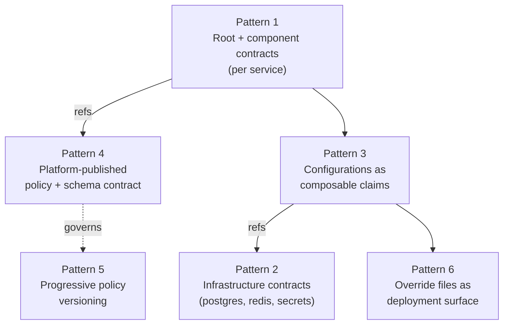

# Composition Patterns
Pacto's primitives — bundles, references, configurations, policies, metadata — compose into platform interfaces. This page collects the compositions worth knowing: when to reach for each one, which primitives it relies on, and a minimal worked example.

Each pattern is independent. Stack what you need; ignore what you don't.

Across every pattern, two things are happening. Pacto composes interfaces you already have — a Helm chart's `values.schema.json`, a provisioning claim's schema — rather than inventing a parallel configuration language: compose, don't replace. And it adds the layer no single schema owns — ownership, dependencies, compatibility and how those interfaces change over time. A JSON Schema describes one interface; Pacto describes the relationships between them.

---

## The patterns

Numbered so the stacking diagram below can refer to them.

1. **[Root + component contracts](root-component.md)**
2. **[Infrastructure contracts](infrastructure-contracts.md)**
3. **[Configurations as composable claims](composable-configs.md)**
4. **[Platform-published policy + schema contract](policy-schema.md)**
5. **[Progressive policy versioning](progressive-policy.md)**
6. **[Override files as the deployment surface](override-files.md)**

Alongside them, **[Configuration schema ownership](configuration-schema-ownership.md)**
covers who owns a `configurations[]` schema and when an existing schema can be
reused. It is organizational guidance rather than a composition, so it does not
appear in the stack below.

## How patterns stack

These patterns aren't a menu of choices — they compose. A typical platform integration uses several at once:

A platform team publishes its policy + chart schema (4) and one contract per infrastructure type (2). Each service is a monorepo with a root + component contracts (1). Components compose deployment + infrastructure configurations into a single override file per environment (3 + 6). The policy versions tighten over time without forcing migrations (5).
