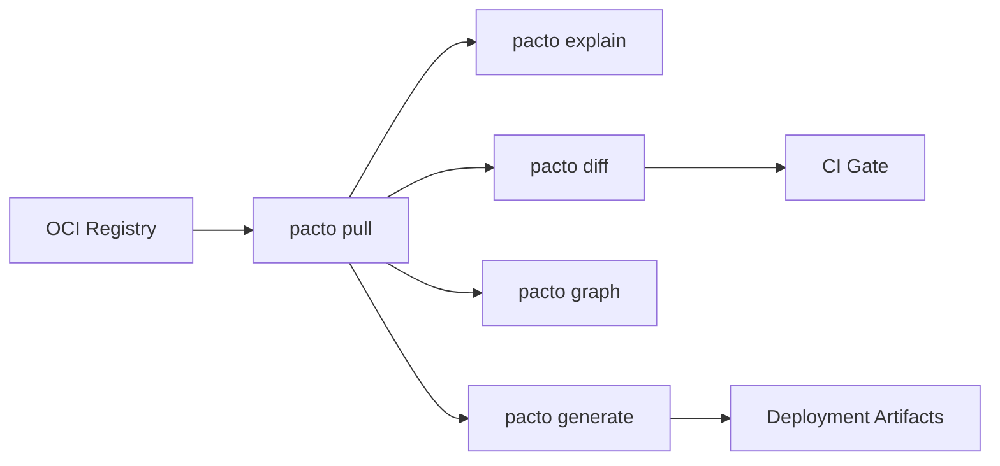

# Pacto for Platform Engineers
{: .no_toc }

You manage the infrastructure that runs services. Pacto gives you a machine-readable, validated contract for every service — so you can stop guessing and start automating.

Instead of reverse-engineering how to run a service from Helm charts, READMEs, and Slack threads, you pull a contract from an OCI registry and get everything you need: workload type, state model, interfaces, health checks, dependencies, configuration schema, and scaling intent.

---

<details open markdown="block">
  <summary>Table of contents</summary>
- TOC
{:toc}
</details>

---

## What a contract tells you

Every question you'd normally have to ask the dev team — or discover in production — is answered in the contract:

| Contract Field | Platform Decision |
|---|---|
| `workload: service` | Deploy as a long-running process (Deployment/StatefulSet) |
| `workload: job` | Deploy as a one-shot task (Job/CronJob) |
| `state.type: stateful` | Needs stable identity and storage (StatefulSet + PVC) |
| `state.type: stateless` | Horizontally scalable, no persistent storage needed |
| `state.persistence.durability: persistent` | Provision durable storage |
| `state.dataCriticality: high` | Enable backups, stricter disruption budgets |
| `interfaces[].port` | Configure Service, Ingress |
| `interfaces[].visibility: public` | Create external Ingress or load balancer |
| `health.interface` + `health.path` | Configure liveness/readiness probes |
| `lifecycle.upgradeStrategy: ordered` | Use ordered pod management |
| `lifecycle.gracefulShutdownSeconds` | Set termination grace period |
| `scaling.min` / `scaling.max` | Configure auto-scaling bounds |
| `dependencies[].ref` | Validate dependency graph, check compatibility |

---

## Your workflow



### 1. Pull a service contract

```bash
pacto pull oci://ghcr.io/acme/payments-api-pacto:2.1.0
```

### 2. Inspect it

```bash
$ pacto explain oci://ghcr.io/acme/payments-api-pacto:2.1.0
Service: payments-api@2.1.0
Owner: team/payments
Pacto Version: 1.0

Runtime:
  Workload: service
  State: stateful
  Persistence: local/persistent
  Data Criticality: high

Interfaces (2):
  - rest-api (http, port 8080, public)
  - grpc-api (grpc, port 9090, internal)

Dependencies (1):
  - oci://ghcr.io/acme/auth-pacto@sha256:abc123 (^2.0.0, required)

Scaling: 2-10
```

### 3. Check for breaking changes

```bash
pacto diff \
  oci://ghcr.io/acme/payments-api-pacto:2.0.0 \
  oci://ghcr.io/acme/payments-api-pacto:2.1.0
```

`pacto diff` exits non-zero if breaking changes are detected. Use the exit code in CI to gate deployments.

### 4. Resolve the dependency graph

```bash
$ pacto graph oci://ghcr.io/acme/payments-api-pacto:2.1.0
payments-api@2.1.0
├─ auth-service@2.3.0
│  └─ user-store@1.0.0
└─ notifications@1.0.0 (shared)
```

Dependencies are resolved recursively from OCI registries. Sibling deps are fetched in parallel. Results are cached locally for fast repeated lookups.

### 5. Generate deployment artifacts

```bash
pacto generate helm oci://ghcr.io/acme/payments-api-pacto:2.1.0
```

This invokes the `pacto-plugin-helm` plugin to produce Helm charts, Kubernetes manifests, or whatever your plugin generates. See the [Plugin Development]({{ site.baseurl }}) guide.

---

## Mapping contracts to infrastructure

### Workload type

| `workload` | Kubernetes resource | Notes |
|---|---|---|
| `service` | Deployment or StatefulSet | Based on `state.type` |
| `job` | Job | No scaling, runs to completion |
| `scheduled` | CronJob | Schedule defined externally |

### State model

The state model tells you exactly what storage and scheduling strategy a service needs:

| `state.type` | `persistence` | Infrastructure |
|---|---|---|
| `stateless` | `local/ephemeral` | Deployment, no PVC, free to scale horizontally |
| `stateful` | `local/persistent` | StatefulSet + PVC, stable identity per replica |
| `stateful` | `local/ephemeral` | StatefulSet with emptyDir (stable identity, no durable storage) |
| `stateful` | `shared/persistent` | Network-attached or shared storage |
| `hybrid` | `local/persistent` | StatefulSet + PVC, tolerates cold starts |
| `hybrid` | `local/ephemeral` | Deployment with emptyDir, warm caches improve performance |

### Upgrade strategy

| `upgradeStrategy` | Kubernetes strategy |
|---|---|
| `rolling` | `RollingUpdate` |
| `recreate` | `Recreate` |
| `ordered` | StatefulSet with `OrderedReady` |

---

## Breaking change detection

`pacto diff` doesn't just compare fields — it resolves both dependency trees and shows the full blast radius.

```bash
$ pacto diff oci://ghcr.io/acme/payments-api-pacto:1.0.0 \
             oci://ghcr.io/acme/payments-api-pacto:2.0.0
Classification: BREAKING
Changes (4):
  [BREAKING] runtime.state.type (modified): runtime.state.type modified
  [BREAKING] runtime.state.persistence.durability (modified): ...
  [BREAKING] interfaces (removed): interfaces removed
  [BREAKING] dependencies (removed): dependencies removed

Dependency graph changes:
payments-api
├─ auth-service  1.5.0 → 2.3.0
└─ postgres      -16.0.0
```

Every change is classified as `NON_BREAKING`, `POTENTIAL_BREAKING`, or `BREAKING`. See the [Change Classification Rules]({{ site.baseurl }}#change-classification-rules) for the full table.

---

## CI integration

Use Pacto in CI pipelines to catch problems before deployment:

```yaml
# Example CI pipeline
steps:
  - name: Validate contract
    run: pacto validate .

  - name: Check for breaking changes
    run: pacto diff oci://ghcr.io/acme/my-service-pacto:latest .

  - name: Verify dependency graph
    run: pacto graph .
```

{: .tip }
Using GitHub Actions? Check out the official [Pacto CLI action]({{ site.baseurl }}).

---

## Tips

- **Automate diff checks.** Run `pacto diff` in CI to catch breaking changes before they reach production.
- **Build a plugin for your platform.** A Helm plugin, Terraform plugin, or custom manifest generator can consume Pacto contracts deterministically.
- **Use `pacto graph` to understand impact.** Before upgrading a shared service, check what depends on it.
- **Disable cache in CI.** Use `--no-cache` or `PACTO_NO_CACHE=1` to ensure fresh OCI pulls in pipelines where the cache might be stale.
- **Trust the state semantics.** If a contract says `stateless` + `ephemeral`, you can safely use a Deployment with no PVC. The validation engine enforces consistency.
- **Use JSON output.** Every command supports `--output-format json` for programmatic consumption.
- **Use `--verbose` for debugging.** Pass `-v` to any command to see debug-level logs (OCI operations, resolution steps, cache hits/misses) on stderr.
