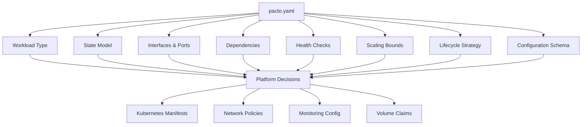
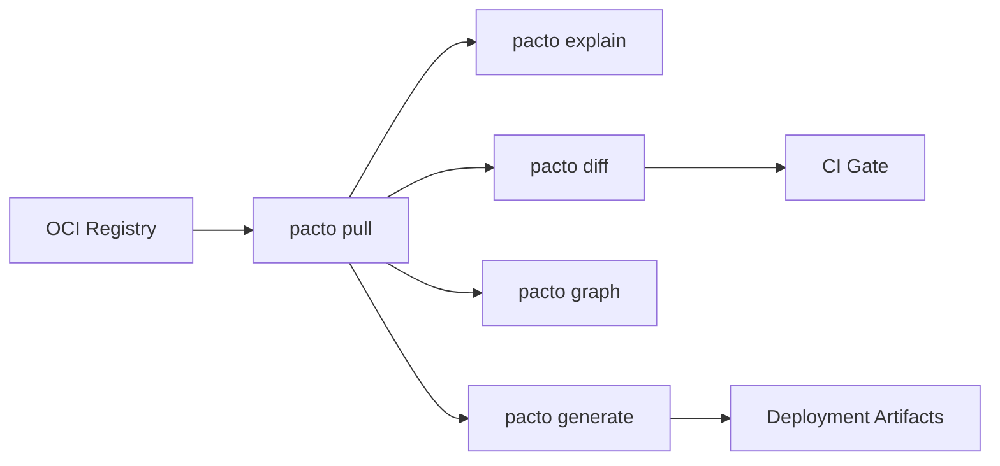

# Pacto for Platform Engineers
{: .no_toc }

As a platform engineer (DevOps, SRE, infrastructure), Pacto gives you a machine-readable, validated contract for every service. You can use it to generate deployment manifests, enforce policies, build dependency graphs, and detect breaking changes — all deterministically.

---

<details open markdown="block">
  <summary>Table of contents</summary>
- TOC
{:toc}
</details>

---

## What you get from a Pacto contract



A single contract tells you:

| Contract Field | Platform Decision |
|---|---|
| `workload.type: service` | Deploy as Deployment/StatefulSet |
| `workload.type: job` | Deploy as Job/CronJob |
| `state.type: stateful` | Use StatefulSet, attach PVCs |
| `state.persistence.durability: persistent` | Provision persistent volumes |
| `state.dataCriticality: high` | Enable backups, stricter PDB |
| `interfaces[].port` | Configure Service, Ingress |
| `interfaces[].visibility: public` | Create external Ingress |
| `health.interface` + `health.path` | Configure liveness/readiness probes |
| `lifecycle.upgradeStrategy: ordered` | Use OrderedReady pod management |
| `lifecycle.gracefulShutdownSeconds` | Set `terminationGracePeriodSeconds` |
| `scaling.min` / `scaling.max` | Configure HPA bounds |
| `dependencies[].ref` | Validate graph, check compatibility |

---

## Your workflow



### 1. Pull a service contract

```bash
pacto pull ghcr.io/acme/payments-api-pacto:2.1.0
```

### 2. Inspect it

```bash
pacto explain ghcr.io/acme/payments-api-pacto:2.1.0
```

```
Service: payments-api@2.1.0
Owner: team/payments
Pacto Version: 1.0

Runtime:
  Workload: service (long-lived)
  State: stateful
  Persistence: local/persistent
  Data Criticality: high

Interfaces (2):
  - rest-api (http, port 8080, public)
  - grpc-api (grpc, port 9090, internal)

Dependencies (1):
  - ghcr.io/acme/auth-pacto@sha256:abc123 (^2.0.0, required)

Scaling: 2-10
```

### 3. Check for breaking changes

```bash
pacto diff \
  ghcr.io/acme/payments-api-pacto:2.0.0 \
  ghcr.io/acme/payments-api-pacto:2.1.0
```

Use the exit code in CI pipelines — `pacto diff` exits non-zero if breaking changes are detected.

### 4. Resolve the dependency graph

```bash
pacto graph ghcr.io/acme/payments-api-pacto:2.1.0
```

```
payments-api@2.1.0
  - auth-service@2.3.0 (ghcr.io/acme/auth-pacto@sha256:abc123)
    - user-store@1.0.0 (ghcr.io/acme/user-store-pacto:1.0.0)

Cycles (0)
Conflicts (0)
```

### 5. Generate deployment artifacts

```bash
pacto generate helm ghcr.io/acme/payments-api-pacto:2.1.0
```

This invokes the `pacto-plugin-helm` plugin to produce Helm charts, Kubernetes manifests, or whatever your plugin generates.

---

## Mapping contracts to infrastructure

### Workload type mapping

| `workload.type` | Kubernetes Resource | Notes |
|---|---|---|
| `service` | Deployment or StatefulSet | Based on `state.type` |
| `worker` | Deployment | No Service needed if no interfaces |
| `job` | Job | No scaling, runs to completion |
| `scheduled` | CronJob | Schedule defined externally |

### State model mapping

| `state.type` | `persistence.durability` | Infrastructure |
|---|---|---|
| `stateless` | `ephemeral` | Deployment, no PVC |
| `stateful` | `persistent` | StatefulSet + PVC |
| `stateful` | `ephemeral` | StatefulSet, emptyDir |
| `hybrid` | `persistent` | StatefulSet + PVC |
| `hybrid` | `ephemeral` | Deployment, emptyDir |

### Upgrade strategy mapping

| `upgradeStrategy` | Kubernetes Strategy |
|---|---|
| `rolling` | `RollingUpdate` |
| `recreate` | `Recreate` |
| `ordered` | StatefulSet with `OrderedReady` |

---

## Policy enforcement

Pacto contracts enable programmatic policy enforcement:

```bash
# Block services without health checks
pacto validate service

# Block breaking changes in CI
pacto diff old-version new-version

# Verify dependency graph has no cycles
pacto graph service
```

### Example CI gate

```yaml
# In your CI pipeline
steps:
  - name: Validate contract
    run: pacto validate .

  - name: Check for breaking changes
    run: pacto diff oci://ghcr.io/acme/my-service-pacto:latest .

  - name: Verify dependencies
    run: pacto graph .
```

---

## Building plugins

Platform teams can build custom plugins to generate artifacts specific to their infrastructure. See the [Plugin Development]({{ site.baseurl }}) guide.

---

## Tips

- **Automate diff checks.** Run `pacto diff` in CI to catch breaking changes before they reach production.
- **Build a plugin for your platform.** A Helm plugin, Terraform plugin, or custom manifest generator can consume Pacto contracts deterministically.
- **Use `pacto graph` to understand impact.** Before upgrading a shared service, check what depends on it.
- **Trust the state semantics.** If a contract says `stateless` + `ephemeral`, you can safely use a Deployment with no PVC. The validation engine enforces consistency.
- **Use the JSON output.** Every command supports `--output-format json` for programmatic consumption.
