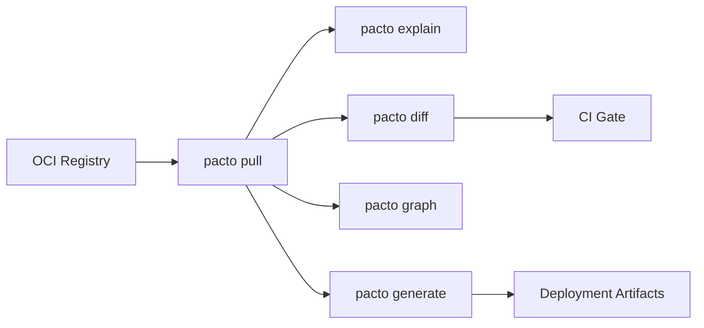

# Pacto for Platform Engineers
You manage the infrastructure that runs services. Pull a validated, machine-readable contract from an OCI registry and get everything needed to run a service: workload type, state model, interfaces, capabilities, dependencies and config schema. The contract states operational *intent* — what the service is, not how to deploy it — so how you provision, scale and wire it stays your decision.

---
## What a contract tells you

Every question you'd normally have to ask the dev team — or discover in production — is answered in the contract. The fields are top-level in v2 (there is no `runtime` wrapper, and no port, scaling, image or lifecycle field — those are delivery concerns you own):

| Contract Field | Platform Decision |
|---|---|
| `workload` (`service` / `job` / `scheduled`) | Choose the workload kind — see [Workload type](#workload-type) below |
| `state.type` + `state.persistence` | Choose storage + scheduling strategy — see [State model](#state-model) below |
| `state.dataCriticality: high` | Enable backups, stricter disruption budgets |
| `interfaces[]` (`type` + `ref`) | Know the API surface — generate Service/Ingress wiring, publish the spec, drive conformance |
| `interfaces[].visibility: public` | Create external Ingress or load balancer |
| `capabilities[]` (`health` / `metrics` binding) | Configure liveness/readiness probes and metrics scraping from the bound interface + path |
| `configurations[].schema` / `configurations[].ref` | Validate required configuration, generate config templates. Platform teams can publish a shared schema that services vendor into their bundles or reference via OCI — the schema then expresses what the platform *provides*. See [Configuration Schema Ownership Models](patterns/configuration-schema-ownership.md) |
| `policies[].ref` | Enforce organizational standards — require a health capability, enforce visibility rules, mandate an owner. See [policies](contract-reference/sections.md#policies) |
| `readiness.claims[]` | Gate promotion and surface operational readiness — declare dashboard, runbook, security-review, SLO, AI-eval evidence; each claim carries a weight; the assessment carries a single expiry date; derive a readiness score. Enforce required claims via policies. See [readiness](contract-reference/sections.md#readiness) |
| `dependencies[].ref` | Validate dependency graph, check compatibility |
| `docs/` *(optional)* | Access service documentation, runbooks, integration guides |
| `sbom/` *(optional)* | Audit third-party packages, track license compliance |

---

## Your workflow


```mermaid
flowchart LR
    R[OCI Registry] --> PL[pacto pull]
    PL --> E[pacto explain]
    PL --> DI[pacto diff]
    PL --> G[pacto graph]
    PL --> GEN[pacto generate]
    GEN --> K[Deployment Artifacts]
    DI --> CI[CI Gate]
```

### 1. Pull a service contract

```bash
pacto pull oci://ghcr.io/acme/payments-api-pacto:2.1.0
```

`explain`, `diff`, `graph` and `generate` accept `oci://` refs directly (resolving through the local cache), so this explicit `pull` is optional — use it only when you want the extracted bundle on disk.

### 2. Inspect it

```bash
$ pacto explain oci://ghcr.io/acme/payments-api-pacto:2.1.0
Service: payments-api@2.1.0
Owner: payments
Pacto Version: 2.0

Workload: service

State:
  Type: stateful
  Persistence: shared/persistent
  Data Criticality: high

Capabilities (2):
  - health
  - metrics

Interfaces (2):
  - rest-api (openapi: interfaces/openapi.yaml, public)
  - grpc-api (grpc: interfaces/service.yaml, internal)

Dependencies (1):
  - auth: oci://ghcr.io/acme/auth-pacto@sha256:abc123 (^2.0.0, required)
```

### 3. Check for breaking changes

```bash
pacto diff \
  oci://ghcr.io/acme/payments-api-pacto:2.0.0 \
  oci://ghcr.io/acme/payments-api-pacto:2.1.0
```

`pacto diff` exits non-zero if breaking changes are detected. Use the exit code in CI to gate deployments.

### 4. Resolve the dependency graph

```bash
$ pacto graph oci://ghcr.io/acme/payments-api-pacto:2.1.0
payments-api@2.1.0
├─ auth-service@2.3.0
│  └─ user-store@1.0.0
└─ notifications@1.0.0 (shared)
```

Dependencies are resolved recursively from OCI registries. Sibling deps are fetched in parallel. Results are cached locally for fast repeated lookups.

#### Including config/policy references

By default, `pacto graph` shows only declared `dependencies`. To also visualize **config/policy references** — OCI refs in the `configurations[].ref` and `policies[].ref` fields — use the reference flags:

```bash
# Show dependencies AND config/policy references
pacto graph --with-references oci://ghcr.io/acme/payments-api-pacto:2.1.0

# Show ONLY config/policy references (no dependencies)
pacto graph --only-references oci://ghcr.io/acme/payments-api-pacto:2.1.0
```

References differ from dependencies: a **dependency** declares a runtime relationship between services (`dependencies[].ref`), while a **reference** points to a shared configuration or policy contract (`configurations[].ref` or `policies[].ref`). Both produce graph edges, but references are rendered with dashed lines in the dashboard graph.

### 5. Generate deployment artifacts

```bash
pacto generate helm oci://ghcr.io/acme/payments-api-pacto:2.1.0
```

This invokes the `pacto-plugin-helm` plugin to produce Helm charts, Kubernetes manifests, or whatever your plugin generates. See the [Plugin Development](plugins.md) guide.

---

## Mapping contracts to infrastructure

### Workload type

| `workload` | Kubernetes resource | Notes |
|---|---|---|
| `service` | Deployment or StatefulSet | Based on `state.type` |
| `job` | Job | Runs to completion |
| `scheduled` | CronJob | Schedule defined externally |

### State model

The state model tells you exactly what storage and scheduling strategy a service needs. The `scope/durability` values below (e.g. `shared/persistent`) are shorthand for the `state.persistence.scope` + `state.persistence.durability` fields, matching the `pacto explain` display. These are platform-agnostic signals, not Kubernetes prescriptions — the mapping below is one reasonable interpretation for Kubernetes; the equivalent decision exists on Nomad, ECS or a custom platform:

| `state.type` | `state.persistence` | Infrastructure |
|---|---|---|
| `stateless` | `local/ephemeral` | Deployment, no PVC, free to scale horizontally |
| `stateful` | `local/persistent` | StatefulSet + PVC, stable identity per replica |
| `stateful` | `local/ephemeral` | StatefulSet with emptyDir (stable identity, no durable storage) |
| `stateful` | `shared/persistent` | Network-attached or shared storage |
| `hybrid` | `local/persistent` | StatefulSet + PVC, tolerates cold starts |
| `hybrid` | `local/ephemeral` | Deployment with emptyDir, warm caches improve performance |

Deployment mechanics the contract deliberately does not carry — upgrade strategy, graceful-shutdown timing, replica counts and autoscaling bounds — stay with your deployment tooling. The contract tells you *what* the service is; you decide *how* to roll it out.

---

## Configuration and policy

Two features give platform teams direct control over the boundary between developers and infrastructure: **configuration schemas** and **policies**. Both can be centralized via OCI references.

### Configurations: the interface between dev and platform

The `configurations` section defines **the interface boundary between a service and its environment**. When a platform team publishes a shared configuration schema, it declares *what the platform provides* — database connections, observability endpoints, feature flags, secret paths. When a service author defines one, it declares *what the service requires*.

An interface is a JSON Schema — and you probably already have one. A service's configuration interface is the `values.schema.json` you author for its Helm chart; an infrastructure interface is a JSON Schema derived from the provisioning claim's OpenAPI schema. Pacto composes the schema you already own instead of inventing a new configuration language: vendor that file as a local `schema:` (required whenever you supply values), or resolve a schema-only contract via `ref:`.

There are two approaches:

**Vendored:** The platform publishes a schema externally, and services copy it into their bundle at build time:

```yaml
configurations:
  - name: platform
    schema: configuration/platform-schema.json
```

**Referenced (OCI):** Services reference the platform's configuration contract directly. No vendoring required — Pacto resolves the schema from the referenced bundle at the fixed path `configuration/schema.json`:

```yaml
configurations:
  - name: platform
    ref: oci://ghcr.io/acme/platform-config-pacto:1.0.0
```

See [Configuration Schema Ownership Models](patterns/configuration-schema-ownership.md) for the full breakdown of service-defined vs. platform-defined schemas.

### Policy: enforcing contract standards

The `policies` section lets platform teams enforce **minimum requirements on contracts themselves**. A policy is a JSON Schema that validates `pacto.yaml` — requiring a health capability, enforcing interface visibility rules, mandating a declared owner or a readiness gate, or any other organizational standard.

The platform team publishes a policy contract carrying the JSON Schema, and services adopt it by reference:

```yaml
policies:
  - name: platform-policy
    ref: oci://ghcr.io/acme/platform-policy-pacto:1.0.0
```

See [The platform-published policy + schema contract](patterns/policy-schema.md) for the authoring and publish recipe.

!!! warning "Where refs are enforced"
    Ref-based policies are enforced by `pacto validate` and `pacto push` (fail-closed — an unresolvable ref is a hard `POLICY_REF_UNRESOLVED` error, which is how push blocks non-compliant publishes). `pacto pack` and the operator run local-only validation: they enforce only inline `schema` policies and emit a `POLICY_REF_NOT_ENFORCED` warning for refs.

See [Layer 3: Policy enforcement](contract-reference/validation.md#layer-3-policy-enforcement) for the resolution semantics (recursive N-hop, cycle detection, error codes) and [policies](contract-reference/sections.md#policies) for the full specification.

!!! info
    Configuration and policy are complementary:

    - **Configuration** defines what a service needs (or what the platform provides) — the *data interface*
    - **Policy** enforces how contracts must be structured — the *contract interface*

    A single JSON Schema describes one interface in isolation; it can't express how interfaces relate or change over time. That relational layer — ownership, dependencies, compatibility, readiness — is what the contract adds around them.

---

## Breaking change detection

`pacto diff` compares contract fields, deep-diffs referenced interface specs (e.g. OpenAPI) and resolves both dependency trees to show the full blast radius — every downstream service a change can affect. Gate CI on its exit code — it exits non-zero when the classification is `BREAKING`.

```bash
$ pacto diff oci://ghcr.io/acme/payments-api-pacto:1.0.0 \
             oci://ghcr.io/acme/payments-api-pacto:2.0.0
Classification: BREAKING
Changes (4):
  [BREAKING] state.type (modified): state.type modified [stateless -> stateful]
  [BREAKING] state.persistence.durability (modified): ... [ephemeral -> persistent]
  [BREAKING] interfaces (removed): interfaces removed [- metrics]
  [BREAKING] dependencies (removed): dependencies removed [- redis]

Dependency graph changes:
payments-api
├─ auth-service  1.5.0 → 2.3.0
└─ postgres      -16.0.0
```

Every change is classified as `NON_BREAKING`, `POTENTIAL_BREAKING` or `BREAKING`; when both bundles include an `sbom/` directory, package-level SBOM changes are reported but stay informational (they don't affect the classification or exit code). See [Change Classification Rules](contract-reference/diff.md#change-classification-rules) for the full table plus the OpenAPI, JSON-Schema and SBOM diff mechanics.

---

## CI integration

Use Pacto in CI pipelines to catch problems before deployment:

```yaml
# Example CI pipeline
# (Schema/OpenAPI inference is a service-authoring step — see developers.md)
steps:
  - name: Validate contract
    run: pacto validate .

  - name: Verify the lockfile is up to date
    run: pacto lock --check

  - name: Check for breaking changes
    run: pacto diff oci://ghcr.io/acme/my-service-pacto:latest .

  - name: Post diff as PR comment (markdown)
    run: |
      DIFF=$(pacto diff --output-format markdown oci://ghcr.io/acme/my-service-pacto:latest . 2>&1 || true)
      gh pr comment --body "$DIFF"

  - name: Verify dependency graph
    run: pacto graph .
```

`pacto lock --check` acts as a supply-chain reproducibility gate — it fails when a contributor edited dependencies or references without re-running `pacto lock`. See [Lockfile](lockfile.md#pacto-lock-check).

Using GitHub Actions? See [GitHub Actions integration](github-actions.md) for the equivalent workflow built on [pacto-actions](https://github.com/trianalab/pacto-actions), including multi-service workflows, doc generation and authentication options.

---

## Dashboard

`pacto dashboard` launches the contract exploration dashboard — the same contracts the CLI manages and the operator verifies, visualized for:

- Navigating service dependency chains and understanding blast radius
- Inspecting interfaces (OpenAPI endpoints, gRPC definitions, event schemas)
- Comparing versions and reviewing classified changes (breaking / non-breaking)
- Exploring configuration schemas and policy references
- Monitoring runtime compliance alongside contract content

Sources (local, Kubernetes, OCI) are auto-detected at startup and merged per service. The platform-relevant behavior: when running alongside the Kubernetes operator, the dashboard auto-discovers OCI repositories from the `resolvedRef` fields in Pacto CRD statuses, so a K8s deployment gives the full contract experience — version history, interface details, configuration schemas and diffs — without explicit OCI arguments.

See [Dashboard architecture](architecture.md#dashboard-architecture) for the source model, merge priority, graph edges and version-tracking rules, and the [`pacto dashboard` command reference](cli-reference.md#pacto-dashboard) for flags (`--host`, `--port`, `--namespace`, `--no-cache`, `--diagnostics`, `--cors-origin`) and environment variables. Pass OCI repositories as positional `oci://` arguments or via the `PACTO_DASHBOARD_REPO` env var.

---

## Tips

- **Build a plugin for your platform.** A Helm plugin, Terraform plugin, or custom manifest generator can consume Pacto contracts deterministically.
- **Use `pacto graph` to understand impact.** Before upgrading a shared service, check what depends on it.
- **Disable cache in CI.** Use `--no-cache` or `PACTO_NO_CACHE=1` to ensure fresh OCI pulls in pipelines where the cache might be stale. `--no-cache` is a cold-start flag: it skips disk *reads* of pre-existing cached bundles, but bundles fetched during the run are still *written* to disk and reused within the same session.
- **Trust the state semantics.** If a contract says `stateless` + `ephemeral`, you can safely use a Deployment with no PVC. The validation engine enforces consistency.
- **Use JSON output.** Every inspection command (explain, diff, graph, validate, generate, doc) supports `--output-format json` for programmatic consumption.
- **Use markdown output for PR comments.** `pacto diff --output-format markdown` renders changes as tables with old/new values — pipe it into `gh pr comment` for rich CI feedback.
- **Use `--verbose` for debugging.** Pass `-v` to any command to see debug-level logs (OCI operations, resolution steps, cache hits/misses) on stderr.
- **Leverage AI assistants.** Pacto contracts are machine-consumable. In addition to CI pipelines and platform controllers, AI assistants can interact with contracts directly through the [MCP interface](mcp-integration.md) — useful for ad-hoc inspection, dependency analysis, and contract generation.
- **Close the loop with the operator.** The [Kubernetes Operator](integrations/kubernetes/overview.md) is one runtime evidence source: it observes deployed workloads and reports whether they still match their contracts — workload alignment, state model, capability reachability, interface availability and more — as typed findings, never modifying your workloads. Combined with the dashboard, you get a complete view: contract truth from OCI + runtime truth from the operator.
