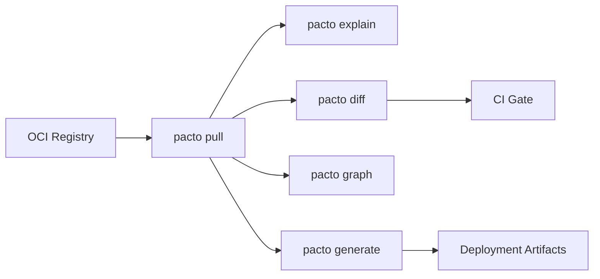

# Pacto for Platform Engineers

You manage the infrastructure that runs services. Pull a validated, machine-readable contract from an OCI registry and get everything needed to run a service: workload type, state model, interfaces, capabilities, dependencies and config schema. The contract states operational *intent* — what the service is, not how to deploy it — so how you provision, scale and wire it stays your decision.

---

## Your workflow


```mermaid
flowchart LR
    R[OCI Registry] --> PL[pacto pull]
    PL --> E[pacto explain]
    PL --> DI[pacto diff]
    PL --> G[pacto graph]
    PL --> GEN[pacto generate]
    GEN --> K[Deployment Artifacts]
    DI --> CI[CI Gate]
```

### 1. Pull a service contract

```bash
pacto pull oci://ghcr.io/acme/payments-api-pacto:2.1.0
```

`explain`, `diff`, `graph` and `generate` accept `oci://` refs directly (resolving through the local cache), so this explicit `pull` is optional.

A private repository needs credentials first: `pacto login <registry>`, or an already-authenticated `gh` for GHCR. [Authentication](cli-reference.md#authentication) gives the full resolution order.

### 2. Inspect it

```bash
pacto explain oci://ghcr.io/acme/payments-api-pacto:2.1.0
```

See [`pacto explain`](cli-reference.md#pacto-explain) for the output format.

### 3. Check for breaking changes

```bash
pacto diff oci://ghcr.io/acme/payments-api-pacto:2.0.0 \
  oci://ghcr.io/acme/payments-api-pacto:2.1.0
```

It exits non-zero if breaking changes are detected. See [Diff and change classification](contract-reference/diff.md) for the full reference and worked examples.

### 4. Resolve the dependency graph

```bash
$ pacto graph oci://ghcr.io/acme/payments-api-pacto:2.1.0
payments-api@2.1.0
├─ auth-service@2.3.0
│  └─ user-store@1.0.0
└─ notifications@1.0.0 (shared)
```

Dependencies are resolved recursively from OCI registries. Results are cached locally for fast repeated lookups. Use `--with-references` to also see config/policy references, or `--only-references` to show only reference edges.

### 5. Generate deployment artifacts

`pacto generate <name>` spawns a `pacto-plugin-<name>` binary and writes whatever it returns. **Pacto ships no deployment-artifact plugin** — the two official ones (`schema-infer`, `openapi-infer`) run inward, deriving contract inputs from files you already have. Generating Helm charts or Kubernetes manifests means writing the plugin, which is deliberately small — a binary that reads a contract as JSON on stdin and writes file descriptions on stdout, in any language. See the [Plugin Development](plugins.md) guide.

---

## Mapping contracts to infrastructure

### Workload type

| `workload` | Kubernetes resource | Notes |
|---|---|---|
| `service` | Deployment or StatefulSet | Based on `state.type` |
| `job` | Job | Runs to completion |
| `scheduled` | CronJob | Schedule defined externally |

### State model

The `scope/durability` values below (e.g. `shared/persistent`) are shorthand for the `state.persistence.scope` + `state.persistence.durability` fields, matching the `pacto explain` display. These are platform-agnostic signals, not Kubernetes prescriptions — the mapping below is one reasonable interpretation for Kubernetes; the equivalent decision exists on Nomad, ECS or a custom platform:

| `state.type` | `state.persistence` | Infrastructure |
|---|---|---|
| `stateless` | `local/ephemeral` | Deployment, no PVC, free to scale horizontally |
| `stateful` | `local/persistent` | StatefulSet + PVC, stable identity per replica |
| `stateful` | `local/ephemeral` | StatefulSet with emptyDir (stable identity, no durable storage) |
| `stateful` | `shared/persistent` | Network-attached or shared storage |
| `hybrid` | `local/persistent` | StatefulSet + PVC, tolerates cold starts |
| `hybrid` | `local/ephemeral` | Deployment with emptyDir, warm caches improve performance |

Deployment mechanics the contract deliberately does not carry — upgrade strategy, graceful-shutdown timing, replica counts and autoscaling bounds — stay with your deployment tooling.

---

## See also

- [Configuration and policy](contract-reference/configuration-and-policy.md) — the full reference
- [Composition patterns](patterns/index.md) — root + component contracts,
  infrastructure contracts, published policy + schema bundles and the rest
- [Diff and change classification](contract-reference/diff.md) — what counts as breaking
- [CI integration](ci.md) — using Pacto in pipelines
- [GitHub Actions integration](github-actions.md) — the pacto-actions workflow
- [Fleet tools](fleet-tools.md) — reading the fleet (dashboard, `pacto fleet`, terminal UI)
- [Kubernetes operator](integrations/kubernetes/overview.md) — the runtime
  evidence source
- [The operational graph](operational-graph.md) — the fleet-wide read model
- [For developers](developers.md) — the other side of the same contract
