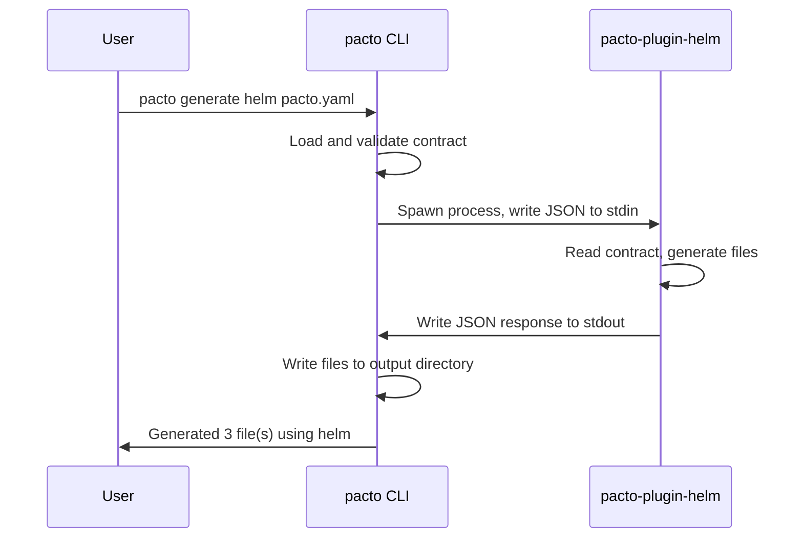

# Plugin Development
{: .no_toc }

Pacto uses an out-of-process plugin architecture for artifact generation. A plugin is a standalone executable that receives a contract via JSON on stdin and writes generated file descriptions to stdout.

This means you can turn a Pacto contract into anything — Helm charts, Terraform modules, Kubernetes manifests, monitoring configs — using any language you want.

---

<details open markdown="block">
  <summary>Table of contents</summary>
- TOC
{:toc}
</details>

---

## Why plugins?

Pacto describes *what* a service is. Plugins decide *how* to deploy it. The contract is the input; deployment artifacts are the output. This separation keeps Pacto platform-agnostic while letting each team generate exactly the artifacts their infrastructure needs.

The plugin design is:

- **Language-agnostic** — write plugins in Go, Python, Rust, Bash, or anything
- **Version-independent** — plugins don't link against Pacto libraries
- **Sandboxed** — plugins receive a read-only view of the contract

---

## How it works



1. The user runs `pacto generate <plugin-name> [path]`
2. Pacto loads and validates the contract
3. Pacto finds the plugin binary (`pacto-plugin-<name>`)
4. Pacto writes a `GenerateRequest` JSON to the plugin's stdin
5. The plugin reads the request, generates artifacts, and writes a `GenerateResponse` JSON to stdout
6. Pacto reads the response and writes the generated files to disk

---

## Plugin discovery

Pacto searches for plugin binaries in this order:

1. **`$PATH`** — any binary named `pacto-plugin-<name>`
2. **`~/.config/pacto/plugins/`** — user plugin directory

For example, `pacto generate helm` looks for:
- `pacto-plugin-helm` in `$PATH`
- `~/.config/pacto/plugins/pacto-plugin-helm`

---

## Protocol (v1)

### Request (stdin)

Pacto writes a JSON object to the plugin's stdin:

```json
{
  "protocolVersion": "1",
  "contract": {
    "pactoVersion": "1.0",
    "service": {
      "name": "my-service",
      "version": "1.0.0"
    },
    "interfaces": [...],
    "runtime": {...},
    ...
  },
  "bundleDir": "/path/to/bundle",
  "outputDir": "/path/to/output",
  "options": {
    "namespace": "production"
  }
}
```

| Field | Type | Description |
|-------|------|-------------|
| `protocolVersion` | string | Always `"1"` for the current protocol |
| `contract` | object | The full parsed contract (same structure as `pacto.yaml`) |
| `bundleDir` | string | Absolute path to the bundle directory (read-only) |
| `outputDir` | string | Absolute path where output files should go |
| `options` | object | User-provided key-value options (from CLI flags) |

The contract object contains everything from `pacto.yaml` — runtime semantics, interfaces, dependencies, scaling. Your plugin can use any combination of these fields to generate artifacts.

### Response (stdout)

The plugin writes a JSON object to stdout:

```json
{
  "files": [
    {
      "path": "deployment.yaml",
      "content": "apiVersion: apps/v1\nkind: Deployment\n..."
    },
    {
      "path": "service.yaml",
      "content": "apiVersion: v1\nkind: Service\n..."
    }
  ],
  "message": "Generated Kubernetes manifests for my-service"
}
```

| Field | Type | Description |
|-------|------|-------------|
| `files` | array | List of generated files |
| `files[].path` | string | Relative path within the output directory |
| `files[].content` | string | File content |
| `message` | string | Optional message displayed to the user |

### Errors

If the plugin encounters an error, it should:
1. Write a message to **stderr**
2. Exit with a non-zero exit code

Pacto captures stderr and presents it to the user.

---

## Example: Minimal plugin in Bash

```bash
#!/usr/bin/env bash
# pacto-plugin-readme — Generates a README from a Pacto contract

set -euo pipefail

# Read the full JSON request from stdin
REQUEST=$(cat)

# Extract fields using jq
NAME=$(echo "$REQUEST" | jq -r '.contract.service.name')
VERSION=$(echo "$REQUEST" | jq -r '.contract.service.version')
WORKLOAD=$(echo "$REQUEST" | jq -r '.contract.runtime.workload')
STATE=$(echo "$REQUEST" | jq -r '.contract.runtime.state.type')

# Generate a README
CONTENT="# ${NAME}

**Version:** ${VERSION}
**Workload:** ${WORKLOAD}
**State:** ${STATE}

This file was auto-generated by pacto-plugin-readme.
"

# Write the response JSON to stdout
jq -n \
  --arg path "README.md" \
  --arg content "$CONTENT" \
  --arg msg "Generated README for ${NAME}" \
  '{files: [{path: $path, content: $content}], message: $msg}'
```

Make it executable and place it in your `$PATH`:

```bash
chmod +x pacto-plugin-readme
mv pacto-plugin-readme /usr/local/bin/

# Use it
pacto generate readme my-service
```

---

## Example: Plugin in Go

```go
package main

import (
    "encoding/json"
    "fmt"
    "os"
)

type Contract struct {
    Service struct {
        Name    string `json:"name"`
        Version string `json:"version"`
    } `json:"service"`
    Runtime struct {
        Workload string `json:"workload"`
        State struct {
            Type string `json:"type"`
        } `json:"state"`
    } `json:"runtime"`
}

type Request struct {
    ProtocolVersion string   `json:"protocolVersion"`
    Contract        Contract `json:"contract"`
    BundleDir       string   `json:"bundleDir"`
    OutputDir       string   `json:"outputDir"`
    Options         map[string]any `json:"options"`
}

type File struct {
    Path    string `json:"path"`
    Content string `json:"content"`
}

type Response struct {
    Files   []File `json:"files"`
    Message string `json:"message,omitempty"`
}

func main() {
    var req Request
    if err := json.NewDecoder(os.Stdin).Decode(&req); err != nil {
        fmt.Fprintf(os.Stderr, "failed to read request: %v\n", err)
        os.Exit(1)
    }

    content := fmt.Sprintf("# %s v%s\nWorkload: %s\nState: %s\n",
        req.Contract.Service.Name,
        req.Contract.Service.Version,
        req.Contract.Runtime.Workload,
        req.Contract.Runtime.State.Type,
    )

    resp := Response{
        Files: []File{
            {Path: "README.md", Content: content},
        },
        Message: fmt.Sprintf("Generated README for %s", req.Contract.Service.Name),
    }

    json.NewEncoder(os.Stdout).Encode(resp)
}
```

Build and install:

```bash
go build -o pacto-plugin-readme .
mv pacto-plugin-readme /usr/local/bin/
```

---

## Example: Plugin in Python

```python
#!/usr/bin/env python3
"""pacto-plugin-env — Generates a .env.example from the contract's configuration schema."""

import json
import sys

def main():
    request = json.load(sys.stdin)
    contract = request["contract"]
    name = contract["service"]["name"]

    # Read the configuration schema from the bundle
    config = contract.get("configuration")
    if not config:
        response = {"files": [], "message": "No configuration section found"}
        json.dump(response, sys.stdout)
        return

    schema_path = f"{request['bundleDir']}/{config['schema']}"
    try:
        with open(schema_path) as f:
            schema = json.load(f)
    except FileNotFoundError:
        print(f"Schema file not found: {schema_path}", file=sys.stderr)
        sys.exit(1)

    # Generate .env.example from schema properties
    lines = [f"# Configuration for {name}", ""]
    for prop, details in schema.get("properties", {}).items():
        desc = details.get("description", "")
        comment = f"  # {desc}" if desc else ""
        lines.append(f"{prop.upper()}={comment}")

    content = "\n".join(lines) + "\n"

    response = {
        "files": [{"path": ".env.example", "content": content}],
        "message": f"Generated .env.example for {name}",
    }
    json.dump(response, sys.stdout)

if __name__ == "__main__":
    main()
```

---

## Guidelines

- **Read only from `bundleDir`.** Don't access files outside the bundle.
- **Write only to stdout.** Don't write files directly; return them in the response. Pacto handles file creation.
- **Use stderr for errors.** Anything on stderr is shown to the user on failure.
- **Exit non-zero on failure.** Pacto checks the exit code.
- **Be deterministic.** Given the same input, produce the same output.
- **Handle missing optional fields.** Not all contracts have `runtime`, `configuration`, `dependencies`, `scaling`, etc.
