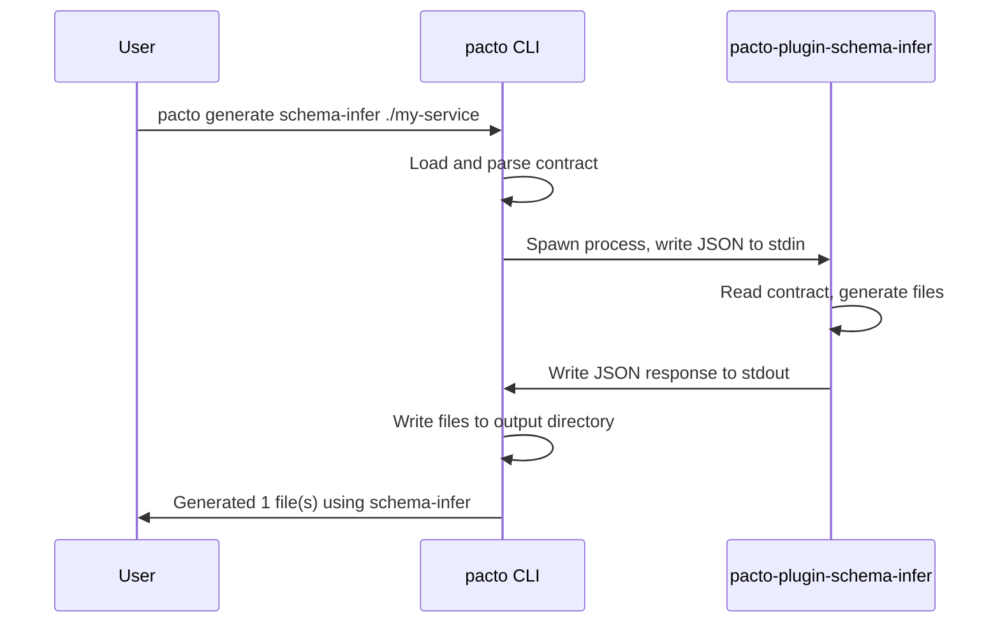

# Plugin Development
Pacto uses an out-of-process plugin architecture for artifact generation. A plugin is a standalone executable that receives a contract via JSON on stdin and writes generated file descriptions to stdout.

A plugin can turn a contract into any artifact — Helm charts, Terraform, Kubernetes manifests — in any language.

---
## Official plugins

Pacto has two official plugins:

| Plugin | Description |
|--------|-------------|
| **pacto-plugin-schema-infer** | Infers a JSON Schema from sample configuration files (JSON, YAML, TOML) for use in Pacto contracts. |
| **pacto-plugin-openapi-infer** | Auto-detects web frameworks and extracts OpenAPI 3.1 specs from source code. Currently supports FastAPI and Huma. |

Both `*-infer` plugins are the composition on-ramp: they derive the interfaces you already have — a service's HTTP API from its source, its config shape from real config files — instead of asking you to hand-author a schema. Compose what already exists rather than reinvent it.

Those two are the whole official set, and both run *inward*. **No deployment-artifact plugin ships with Pacto.** `pacto generate helm` is a plugin you write or install, not one Pacto provides — without a `pacto-plugin-helm` on your `PATH` it exits 1 with `plugin "helm" not found`. The rest of this page is how to build that plugin.

### Installing them

They are separate binaries maintained in the
[pacto-plugins](https://github.com/TrianaLab/pacto-plugins) repository, not part
of the `pacto` binary, so how you installed Pacto decides whether you have them:

| Install method | Plugins |
|----------------|---------|
| [Installer script](installation.md#via-installer-script) (`get-pacto.sh`) | Installed alongside the CLI — best-effort. If the plugin release cannot be fetched the script prints `Warning: failed to fetch latest plugins version, skipping plugin installation` and continues, so a successful Pacto install does not guarantee them. |
| [`go install`](installation.md#via-go) | Not installed |
| [From source](installation.md#from-source-manual-build) (`make build`) | Not installed |

Without them, `pacto generate schema-infer` and `pacto generate openapi-infer`
fail with `plugin "<name>" not found`. To install them by hand, download the
binaries for your platform from the [pacto-plugins releases](https://github.com/TrianaLab/pacto-plugins/releases),
make them executable and put them on your `PATH` or in
`~/.config/pacto/plugins/` (see [Plugin discovery](#plugin-discovery)).

Refer to each plugin's README for detailed usage and options:

- [pacto-plugin-schema-infer](https://github.com/TrianaLab/pacto-plugins/tree/main/plugins/pacto-plugin-schema-infer)
- [pacto-plugin-openapi-infer](https://github.com/TrianaLab/pacto-plugins/tree/main/plugins/pacto-plugin-openapi-infer)

---

## Why plugins?

Pacto describes *what* a service is. Plugins decide *how* to deploy it. The contract is the input; deployment artifacts are the output.

Plugins run in both directions: the `*-infer` plugins run inward (composing interfaces you already have into the contract), while generate plugins run outward (turning the contract into deployment artifacts). One schema describes a single interface; the contract describes how those interfaces relate and change.

The plugin design is:

- **Language-agnostic** — write plugins in Go, Python, Rust, Bash or anything
- **Version-independent** — plugins don't link against Pacto libraries
- **Isolated input** — the plugin gets a serialized, read-only snapshot of the contract on stdin and cannot mutate Pacto's state; Pacto bounds it with a timeout and output cap but does not OS-sandbox the process

---

## How it works


```mermaid
sequenceDiagram
    participant User
    participant Pacto as pacto CLI
    participant Plugin as pacto-plugin-schema-infer

    User->>Pacto: pacto generate schema-infer ./my-service
    Pacto->>Pacto: Load and parse contract
    Pacto->>Plugin: Spawn process, write JSON to stdin
    Plugin->>Plugin: Read contract, generate files
    Plugin->>Pacto: Write JSON response to stdout
    Pacto->>Pacto: Write files to output directory
    Pacto->>User: Generated 1 file(s) using schema-infer
```

1. The user runs [`pacto generate <plugin-name> [dir | oci://ref]`](cli-reference.md#pacto-generate) — see the command reference for flags like `--option key=value` (populates `options`) and `-o/--output`
2. Pacto loads and parses the contract
3. Pacto finds the plugin binary (`pacto-plugin-<name>`)
4. Pacto writes a `GenerateRequest` JSON to the plugin's stdin
5. The plugin reads the request, generates artifacts, and writes a `GenerateResponse` JSON to stdout
6. Pacto reads the response and writes the generated files to disk

---

## Plugin discovery

Pacto searches for plugin binaries in this order:

1. **`$PATH`** — any binary named `pacto-plugin-<name>`
2. **`~/.config/pacto/plugins/`** — user plugin directory

For example, `pacto generate schema-infer` looks for:

- `pacto-plugin-schema-infer` in `$PATH`
- `~/.config/pacto/plugins/pacto-plugin-schema-infer`

Neither found is an error, not a no-op — `pacto generate helm` on a machine with
no `pacto-plugin-helm` exits 1 and says so:

```
plugin "helm" not found (looked for pacto-plugin-helm in $PATH and ~/.config/pacto/plugins/)
```

---

## Protocol (v1)

### Request (stdin)

Pacto writes a JSON object to the plugin's stdin:

```json
{
  "protocolVersion": "1",
  "contract": {
    "pactoVersion": "2.0",
    "service": {
      "name": "my-service",
      "version": "1.0.0"
    },
    "interfaces": [...],
    "workload": "service",
    "state": {...},
    ...
  },
  "bundleDir": "my-service",
  "outputDir": "helm-output",
  "options": {
    "namespace": "production"
  }
}
```

| Field | Type | Description |
|-------|------|-------------|
| `protocolVersion` | string | Always `"1"` for the current protocol |
| `contract` | object | The full parsed contract (same structure as `pacto.yaml`) |
| `bundleDir` | string | Path to the bundle directory, **as resolved by the CLI** — for a local contract this is the reference the user typed, so it may be relative; for an `oci://` reference it is an absolute temp directory that Pacto deletes when the plugin exits. Treat as read-only (Pacto does not enforce that). |
| `outputDir` | string | Path where output files should go — `-o/--output` verbatim, or `<plugin-name>-output` when the flag is omitted. **May be relative**, and Pacto creates the directory before spawning the plugin. |
| `options` | object | *Optional.* User-provided key-value options (from `--option key=value`). **Omitted entirely** when no `--option` is passed, so read it defensively: `request.get("options", {})`. |

A relative `bundleDir` or `outputDir` is relative to Pacto's working directory,
which the plugin process inherits. A plugin must therefore not `chdir` before it
resolves either path, and must not assume either one is absolute.

The contract object mirrors [`pacto.yaml`](contract-reference/index.md) exactly.

### Response (stdout)

The plugin writes a JSON object to stdout:

```json
{
  "files": [
    {
      "path": "deployment.yaml",
      "content": "apiVersion: apps/v1\nkind: Deployment\n..."
    },
    {
      "path": "service.yaml",
      "content": "apiVersion: v1\nkind: Service\n..."
    }
  ],
  "message": "Generated Kubernetes manifests for my-service"
}
```

| Field | Type | Description |
|-------|------|-------------|
| `files` | array | List of generated files |
| `files[].path` | string | Relative path within the output directory |
| `files[].content` | string | File content |
| `message` | string | Optional message displayed to the user |

#### Path safety

`files[].path` must be a relative path within the output directory. Absolute paths and paths containing `..` are rejected. Always return clean relative paths.

### Errors

If the plugin encounters an error, it should:

1. Write a message to **stderr**
2. Exit with a non-zero exit code

Pacto captures stderr and presents it to the user.

### Execution limits

Pacto bounds plugin execution defensively: a plugin is killed if it runs longer
than 60 seconds, and its stdout is capped at 64 MB (output beyond the cap is an
error). Keep plugins fast and bounded; long-running work should be split or
streamed differently.

---

## Example: Minimal plugin in Bash

```bash
#!/usr/bin/env bash
# pacto-plugin-readme — Generates a README from a Pacto contract

set -euo pipefail

# Read the full JSON request from stdin
REQUEST=$(cat)

# Extract fields using jq
NAME=$(echo "$REQUEST" | jq -r '.contract.service.name')
VERSION=$(echo "$REQUEST" | jq -r '.contract.service.version')
WORKLOAD=$(echo "$REQUEST" | jq -r '.contract.workload // "n/a"')
STATE=$(echo "$REQUEST" | jq -r '.contract.state.type // "n/a"')

# Generate a README
CONTENT="# ${NAME}

**Version:** ${VERSION}
**Workload:** ${WORKLOAD}
**State:** ${STATE}

This file was auto-generated by pacto-plugin-readme.
"

# Write the response JSON to stdout
jq -n \
  --arg path "README.md" \
  --arg content "$CONTENT" \
  --arg msg "Generated README for ${NAME}" \
  '{files: [{path: $path, content: $content}], message: $msg}'
```

Make it executable and place it in your `$PATH`:

```bash
chmod +x pacto-plugin-readme
mv pacto-plugin-readme /usr/local/bin/

# Use it
pacto generate readme my-service
```

---

## Example: Plugin in Python

```python
#!/usr/bin/env python3
"""pacto-plugin-env — Generates a .env.example from the contract's configuration schema."""

import json
import sys

def main():
    request = json.load(sys.stdin)
    contract = request["contract"]
    name = contract["service"]["name"]

    # Read the first configuration schema from the bundle
    configs = contract.get("configurations", [])
    if not configs or "schema" not in configs[0]:
        response = {"files": [], "message": "No configurations section found"}
        json.dump(response, sys.stdout)
        return

    schema_path = f"{request['bundleDir']}/{configs[0]['schema']}"
    try:
        with open(schema_path) as f:
            schema = json.load(f)
    except FileNotFoundError:
        print(f"Schema file not found: {schema_path}", file=sys.stderr)
        sys.exit(1)

    # Generate .env.example from schema properties
    lines = [f"# Configuration for {name}", ""]
    for prop, details in schema.get("properties", {}).items():
        desc = details.get("description", "")
        comment = f"  # {desc}" if desc else ""
        lines.append(f"{prop.upper()}={comment}")

    content = "\n".join(lines) + "\n"

    response = {
        "files": [{"path": ".env.example", "content": content}],
        "message": f"Generated .env.example for {name}",
    }
    json.dump(response, sys.stdout)

if __name__ == "__main__":
    main()
```

---

## Guidelines

- **Read only from `bundleDir`.** Don't access files outside the bundle.
- **Write only to stdout.** Don't write files directly; return them in the response. Pacto handles file creation.
- **Follow the protocol.** Return clean relative paths, write errors to stderr and exit non-zero on failure — see [Path safety](#path-safety) and [Errors](#errors) above for what Pacto enforces.
- **Be deterministic.** Given the same input, produce the same output.
- **Handle missing optional fields.** Only `pactoVersion` and `service` are required — not all contracts have `workload`, `state`, `configurations`, `dependencies` or `capabilities`.
