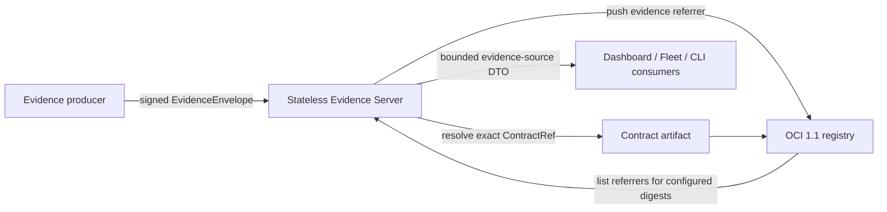

# OCI-native Evidence Referrers Design

**Status:** Approved architecture; implementation not started

**Phase:** 10C, after Phase 10B and before Phase 11

**Decision date:** 2026-08-17

## 1. Objective

Replace Pacto's custom durable evidence store with OCI 1.1 Referrers. An
accepted evidence record becomes an OCI artifact whose `subject` is the exact
immutable contract digest in `EvidenceSet.ContractRef`. The registry that
already stores the contract becomes the only durable evidence system.

This is a complete replacement. There is no bucket fallback, dual write,
read-through migration or second persistence path.

The result must remove more system than it adds:

- delete the append-only file/cloud-bucket engine;
- delete recovery, projection repair and materialized manifests;
- delete evidence PVCs and bucket configuration;
- retain one stateless Evidence Server as the security, evaluation and DTO
  boundary;
- reuse the registry and Pacto's existing credential policy.

## 2. Scope and non-goals

### In scope

- OCI 1.1 artifact publication and native Referrers discovery;
- exact contract-digest subjects configured declaratively;
- stable, strictly decoded Pacto evidence artifact payloads;
- Ed25519 verification and existing producer/subject/repository authorization;
- producer-global replay protection reconstructed from the registry;
- the existing evaluation and latest-target behaviour;
- a versioned registry-aware `/targets` health DTO;
- CLI, operator, Helm, Kind and Compose wiring;
- removal of `pkg/evidencestore`, `gocloud.dev`, bucket flags, PVCs, recovery and
  store inspection;
- documentation, compatibility statements and OCI/ORAS interoperability tests.

### Out of scope

- evidence attached to container images or any subject other than a Pacto
  contract digest;
- mutable tags as subjects;
- scanning an entire registry or repository catalog to discover subjects;
- multi-writer or horizontally scaled Evidence Servers;
- a bucket-to-OCI migration utility;
- evidence deletion, retention orchestration or a registry garbage collector;
- a second evidence protocol or a replacement for `EvidenceEnvelope`;
- direct registry access from the Dashboard.

## 3. Selected architecture



The Evidence Server remains because removing it would spread registry write
credentials, trust-store policy, signature verification and contract evaluation
across every producer and consumer. Keeping this one stateless gateway removes
the storage infrastructure without duplicating the security boundary.

The server has no persistent volume and maintains no authoritative local index.
An in-memory mutex serializes a registry scan and a manifest publish inside the
single process. Every read and every replay decision can be reconstructed from
the registry after restart.

## 4. Subject configuration and authorization

The server starts with a non-empty, deduplicated list of exact references in
this form:

```text
oci://registry.example/team/contracts/orders@sha256:<64 lowercase hex digits>
```

The CLI exposes the list through repeatable `pacto evidence serve --subject`
flags. Helm exposes the same data as `evidence.registry.subjects`. The
canonical acceptance scenario projects its known contract digests into both
Kind/Helm and Compose; no harness maintains a second subject list.

Each subject must satisfy all of these rules before the server becomes ready:

1. it is an OCI reference, not a local path;
2. it contains exactly one SHA-256 digest and no mutable tag semantics;
3. it resolves to an existing manifest;
4. its registry/repository/digest exactly matches the normalized configured
   value;
5. the repository supports the native OCI 1.1 Referrers endpoint;
6. it is reachable using the server's registry credential policy.

Ingestion adds another exact-membership check: the signed
`EvidenceSet.ContractRef` must be one of the configured subjects. Existing trust
rules continue to authorize the producer, operational subject name and contract
repository. Configuration membership narrows those permissions; it never
widens them.

Evidence is published in the same repository as its contract subject, as
required by the Referrers API. The runtime credential therefore needs pull and
push access only to the configured contract repositories. Pacto never requests
write access to an image repository.

## 5. OCI artifact contract

Use these stable media types:

```text
artifactType: application/vnd.pacto.evidence.record.v1+json
payload layer: application/vnd.pacto.evidence.record.v1+json
empty config: application/vnd.oci.empty.v1+json
manifest: application/vnd.oci.image.manifest.v1+json
```

The OCI manifest has exactly one payload layer and one `subject` descriptor.
The `subject.digest` equals the digest from the envelope's exact
`EvidenceSet.ContractRef`; the repository is supplied by that same reference.
The manifest is pushed by digest and receives no tag.

The payload is a strict JSON document:

```json
{
  "schemaVersion": "pacto.dev/evidence-record/v1",
  "record": {
    "envelope": {},
    "compliance": "Compliant",
    "coverage": {},
    "acceptedAt": "2026-08-17T12:00:00Z",
    "service": "orders",
    "domain": "registry.example/team/contracts",
    "digest": "sha256:..."
  }
}
```

`record` is the current `evidenceingest.Record`, including its findings. The
codec rejects unknown fields, trailing JSON, an unknown schema version, more
than one layer, a wrong media type, an oversized payload, a missing identity, a
contract ref that differs from the OCI subject, or a digest/domain that differs
from the immutable contract ref. The existing envelope and findings limits stay
in force. Registry content digests protect byte integrity; repository write
authorization remains the accepted-record trust boundary, matching the current
private-bucket/IAM model.

The artifact does not embed registry credentials, private signing keys or a
copy of the contract. It contains only the accepted record needed to reconstruct
replay and Product state.

## 6. Library and credential boundary

Evidence persistence uses stable `oras.land/oras-go/v2` (version `v2.6.2` at
design time) because its repository API provides OCI 1.1 manifest publication
and paginated `Referrers` enumeration. The implementation must not depend on a
single unpaginated response for replay correctness.

`go-containerregistry` remains in the existing contract bundle subsystem. It is
not expanded into a second evidence implementation. `gocloud.dev` and its cloud
blob drivers are removed once `pkg/evidencestore` is deleted.

An adapter converts Pacto's existing ordered OCI keychain into ORAS credentials.
The existing explicit environment credentials, Pacto login, GitHub token and
Docker configuration remain the one credential policy. Phase 10C creates no new
login command, credential file or provider-specific bucket configuration.

The operator may mount an existing `kubernetes.io/dockerconfigjson` Secret for
private registries. Anonymous access or workload-provided credentials require no
Secret. The chart never creates registry credentials.

## 7. Write path and replay protection

`POST /api/evidence/v1/envelopes` keeps its external request and success DTO.
The ordered path is:

1. strictly decode and size-bound the envelope;
2. verify the Ed25519 signature, time window, producer binding and operational
   subject allowlist;
3. validate the evidence set;
4. validate the existing immutable contract-repository policy;
5. require exact membership of `EvidenceSet.ContractRef` in the configured
   subject set;
6. resolve that immutable contract and evaluate the evidence;
7. enter the process-wide commit mutex;
8. enumerate every page of Pacto evidence referrers for every configured
   subject;
9. strictly fetch and validate every Pacto evidence record needed for the replay
   index;
10. reject a duplicate envelope ID or a sequence not strictly greater than the
    highest accepted sequence for that producer;
11. pack one OCI 1.1 artifact and push its blobs, config and manifest to the
    contract repository, with native Referrers support required;
12. confirm that the pushed manifest digest is immediately returned by native
    Referrers discovery for the subject;
13. release the mutex and return the existing accepted response.

Steps 8-12 are one serialized logical commit for the supported single-writer
deployment. The manifest push is the registry commit point, but success is not
reported until the record is discoverable through the same API later scans use.
If that read-after-write check fails, ingestion returns `503` and subsequent
writes continue to scan the registry rather than treating the failed response as
an uncommitted reservation. If the client loses the response after the manifest
push, retrying the same envelope discovers its ID and returns the existing
replay conflict, just as the bucket implementation does.

If any configured subject cannot be completely enumerated, any page is lost, or
any Pacto-typed artifact is invalid, the replay index is incomplete and the
write fails closed with a sanitized `503 registry_unavailable` or
`503 registry_incomplete`. A non-Pacto artifact type is irrelevant and ignored.

Exactly one active Evidence Server is supported for a subject set. Kubernetes
keeps `replicas: 1` and uses a `Recreate` deployment strategy so an update cannot
briefly create two writers. Running two standalone servers against an
overlapping subject set is documented as unsupported. Cross-process locking is
not emulated in tags, buckets or another service.

## 8. Read path and deterministic projection

`GET /api/evidence/v1/targets` enumerates all configured subjects, requests only
the Pacto artifact type, follows every Referrers page and fetches the referenced
payloads with existing body/count limits.

Valid records are folded into:

- the set of seen envelope IDs;
- the maximum sequence per producer;
- the latest record per operational target.

Latest-target ordering remains `AcceptedAt`, with producer sequence as the tie
breaker, matching current behaviour. Final targets remain deterministically
ordered by target key. Findings and target responses retain their existing
bounds and explicit `truncated` signal.

Partial reads are epistemically honest:

- an unavailable subject contributes no invented empty result;
- malformed Pacto artifacts are counted and omitted;
- valid records from other subjects may still be returned with `partial`
  health;
- if no configured subject can be read, `/targets` returns `503`, causing the
  Fleet source to become unavailable rather than empty.

The Dashboard continues to consume only the Evidence Server's HTTP DTO. It does
not receive registry credentials, enumerate referrers or repeat verification and
evaluation logic.

## 9. HTTP health and DTO evolution

Liveness remains an always-200 process check. Readiness no longer waits for
bucket recovery. It performs a bounded registry preflight: the subject list is
valid, every subject resolves and native Referrers discovery succeeds. A
transient registry failure makes readiness `503`; it never restarts the process
through liveness.

The strict `/targets` schema advances to
`pacto.dev/evidence-source/v2`. Target fields stay semantically unchanged. The
storage-specific health block is replaced by:

```json
{
  "status": "ready|partial|unavailable",
  "subjects": 3,
  "failedSubjects": 0,
  "invalidArtifacts": 0
}
```

The existing `truncated` field remains outside the health block. The Fleet HTTP
consumer is updated in the same commit as the server DTO: `partial`, failed
subjects, invalid artifacts or truncation produce `SourcePartial`; a `503`
produces `SourceUnavailable`. No old and new DTO are served in parallel.

`pacto evidence inspect` is deleted because its bucket recovery/repair status no
longer exists. Operational inspection uses `/ready`, `/targets` health and
standard ORAS discovery. `pacto evidence serve`, `send`, `sign`, `verify` and
`keygen` remain.

## 10. Infrastructure replacement

### Kubernetes and Helm

Remove:

- `evidence.storage.bucketURL` and `evidence.storage.prefix`;
- the complete `evidence.storage.persistence` value tree;
- operator flags for bucket URL, prefix, persistence, claim, size and storage
  class;
- `PersistenceConfig`, PVC reconciliation and PVC RBAC;
- the evidence data volume and the gocloud `/tmp` volume;
- recovery-oriented startup probe budgets and comments.

Add:

- `evidence.registry.subjects`, a required non-empty list when evidence is
  enabled;
- `evidence.registry.credentialsSecret`, optional and referencing an existing
  Docker config Secret;
- repeated subject arguments on the stateless Deployment;
- an optional read-only Docker config mount;
- `Recreate` deployment strategy with one replica.

Keep:

- the Evidence Server Deployment and ClusterIP Service;
- optional chart-managed external Service, Ingress and HTTPRoute;
- the producer-trust Secret mount;
- the existing restricted container security context and resource controls.

A fresh install creates no evidence PVC. An upgrade stops mounting and managing
an old `pacto-evidence-data` PVC but does not delete it automatically. The
upgrade guide tells an operator to retain/export it if needed and delete it
manually only after accepting that Phase 10C has no bucket reader.

### Docker Compose demo

Remove the Evidence Server data volume and `--bucket-url`. Keep the registry
volume because the registry is now the persistence boundary, and keep the
runtime trust/key volume because it is security material, not evidence storage.
The projection passes exact scenario contract digests as subjects.

Restart acceptance must recreate the Evidence Server container while preserving
only the registry and trust volumes. The original evidence remains visible and
replaying its envelope returns `409`.

## 11. Source deletion and documentation replacement

Delete the entire `pkg/evidencestore` package and its tests. Delete
`internal/app/evidencestore.go`, its recovery adapter and tests. Replace that
adapter with a focused internal OCI-referrer implementation whose files each
have one responsibility:

- artifact codec and OCI descriptor construction;
- ORAS repository/authentication factory;
- paginated subject scan and strict fetch;
- `evidenceingest.Store` commit/list semantics and health result.

Delete `cmd/pacto/blob_drivers.go` if no other import uses gocloud drivers. Run
module tidying and prove `gocloud.dev` and its transitive cloud SDKs disappear.

Replace `docs/evidence-storage-recovery.md` with an OCI evidence operations page
covering permissions, native Referrers compatibility, subject configuration,
registry retention/backup, failure semantics and manual retirement of legacy
PVCs/buckets. Update the protocol, security, operational graph, CLI reference,
Helm reference, operator configuration and Compose demo docs. Regenerate all
committed documentation and chart artifacts through their existing generators.

Registry durability, backup, retention and garbage collection are explicitly an
operator responsibility. Deleting a contract subject or applying a registry
policy that removes its referrers can remove evidence discoverability; Pacto
does not claim otherwise and does not recreate a recovery engine around the
registry.

## 12. Testing strategy

All implementation follows red-green-refactor and the existing taxonomy in
`docs/maintainers/testing.md`.

### Unit and component tests

- deterministic OCI 1.1 manifest and payload construction;
- exact subject binding and no mutable subject acceptance;
- one layer, media-type, size, schema and strict-JSON validation;
- all Referrers pages are consumed;
- non-Pacto referrers are ignored;
- malformed Pacto artifacts make reads partial and writes fail closed;
- duplicate IDs and producer-global non-increasing sequences are rejected across
  different configured contract subjects;
- two concurrent requests in one process cannot both pass the replay scan;
- latest-target ordering and target/finding bounds stay unchanged;
- credential conversion preserves anonymous, explicit, Pacto, GitHub and Docker
  credential sources without logging secrets;
- native Referrers absence fails instead of activating tag fallback;
- startup requires a non-empty, exact-digest subject list.

### Local integration and interoperability

Run a real OCI 1.1 test registry and prove:

- Pacto publishes a digest-addressed, untagged referrer;
- the published manifest is visible through native Referrers before ingestion
  reports success;
- `oras discover --artifact-type application/vnd.pacto.evidence.record.v1+json`
  sees it under the contract digest;
- ORAS can fetch the payload and its subject is exact;
- Pacto can read an equivalent valid artifact attached with ORAS;
- restart with no local evidence directory retains targets and replay rejection;
- registries without native Referrers support fail closed;
- pagination is exercised with a deliberately small registry page size or a
  protocol-faithful paginated test server.

### Kind, Compose and Product acceptance

- operator installation creates no evidence PVC;
- the Evidence Server pod has no evidence data or writable gocloud temp volume;
- registry credentials, when configured, are read-only-mounted and not emitted
  into generated output;
- evidence remains visible after pod replacement because it is in the registry;
- the canonical Product facts and browser journeys remain unchanged;
- Compose restart persistence uses the registry volume only;
- the Helm and Compose projections contain the same configured contract
  subjects;
- `make ci`, all relevant Kind shards, browser acceptance, artifact drift,
  release dry-run and security workflows are not weakened.

Mutation checks must prove at least these tests bite: remove the exact-subject
comparison, stop reading the second Referrers page, relax producer sequence
comparison from `>` to `>=`, enable tag fallback, or reintroduce an evidence PVC;
each mutation must fail its intended permanent test and then be reverted.

## 13. Acceptance and closure criteria

Phase 10C is a CANDIDATE only when all of the following are true:

1. no production import or configuration references `pkg/evidencestore`, bucket
   URLs, evidence prefixes, recovery, repair or evidence PVCs;
2. `pkg/evidencestore`, its app adapter, blob driver registration and store
   inspection command are gone;
3. `gocloud.dev` is absent from `go.mod` and `go.sum` unless an unrelated,
   evidenced consumer is found;
4. every accepted record is one OCI 1.1 referrer of its exact configured
   `EvidenceSet.ContractRef` digest;
5. ORAS discovery and Pacto discovery agree on the artifact;
6. replay protection survives process/pod restart and spans all configured
   subjects for a producer;
7. incomplete discovery blocks writes and is never rendered as authoritative
   empty state;
8. Dashboard/Fleet and CLI journeys retain their current information and status
   semantics through the v2 DTO;
9. fresh Helm installations create no PVC/bucket resources and Compose has no
   Evidence Server data volume;
10. generated docs, chart schema/reference, CLI reference and architecture docs
    contain no stale bucket-store claim;
11. local and exact-SHA CI evidence covers unit, integration, Kind, Compose,
    browser, artifact-drift, release and security gates;
12. the change is append-only and Phase 10C is independently reviewed before it
    is marked CLOSED.

Phase 11 does not begin while Phase 10C is merely a candidate.

## 14. Standards

The implementation follows:

- OCI Image Spec 1.1 artifact manifest and subject semantics;
- OCI Distribution Spec 1.1 native Referrers API, artifact-type filtering and
  pagination;
- ORAS Go v2 packing, publishing and Referrers enumeration;
- Pacto's `declarative > imperative` preference;
- the repository's existing append-only phase and independent-review protocol.

Primary references:

- <https://github.com/opencontainers/image-spec/blob/v1.1.1/manifest.md>
- <https://github.com/opencontainers/distribution-spec/blob/v1.1.1/spec.md#listing-referrers>
- <https://pkg.go.dev/oras.land/oras-go/v2@v2.6.2>
- <https://pkg.go.dev/oras.land/oras-go/v2/registry/remote@v2.6.2>
