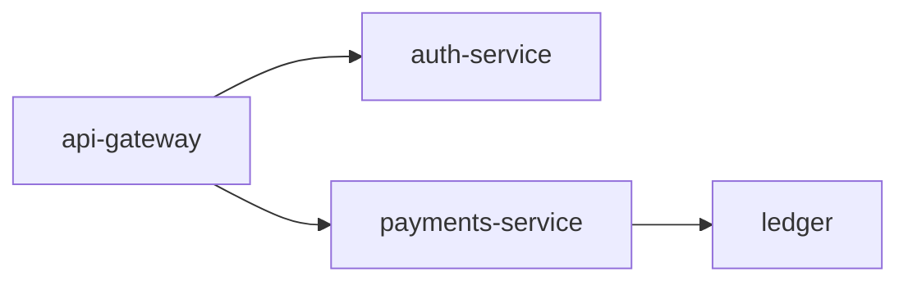

# Payments Service v2.1.0

Introduces structured ownership metadata with team, DRI, and contact information.

## Changes from v2.0.0
- Migrated `owner` from simple string to structured ownership model
- Added team, DRI, and contact channels (email, chat, oncall)

## Request flow

The gateway authenticates, then payments settles and records to the ledger:

