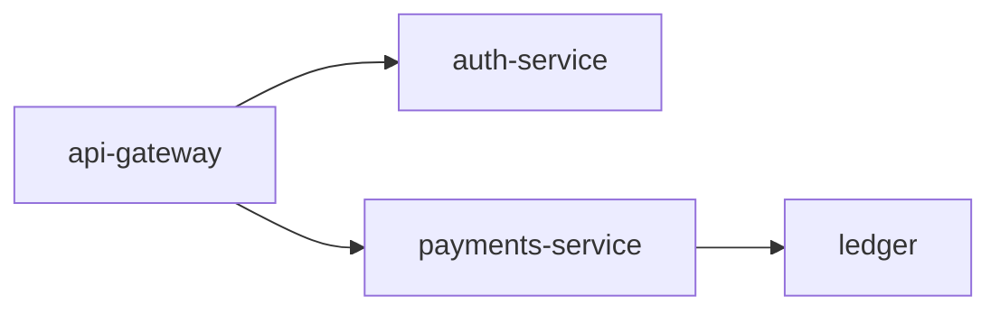

# Payments Service v2.1.1

Documentation-only release: the request flow is now drawn, not described.

## Changes from v2.1.0
- Documented the settlement path as a diagram

## Request flow

The gateway authenticates, then payments settles and records to the ledger:

