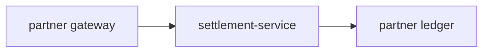

# Partner settlement service

This service lives in the **partners domain**. It reads a configuration contract
called `platform-app-config` — and so does the core `payments-service`, but not the
same one. Each domain publishes its own.

Two services may share a name. They are never the same service.

## Settlement flow

Anything that identifies a contract by name alone will read the wrong one.
