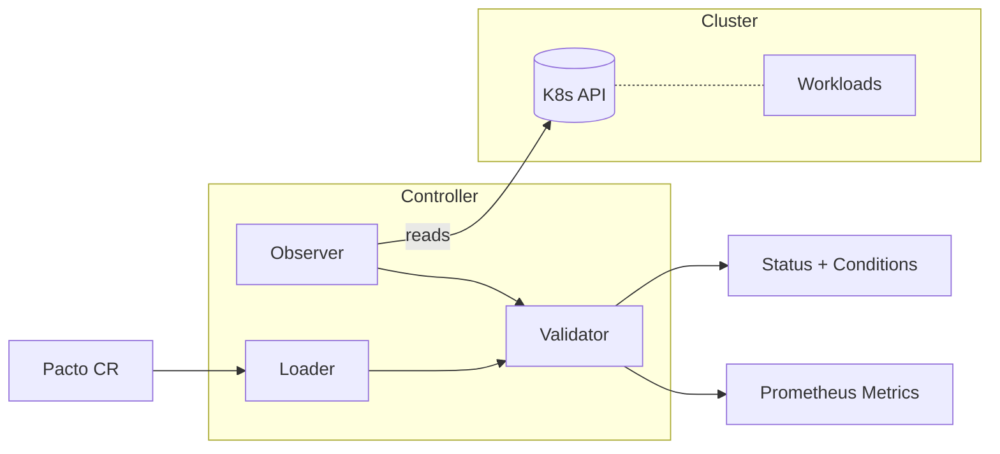

[](https://github.com/TrianaLab/pacto/actions/workflows/ci.yml)
[](https://github.com/TrianaLab/pacto/releases/latest)
[](LICENSE)
[](https://artifacthub.io/packages/search?repo=pacto-operator)

# Pacto Operator

**Kubernetes operator that checks whether running workloads match their declared [Pacto](https://github.com/TrianaLab/pacto) service contracts.**

Teams declare operational intent in a contract — workload type, state and persistence, interfaces, capabilities, dependencies and configurations — then deploy separately through Helm or Kustomize, and nothing connects the two sides at runtime, so contracts drift from reality silently. The operator closes that gap: it watches `Pacto` custom resources, reads the referenced contract, observes the live workload and reports whether they align — continuously, read-only, never modifying your workloads.

**[Pacto](https://github.com/TrianaLab/pacto)** · **[Documentation](https://trianalab.github.io/pacto)** · **[Contract reference](https://trianalab.github.io/pacto/contract-reference)** · **[Helm chart](charts/pacto-operator/)**

---

## Where it fits

[Pacto](https://github.com/TrianaLab/pacto) is a service contract system. Three components cover the full lifecycle:

| Component | Role |
|-----------|------|
| [**CLI**](https://github.com/TrianaLab/pacto) | Author, validate, diff, and publish contracts to OCI registries |
| **Operator** (this repo) | Continuously check runtime alignment between contracts and live workloads |
| [**Dashboard**](https://github.com/TrianaLab/pacto-dashboard) | Visualize the service graph, dependency tree, and compliance status |

The CLI is the authoring tool. The operator is the runtime feedback loop. The dashboard makes the results visible.

---

## Try it

```bash
# Install (dashboard enabled by default)
helm install pacto-operator oci://ghcr.io/trianalab/pacto-operator/charts/pacto-operator \
  --namespace pacto-operator-system --create-namespace
```

Bind a contract to a workload:

```yaml
apiVersion: pacto.trianalab.io/v1alpha1
kind: Pacto
metadata:
  name: my-service
spec:
  contractRef:
    oci: ghcr.io/your-org/contracts/my-service
  target:
    serviceName: my-service
```

The operator resolves the highest semver tag, snapshots it as a `PactoRevision`, observes the `my-service` Deployment and Service, runs the checks and sets the status:

```bash
kubectl get pactos                 # STATUS: one of Compliant, Warning, NonCompliant, Reference, Unknown, Invalid, NotEvaluated
kubectl describe pacto my-service  # conditions + findings
```

Full install options (Helm values, Kustomize) are in [Installation](#installation).

---

## Architecture



Each reconciliation follows a fixed pipeline:

1. **Loader** resolves the contract from an OCI registry (auto-selecting the highest semver tag) or parses inline YAML.
2. **Observer** reads runtime state from the Kubernetes API — workload kind, strategy, images, probes, volumes, termination grace period.
3. **Validator** is the engine's pure evaluator, `validation.Evaluate(contract, evidenceSet) → (findings, coverage)`. The operator turns the observed runtime into an `EvidenceSet`, then Evaluate reasons over contract vs evidence and returns typed findings plus coverage metadata. It is stateless — no Kubernetes or temporal logic and no side effects; the operator owns evidence collection and status writes.
4. **Controller** coordinates the pipeline, creates `PactoRevision` snapshots for each resolved version, and updates the CR status with structured conditions, a contract compliance status, and metrics.

---

## Runtime checks

Each reconciliation compares the declared contract against observed runtime evidence and produces typed **findings**. Every finding carries a code and a severity (`error`, `warning`, `info` or `unknown`); the contract status is derived from the worst severity present. Findings fall into two families.

**Confirmed violations** (`error`) — a matching observation contradicts the contract:

| Code | What contradicted the contract |
|------|--------------------------------|
| `INTERFACE_ABSENT` | a declared interface is not served |
| `CAPABILITY_ABSENT` | a declared capability (health, metrics, extension) is not present |
| `DEPENDENCY_UNREACHABLE` | a declared dependency cannot be reached |
| `CONFIGURATION_ABSENT` / `CONFIGURATION_MISMATCH` | a declared configuration is missing or differs |
| `WORKLOAD_MISMATCH` | the observed workload kind differs from the declared workload |
| `PERSISTENCE_MISMATCH` | observed storage differs from the declared state model |

**Insufficient evidence** (`unknown`) — the assertion could not be evaluated, which is distinct from a contradiction:

| Code | Why it could not be evaluated |
|------|-------------------------------|
| `EVIDENCE_MISSING` | no observation was collected for a required assertion |
| `EVIDENCE_INSUFFICIENT` | an observation was collected but is inconclusive |
| `OBSERVATION_UNSUPPORTED` | the dimension cannot be observed in this environment |
| `COLLECTION_FAILED` | the cluster query needed to observe the assertion errored |

Severity is derived, not authored: a required assertion that is contradicted is `error`; an optional one is `warning`; one that cannot be observed is `unknown`.

### Status derivation

The contract status follows a strict precedence over the findings (worst wins):

`Invalid` > `NonCompliant` > `Unknown` > `Warning` > `Compliant`

- `Invalid` — the contract failed structural validation or the artifact was malformed. Set by the pre-findings gate, before any runtime evidence is evaluated.
- `NonCompliant` — at least one `error`-severity finding.
- `Unknown` — no errors, but at least one `unknown`-severity finding (a required assertion could not be evaluated).
- `Warning` — no errors or unknowns, but at least one `warning`-severity finding.
- `Compliant` — no findings above `info`.

The evaluator compares only what the contract declares and the operator can observe: interfaces, capabilities, dependencies, configurations, workload type and persistence. Image, upgrade strategy and probe timing are **observed** into `status.observedRuntime` but are not asserted into findings.

### Health and metrics capabilities

Health and metrics are contract **capabilities**, evaluated like any other assertion: a declared-but-absent health or metrics capability is `CAPABILITY_ABSENT` (`error`, so `NonCompliant`) or `unknown` when it cannot be observed — never a bare `Warning`. There is no separate `status.endpoints` field and no `HealthEndpointValid`/`MetricsEndpointValid` condition; the only status conditions are `ContractValid`, `RuntimeObserved` and `ReadinessSatisfied`.

By default the operator observes health passively (readiness-probe and EndpointSlice signals) and sends no traffic. Active probing and full metrics observation are opt-in:

| Flag | Default | Effect |
|------|---------|--------|
| `--enable-probing` | off | Active in-cluster HTTP probing of health capability endpoints (Tier A). When off, health uses passive readiness-probe and EndpointSlice signals only. |
| `--enable-metrics-observation` | off | Full metrics observation (discovery + active probe). When off, the metrics dimension returns Unsupported. |
| `--interface-name-match-discovery` | off | Resolve an unbound interface's Service port by matching a Service port whose name equals the interface name (positive availability assist only; never yields an absent or error result). |

> **Note:** `ContractStatus` reflects contract validation/compliance, not runtime health.

---

## Readiness

The `readiness` section is part of `pactoVersion: "2.0"` — the only contract version the engine accepts. Contracts pinned to any other `pactoVersion` are rejected by the CLI before they ever reach the operator.

When a contract declares a `readiness` section, the operator computes a derived readiness assessment and writes it to **`status.readiness`** — `score`, `minScore`, `passing`, `totalWeight`, `earnedWeight`, `expires`, `expired`, `daysRemaining`, the counts `doneCount`/`partialCount`/`notDoneCount`/`deferredCount`, a per-claim list under `claims` (each with `status` ∈ `done`/`partial`/`not-done`/`deferred`, `weight`, `earnedWeight` and `evidence`) and the declared revision history under `revisions`. It is computed from the declared `weight`/`expires`/`minScore` values and the current time; the evidence targets are never fetched or verified.

Readiness is a **separate dimension** from contract compliance — it never changes `ContractStatus`. The operator surfaces the gate (`score >= minScore`, with `minScore` defaulting to 100 when omitted) through one aggregate condition, **`ReadinessSatisfied`**:

| Status | Reason | Meaning |
|--------|--------|---------|
| `True`  | `Satisfied`     | the readiness score meets `minScore` |
| `False` | `Expired`       | the gate is unmet because the assessment has passed its `expires` date |
| `False` | `BelowMinScore` | the gate is unmet with the assessment still current |

The reason precedence when the gate is unmet is: `Expired` when the assessment has passed its `expires` date, otherwise `BelowMinScore`.

On gate transitions it emits events sparingly: a `Warning`/`ReadinessGateUnmet` when the gate first drops and a `Normal`/`ReadinessRecovered` when it is met again. Contracts without readiness get neither `status.readiness` nor the condition.

For the canonical score and gate semantics, see the [readiness reference](https://trianalab.github.io/pacto/contract-reference/#readiness) in the CLI docs.

---

## CRDs

### Pacto

A `Pacto` resource binds a contract source to an optional runtime target:

- **Contract source**: OCI registry reference (`spec.contractRef.oci`) or inline YAML (`spec.contractRef.inline`).
  - **Unversioned** (`ghcr.io/org/name`): tracks the latest semver tag, re-resolved on every reconciliation.
  - **Tagged** (`ghcr.io/org/name:1.2.3`): pinned to that exact tag, no automatic updates.
  - **Digest** (`ghcr.io/org/name@sha256:abc...`): immutable, always resolves to that exact content.
  - The resolved mode is reported in `status.resolutionPolicy` (`Latest`, `PinnedTag`, or `PinnedDigest`).
- **Private registries**: set `spec.contractRef.pullSecretRef` to the name of a Kubernetes Secret (in the same namespace) containing OCI credentials. See [Private OCI Registries](#private-oci-registries).
- **Target**: a Kubernetes Service (`spec.target.serviceName`) and workload (`spec.target.workloadRef`). If the workload ref is omitted, it defaults to a Deployment with the same name as the service.
- **Reference mode**: when no target is specified, the Pacto is reference-only — the contract is resolved and stored, but no runtime validation runs. ContractStatus is `Reference`.
- **Reconciliation frequency**: `spec.checkIntervalSeconds` is the requeue delay the operator returns after each reconciliation (default: 300, minimum: 30) — it is not a background poll. The operator also reconciles immediately whenever the spec, status, or a referenced Secret changes, then requeues itself after this interval.

### PactoRevision

A `PactoRevision` is an immutable snapshot of a resolved contract version. Created automatically when a new version is resolved. Owned by the parent `Pacto` resource and garbage collected on deletion. Name pattern: `<pacto-name>-<version>-<hash>`.

---

## Breaking change: `status.phase` removed

The `status.phase` field has been removed. Use `status.contractStatus` instead.

| Before (`status.phase`) | After (`status.contractStatus`) |
|---|---|
| `Healthy` | `Compliant` |
| `Degraded` | `Warning` |
| `Invalid` | `NonCompliant` |
| `Reference` | `Reference` |
| `Unknown` | `Unknown` |

`kubectl get pactos` now shows a `STATUS` column (was `PHASE`).

ContractStatus reflects **contract validation/compliance**, not runtime health. Update any scripts, dashboards, alerts, or integrations that read `.status.phase` to use `.status.contractStatus`.

---

## Installation

### Helm (recommended)

```bash
helm install pacto-operator oci://ghcr.io/trianalab/pacto-operator/charts/pacto-operator \
  --namespace pacto-operator-system --create-namespace
```

The dashboard is enabled by default. See the [chart README](charts/pacto-operator/) for all configuration options including Service type, Ingress, and Gateway API HTTPRoute.

### Kustomize

```bash
make install   # Install CRDs
make deploy    # Deploy the controller
```

---

## Private OCI Registries

If your contracts are stored in a private OCI registry, create a Kubernetes Secret with credentials and reference it from the Pacto CR via `spec.contractRef.pullSecretRef`.

The Secret must be in the **same namespace** as the Pacto CR and contain one of:

- `token` — a bearer/registry token (e.g. a GitHub PAT), **or**
- `username` + `password` — basic auth credentials

These are mutually exclusive — if `token` is present it takes precedence.

**Example using a GitHub token:**

```bash
kubectl create secret generic ghcr-creds \
  --from-literal=username=x-access-token \
  --from-literal=password="$(gh auth token)" \
  -n my-namespace
```

**Example Pacto CR:**

```yaml
apiVersion: pacto.trianalab.io/v1alpha1
kind: Pacto
metadata:
  name: my-service
  namespace: my-namespace
spec:
  contractRef:
    oci: ghcr.io/my-org/contracts/my-service
    pullSecretRef: ghcr-creds
  target:
    serviceName: my-service
```

The operator watches the referenced Secret — if credentials are rotated, the next reconciliation uses the updated values automatically.

If the Secret is missing or cannot be read, the Pacto CR status is set to `Unknown` with a clear error message — a transient obtain-failure: the contract could not be fetched, so its validity is undetermined rather than `NonCompliant`.

> **Note:** `spec.contractRef.pullSecretRef` provides credentials for the **operator** to pull contracts. The separate `dashboard.ociSecret` Helm value provides credentials for the **dashboard** pod. These are independent configurations.

---

## Dashboard

The operator optionally manages a [Pacto Dashboard](https://github.com/TrianaLab/pacto-dashboard) instance. The dashboard provides a visual service graph showing dependencies, contract versions, readiness and compliance status across all Pacto resources in the cluster. A fleet overview surfaces compliance, readiness and high-blast-radius services at a glance, and a dedicated Service Readiness view shows per-service scores and check gaps (expired or invalid evidence).

The operator handles the full dashboard lifecycle: Deployment, ClusterIP Service, ServiceAccount, and RBAC. The dashboard image is version-locked to the Pacto library bundled into the controller.

Dashboard CPU/memory requests and limits can be overridden via the chart's `dashboard.resources` values (which set the controller's `--dashboard-cpu-request` / `--dashboard-cpu-limit` / `--dashboard-memory-request` / `--dashboard-memory-limit` flags). These accept standard Kubernetes [resource quantity](https://kubernetes.io/docs/reference/kubernetes-api/common-definitions/quantity/) strings — `100m`, `256Mi`, `1Gi`, and so on. Every supplied value is parsed at operator startup, so an invalid quantity fails fast (the operator refuses to start) rather than panicking during the first reconciliation.

Network exposure is a chart-level concern. The Helm chart creates a separate configurable Service for external access, with optional Ingress and Gateway API HTTPRoute support. See the [chart README](charts/pacto-operator/#dashboard) for details.

---

## Metrics

The controller exposes Prometheus metrics via OpenTelemetry:

| Metric | Type | Labels | Description |
|--------|------|--------|-------------|
| `pacto_contract_status` | Gauge | name, namespace, status | Info-style gauge: 1 for the current status, 0 for all others. `status` is one of: Compliant, Warning, NonCompliant, Reference, Unknown, Invalid, NotEvaluated |
| `pacto_readiness_score` | Gauge | name, namespace | Derived operational readiness score (0-100) |
| `pacto_readiness_gate` | Gauge | name, namespace | Whether the readiness gate is met (1=passing, 0=not passing) |
| `pacto_readiness_status` | Gauge | name, namespace, status | Info-style gauge for the gate state: 1 for the current state, 0 for others. `status` is one of: Satisfied, BelowMinScore, Expired |
| `pacto_readiness_checks` | Gauge | name, namespace, status | Number of readiness checks by declared status. `status` is one of: done, partial, not-done, deferred |

Enable a Prometheus ServiceMonitor via Helm:

```yaml
metrics:
  serviceMonitor:
    enabled: true
```

Pre-built PrometheusRule alerting templates are available in `config/prometheus/alerts.yaml`. Apply them manually:

```bash
kubectl apply -f config/prometheus/alerts.yaml
```

---

## What it does NOT do

- **Enforce or block deployments.** The operator is read-only. It reports drift; it does not prevent it. Use admission webhooks or CI gates if you need enforcement.
- **Author or publish contracts.** That is the [CLI](https://github.com/TrianaLab/pacto)'s job.
- **Modify workloads.** It never patches, scales, restarts, or deletes your resources.
- **Deep protocol validation.** It does not validate OpenAPI responses or run integration tests. It compares the contract's declared interfaces, capabilities, dependencies, configurations, workload type and persistence against observed runtime evidence; active endpoint probing is opt-in (`--enable-probing`).
- **Replace monitoring.** It answers "does the workload match the contract?", not "is the workload healthy?". Use it alongside — not instead of — observability tools.

---

## Artifact Verification

All published artifacts (controller image and Helm chart) are signed with [Cosign](https://docs.sigstore.dev/cosign/overview/) using keyless OIDC signing via GitHub Actions.

Verify the controller image:

```bash
cosign verify \
  --certificate-oidc-issuer https://token.actions.githubusercontent.com \
  --certificate-identity-regexp 'github\.com/TrianaLab/pacto/\.github/workflows/release\.yml' \
  ghcr.io/trianalab/pacto-operator/pacto-controller:<version>
```

Verify the Helm chart:

```bash
cosign verify \
  --certificate-oidc-issuer https://token.actions.githubusercontent.com \
  --certificate-identity-regexp 'github\.com/TrianaLab/pacto/\.github/workflows/release\.yml' \
  ghcr.io/trianalab/pacto-operator/charts/pacto-operator:<version>
```

---

## Development

### Prerequisites

- Go 1.26+
- Docker
- kubectl
- [Kind](https://kind.sigs.k8s.io/) (optional — for deploying to a local Kubernetes cluster)
- make

### Build and test

```bash
make build        # Build the controller binary
make test         # Run unit/integration tests (envtest)
make ci           # Run static checks + unit tests + chart validation (no cluster required)
make test-e2e     # Run the e2e acceptance suite (envtest — no cluster required)
make lint         # Run golangci-lint
```

`make ci` mirrors the CI pipeline's `static`, `unit-test`, and `chart` jobs. The `e2e` job runs separately via `make test-e2e`, which spins up an envtest control plane (no cluster required).

### Local development

**Local process** (operator runs on your machine, connects to current kube context):

```bash
make run                    # Operator without dashboard
make run-with-dashboard     # Operator with dashboard enabled
```

**Local Kubernetes** (operator runs inside a local cluster as a container):

```bash
make deploy-local                  # Build, install CRDs, deploy (any kube context)
make deploy-local-with-dashboard   # Build, install CRDs, deploy with dashboard
make undeploy-local                # Remove from current kube context
```

These targets work with any local Kubernetes distribution (Docker Desktop, minikube, Kind, etc.). If you use Kind, run `make kind-load` first so the image is available inside the cluster, or use `make deploy-kind` which combines both steps.

> **Engine dependency.** The operator is a nested Go module (`github.com/trianalab/pacto/integrations/kubernetes/v5`) that depends on the Pacto engine module `github.com/trianalab/pacto/v3`. It is resolved against the engine through the monorepo root `go.work` — there is no sibling checkout or `go.mod` replace to manage.

See the repository-root [CONTRIBUTING.md](/CONTRIBUTING.md) for the full development guide. Releases are transaction-driven Changesets managed at the repo root — see [`release/`](/release).

---

## Artifacts

| Artifact | Location |
|----------|----------|
| Controller image | `ghcr.io/trianalab/pacto-operator/pacto-controller` |
| Helm chart | `oci://ghcr.io/trianalab/pacto-operator/charts/pacto-operator` |

## License

Copyright 2026 TrianaLab.

Licensed under the [MIT License](LICENSE).
