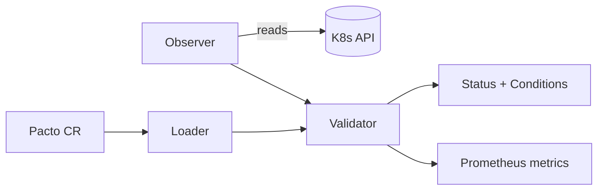

# Kubernetes integration

The Pacto Kubernetes integration is an operator that continuously checks whether
running workloads match their declared [Pacto](../../index.md) service contracts.
Teams declare operational intent in a contract -- workload type, state and
persistence, interfaces, capabilities, dependencies and configurations -- then
deploy separately through Helm or Kustomize. Nothing connects the two sides at
runtime, so contracts drift from reality silently. The operator closes that gap:
it watches `Pacto` custom resources, reads the referenced contract, observes the
live workload and reports whether they align.

**It observes your workloads and never modifies them.** It is not, however, a
read-only component overall: at chart defaults it also deploys and manages
Pacto's own dashboard, which means creating a Deployment, Service,
ServiceAccount, Secret and cluster-scoped RBAC of its own. Those grants are broad
enough to allow privilege escalation, and turning the managed components off
removes them -- read [RBAC](rbac.md) before installing into a cluster where that
matters. The Evidence Server is the operator's other managed component; it is
**off** at chart defaults and needs `evidence.enabled=true` plus a trust store
and a subject list (see [Install the Kubernetes operator](installation.md#the-evidence-server-is-off-by-default)).

## Where it fits

Pacto is a service contract system with three components:

| Component | Role |
| --- | --- |
| CLI | Author, validate, diff and publish contracts to OCI registries |
| Operator | Continuously check runtime alignment between contracts and live workloads |
| Dashboard | Visualize the service graph, dependency tree and compliance status |

The CLI is the authoring tool. The operator is the runtime feedback loop. The
dashboard makes the results visible. The operator can optionally deploy and manage
the dashboard for you (see [Operator configuration](operator-configuration.md)).

## How a reconciliation works

Each reconciliation follows a fixed pipeline:

1. **Loader** resolves the contract from an OCI registry (auto-selecting the
   highest semver tag) or parses inline YAML, and snapshots each resolved version
   as an immutable `PactoRevision`.
2. **Observer** (the collector) reads runtime state from the Kubernetes API and
   produces typed Evidence. See [Runtime observations](runtime-observations.md).
3. **Validator** is the engine's pure evaluator. It reasons over contract versus
   evidence and returns typed findings plus evaluation coverage. It is stateless:
   the operator owns evidence collection and status writes.
4. **Controller** coordinates the pipeline, writes the `PactoRevision` snapshots,
   and updates the `Pacto` CR status with structured conditions, a contract
   compliance status and Prometheus metrics.

The revisions in step 1 accumulate, and they are keyed by content rather than by
time: the name is `<pacto>-<version>-<7 hex of the sha256 of the contract YAML>`,
and the controller looks it up before creating it. Reconciling the same bytes a
thousand times therefore produces one `PactoRevision`, and republishing a
different contract under the same tag produces a second one alongside it — which
is how a mutated tag becomes visible after the fact. `status.currentRevision`
names the one in force. Each revision is set as a child of its `Pacto`, so
deleting the `Pacto` garbage-collects its whole history with it, and nothing else
prunes them: a long-lived resource whose contract changes often keeps every
distinct version it has ever seen.

## What it reports

The operator sets `status.contractStatus` on each `Pacto` resource to one of six
values (`Compliant`, `Warning`, `NonCompliant`, `Reference`, `Unknown`, `Invalid`)
derived from the typed findings. The CRD enum accepts a seventh,
[`NotEvaluated`, which the operator never writes](limitations.md#notevaluated-is-reserved).
It is a measure of contract
fidelity, not runtime health. The full status ladder, finding codes and the
observation dimensions are documented in
[Runtime observations](runtime-observations.md).

`Unknown` here means *evaluated, and one required assertion could not be decided*
— a verdict about this contract. It is not the `unknown` of the wider Pacto
vocabulary, which is a statement about an **answer** rather than a service: see
[Core concepts — Knowledge](../../concepts.md#knowledge) for the six words Pacto
uses for how much of the world an answer saw, and
[A contract status is not a knowledge state](../../concepts.md#boundaries) for why
these two never mix.

Alongside the status the operator exports five Prometheus gauges. The names,
labels and the scrape permission you have to grant yourself are in
[Scraping the metrics](installation.md#scraping-the-metrics).

## Where to go next

- [Install the Kubernetes operator](installation.md) -- install it with Helm.
- [Upgrade the operator](upgrade.md) -- including across a major version, where
  Helm leaves the CRDs untouched and you apply them yourself.
- [Uninstall](installation.md#uninstall) -- and the five things that survive it.
- [Contract bindings](contract-bindings.md) -- bind a contract to a workload.
- [Runtime observations](runtime-observations.md) -- what the operator observes and how it reasons.
- [Operator configuration](operator-configuration.md) -- flags and environment variables.
- [CRD reference](crd-reference.md) -- the `Pacto` and `PactoRevision` schemas.
- [Helm reference](helm-reference.md) -- chart values.
- [RBAC](rbac.md) -- the permissions the operator needs.
- [Published artifacts](artifact-hub.md) -- coordinates, verification and the Artifact Hub listing.
- [Troubleshooting](troubleshooting.md) and [Limitations](limitations.md).
