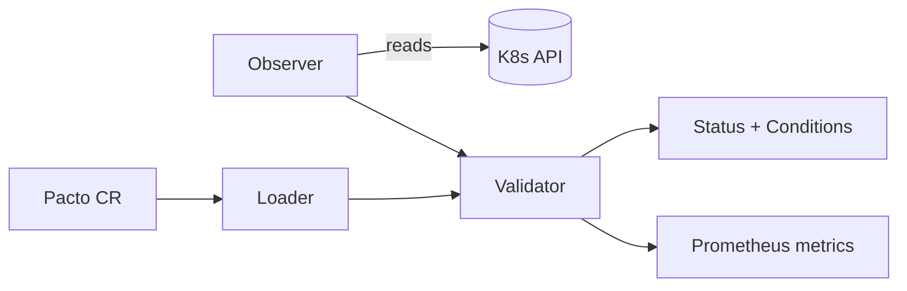

# Kubernetes integration

The Pacto Kubernetes integration is an operator that continuously checks whether
running workloads match their declared [Pacto](../../index.md) service contracts.
Teams declare operational intent in a contract -- workload type, state and
persistence, interfaces, capabilities, dependencies and configurations -- then
deploy separately through Helm or Kustomize. Nothing connects the two sides at
runtime, so contracts drift from reality silently. The operator closes that gap:
it watches `Pacto` custom resources, reads the referenced contract, observes the
live workload and reports whether they align.

**On your workloads it holds `get`, `list` and `watch` — it observes them and
never modifies them.** On its own components it holds considerably more: at chart defaults it deploys and
manages Pacto's own dashboard, which means creating a Deployment, Service,
ServiceAccount, Secret and cluster-scoped RBAC of its own. Those grants are broad
enough to allow privilege escalation, and turning the managed components off
removes them -- read [RBAC](rbac.md) before installing into a cluster where that
matters. The Evidence Server is the operator's other managed component; it is
**off** at chart defaults and needs `evidence.enabled=true` plus a trust store
and a subject list (see [The Evidence Server](evidence-server.md)).

## How a reconciliation works

Each reconciliation follows a fixed pipeline:

1. **Loader** resolves the contract from an OCI registry (auto-selecting the
   highest semver tag) or parses inline YAML, and snapshots each resolved version
   as an immutable `PactoRevision`.
2. **Observer** (the collector) reads runtime state from the Kubernetes API and
   produces typed Evidence. See [Runtime observations](runtime-observations.md).
3. **Validator** is the engine's pure evaluator. It reasons over contract versus
   evidence and returns typed findings plus evaluation coverage. It is stateless:
   the operator owns evidence collection and status writes.
4. **Controller** coordinates the pipeline, writes the `PactoRevision` snapshots
   and updates the `Pacto` CR status with structured conditions, a contract
   compliance status and Prometheus metrics.

The revisions in step 1 accumulate, and they are keyed by content rather than by
time. The name is `<pacto>-<version>-<7 hex of the sha256 of the contract YAML>`,
and the controller looks it up before creating it. Reconciling the same bytes a
thousand times therefore produces one `PactoRevision`. Republishing a different
contract under the same tag produces a second one alongside it, which is how a
mutated tag becomes visible after the fact. `status.currentRevision` names the
one in force. Each revision is set as a child of its `Pacto`, so deleting the
`Pacto` garbage-collects its whole history with it. Nothing else prunes them, so
a long-lived resource whose contract changes often keeps every distinct version
it has ever seen.

```mermaid
flowchart LR
    CR[Pacto CR] --> Loader
    Observer -- reads --> API[(K8s API)]
    Loader --> Validator
    Observer --> Validator
    Validator --> Status[Status + Conditions]
    Validator --> Metrics[Prometheus metrics]
```

## What it reports

The operator sets `status.contractStatus` on each `Pacto` resource to one of six
values (`Compliant`, `Warning`, `NonCompliant`, `Reference`, `Unknown`, `Invalid`)
derived from the typed findings. The CRD enum accepts a seventh,
[`NotEvaluated`, which the operator never writes](limitations.md#notevaluated-is-reserved).
It is a measure of contract
fidelity, not runtime health. The full status ladder, finding codes and the
observation dimensions are documented in
[Runtime observations](runtime-observations.md).

`Unknown` here means *evaluated, and one required assertion could not be decided*
— a verdict about this contract. It is not the `unknown` of the wider Pacto
vocabulary, which is a statement about an **answer** rather than a service. See
[Knowledge](../../operational-graph.md#knowledge) for the six words Pacto uses
for how much of the world an answer saw. A contract status and a knowledge state
never mix.

Alongside the status the operator exports five Prometheus gauges. The names,
labels and the scrape permission you have to grant yourself are in
[Scraping the metrics](installation.md#scraping-the-metrics).

Start with [Install the Kubernetes operator](installation.md).
